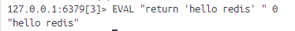
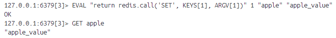
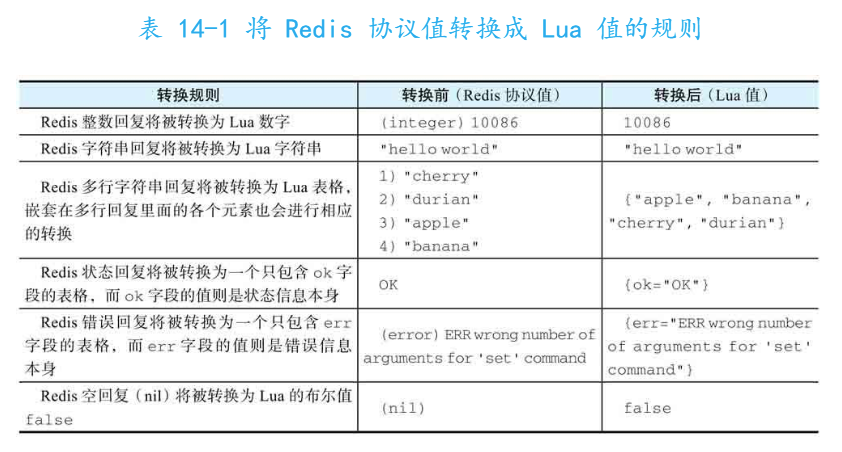
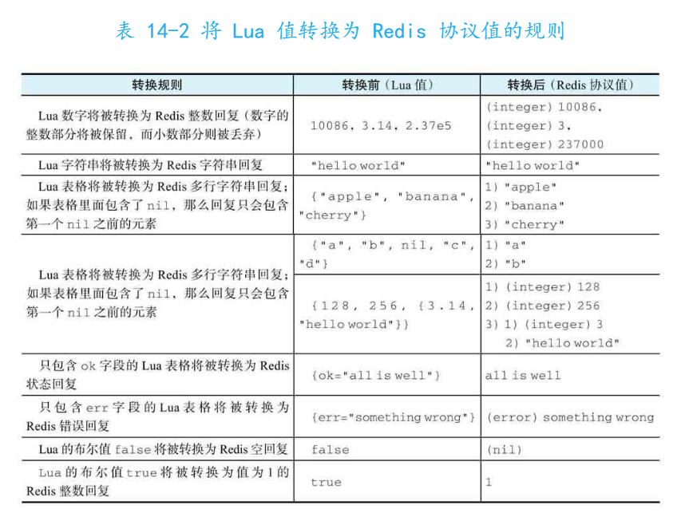
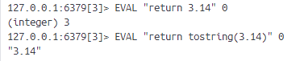
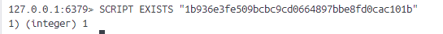
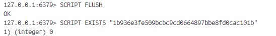

# 13-redis-Lua脚本
Lua 脚本是一种轻量级的脚本语言，广泛用于嵌入式应用和游戏开发。Lua 以简单、快速和可扩展著称，常被用作配置文件、游戏逻辑处理、数据处理和其他需要动态脚本的场景。

- lua的出现让用户可以按需对redis服务器功能进行扩展
- redis以原子方式执行lua脚本
- 用lua一次在脚本执行多条命令，虽然流水线加上事务同样能实现，但用lua脚本缓存特性能够更为有效减少带宽占用

基本语法查看Lua文件夹里的笔记。

## 1、EVAL
**EVAL scrip numkeys key [key ...] arg [arg ...]**
执行脚本。
- script是脚本本身，应该redis内置哪个版本的lua解释器，就需要用哪个版本的的lua语法
- numkeys指定脚本需要处理的键数量，之后的任意多个key是指定被处理的键
- arg是传递给脚本的附加参数

### 1.1 在脚本中执行redis命令
lua可以让用户直接在脚本中执行redis命令，可以通过redis.call(command,...) 或 redis.pcall(command,...)实现。

redis.call与redis.pcall不同点事处理错误的方式。call出错会引发lua错误，后者会将错误包裹起来返回一个表示错误的lua表格。

### 1.2 值转换
EVAL出现前redis服务器只有一种环境：redis命令执行器所处的环境。这个环境以协议值作为输入输出。

EVAL与lua解释器出现后有两种环境：redis命令执行器所处环境、lua解释器所处环境。两种环境用的输入输出不一样，所以需要进行值转换。

### 1.3 全局变量保护
为了防止预定义的lua环境被污染，redis只允许lua脚本中创建局部变量。

### 1.4 以命令行法方式执行脚本
可以用redis-cli的eval选项以命令行方式执行给定的脚本文件。

(命令是这个命令，不过我用的是docker，所以本地找不到文件)

## 2、SCRIPT LOAD 和 EVALSHA
**SCRIPT LOAD script**
**EVALSHA sha1 numkeys key [key ...] arg [arg ...]**
一个复杂脚本可能会有数百字节，如果客户端每次执行脚本都要发送一遍，会很浪费带宽。

redis提供lua脚本缓存功能，允许用户将给定lua脚本缓存到服务器中，根据lua脚本的SHA1校验和直接调用脚本，避免重复发送的麻烦。

SCRIPT LOAD 可以将用户给定脚本缓存到服务器中并返回对应的SHA1校验。之后用EVALSHA命令执行已经被缓存的脚本。

EVAL 也会缓存，但是因为没有直接返回SHA1校验需要通过其他方法计算出脚本的SHA1验证码，不如SCRIPT方便。

## 3、SCRIPT EXISTS|FLUSH|KILL
**SCRIPT EXISTS sha1 [sha1 ...]** : 检查脚本是否已被缓存

**SCRIPT FLUSH**：移除所有已缓存脚本

**SCRIPT KILL**：强制停止正在执行的脚本
可能有两种情况：
- 正在运行的脚本尚未执行任何写命令，终止脚本后回到正常状态
- 已经执行过写命令，停止脚本导致写入输入可能是不完整的，为防止脏数据，服务器不会直接终止会到正常状态。用户只能用SHUTDOWN nosave命令，在不执行持久化操作情况下关闭服务器，然后手动重启服务器让它回到正常状态

## 4、函数库
redis在lua环境内置一些函数库，可以通过这些函数库对redis服务器进行操作：
https://www.lua.org/manual/5.1/

## 5、脚本调试
（占位，知道有这个功能就行，后续需要再补上）

