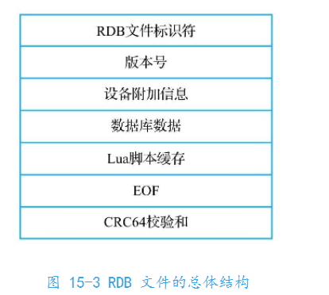
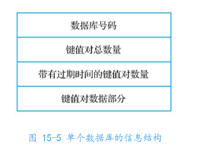
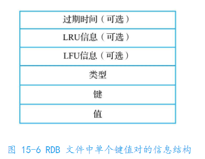
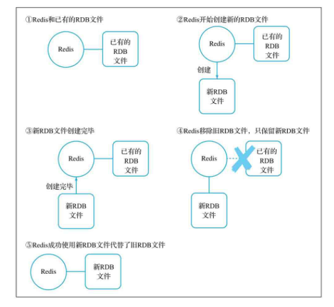
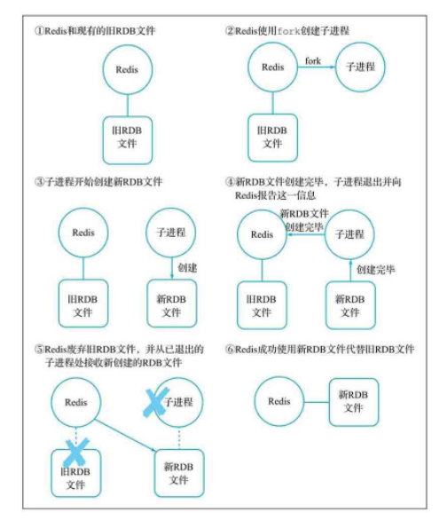
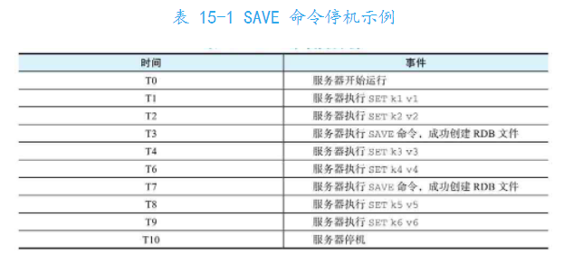
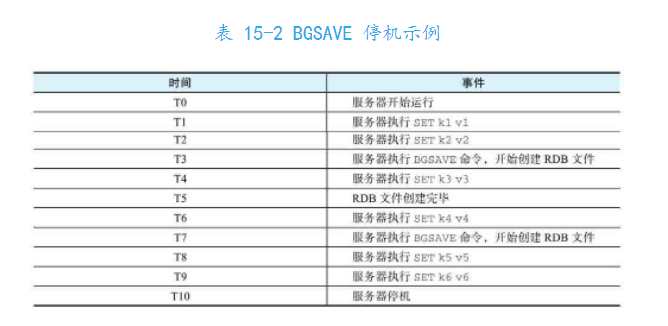
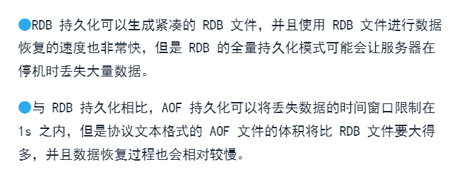
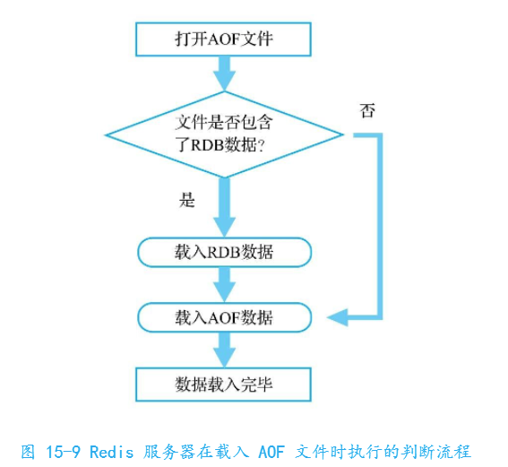
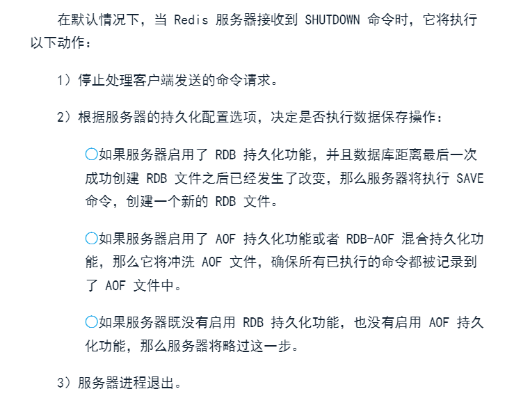

# 14-redis-持久化
redis提供持久化功能，可以把内存中存储的数据以文件形式存储到硬盘上，而服务器可以根据这些文件在系统停机后恢复数据。

为了满足不同持久化需求，redis提供RDB持久化、AOP持久化和RDB-AOP混合持久化等多种持久化方式。

## 1、RDB
RDB持久化是默认使用的持久化功能。

EDB创建出一个经过压缩的二进制文件，其中包含服务器在各个数据库存储的键值对数据等信息。产生的文件以.rdb结尾，代表 Redis DataBase。

### 1.1 SAVE
**SAVE**
阻塞服务器并创建RDB文件。

以同步方式创建出一个记录了服务器当前所有数据库数据的RDB文件。

### 1.2 BGSAVE
**BGSAVE**
已非阻塞方式创建RDB文件。

BGSAVE不会直接使用Redis服务器检查创建RDB文件，而是使用子进程创建文件。

执行后立刻返回OK，然后创建时在后台创建的。

虽然是异步的方式执行，但需要创建子进程，所以父进程占用内存数量越大，创建子进程耗费的时间会越长。延迟redis服务器在执行DBSAVE命令时仍然可能会由于创建子进程而被短暂地阻塞。

### 1.3 通过配置选项自动创建RDB文件
**save <seconds> <changes>**

（目前不太重要，占位）

### 1.4 载入RDB文件
RDB文件载入流程：打开RDB文件->检查文件头->检查版本号->读取设备信息->重建数据库->重建脚本缓存->对比校验和->数据载入完毕

### 1.5 数据丢失
如果在创建RDB时停机，SAVE和BGSAVE会有不同表现：

重启服务器时k5 k6数据将丢失。

只有k1 k2能够恢复，因为k3是在开始创建之后才添加的。

## 2、AOF
AOF提供的是增量式持久化功能。服务器每次执行完写命令后，都会以协议文本的方式将执行的命令追加到AOF文件的末尾。（就是把命令记录到文本中）

### 2.1 打开AOF持久化功能
**appendonly <yes|no>**

打开状态下，redis服务器在默认情况下创建appendonly.aof文件作为AOF文件。

### 2.2 设置AOF文件冲洗频率
为了提高写入性能，现代操作系统不会直接把数据写入硬盘，而是先将数据写入位于内存的缓冲区，等指定时限到达或满足某些写入条件时，系统执行flush，将缓冲区中的数据冲洗至硬盘。

这种机制提高性能但带来不确定性。对于AOF来说是不安全的。redis提供appendfsync选项，控制系统冲洗AOF文件的频率。
**appendfsync <value>**
可选值：
- always：每执行一个写命令就冲洗一次
- everysec:每隔1s就冲洗一次
- no:不主动对AOF执行冲洗，由操作系统决定何时对AOF进行冲洗

### 重写
时间越长记录的命令就越多，文件就越大，其中就会有很多冗余命令，比如对某个键值的多次修改操作。

可以通过重写给文件瘦身。

执行**BGREWRITWAOF**命令显示触发重写。这是一个异步命令。

通过配置项
**auto-aof-rewrite-min-size <value>**  （体积大于给定值就触发重写）
**auto-aof-rewrite-percentage <value>**（文件体积增大比例超过时重写） 

## 3、RDB-AOF 混合持久化

redis4.0开始引入RDB-AOF混合持久化模式。

**aof-use-rdb-preamble <yes|no>**

开启RDB-AOF后。服务器生成的AOF文件由两部分组成：RDB数据、AOF数据

## 4、无持久化
提供配置：**save ""**

## 5、SHUTDOWN
**SHUTDOWN [save|nosave]**
关闭服务器。

就是说只要有启动持久化，关闭服务器不会造成任何损失（没有指定nosave的情况下）。

