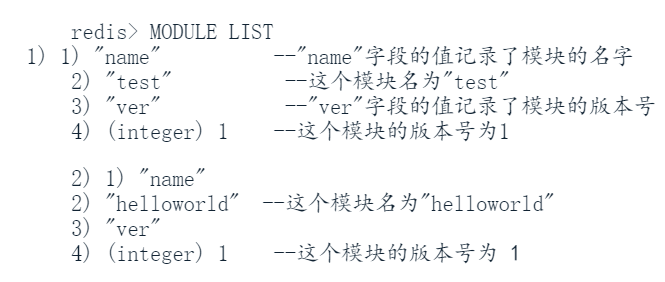

# 16-redis-模块
redis模块运行开发者通过redis开发的一簇API将redis用作网络服务和数据存储平台，通过C语言在redis上构建任意复杂的，全新的数据结构、功能和应用。

https://redis.io/modules 上罗列目前可用模块，这些通常是由C语言或可以与C交互的语言实现的。我们只需要下载模块源码，编译并载入编译好的模块，然后就可以像使用普通redis命令一样使用模块了。

## 1、模块管理
### 1.1 编译模块
不同模块的编译方法各有不同，大多数模块都会在文档说明自身的编译方法。

为了用户尝试模块功能，redis在自身源码中附带几个测试用的模块，在src/modules文件夹中。一般这些模块会跟着redis服务器一起被编译，如果不是，可以通过执行make命令编译这些模块。

### 1.2 载入模块
服务器启动时通过**loadmodule <module_path>**载入模块。

服务器运行期间通过**MODULE LOAD module_path**也可以载入模块。

### 1.3 列出已载入的模块
**MODULE LIST**

### 1.4 卸载模块
**MODULE UNLOAD module_name**
一般模块文件前缀名都会和模块名字保持一致，比如helloworld.so模块文件注册的名字是HELLOWORLD。

