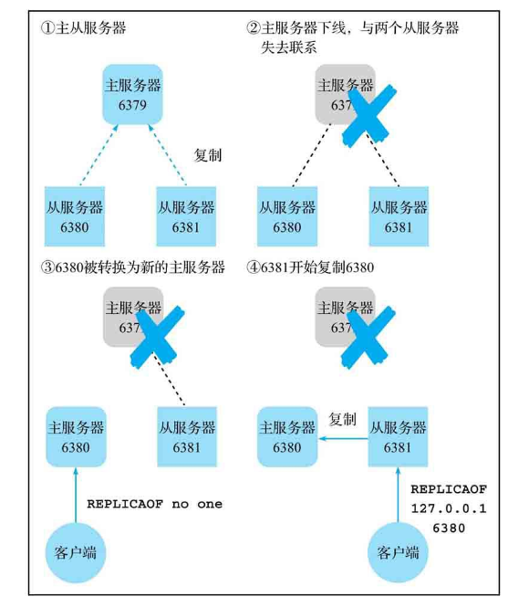
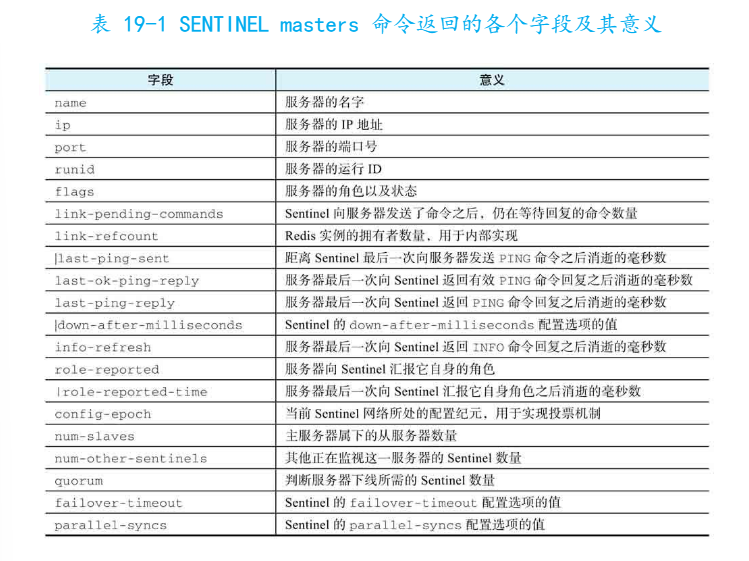
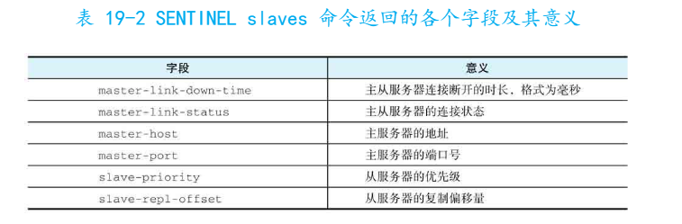
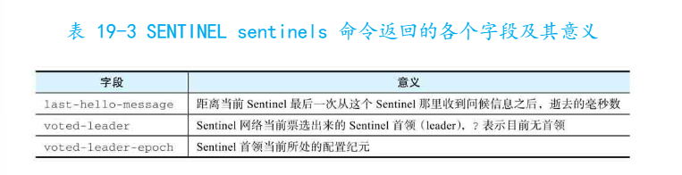

# 18-redis-多机功能-Sentinel
主从服务器有相同数据，所以理论上它们可以相互替换。

如果主服务器因故下线，将它其中一个从服务器转换为主服务器，并使用新的祝服务器继续处理命令请求，这样不会因为主服务器下线而停机。

这种使用注册服务器替换下线服务器以维持系统正常运转的操作被称为故障转移。



redis sentinel可以通过心跳检测的方式监视多个主服务器以及它们的所有从服务器，并在某个主服务器下线时自动对其实施故障转移。

## 1、启动Sentinel
Redis Sentinel 程序文件名为redis-sentinel,通常和普通redis服务器redis-server在同一个文件夹。

用户需要在配置文件中指定想要被Sentinel监视的主服务器，而且Sentinel需要在配置文件中写入信息记录主从服务器状态，所以启动Sentinel时必须传入一个可写的配置文件作为参数：
```
$ redis-sentinel /etc/sentinel.conf
```
一个Sentinel配置文件至少需要包含以下选项指定Sentinel要监视的主服务器：
```
sentinel monitor <master-name> <ip> <port> <quorum>
```
quorum用于指定判断这个猪服务器下线所需的Sentinel数量。

- redis sentinel实际上就是一个运行在特殊模式下的redis服务器，所以可以用命令 redis-server sentinel.conf --sentinel 启动一个sentinel
- 一个sentinel可以监视任意数量主服务器，只需要在配置中指定多个sentinel monitor就行
- sentinel在堆下线主服务器实施故障转移后仍会继续对它进行心跳检测，当服务器重新上线，sentinel会把它转换为当前主服务器的从服务器
- 可以通过replica-priorit配置各个从服务器优先级，优先级高的从服务器在sentinel选择新主服务器时会被优先选择
- sentinel选新主服务器的规则
    - 否决所有已经下线或疑似下线的服务器
    - 否决所有长时间没有与主服务器通信，数据状态过时的从服务器
    - 否决所有优先级为0的从服务器
    - 如果优先级最高的从服务器有两个或以上，复制偏移量最大的哪个服务器获胜
    - 如果符合条件的从服务器有两个或以上，选它们运行ID最小的那一个

## 2、Sentinel网络
实际应用中不会只使用单个Sentinel监视主从服务器的，因为Sentinel可能会出现单点故障，可能会因为网络故障无法获得主服务器的相关信息并因此错误地将主服务器判断为下线。

为了避免这些让Sentinel给出真实有效的判断结果，可以使用多个Sentinel组件一个分布式Sentinel网络。

当Sentinel网络中一个认为某个主服务器已经下线时，会将这个主服务器标记为主观下线（SDOWN），然后询问网络中其他Sentinel，当数量达到Sentinel monitor配置中quorum参数指定数量时就会标记主服务器未客观下线（ODOWN），然后进行故障转移。

组建Sentinel网络和启动单个Sentinel方法一样，只需要启动多个Sentinel并用Sentinel monitor配置选项指定Sentinel要监视的主服务器。


Sentinel应该和被监视的服务器放在不同机器上云霄，这样Sentinel网络才能够更准确有效地判断出服务器的实际状态。

## 3、Sentinel管理命令
### 3.1 SENTINEL master：获取所有被监视主服务器信息
**SENTINEL masters**


### 3.2 SENTINEL master:获取指定被监视主服务器的信息
**SENTINEL master <master-name>**

### 3.3 SENTINEL slaves:获取被监视主服务器的从服务器信息
**SENTINEL slaves <master-name>**


### 3.4 SENTINEL sentinels:获取其他Sentinel相关信息
**SENTINEL sentinels <master-name>**


### 3.5 SENTINEL get-master-addr-by-name:获取给定主服务器的IP地址和端口号
**SENTINEL get-master-addr-by-name <master-name>**

### 3.6 SENTINEL reset:重置主服务器状态
**SENTINEL reset <pattern>**
接收一个glob风格的模式作为参数。

SENTINEL reset可以让sentinel忘掉主服务器之前的记录，重新开始对住服务器进行监视，所以它通常只会在Sentinel网络或被监视主从服务器的结构发生重大变化时使用。

### 3.7 SENTINEL failover：强制执行故障转移
**SENTINEL failover <master-name>**

### 3.8 SENTINEL ckquorum：检查可用Sentinel数量
**SENTINEL ckquorum <master-name>**
如果部署3个但只识别出2个可用，说明有什么地方出错了。

### 3.9 SENTINEL flushconfig：强制写入配置文件
**SENTINEL flushconfig**
Sentinel在被监视服务器的状态发生变化时会自动重写配置文件，这个命令的作用是在配置文件基于某些原因或错误丢失时立即生成一个新的配置文件。

当Sentinel的配置选项发生变化时，Sentinel内部也会使用这个命令创建新的配置文件替换原有配置文件。

只有接受到这个命令的Sentinel才会重写配置。

## 4、在线配置Sentinel
redis从2.8.4开始为SENTINEL命令新添加一组子命令，这些命令可以在线修改Sentinel对于被监视主服务器的配置选项，修改后的配置选项保存到配置文件中，整个过程完全不需要停止Sentinel，也不需要手动修改配置文件。

### 4.1 SENTINEL monitor:监视给定主服务器
**SENTINEL monitor <master-name> <ip> <port> <quorum>**
可以用这个命令让sentinel开始监视一个新的主服务器。

### 4.2 SENTINEL remove：取消对给定主服务器的监视
**SENTINEL remove <masters-name>**

### 4.2 SENTINEL set:修改Sentinel配置选项的值
**SENTINEL set <master-name> <option> <value>**

比如：
```
SENTINEL set website_db quorum 3
```

Sentinel网络中的各个Sentinel可以拥有不同的quorum值。