# 19-redis-多机功能-集群
## 1、基本特性
### 1.1 复制和高可用
redis集群和单机redis服务器一样也提供主从复制功能。

redis集群中，各个redis服务器被称为节点（node），其中主节点（master node）复制处理客户端发送的读写命令请求，而从节点（replica/slave node）负责对主节点进行复制。

redis集群提供类似redis Sentinel功能，以此为集群提供高可用特性。集群中各个节点互相监视各自的运行状况，并在某个主节点下线时，通过提升改节点的从节点为新主节点来继续提供服务。

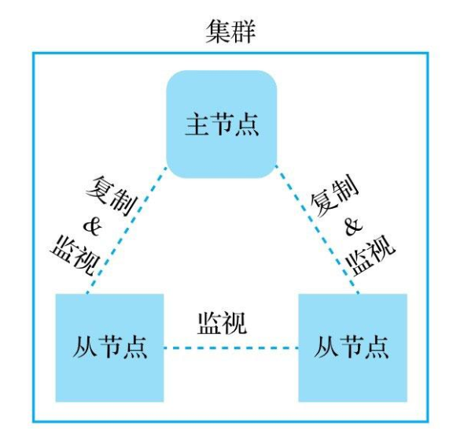

### 1.2 分片与重分片
与单机redis将整个数据库放在同一台服务器上的做法不同，redis集群通过将数据库分散存储到多个节点上来平衡各个节点的负载压力。

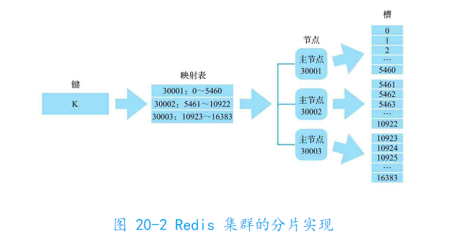

当用户要添加新结点，只需要向redis集群发送几条简单命令，集群会将相应槽以及槽中存储的数据迁移到新节点。

用户想要从集群移除已存在节点，被移除的节点也会将自己负责处理的槽以及槽中数据转交给集群中的其他节点负责。

无论是添加还是移除，整个重分片都可以在线进行。

### 1.3 高性能
redis集群用无代理模式，客户端发生的所有命令都会直接交给节点执行。

除了节点之间互通信息带来的性能损耗外，单个redis集群节点处理命令请求的性能与单个redis服务器处理命令请求的性能几乎别无二致。

理论上说，集群每增加一倍数量的主节点，集群对于命令请求的处理性能就会提高一倍。

### 1.4 简单易用

## 2、搭建集群
redis提供两种方法：用源码附带的集群自动搭建程序、使用配置文件手动搭建集群

### 1、自动搭建（占）
等弄到好点的服务器再说 QAQ
### 2、手动搭建（占）

## 3、散列标签
默认情况下，redis将根据用户输入的整个键计算出所属的槽，然后将键存储到相应槽中。

某些情况下，处于性能考虑或为了在同一个节点上对多个相关联的键执行批量操作，我们会想要将一些原本不属于同一个槽的键放在相同槽里。

为满足这个需求，redis提供散列标签（hash tag）功能。根据第一个“{}”里面的字符串计算所属槽。
比如：
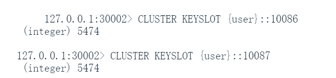

## 4、打开/关闭从节点的读命令执行权限
在单机redis服务器中，用户可以为服务器创建从服务器，然后通过让服务器处理读请求提升整个系统处理读请求的能力。

集群的从节点默认情况下只会对主节点进行复制，不会处理客户端发生的任何命令请求。当从节点接受到命令请求时，只会引导客户端发送转向消息，引导客户端向某个主节点重新发送请求。

某些情况下，想让从节点也能处理读请求提高整个集群处理读请求能力，可以用**READONLY**（打开读命令，无参）和**READWRTE**（关闭读命令，无参）两个命令，可以临时打开和关闭客户端在从节点上执行读命令的权限。


## 5、集群管理工具 redis-cli
redis为管理集群提供两种工具：redis-cli客户端附带的集群管理程序，redis内置的集群管理命令。

可以通过执行redis-cli时给定cluster选项启动，输入help子命令可以看到支持的各个子命令及格式：
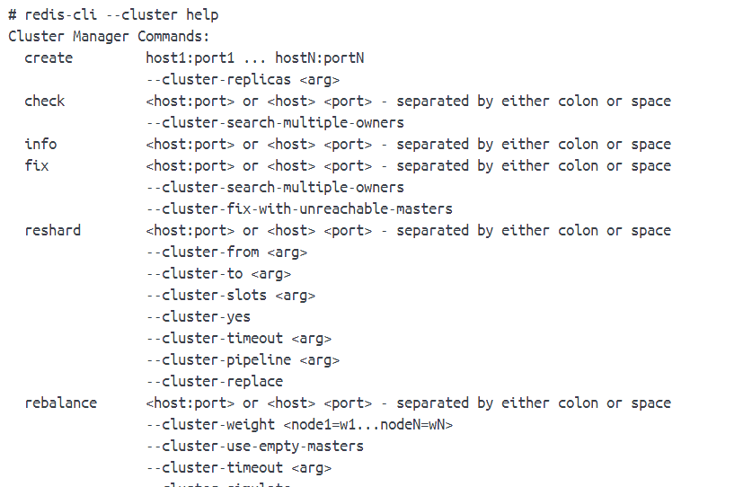

### 5.1 创建集群
**create <ip1>:<port1> ... <ipN>:<oprtN>**
给出各个节点的IP和端口号，命令就会将它们聚合到用一个集群中，并根据节点数量将槽平均地指派给它们负责。

```
redis-cli --cluster create 127.0.0.1:7001
```

通过**--cluster-replicas <num>**可以决定要为每个主节点配置多少个从节点

### 5.2 查看集群信息
**info <ip>:<port>**

返回信息：
- 主节点地址及运行ID，它们存储的键数量以及负责的槽数量，拥有的从节点数量
- 集群包含的数据库键数量已经主节点数量，每个槽平均存储的键数量

### 5.3 检查集群
**check <ip>:<port>**

可以检查集群的配置是否正确。

### 5.4 修复槽错误
当集群在重分配、负载君合或槽迁移过程中出现错误，执行cluster选项的fix子命令，可以让操作涉及的槽重新回到正常状态：
**fix <ip>:<port>**

fix会检查各个节点中处于 导入中 和 迁移中 状态的槽，根据情况将槽迁移至更合理的一方。

如果fix命令检查后没有发现异常，那么不做任何处理直接退出。

### 5.5 重分片
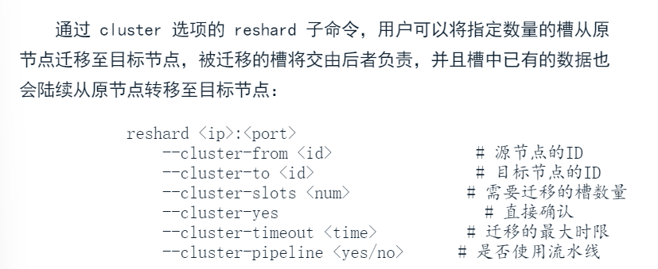

### 5.6 负载均衡
rebalance子命令允许用户在有需要时重新分配各个节点负责的槽数量，使得各个节点的负载压力趋于平衡：
**rebalance <ip>:<port>**
这个是自动分配的。

可以通过设置节点权重，权重大的节点将被指派更多槽：
**--cluster-weight <node_id1>=<weight1> <node_id2>:<weight2> ...**

如果在执行负载均衡操作时要为尚未指派槽的空节点也分配相应的槽，用：
**--cluster-use-empty-masters**

rebalance命令执行时会根据接地那目前负责的槽数量以及用户给定权重计算每个节点应该负责的槽数量（期望槽数量），如果这个槽数量与节点目前负责的槽数量之间比率超过指定阈值，就会触发重分配。阈值默认2.0，用户可以自己指定阈值：
**--cluster-threshold <value>**

还可以设置负载均衡操作是否使用流水线：
**--cluster-pipeline <yes|no>**

设置负载均衡操作的最大可执行时限：
**--cluster-timeout <time>**

执行负载均衡时通常是一个一个地对结点槽数进行调整，如果想要同时对多节点实施调整，需要给定选项：
**--cluster-simulate**

### 5.7 添加节点
**add-node <new_host>:<port> <existing_host>:<port>**

给定新节点地址以及集群中某个节点的地址。

默认是添加新节点为主节点，如果是添加为从节点，在执行添加命令同时给出以下设置：
**--cluster-slave  --cluster-master-id <id>**
id参数是从节点要复制的主节点。

### 5.8 移除节点
**del-node <ip>:<port> <node_id>**
<ip>:<port>用于指定集群中某个节点作为入口。

### 5.9 执行命令
通过call子命令可以在整个集群的所有节点上执行给定命令：
**call host:port command arg arg ...**

### 5.10 设置超时时间
**set-timeout <host>:<port> <milliseconds>**
为集群所有节点程序设置cluster-node-timeout 选项的值。

### 5.11 导入数据
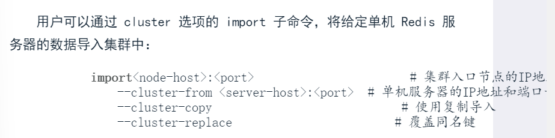

默认情况下import命令会删除单机服务器中的源数据，如果要保留，在执行命令同时给定**--cluster-copy**

导入时如果发现导入键在集群数据库中已存在，那么默认情况下会中断导入操作，如果要覆盖已有同名键，可以给定**--cluster-replace**

## 6、集群管理命令
除了集群管理程序外，redis提供CLUSTER开头的集群命令，分别为集群管理命令和槽管理命令。

redis-cli --cluster实际上就是由CLUSTER命令实现的。

### 6.1 CLUSTER MEET:将节点添加至集群
**CLUSTER MEET ip port**
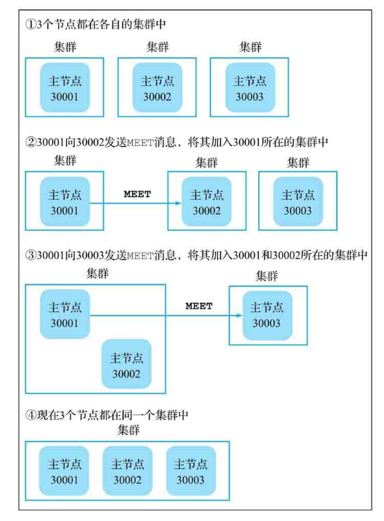

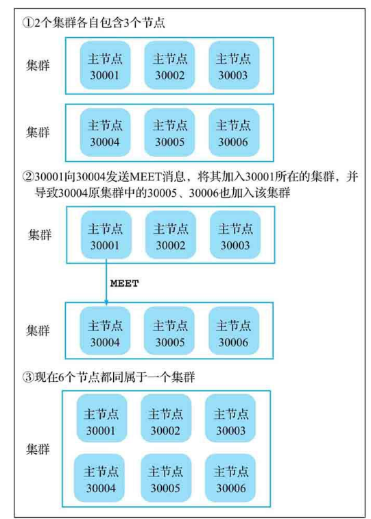

### 6.2 CLUSTER NODES:查看集群内所有节点相关信息
**CLUSTER NODES**
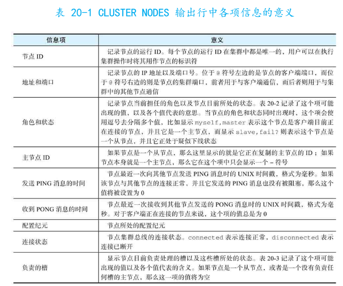

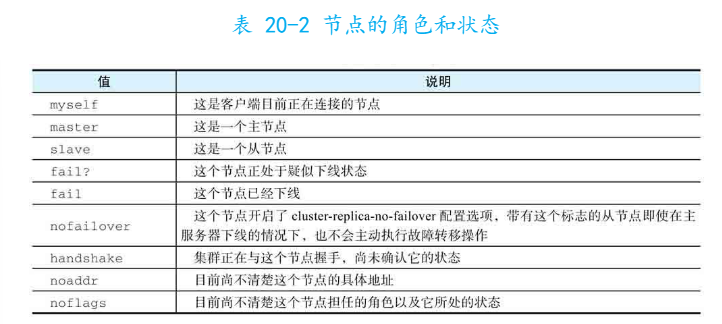

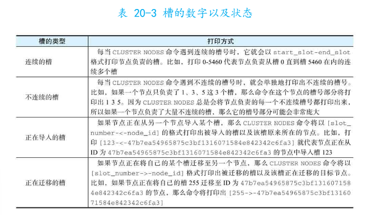

### 6.3 CLUSTER MYID：查看当前结点的运行ID
**CLUSTER MYID**

### 6.4 CLUSTER INFO：查看集群信息
**CLUSTER INFO**
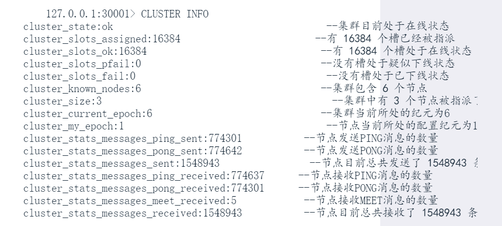
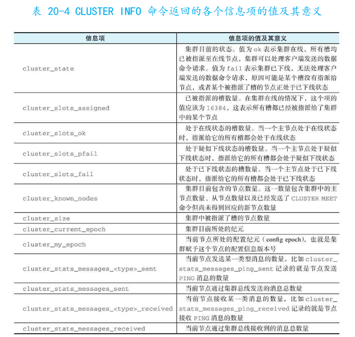

### 6.5 CLUSTER FORGET：从集群中移除节点
**CLUSTER FORGET node-id**
与CLUSTER MEET命令引发的节点添加不一样，CLUSTER FORGET命令引发的移除消息不回通过Gossip协议传播到集群中其他节点，接收到命令的节点只是暂时屏蔽指定节点，这个被屏蔽节点对其他节点依然可见。

要集群正在移除一个节点，必须在60s内向集群中所有节点发送相同的CLUSTER FORGET命令，否则暂时屏蔽的节点会因为Gossip协议的作用被重新添加到集群中。

可以用集群管理程序的call子命令一次性执行。

### 6.6 CLUSTER REPLICATE：将节点变为从节点
**CLUSTER REPLICATE master-id**
- 如果当前节点是主节点，那必须是一个没有被指派任何槽的主节点，数据库不能有任何数据
- 如果是一个从节点，那么将会清空数据库中已有数据并开始复制用户给定节点

操作时异步的。

### 6.7 CLUSTER REPLICAS：查看给定节点的所有从节点
**CLUSTER REPLICAS node-id**

### 6.8 CLUSTER FAILOVER:强制执行故障转移
**CLUSTER FAILOVER [FORCE|TAKEOVER]**
接收到该命令的从节点会将自身数据库更新至于主节点完全一致，然后再执行后续故障转移操作。

FORCE让从节点在不尝试与主节点进行握手情况下直接实施故障转移。

即使给了FORCE，从节点对主节点的故障转移操作仍然要经过集群中大多数主节点的同意才能真正执行。如果给定TAKEOVER就不用询问集群中其他主节点意见，直接对主节点实施故障转移。

### 6.9 CLUSTER RESET：重置节点
**CLUSTER RESET [SOFT|HARD]**

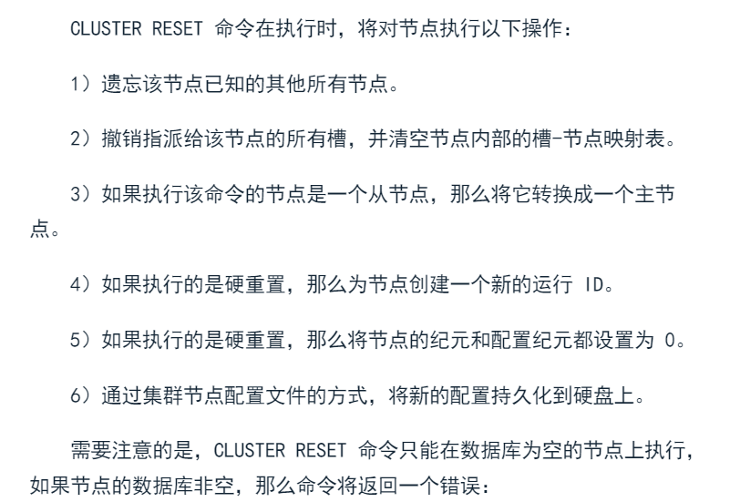

默认是SOFT。


## 7、槽管理命令
### 7.1 CLUSTER SLOTS:查看槽与节点之间的关联信息
**CLUSTER SLOTS**

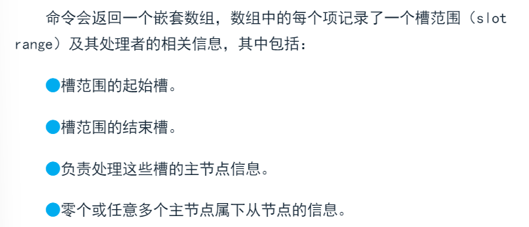

### 7.2 CLUSTER ADDSLOTS：把槽指派给节点
**CLUSTER ADDSLOTS slot [slot ...]**

### 7.3 CLUSTER DELSLOTS:撤销对节点的槽指派
**CLUSTER DELSLOTS slot [slot ...]**

### 7.4 CLUSTER FLUSHSLOTS：撤销对节点的所有槽指派
**CLUSTER FLUSHSLOTS**

### 7.5 CLUSTER KEYSLOT：查看键所属的槽
**CLUSTER KEYSLOT key**

### 7.6 CLUSTER COUNTKEYSINSLOT：查看槽包含的键数量
**CLUSTER COUNTKEYSINSLOT slot**

只对对当前节点的槽计数，如果给的槽不是当前节点的，返回0。

### 7.7 CLUSTER GETKEYSINSLOT：获取槽包含的键
**CLUSTER GETKEYSINSLOT slot count**

### 7.8 CLUSTER SETSLOT:改变槽状态
改变给定槽在节点中的状态，从而实现节点之间的槽迁移以及集群重分片。
#### 7.8.1 导入槽
**CLUSTER SETSLOT slot IMPORTING source-node-id**

让节点的指定槽进入 导入中 状态，处于该状态的槽允许从源节点中导入槽数据。

#### 7.8.2 迁移槽
**CLUSTER SETSLOT slot MIGRATING destination-node-id**
可以让节点的指定槽进入 迁移中 状态，处于该状态的槽运行向目标接地那转移槽数据

#### 7.8.3 将槽指派给节点
**CLUSTER SETSLOT slot NODE node-id**
将槽数据从源节点迁移至目标节点后，可以在集群的任一节点执行这个命令，正式将槽指派给目标节点负责。

#### 7.8.4 移除槽的导入/迁移状态
**CLUSTER SETSLOT slot STABLE**
