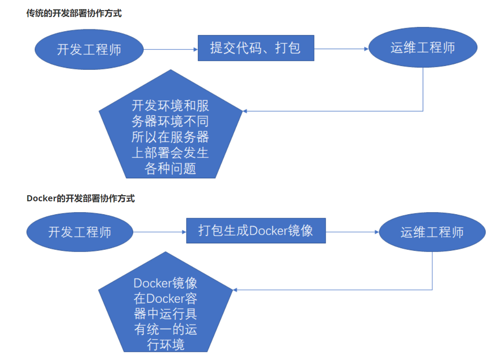
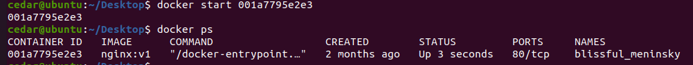

# docker基础
docker与虚拟机类似，但是比虚拟机更轻便，多个容器共享同一个操作系统内核，但在用户空间中相互隔离。容器更轻量，仅包含应用及其依赖项。

## 1、docker三要素
docker帮助命令：
- 查看版本信息 docker version
- 查看详细信息 docker info
- 查看命令帮助 docker –help
### 1.1 镜像
 镜像就是一个只读模板。镜像可以用来创建Docker容器，一个镜像可以创建多个容器。（类比class）

#### 1.1.1 拉取镜像
`docker pull [选项] [Docker Registry 地址[:端口号]/]仓库名[:标签]`

#### 1.1.2 删除镜像
`docker image rm [选项] <镜像1> [<镜像2> ...]`

#### 1.1.3 列出镜像
`docker images`

#### 1.1.4 搜索镜像
`docker search [镜像名]`

ps:搜索的不是本地的，是仓库的

#### 1.1.5 提交容器作为镜像
`docker commit [选项] <容器ID或容器名> [<仓库名>[:<标签>]]`

#### 1.1.6 保存镜像
`docker save [镜像名]:[Tag] -o /path/[name].tar`

#### 1.1.7 加载镜像
`docker load -i [name].tar`

#### 1.1.8 构建镜像
`docker build [选项] <上下文路径/URL/->`

### 1.2 容器
Docker利用容器独立运行一个或一组应用。容器是镜像创建的运行示例。它可以被启动、停止、删除。每个容器都是相互隔离的、保证安全的平台。（类比对象）
#### 1.2.1 运行容器
`docker run [镜像名]:[Tag]`

network：
-  --network=host.docker.internal  与window宿主机共享网络的
-  --network=host  与linux宿主机共享网络的

#### 1.2.2 退出容器
- exit 容器停止退出
- ctrl+p+q 容器不停止退出

#### 1.2.3 查看容器
`docker ps`

#### 1.2.4 启动/重启/停止容器
`docker start/restart/stop [容器ID]`

#### 1.2.5 强制停止容器
`docker kill [容器ID]`

#### 1.2.6 删除关闭容器
`docker rm [容器ID]`

#### 1.2.7 查看容器日志
`docker logs [容器ID]`

#### 1.2.8 查看容器运行进程信息
`docker top [容器ID]`

#### 1.2.9 查看容器内部细节
`docker inspect [容器ID]`

#### 1.2.10 查看容器占用的系统资源
`docker stats [容器ID]`
不加容器ID则查看所有容器的系统资源。

#### 1.2.11 重新进入容器
`docker attach [容器ID]`

#### 1.2.12 进入容器执行shell命令
`docker exec -it [容器id Shell命令]`

#### 1.2.13 拷贝容器内文件
`docker cp [容器ID]:容器路径 本机路径`

#### 1.2.14 容器运行机制
​ Docker容器后台运行，就必须有一个前台进程，容器运行的命令如果不是会挂起的命令（比如top），会自动退出。最佳的解决方案是，将要运行的程序以前台进程的形式运行

### 1.3 仓库
仓库是集中存放镜像文件的场所。仓库和仓库注册服务器（Registry）是有区别的。仓库注册服务器上往往存放着多个仓库，每个仓库又包含了多个镜像，每个镜像又不同的标签（tag）。我们从Docker执行拉取镜像的命令就是从仓库中拉取命令的。

- Docker Hub:目前 Docker 官方维护了一个公共仓库 Docker Hub，大部分需求都可以通过在 Docker Hub 中直接下载镜像来实现。
- 私有仓库:用户可以创建一个本地仓库供私人使用。

