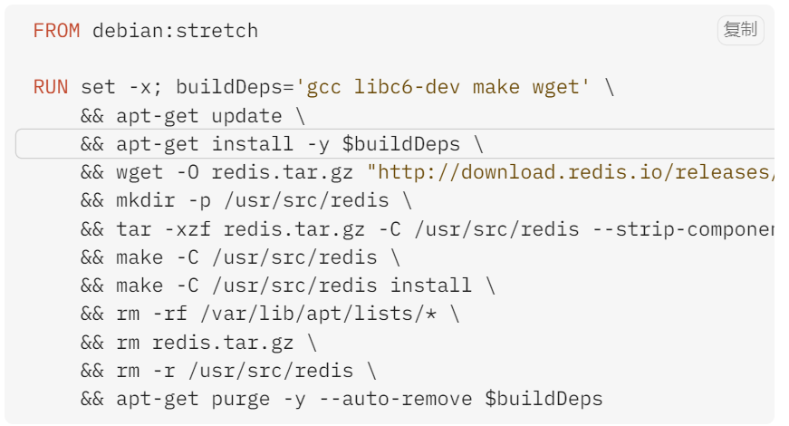
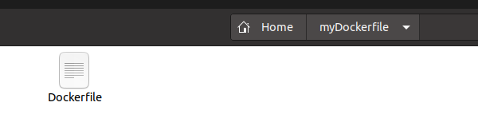
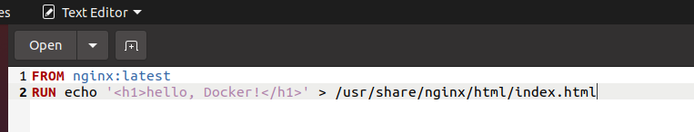
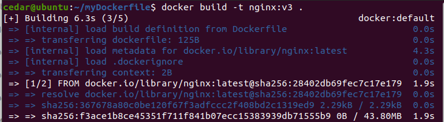

# Dockerfile
Dockerfile 是一个文本文件，包含了构建 Docker 镜像的所有指令。

## 1、指令
### 1.1 FROM 指定基础镜像
所谓定制镜像，那一定是以一个镜像为基础，在其上进行定制。

FROM 就是指定 基础镜像，因此一个 Dockerfile 中 FROM 是必备的指令，并且必须是第一条指令。

在 Docker Hub 上有非常多的高质量的官方镜像，有可以直接拿来使用的服务类的镜像，如 nginx、redis、mongo、mysql、httpd、php、tomcat 等；也有一些方便开发、构建、运行各种语言应用的镜像，如 node、openjdk、python、ruby、golang 等。还提供了一些更为基础的操作系统镜像，如 ubuntu、debian、centos、fedora、alpine 等。

Docker 还存在一个特殊的镜像，名为 scratch。表示一个空白的镜像。

```
FROM scratch
```

Dockerfile 中每一个指令都会建立一层。

### 1.2 RUN 执行命令
RUN 指令是用来执行命令行命令的。
RUN指令由两种格式：
- shell 格式
- exec 格式

Union FS 是有最大层数限制的，所以并不是用RUN一层层地执行，而是像下面这样，所有命令写在一个RUN里面：



Dockerfile 支持 Shell 类的行尾添加 \ 的命令换行方式，以及行首 # 进行注释的格式。


### 1.3 COPY 复制文件
- COPY [--chown=<user>:<group>] <源路径>... <目标路径>

- COPY [--chown=<user>:<group>] ["<源路径1>",... "<目标路径>"]

COPY 指令将从构建上下文目录中 <源路径> 的文件/目录复制到新的一层的镜像内的 <目标路径> 位置。

<p style="color:gray">构建上下文目录是指在执行 docker build 命令时，指定的当前目录及其所有子目录。这个目录中的文件和目录会被发送到 Docker 引擎，以便在构建 Docker 镜像时使用。</p>

### 1.4 ADD 更高级的复制文件
ADD 指令和 COPY 的格式和性质基本一致。但是在 COPY 基础上增加了一些功能:
- 支持 URL:ADD 可以直接从远程 URL 下载文件并将其添加到镜像中。
- 自动解压缩：如果添加的文件是压缩包（例如 .tar, .tar.gz, .tgz），ADD 会在将其复制到镜像时自动解压缩。

`ADD <源路径> <目标路径>`

在使用该指令的时候还可以加上 --chown=\<user\>:\<group\> 选项来改变文件的所属用户及所属组。

### 1.5 CMD 容器启动命令
- shell 格式：CMD <命令>
- exec 格式：CMD ["可执行文件", "参数1", "参数2"...]


### 1.6 ENTRYPOINT 入口点

### 1.7 ENV 设置环境变量

### 1.8 ARG 构建参数

### 1.9 VOLUME 定义匿名卷

### 1.10 EXPOSE 暴露端口

### 1.11 WORKDIR 指定工作目录

### 1.12 USER 指定当前用户

### 1.13 HEALTHCHECK 健康检查

### 1.14 ONBUILD 为他人作嫁衣裳

### 1.15 LABEL 为镜像添加元数据

### 1.16 SHELL 指令

## 2、实践
写一个DockerFile文件：




开始构建镜像：



nginx:v3是自己命名的，而“.”是搜索当前路径的DockerFile。

<hr>

对于DotNet练习项目，在项目根目录下文件DockerFile文件：
```dockerfile
# 使用官方的 .NET SDK 镜像作为构建环境
FROM mcr.microsoft.com/dotnet/sdk:7.0 AS build
WORKDIR /app

# 复制所有项目文件
COPY SmallShoppingApi.Initiator/*.csproj ./SmallShoppingApi.Initiator/
COPY SmallShoppingApi.WebApi/*.csproj ./SmallShoppingApi.WebApi/
COPY SmallShoppingApi.Core/*.csproj ./SmallShoppingApi.Core/
COPY SmallShoppingApi.Message/*.csproj ./SmallShoppingApi.Message/

# 恢复所有项目的依赖
RUN dotnet restore SmallShoppingApi.WebApi/SmallShoppingApi.WebApi.csproj
RUN dotnet restore SmallShoppingApi.Initiator/SmallShoppingApi.Initiator.csproj
RUN dotnet restore SmallShoppingApi.Core/SmallShoppingApi.Core.csproj
RUN dotnet restore SmallShoppingApi.Message/SmallShoppingApi.Message.csproj

# 复制源代码
COPY SmallShoppingApi.Initiator ./SmallShoppingApi.Initiator
COPY SmallShoppingApi.WebApi ./SmallShoppingApi.WebApi
COPY SmallShoppingApi.Core ./SmallShoppingApi.Core
COPY SmallShoppingApi.Message ./SmallShoppingApi.Message

# 构建和发布 Web API 项目
RUN dotnet publish SmallShoppingApi.WebApi/SmallShoppingApi.WebApi.csproj -c Release -o /app/out

# 构建阶段 `initiator`
FROM mcr.microsoft.com/dotnet/sdk:7.0 AS initiator
WORKDIR /app

# 复制和构建数据库初始化项目
COPY SmallShoppingApi.Initiator/*.csproj ./SmallShoppingApi.Initiator/
COPY SmallShoppingApi.WebApi/*.csproj ./SmallShoppingApi.WebApi/
COPY SmallShoppingApi.Core/*.csproj ./SmallShoppingApi.Core/
COPY SmallShoppingApi.Message/*.csproj ./SmallShoppingApi.Message/
RUN dotnet restore SmallShoppingApi.WebApi/SmallShoppingApi.WebApi.csproj
RUN dotnet restore SmallShoppingApi.Initiator/SmallShoppingApi.Initiator.csproj
RUN dotnet restore SmallShoppingApi.Core/SmallShoppingApi.Core.csproj
RUN dotnet restore SmallShoppingApi.Message/SmallShoppingApi.Message.csproj
COPY SmallShoppingApi.Initiator ./SmallShoppingApi.Initiator
COPY SmallShoppingApi.WebApi ./SmallShoppingApi.WebApi
COPY SmallShoppingApi.Core ./SmallShoppingApi.Core
COPY SmallShoppingApi.Message ./SmallShoppingApi.Message

RUN dotnet publish SmallShoppingApi.Initiator/SmallShoppingApi.Initiator.csproj -c Release -o /app/out

# 使用官方的 ASP.NET Core 运行时镜像作为运行环境
FROM mcr.microsoft.com/dotnet/aspnet:7.0 AS final
WORKDIR /app
# 复制 Web API 发布输出
COPY --from=build /app/out ./
COPY --from=initiator /app/out ./  # 确保初始化项目的输出也被复制

# 运行 Web API 应用
ENTRYPOINT ["dotnet", "SmallShoppingApi.WebApi.dll"]
```


