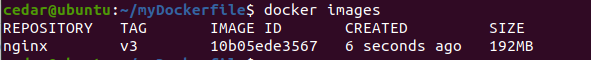
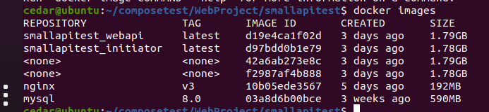

# Dockerfile
Dockerfile 是一个文本文件，包含了构建 Docker 镜像的所有指令。

## 1、指令
### 1.1 FROM 指定基础镜像
所谓定制镜像，那一定是以一个镜像为基础，在其上进行定制。

FROM 就是指定 基础镜像，因此一个 Dockerfile 中 FROM 是必备的指令，并且必须是第一条指令。

在 Docker Hub 上有非常多的高质量的官方镜像，有可以直接拿来使用的服务类的镜像，如 nginx、redis、mongo、mysql、httpd、php、tomcat 等；也有一些方便开发、构建、运行各种语言应用的镜像，如 node、openjdk、python、ruby、golang 等。还提供了一些更为基础的操作系统镜像，如 ubuntu、debian、centos、fedora、alpine 等。

Docker 还存在一个特殊的镜像，名为 scratch。表示一个空白的镜像。

```
FROM scratch
```

Dockerfile 中每一个指令都会建立一层。

### 1.2 RUN 执行命令
RUN 指令是用来执行命令行命令的。
RUN指令由两种格式：
- shell 格式
- exec 格式

Union FS 是有最大层数限制的，所以并不是用RUN一层层地执行，而是像下面这样，所有命令写在一个RUN里面：


Dockerfile 支持 Shell 类的行尾添加 \ 的命令换行方式，以及行首 # 进行注释的格式。


### 1.3 COPY 复制文件
- COPY [--chown=<user>:<group>] <源路径>... <目标路径>

- COPY [--chown=<user>:<group>] ["<源路径1>",... "<目标路径>"]

COPY 指令将从构建上下文目录中 <源路径> 的文件/目录复制到新的一层的镜像内的 <目标路径> 位置。
```dockerfile
COPY hom* /mydir/
COPY hom?.txt /mydir/
```

<p style="color:gray">构建上下文目录是指在执行 docker build 命令时，指定的当前目录及其所有子目录。这个目录中的文件和目录会被发送到 Docker 引擎，以便在构建 Docker 镜像时使用。</p>

### 1.4 ADD 更高级的复制文件
ADD 指令和 COPY 的格式和性质基本一致。但是在 COPY 基础上增加了一些功能:
- 支持 URL:ADD 可以直接从远程 URL 下载文件并将其添加到镜像中。
- 自动解压缩：如果添加的文件是压缩包（例如 .tar, .tar.gz, .tgz），ADD 会在将其复制到镜像时自动解压缩。

`ADD <源路径> <目标路径>`

在使用该指令的时候还可以加上 --chown=\<user\>:\<group\> 选项来改变文件的所属用户及所属组。

```dockerfile
ADD ubuntu-xenial-core-cloudimg-amd64-root.tar.gz /
```

### 1.5 CMD 容器启动命令
- shell 格式：CMD <命令>
- exec 格式：CMD ["可执行文件", "参数1", "参数2"...]

Docker 不是虚拟机，容器就是进程。既然是进程，那么在启动容器的时候，需要指定所运行的程序及参数。CMD 指令就是用于指定默认的容器主进程的启动命令的。
```dockerfile
CMD ["nginx", "-g", "daemon off;"]
```


### 1.6 ENTRYPOINT 入口点
ENTRYPOINT 的目的和 CMD 一样，都是在指定容器启动程序及参数。
当指定了 ENTRYPOINT 后，CMD 的含义就发生了改变，不再是直接的运行其命令，而是将 CMD 的内容作为参数传给 ENTRYPOINT 指令：`<ENTRYPOINT> "<CMD>"`

### 1.7 ENV 设置环境变量
格式有两种：
- ENV \<key\> \<value\>
- ENV \<key1\>=\<value1\> \<key2\>=\<value2\>...

```dockerfile
ENV NODE_VERSION 7.2.0

RUN curl -SLO "https://nodejs.org/dist/v$NODE_VERSION/node-v$NODE_VERSION-linux-x64.tar.xz" \
  && curl -SLO "https://nodejs.org/dist/v$NODE_VERSION/SHASUMS256.txt.asc" 
```
### 1.8 ARG 构建参数
ARG <参数名>[=<默认值>]

和 ENV 的效果一样，都是设置环境变量。所不同的是，ARG 所设置的构建环境的环境变量，在将来容器运行时是不会存在这些环境变量的。

```dockerfile
ARG DOCKER_USERNAME=library

FROM ${DOCKER_USERNAME}/alpine
```

### 1.9 VOLUME 定义匿名卷
- VOLUME ["<路径1>", "<路径2>"...]

- VOLUME <路径>

容器运行时应该尽量保持容器存储层不发生写操作，对于数据库类需要保存动态数据的应用，其数据库文件应该保存于卷(volume)中。

```dockerfile
VOLUME /data
```

### 1.10 EXPOSE 暴露端口
EXPOSE <端口1> [<端口2>...]

EXPOSE 指令是声明容器运行时提供服务的端口，这只是一个声明，在容器运行时并不会因为这个声明应用就会开启这个端口的服务。

### 1.11 WORKDIR 指定工作目录
WORKDIR <工作目录路径>
指定工作目录（或者称为当前目录），以后各层的当前目录就被改为指定的目录，如该目录不存在，WORKDIR 新建目录。

一个错误例子：
```dockerfile
RUN cd /app
RUN echo "hello" > world.txt
```
在 Shell 中，连续两行是同一个进程执行环境，因此前一个命令修改的内存状态，会直接影响后一个命令；而在 Dockerfile 中，这两行 RUN 命令的执行环境根本不同，是两个完全不同的容器。

每一个 RUN 都是启动一个容器、执行命令、然后提交存储层文件变更。所以RUN cd /app更改了路径后就结束了，执行RUN echo "hello" > world.txt又是新的一个容器，所以路径根本没有被改变。

需要更改为：
```dockerfile
WORKDIR /app
RUN echo "hello" > world.txt
```

### 1.12 USER 指定当前用户
USER <用户名>[:<用户组>]

USER 指令和 WORKDIR 相似，都是改变环境状态并影响以后的层。
USER 是改变之后层的执行 RUN, CMD 以及 ENTRYPOINT 这类命令的身份。

USER 只是切换到指定用户而已，这个用户必须是事先建立好的，否则无法切换。
```dockerfile
USER redis
RUN [ "redis-server" ]
```

### 1.13 HEALTHCHECK 健康检查
HEALTHCHECK [options] CMD <command>

- CMD \<command\>：指定检查健康状态的命令。一般使用脚本或命令返回0表示健康状态，返回非零表示不健康。
- options：可以指定多个选项，例如间隔时间和重试次数。
    - --interval=\<duration\>：设置健康检查的间隔时间，默认30秒。
    - --timeout=\<duration\>：设置健康检查命令的超时时间，默认30秒。
    - --start-period=\<duration\>：设置容器启动后等待多长时间才开始健康检查，默认0秒。
    - --retries=\<n\>：设置失败次数后将容器标记为不健康，默认3次。

```dockerfile
# 设置HEALTHCHECK，每隔30秒检查一次，超时10秒，连续5次失败后标记为不健康
HEALTHCHECK --interval=30s --timeout=10s --start-period=5s --retries=5 \
  CMD curl -f http://localhost || exit 1
```

### 1.14 ONBUILD 定义延迟执行的命令
ONBUILD <COMMAND>

在构建基础镜像（base image）时定义一些延迟执行的命令。这些命令不会立即执行，而是在构建该镜像的下一个镜像（子镜像）时才会触发。可以类比After方法。

ONBUILD后面可以跟任何有效的Dockerfile指令（如RUN、COPY、ADD等），指定在子镜像构建时自动执行的命令。

比如现在构建一个基础镜像的DockerFile（Dockerfile.base）:
```dockerfile
# 基础镜像
FROM node:alpine

# 定义延迟执行的命令
ONBUILD COPY . /app
ONBUILD WORKDIR /app
ONBUILD RUN npm install
```

现在构建一个Dockerfile.base为基础镜像Dockerfile.child时，ONBUILD命令将自动执行：
```dockerfile
# 使用基础镜像
FROM yourusername/basename:latest

# 其他命令
CMD ["npm", "start"]
```

构建Dockerfile.child时，Docker会自动执行基础镜像中的ONBUILD指令。
相当于执行直接在Dockerfile.child里面定义：
```dockerfile
COPY . /app
WORKDIR /app
RUN npm install
CMD ["npm", "start"]
```

### 1.15 LABEL 为镜像添加元数据
LABEL key=value key=value ...

用于在Docker镜像中添加元数据（metadata），可以为镜像添加一些描述性信息或标识。它常用于标记镜像的作者、版本、用途等，也支持为自动化工具或CI/CD流程提供额外的配置信息。

```dockerfile
LABEL maintainer="lzz@example.com" \
      version="1.0" \
      description="This is a sample Docker image."
```

### 1.16 SHELL 指令
SHELL ["executable", "parameters"]

用于指定Dockerfile中后续命令（如RUN指令）所使用的默认Shell。通常情况下，Linux镜像默认使用/bin/sh，而Windows镜像默认使用cmd。SHELL指令可以在需要时更改Shell。

在Linux镜像中使用SHELL切换到bash：
```dockerfile
FROM ubuntu:latest

# 切换默认Shell为bash
SHELL ["/bin/bash", "-c"]

RUN echo "This is using bash shell" && \
    echo "Running multi-line commands with bash"
```

## 2、实践
写一个DockerFile文件：


开始构建镜像：



nginx:v3是自己命名的，而“.”是搜索当前路径的DockerFile。

<hr>

对于DotNet练习项目，在项目根目录下文件DockerFile文件：
```dockerfile
# 使用官方的 .NET SDK 镜像作为构建环境
FROM mcr.microsoft.com/dotnet/sdk:7.0 AS build
WORKDIR /app

# 复制所有项目文件
COPY SmallShoppingApi.Initiator/*.csproj ./SmallShoppingApi.Initiator/
COPY SmallShoppingApi.WebApi/*.csproj ./SmallShoppingApi.WebApi/
COPY SmallShoppingApi.Core/*.csproj ./SmallShoppingApi.Core/
COPY SmallShoppingApi.Message/*.csproj ./SmallShoppingApi.Message/

# 恢复所有项目的依赖
RUN dotnet restore SmallShoppingApi.WebApi/SmallShoppingApi.WebApi.csproj
RUN dotnet restore SmallShoppingApi.Initiator/SmallShoppingApi.Initiator.csproj
RUN dotnet restore SmallShoppingApi.Core/SmallShoppingApi.Core.csproj
RUN dotnet restore SmallShoppingApi.Message/SmallShoppingApi.Message.csproj

# 复制源代码
COPY SmallShoppingApi.Initiator ./SmallShoppingApi.Initiator
COPY SmallShoppingApi.WebApi ./SmallShoppingApi.WebApi
COPY SmallShoppingApi.Core ./SmallShoppingApi.Core
COPY SmallShoppingApi.Message ./SmallShoppingApi.Message

# 构建和发布 Web API 项目
RUN dotnet publish SmallShoppingApi.WebApi/SmallShoppingApi.WebApi.csproj -c Release -o /app/out

# 构建阶段 `initiator`
FROM mcr.microsoft.com/dotnet/sdk:7.0 AS initiator
WORKDIR /app

# 复制和构建数据库初始化项目
COPY SmallShoppingApi.Initiator/*.csproj ./SmallShoppingApi.Initiator/
COPY SmallShoppingApi.WebApi/*.csproj ./SmallShoppingApi.WebApi/
COPY SmallShoppingApi.Core/*.csproj ./SmallShoppingApi.Core/
COPY SmallShoppingApi.Message/*.csproj ./SmallShoppingApi.Message/
RUN dotnet restore SmallShoppingApi.WebApi/SmallShoppingApi.WebApi.csproj
RUN dotnet restore SmallShoppingApi.Initiator/SmallShoppingApi.Initiator.csproj
RUN dotnet restore SmallShoppingApi.Core/SmallShoppingApi.Core.csproj
RUN dotnet restore SmallShoppingApi.Message/SmallShoppingApi.Message.csproj
COPY SmallShoppingApi.Initiator ./SmallShoppingApi.Initiator
COPY SmallShoppingApi.WebApi ./SmallShoppingApi.WebApi
COPY SmallShoppingApi.Core ./SmallShoppingApi.Core
COPY SmallShoppingApi.Message ./SmallShoppingApi.Message

RUN dotnet publish SmallShoppingApi.Initiator/SmallShoppingApi.Initiator.csproj -c Release -o /app/out

# 使用官方的 ASP.NET Core 运行时镜像作为运行环境
FROM mcr.microsoft.com/dotnet/aspnet:7.0 AS final
WORKDIR /app
# 复制 Web API 发布输出
COPY --from=build /app/out ./
COPY --from=initiator /app/out ./  # 确保初始化项目的输出也被复制

# 运行 Web API 应用
ENTRYPOINT ["dotnet", "SmallShoppingApi.WebApi.dll"]
```




