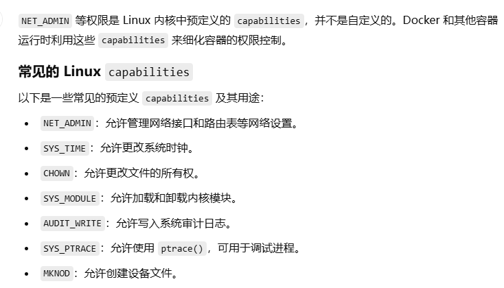
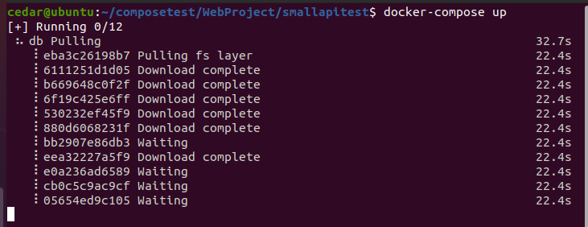
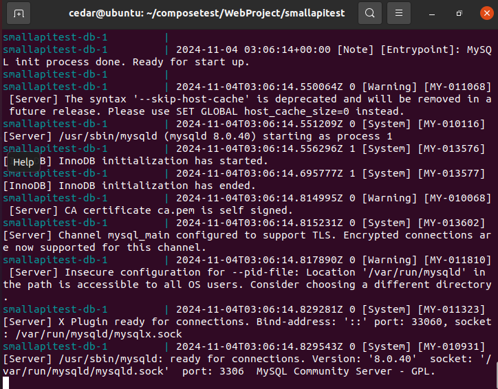

# Docker Compose
## 1、基础
Docker Compose 是 Docker 官方编排（Orchestration）项目之一，负责快速的部署分布式应用。

一个项目需要多个容器共同协作，compose就是写一个docker-compose文件把需要的镜像组合起来，统一管理。

Compose 中有两个重要的概念：
- 服务 (service)：一个应用的容器，实际上可以包括若干运行相同镜像的容器实例。
- 项目 (project)：由一组关联的应用容器组成的一个完整业务单元，在 docker-compose.yml 文件中定义。


docker-compose需要单独安装。
docker compose是 Docker 新版本中引入的 Docker Compose 插件，内置在 Docker CLI (docker) 中。

## 2、yml配置指令
### 2.1 version
使用docker-compose的哪个版本。
```yml
version: "3.8"
```

### 2.2 build
build 配置用于定义如何构建容器镜像。它通常用于指定 Dockerfile 的路径及上下文目录，确保在启动服务时自动构建镜像。

属性：
- context：上下文路径，指定构建镜像的上下文路径，通常是包含 Dockerfile 的目录
- dockerfile：Dockerfile 路径，如果 Dockerfile 不在上下文的根目录，可以使用 dockerfile 字段指定路径
- args：可以通过 args 传递构建时参数给 Dockerfile 中的 ARG 指令
- labels：设置构建镜像的标签
- target：多层构建，可以指定构建哪一层

```yml
services:
  webapi:
    build:
      context: ./dir  # Dockerfile在./dir目录下
      dockerfile: Dockerfile-alternate # 用Dockerfile-alternate为构建文件，而不是用默认的Dockerfile
      args:
        buildno: 1 # ARG buildno 可以在 Dockerfile 中接收此值
      labels: # 镜像自定义标签，可以多个
        - "description=smallShopping webapp" 
      target: prod # 指定构建阶段目标（multi-stage build）。如果 Dockerfile-alternate 使用了多阶段构建（例如 FROM ... AS build 和 FROM ... AS prod），此选项会告诉 Docker 只构建并使用 prod 阶段。这有助于生成一个优化的最终镜像
```

### 2.3 cap_add，cap_drop
添加或删除容器拥有的宿主机的内核功能
```yml
services:
  webapi:
    image: mysql:8.0
    cap_add:
      - NET_ADMIN    # 增加网络管理权限
      - SYS_TIME     # 增加修改系统时间的权限
    cap_drop:
      - CHOWN        # 移除更改文件所有权的权限
      - AUDIT_WRITE  # 移除审计日志写入的权限
```



### 2.4 cgroup_parent
为容器指定父 cgroup 组，意味着将继承该组的资源限制。
```yml
services:
  myapp:
    image: mysql:8.0
    cgroup_parent: /docker/myapp-cgroup  # 指定自定义父 cgroup
```

### 2.5 command
command 用于覆盖容器启动时执行的默认命令。

```yml
# 容器启动时将运行 python app.py --debug
services:
  app:
    image: myapp-image
    command: python app.py --debug  
    # or: command: ["python", "app.py", "--debug"]
```

### 2.6 container_name
指定自定义容器名称，而不是生成的默认名称。
```yml
services:
  app:
    image: myapp-image
    container_name: webApiContainer
```

## 3、实践

用Docker Compose部署DotNet项目。

根目录下创建docker-compose文件：
```yml
version: '3.8'
services:
  webapi:
    build:
      context: .
      dockerfile: Dockerfile
      target: build
    ports:
      - "5000:80"
    environment:
      ASPNETCORE_ENVIRONMENT: Development
      ConnectionStrings__DefaultConnection: "Server=db;Database=dotnet_small_shopping_api;User=root;Password=123456;"
    networks:
      - mynetwork
    depends_on:
      - db
      - initiator

  db:
    image: mysql:8.0
    environment:
      MYSQL_ROOT_PASSWORD: 123456
      MYSQL_DATABASE: dotnet_small_shopping_api
    ports:
      - "3306:3306"
    networks:
      - mynetwork

  initiator:
    build:
      context: .
      dockerfile: Dockerfile
      target: initiator
    entrypoint: ["dotnet", "/app/out/SmallShoppingApi.Initiator.dll"]  # 调整初始化脚本
    depends_on:
      - db
    networks:
      - mynetwork

networks:
  mynetwork:
    driver: bridge
```

执行命令`docker-compose up --build`:




