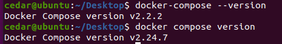

# Docker Compose
## 1、基础
Docker Compose 是 Docker 官方编排（Orchestration）项目之一，负责快速的部署分布式应用。

一个项目需要多个容器共同协作，compose就是写一个docker-compose文件把需要的镜像组合起来，统一管理。

Compose 中有两个重要的概念：
- 服务 (service)：一个应用的容器，实际上可以包括若干运行相同镜像的容器实例。
- 项目 (project)：由一组关联的应用容器组成的一个完整业务单元，在 docker-compose.yml 文件中定义。



docker-compose需要单独安装。
docker compose是 Docker 新版本中引入的 Docker Compose 插件，内置在 Docker CLI (docker) 中。

## 2、yml配置指令
### 2.1 version
使用docker-compose的哪个版本。
```yml
version: "3.8"
```

### 2.2 build
build 配置用于定义如何构建容器镜像。它通常用于指定 Dockerfile 的路径及上下文目录，确保在启动服务时自动构建镜像。

属性：
- context：上下文路径，指定构建镜像的上下文路径，通常是包含 Dockerfile 的目录
- dockerfile：Dockerfile 路径，如果 Dockerfile 不在上下文的根目录，可以使用 dockerfile 字段指定路径
- args：可以通过 args 传递构建时参数给 Dockerfile 中的 ARG 指令
- labels：设置构建镜像的标签
- target：多层构建，可以指定构建哪一层

```yml
services:
  webapi:
    build:
      context: ./dir  # Dockerfile在./dir目录下
      dockerfile: Dockerfile-alternate # 用Dockerfile-alternate为构建文件，而不是用默认的Dockerfile
      args:
        buildno: 1 # ARG buildno 可以在 Dockerfile 中接收此值
      labels: # 镜像自定义标签，可以多个
        - "description=smallShopping webapp" 
      target: prod # 指定构建阶段目标（multi-stage build）。如果 Dockerfile-alternate 使用了多阶段构建（例如 FROM ... AS build 和 FROM ... AS prod），此选项会告诉 Docker 只构建并使用 prod 阶段。这有助于生成一个优化的最终镜像
```

### 2.3 cap_add，cap_drop
添加或删除容器拥有的宿主机的内核功能
```yml
services:
  webapi:
    image: mysql:8.0
    cap_add:
      - NET_ADMIN    # 增加网络管理权限
      - SYS_TIME     # 增加修改系统时间的权限
    cap_drop:
      - CHOWN        # 移除更改文件所有权的权限
      - AUDIT_WRITE  # 移除审计日志写入的权限
```


### 2.4 cgroup_parent
为容器指定父 cgroup 组，意味着将继承该组的资源限制。
```yml
services:
  myapp:
    image: mysql:8.0
    cgroup_parent: /docker/myapp-cgroup  # 指定自定义父 cgroup
```

### 2.5 command
command 用于覆盖容器启动时执行的默认命令。

```yml
# 容器启动时将运行 python app.py --debug
services:
  app:
    image: myapp-image
    command: python app.py --debug  
    # or: command: ["python", "app.py", "--debug"]
```

### 2.6 container_name
指定自定义容器名称，而不是生成的默认名称。
```yml
services:
  app:
    image: myapp-image
    container_name: webApiContainer
```

### 2.7 depends_on
设置依赖关系。比如创建一个容器运行dotnet项目，这个项目需要mysql，那么就必须是mysql容器运行以后再执行dotnet项目。

```yml
services:
  webapi:
    build: .
    depends_on:
      - db
  db:
    image: postgres
```

### 2.8 deploy
指定与服务的部署和运行有关的配置。只在 swarm 模式下才会有用。
(Docker Swarm 是 Docker 的原生集群管理工具，用于容器编排。)

(这个等需要再看，配置挺多的)

### 2.9 devices
devices 是一个用于配置容器设备访问的选项，允许容器访问主机系统中的物理设备（如硬件设备、设备文件等）。它通常用于需要与物理设备交互的容器应用，例如 GPU、串口设备、USB 设备等。

```yml
services:
  my_service:
    image: my_image
    devices:
      - /dev/sda:/dev/sda
```

- /dev/sda 是主机上的设备文件路径。
- /dev/sda（后面的路径）是容器中设备文件的路径。
这种配置将主机上的 /dev/sda 设备文件映射到容器内的同样路径上，容器可以直接访问该设备。

### 2.10 dns
用于指定一个或多个 DNS 服务器的 IP 地址，容器会向这些 DNS 服务器请求域名解析。
```yml
services:
  my_service:
    image: my_image
    dns: # 容器将使用 8.8.8.8 和 8.8.4.4 作为 DNS 服务器
      - 8.8.8.8  # Google 公共 DNS
      - 8.8.4.4  # Google 公共 DNS
```
如果有自己的 DNS 服务器，或者希望容器使用特定的 DNS 服务器（例如，防止泄漏查询、使用企业 DNS、加速解析等），可以通过 dns 来配置。

### 2.11 dns_search
用于设置 DNS 搜索域，允许容器在解析域名时自动附加特定的域名后缀.
```yml
services:
  my_service:
    image: my_image
    dns_search:
      - example.com
      - local
```
如果尝试解析 myhost，Docker 会自动补充域名后缀 example.com 或 local，首先会尝试 myhost.example.com，如果失败，则尝试 myhost.local。

### 2.12 entrypoint
 主要用于定义容器启动时执行的命令。它指定了容器启动时要运行的主进程，通常是一个可执行文件、脚本或者命令。
```yml
services:
  web:
    image: nginx
    entrypoint: ["nginx", "-g", "daemon off;"]
    command: ["-c", "/etc/nginx/nginx.conf"]
```
跟command类似。
- entrypoint: ["nginx", "-g", "daemon off;"]：定义了容器启动时会执行 nginx -g "daemon off;" 命令，这个命令会启动 Nginx 服务并使其保持在前台运行。
- command: ["-c", "/etc/nginx/nginx.conf"]：为 entrypoint 命令提供了额外的参数。
最后执行的命令是：`nginx -g "daemon off;" -c /etc/nginx/nginx.conf`

### 2.13 env_file
指定外部环境变量文件的配置项。
```yml
services:
  myservice:
    image: my-image
    env_file:
      - .env        # 引用一个文件
      - .env.dev    # 可以引用多个文件
```
其中.env文件里面是自己设计的环境变量:
```yml
DB_HOST=localhost
DB_PORT=3306
API_KEY=your-api-key
```

在容器启动时，DB_HOST=localhost、DB_PORT=3306 和 API_KEY=your-api-key 将被加载到容器的环境中。你可以在容器内的应用程序中访问这些环境变量。

### 2.14 environment
env_file 和 environment 都用于设置环境变量，但它们的使用方式不同。
- env_file：通过引用外部文件来加载环境变量，通常用于从文件中导入一组环境变量
- environment：直接在 Docker Compose 文件中定义环境变量，适用于少量或显式需要在 Compose 文件中定义的变量

```yml
services:
  web:
    image: my-image
    environment:
      - DB_HOST=localhost
      - DB_PORT=3306
```

### 2.15 expose
暴露端口，但不映射到宿主机，只被连接的服务访问。
```yml
services:
  web:
    image: nginx
    expose:
      - 80
      - 443
```
expose 表示 web 服务容器会监听 80 和 443 端口，供其他容器在同一网络中使用。注意： expose 不会将端口暴露到宿主机上，只在 Docker 网络中有效。

### 2.16 extra_hosts


## 3、实践

用Docker Compose部署DotNet项目。

根目录下创建docker-compose文件：
```yml
version: '3.8'
services:
  webapi:
    build:
      context: .
      dockerfile: Dockerfile
      target: build
    ports:
      - "5000:80"
    environment:
      ASPNETCORE_ENVIRONMENT: Development
      ConnectionStrings__DefaultConnection: "Server=db;Database=dotnet_small_shopping_api;User=root;Password=123456;"
    networks:
      - mynetwork
    depends_on:
      - db
      - initiator

  db:
    image: mysql:8.0
    environment:
      MYSQL_ROOT_PASSWORD: 123456
      MYSQL_DATABASE: dotnet_small_shopping_api
    ports:
      - "3306:3306"
    networks:
      - mynetwork

  initiator:
    build:
      context: .
      dockerfile: Dockerfile
      target: initiator
    entrypoint: ["dotnet", "/app/out/SmallShoppingApi.Initiator.dll"]  # 调整初始化脚本
    depends_on:
      - db
    networks:
      - mynetwork

networks:
  mynetwork:
    driver: bridge
```

执行命令`docker-compose up --build`:


