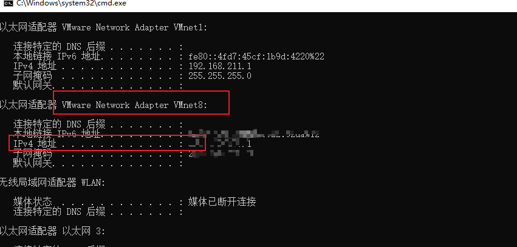
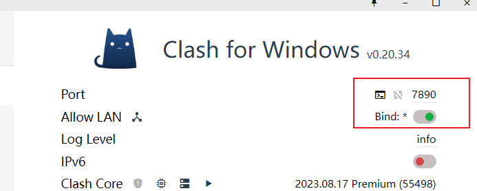
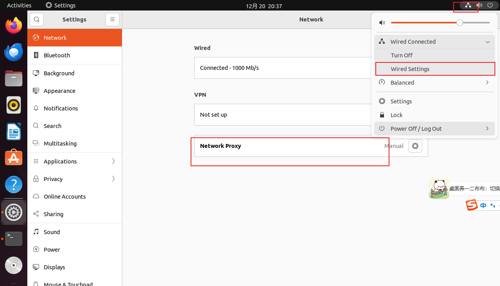
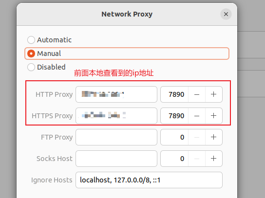
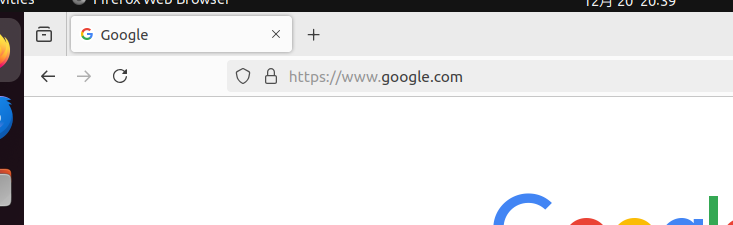
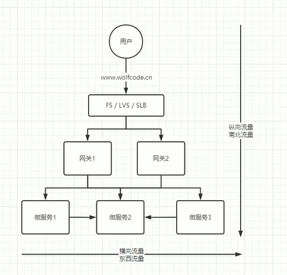

# 资料合集

## 实战补充
### 虚拟机操作系统使用本地vpn
首先对于浏览器一类的，直接在界面操作：

1、在本地计算机查看ip地址：




2、vpn我用的是clash，记住端口并开启lan



3、虚拟机操作系统上配置vpn





4、这时候可以看到浏览器能够访问Google了



<hr>

但是当我们用terminal ping Google.com的时候发现是无法连接的。（占坑！！！！！！！！！！！！！！！！这个一直没有解决！！！！！！！！！）

使用命令行的姿势：

```
设置：
export http_proxy="http://proxy-xxx:7890"
export https_proxy="https://proxy-xxx:7890"

取消：
unset http_proxy
unset https_proxy

查看：
env | grep http_proxy
```

## 查漏补缺
### 东西流量与南北流量


## 参考资料
- k8s教学视频：https://www.bilibili.com/video/BV1MT411x7GH/?spm_id_from=333.337.search-card.all.click&vd_source=c3939bba6fb53dcccb38ed988f16994c
- 官方文档：https://kubernetes.io/zh-cn/docs/home/supported-doc-versions/
- minkube安装：https://minikube.sigs.k8s.io/docs/start/?arch=%2Fwindows%2Fx86-64%2Fstable%2F.exe+download