# K8S基础
## 1 理解kuberneters
k8s是Google开源的一个项目，用于管理多个主机上容器化的应用。（对比dockerfile，dockerfile就是一个主机上的容器。）

应用部署的三大阶段：

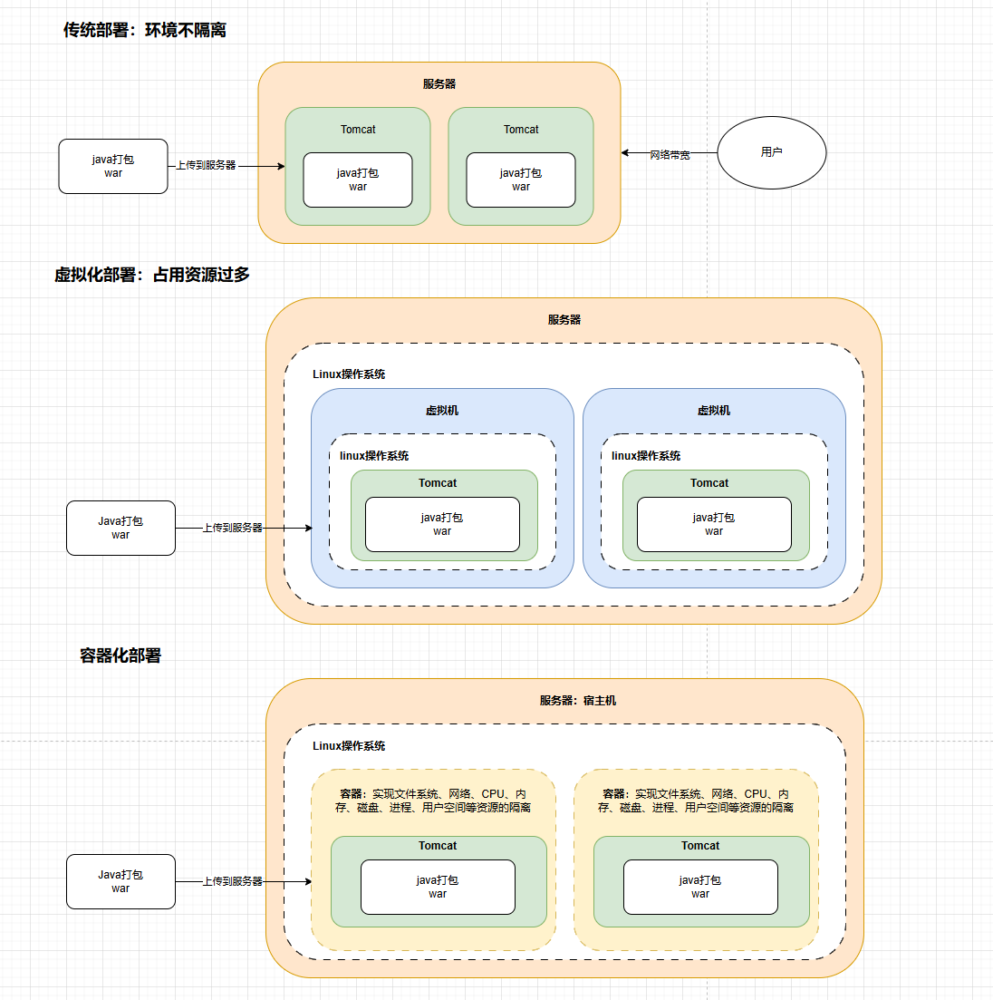

k8s特点：
- 自我修复：其中一个挂了，k8s自己删掉挂掉的容器并从正常运行的容器复制一个代替
- 弹性伸缩：给一个数值，k8s自动复制新的容器或删除容器
- 自动部署和回滚：编写配置文件，k8s自动完成部署，实现滚动更新让用户无感知
- 服务发现和负载均衡：k8s使用前我们需要用nginx实现反向代理和负载均衡，有k8s后就不需要了，直接用k8s里面的配置
- 机密和配置
- 存储编排：可以把存储资源抽象成一个个虚拟磁盘，容器访问虚拟磁盘，由虚拟磁盘映射到对应的真正磁盘
- 批处理

## 2 相关组件
### 2.1 控制面板组件（Master节点上的）
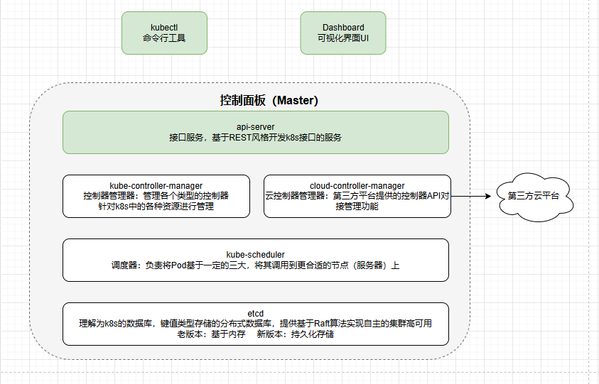
#### 2.1.1 etcd

#### 2.1.2 kube-appiserver

#### 2.1.3 kube-controller-manager

#### 2.1.4 cloud-controller-manager

#### 2.1.5 kube-scheduler

### 2.2 节点组件（普通节点上的）
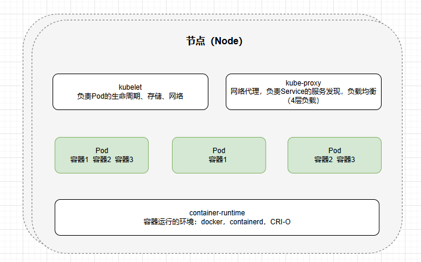

#### 2.2.1 kubelet

#### 2.2.2 kube-proxy

#### 2.2.3 container runtime

### 2.3 附加组件
#### 2.3.1 kube-dns

#### 2.3.2 Ingress controller

#### 2.3.3 Heapster

#### 2.3.4 Dashboard

#### 2.3.5 Federation

#### 2.3.6 Fluentd-elasticsearch

## 3 分层架构
- 生态系统
- 接口层
- 管理层
- 应用层
- 核心层

## 4 专业术语
### 4.1 服务的分类
- 有状态应用
- 无状态应用

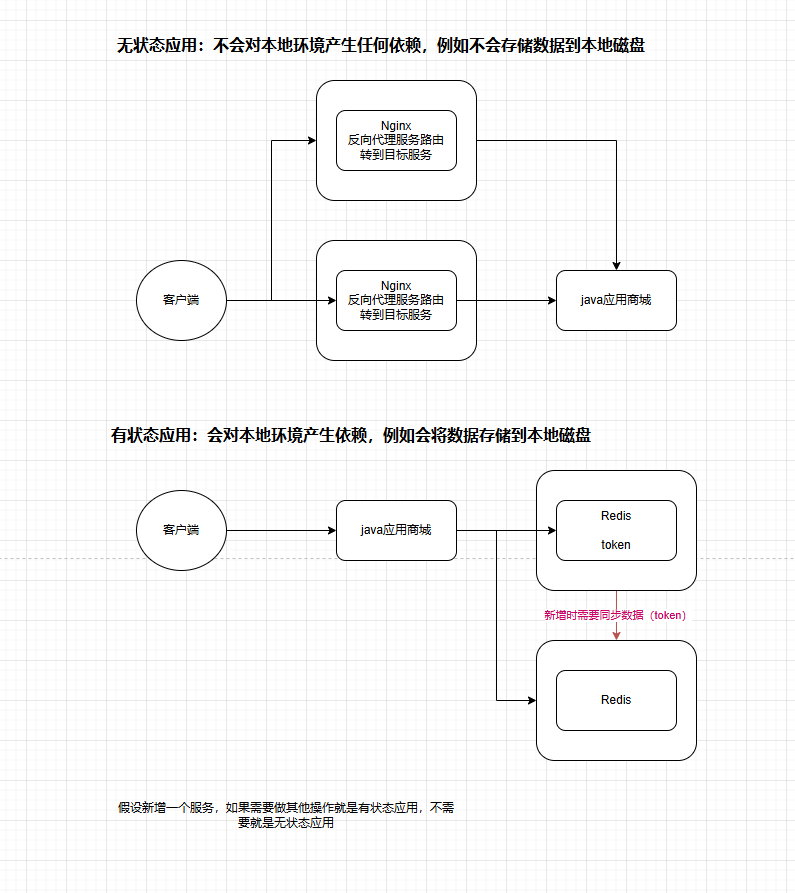

### 4.2 资源和对象
以开发的角度，资源类比类，对象就是基于类创建的对象。

k8s所有内容都被抽象为“资源”，如Pod，Service，Node等都是资源。对象就是资源的实例。对象的创建，删除，修改都是通过“kuberneters API”也就是“Api Server”组件提供的API接口。命令行工具kubectl实际上也是调用的kubernetes api。

k8s中资源类别很多，kubectl可以通过配置文件创建这些对象，配置文件更像是描述对象属性的稳定，配置文件可以是json或yaml，常用yaml。

#### 4.2.1 对象的规约和状态：
- 规约 spec
    - 是规格的意思，spec是必须的，描述了对象的期望状态，希望对象所具有的特征，当创建k8s对象时，必须提供对象的规约，用来描述这个对象的期望状态，以及关于对象的一些基本信息
- 状态 status
    - 表示对象实际状态，由k8s自己维护，k8s会通过一系列控制器对对应对象进行管理，让对象尽可能的让实际状态与期望状态重合

#### 4.2.2 资源的分类

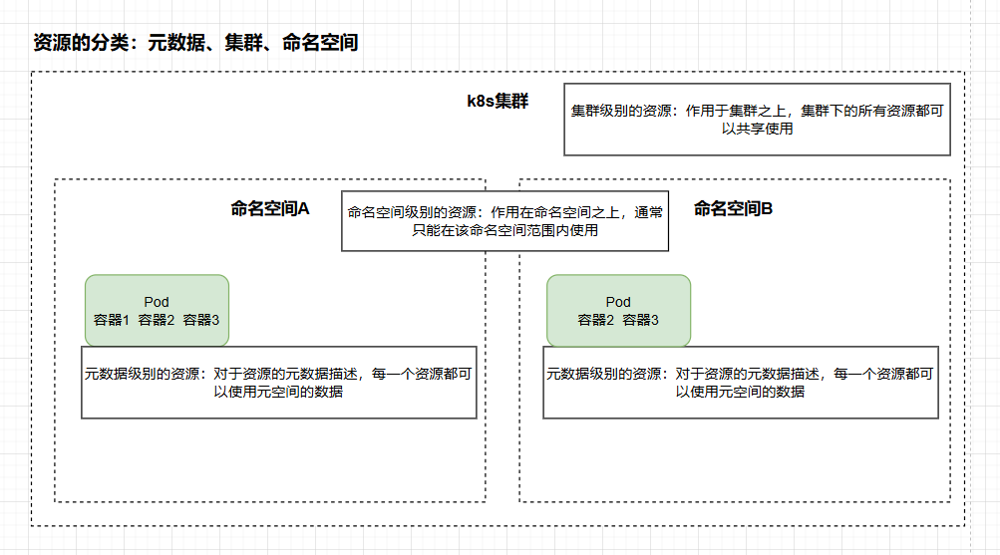

##### 4.2.2.1 元数据
- Horizontal Pod Autoscaler（HPA）
    - Pod自动扩容，可以根据CPU使用率或自定义指标（metrics）自动对pod进行扩容/缩容
    - 控制管理器每隔30s（可通过-horizontal-pod-autoscaler-sync-period修改）查询metrics的资源使用情况
    - 支持3中metrics类型
        - 预定义metrics（比如Pod的CPU）以利用率的方式计算
        - 自定义的Pod metrics，以原始值（raw value）的方式计算
        - 自定义的object metrics
    - 支持两种metrics查询方式：Heapster和自定义的REST API
    - 支持多metrics
- PodTemplate
    - 是关于Pod的定义，是被包含在其他kuberneters对象中。控制器通过PodTemplate信息创建Pod
- LimitRange
    - 对集群内Request和Limits的配置做一个全局的统一的限制

##### 4.2.2.2 集群
- Namespace
    - 命名空间
- Node
    - Node就是服务器，本质不是k8s创建的，k8s只是管理Node上的资源，虽然可以通过Manifest创建一个Node对象，但k8s也只是去检查是否真的有这么一个Node，如果检查失败，也不会往上面调度Pod
- ClusterRole
    - k8s的鉴权是RBAC，集群角色
- ClusterRoleBinding
    - 集群级别的角色与资源的绑定

##### 4.2.2.3 命名空间

**工作负载 Pod：**

Pod是k8s中最小的可部署单元。一个Pod（容器组）包含一个应用程序容器（某些情况下有多个）、存储资源、一个唯一的网络IP地址、以及一些确定容器该如何运行的选项。Pod代表k8s中一个独立的应用程序运行实例。

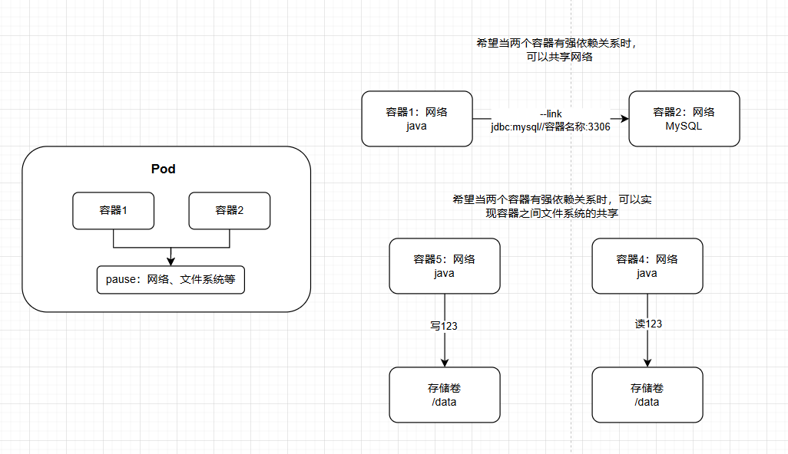

Pod存在两种使用途径：
- 一个Pod中只运行一个容器，one-container-pod是k8s最常见使用方式。可以认为pod容器组是容器的wapper，k8s通过pod管理容器而不是直接管理容器
- 一个pod中运行多个需要互相协作的容器，可以将多个紧密耦合，共享资源切始终在一起运行的容器编排在同一个pod中

1、副本 replicas

一个pod可以被复制成多份，每一份可以称为一个副本。副本除了一些描述性信息不一样外，其他都是一样的。

2、控制器

就是pod抽象出来的一层。可以理解为内存级别的一个对象。

控制器通常包含一个replicas属性，指定pod副本数量。

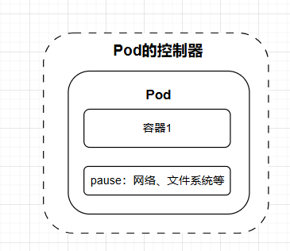

控制器种类：
- 适用无状态服务
    - ReplicationController（RC）
        - 基本废除了。被RS所替代
            - 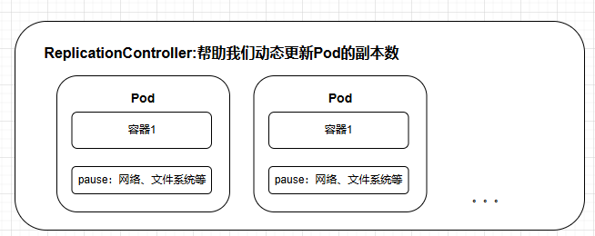
    - ReplicaSet（RS）
        - Label和Selector
            - 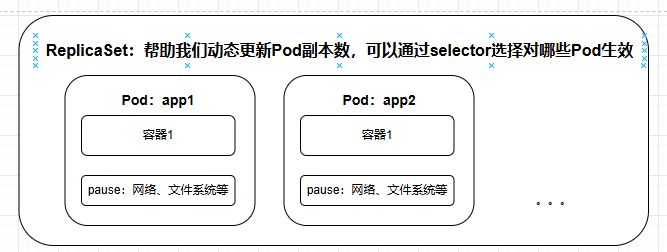
    - Deployment （Deployment：针对RS的更高层次的封装，提供更丰富的部署相关功能）
        - 创建Replica Set / Pod
        - 滚动升级/回滚
            - 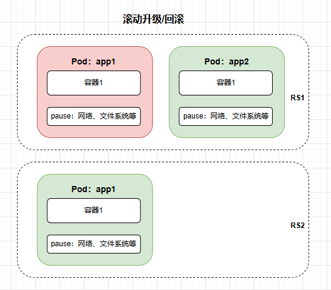
        - 平滑扩容和缩容
        - 暂停与恢复Deployment

- 适用有状态服务
    - StatefulSet
        - 主要特点
            - 稳定持久化存储
            - 稳定网络标志
            - 有序部署，有序扩展
            - 有序收缩，有序删除
        - 组成
            - Headless Service
            - volumeClaimTemplate
        - 注意事项
            - k8s v1.5 以上才支持
            - 所有Pod的Volume必须使用PersistentVolume或管理员事先创建好
            - 为保证数据安全，删除StatefulSet时不会删除Volume
            - StatefulSet需要一个Headless Service定义DNS domain，需要在StatefulSet之前创建好
        - StatefulSet中每个Pod的DNS格式为StatefulSetName-(0..N-1).serviceName.namespace.svc.cluster.local
            - serviceName为Headless Service的名字
            - 0..N-1为Pod所在的需要，从0开始到N-1
            - statefulSetName为StatefulSet的名字
            - namespace为服务所在的namespace，Headless Service和StatefulSet必须在相同的namespace
            - .cluster.local为Cluster Domain（集群域名）
        - 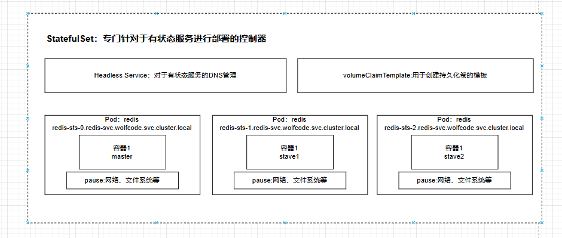
- 守护进程
    - DaemonSet
        - 保证在每个Node上都运行一个容器副本，常用于部署一些集群日志，监控或其他管理应用
        - 经典应用场景
            - 日志收集：fluentd、logstash等
            - 系统监控：Prometheus Node Exporter、collected、New Relic agent、Gangla gmond等
            - 系统程序：kube-proxy、kube-dns、glusterd、ceph等
        - 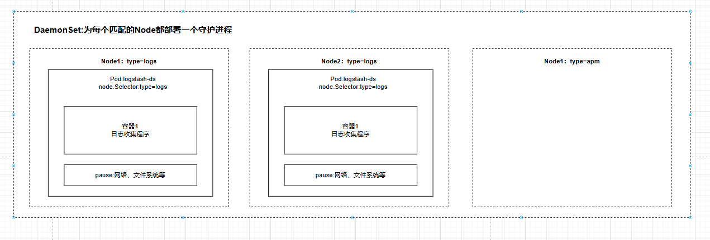
- 任务/定时任务
    - Job
        - 一次性销毁，运行完成后Pod销毁，不再重新启动新容器
    - CronJob
        - 在Job基础上加上了定时功能

**服务发现：**

1、Service（用于东西流量的）
实现k8s内部网络调用、负载均衡（四层负载）

2、Ingress（用于南北流量的）
实现将k8s内部服务暴露给外网访问的服务，ingress-nginx实现反向代理、负载均衡（七层负载）

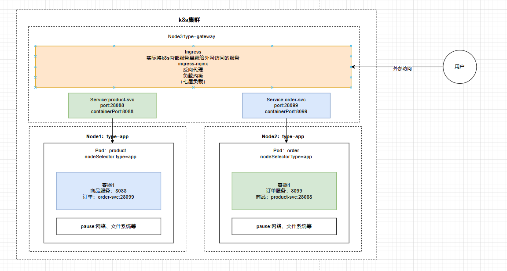

**存储：**

1、Volume：
数据卷，共享Pod容器使用的数据，用于放持久化的数据，比如数据库数据。

2、CSI：
一个行业标准接口规范，将任意存储系统暴露给容器化应用程序。CSI规范定义了存储提供商实现CSI兼容的Volume Plugin的最小操作集和部署建议。

**特殊类型配置：**

1、ConfigMap:
将配置key value放ConfigMap，然后将ConfigMap加载到容器中。

2、Secret：
跟ConfigMap功能一样，多了加密这个功能。
有三种类型：
    - Service Account：用来访问k8s API，由k8s自动创建，并且会自动挂载到Pod的/run/secrets/kubenetes.io/serviceaccount目录中
    - Opaque:base64编码格式的Secret，用来存储密码和密钥
    - kuberneters/dockerconfigjson:用来存储私有docker registry的认证信息

3、DownwardAPI：
让pod里的容器能够直接获取到这个pod对象本身的一些信息。
暴露方式：
- 环境变量：用于单个变量，将pod信息和容器信息直接注入容器内部
- Volume挂载：将pod信息生成文件，直接挂载到容器内部中

**其他：**

1、Role：
定义一组权限，定义命名空间的权限

2、RoleBinding：
可以直接作用于Role，于ClusterRoleBinding的区别是，ClusterRoleBinding也可以绑定普通Role。

