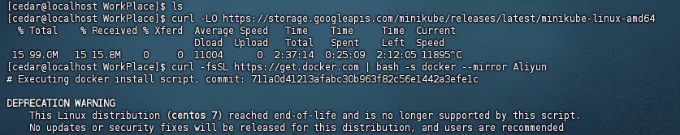
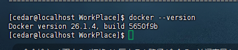
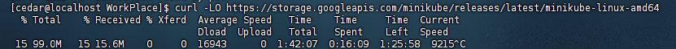

# 实战

## 1 搭建k8s集群
### 1.1 搭建方案

- minkube
    - 轻量级的，个人电脑推荐用这个
- kubeadm
- 二进制安装
- 命令行工具

这里使用CentOS 7 虚拟机安装minkube。

1、安装Docker:用官方安装脚本

```
curl -fsSL https://get.docker.com | bash -s docker --mirror Aliyun
```





2、安装minkube
```
curl -LO https://storage.googleapis.com/minikube/releases/latest/minikube-linux-amd64
sudo install minikube-linux-amd64 /usr/local/bin/minikube && rm minikube-linux-amd64

minikube kubectl
```


虚拟机下载的有点慢，可以本地下载后复制到虚拟机。

