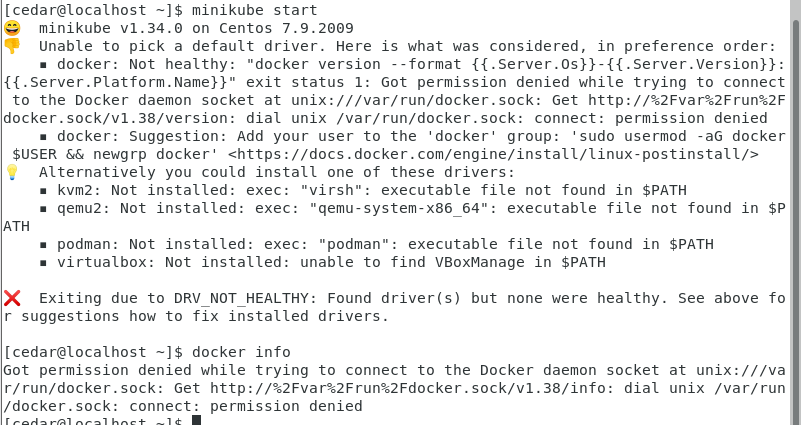

# 实战

## 1 搭建k8s集群
### 1.1 搭建方案

- minkube
    - 轻量级的，个人电脑推荐用这个
- kubeadm
- 二进制安装
- 命令行工具

这里使用CentOS 7 虚拟机安装minkube。

如果出现镜像源问题，解决办法查看Linux操作的笔记。

0、条件
- 2CPU
- 2G以上内存

#### 1.1.1 安装Docker

1）用官方安装脚本（不推荐）

```
curl -fsSL https://get.docker.com | bash -s docker --mirror Aliyun
```


2）yum安装
```
sudo yum update -y
sudo yum install -y docker
sudo systemctl start docker
sudo systemctl enable docker
docker --version
```
踩坑：这样安装后docker版本很低，https://kunyuan.tech/archives/587 查看这个步骤升级docker版本

#### 1.1.2 安装minkube
```
curl -LO https://storage.googleapis.com/minikube/releases/latest/minikube-linux-amd64
sudo install minikube-linux-amd64 /usr/local/bin/minikube && rm minikube-linux-amd64

sudo systemctl start docker
minikube start
```


需要的内存比较多，需要根据提示调整虚拟机内存。

虚拟机下载的有点慢，可以本地下载后复制到虚拟机。


<hr>



如果minikube start启动失败，查看docker info是不是因为没有权限。


<hr>

#### 1.1.3 安装kubectl

```
minikube kubectl
```


