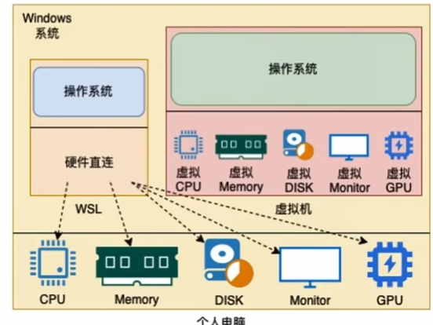

# 资料合集

## 查漏补缺
### WSL（Windows Subsystem for Linux）
WSL是用于Window系统之上的Linux子系统，可以在Window系统中获得Linux系统环境，并完全直连计算机硬件，无需通过虚拟机虚拟硬件。

传统方式获取Linux操作系统环境是安装完整的虚拟机，如VMware，使用WSL可以以轻量化的方式得到Linux系统环境。

需要开启WSL的话可以看视频跟着做，很简单。

## 参考资料
- 黑马程序员视频：https://www.bilibili.com/video/BV1n84y1i7td/?spm_id_from=333.337.search-card.all.click&vd_source=c3939bba6fb53dcccb38ed988f16994c
