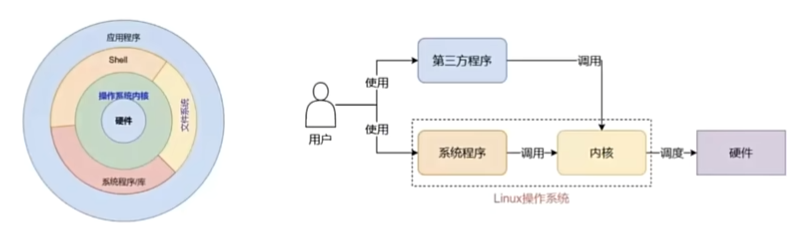
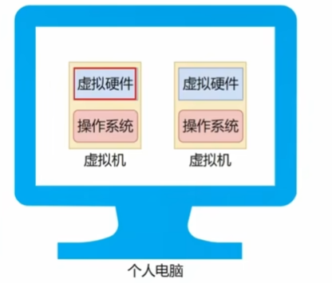
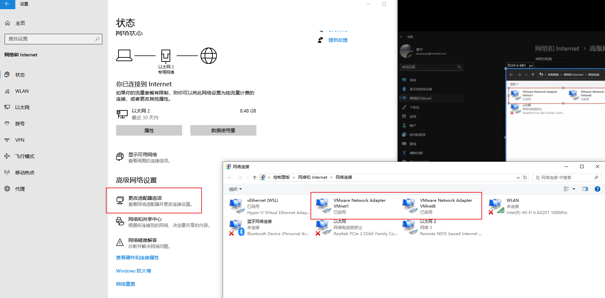
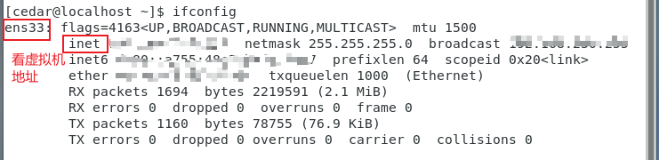
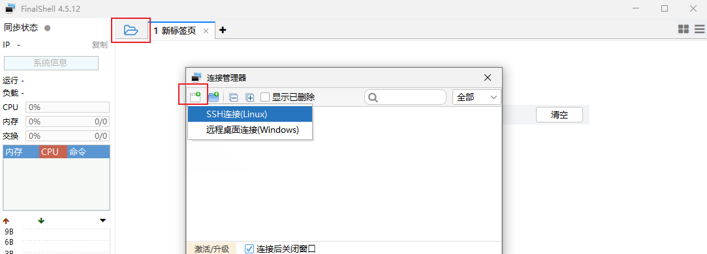

# Linux基础
操作系统就是计算机软件的一种，作为用户和计算机硬件之间的桥梁，调度和管理计算机硬件进行工作。

市面常见PC操作系统：
- Window
- Linux
- macOS

市面常见移动设备操作系统
- Android
- IOS
- HarmonyOS

## 1、Linux概述
Linux系统组成：
- Linux系统内核：提供系统最核心功能，比如调度CPU、内存、文件系统、网络通讯、IO等
- 系统级应用程序：出厂自带的程序，如文件管理器、任务管理器、图片查看等

Linux内核是免费开源的：https://www.kernel.org

任何人都可以获得病修改内核，并且自行集成系统级程序，提供了内核+系统级程序的完整封装就称之为Linux发行版。
常用的Linux发行版有：
- Ubuntu
- CentOS
- redhat

不同发行版基础命令是相同的，部分操作（比如软件安装）不同。

## 2、虚拟机
通过虚拟化技术，在电脑内虚拟出计算机硬件并给虚拟的硬件安装操作系统，即得到一台虚拟的电脑，称为虚拟机。

本次使用VMware进行Linux的实操。

安装后需要确认有没有这两个虚拟网卡。如果没有这两个的话后续虚拟机是没有办法上网的。

本次安装Linux操作系统分别是用CentOS与Ubuntu。
https://wiki.centos.org/Download.html

具体怎么安装虚拟机和常见虚拟机的直接网上搜索图文教程就好啦~

## 3、远程链接Linux
操作系统的使用有2种形式：图形化、命令行。

在VMware种操作命令行页面不太方便，因为主机是Window，虚拟机是Linux，跨越VMware进行交互不方便，可以通过第三方软件FinalShell，远程连接到Linux操作系统上。（其实用VMware tool也可以的）
https://www.hostbuf.com/

Linux虚拟机如果重启，可能IP地址会改变，可以通过命令固定IP地址。（后续会提到）

## 4、虚拟机快照
如果Linux操作系统损坏的话重新安装一个比较麻烦，虚拟机快照将当前虚拟机的状态保存下来后在以后可以通过快照恢复虚拟机到保存的状态。

虚拟机关机后制作快照速度比较快。
