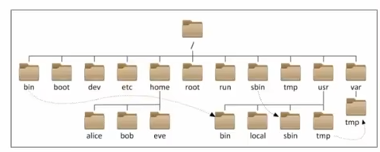

# Linux基础命令
## 1、Linux目录结构
Linux目录结构是一个树形结构。

Windows系统可以有多个盘符，C盘D盘等。Linux没有盘符这个概念，只有一个根目录 / ，所有文件都在它下面。



## 2、Linux命令基础
无论什么命令，在Linux中，命令有通用格式：
`command [-option] [parameter]`

- command:命令本身
- -option：可选，命令的一些选项，通过选项控制命令的行为细节
- parameter：可选，命令的参数，多数用户命令的指向目标等

### 2.1 ls 列出目录下的内容
`ls [-a -l -h] [Linux路径]`
- -a: all,列出全部文件，包含隐藏文件/文件夹（以.开头就能自动隐藏）
- -l：以列表的形式展示内容，并展示更多信息
- -h：以易于阅读（human）的形式列出文件大小，如K、M、G， -h必须搭配-l一起使用，否则没有效果

一下命令都是等价的：
```shell
ls -l -a
ls -la
ls -al
```

Linux系统的命令行终端在启动时默认加载当前登录用户的HOME目录作为当前工作目录，所以ls列出的是HOME目录的内容。

HOME目录是每个Linux操作用户在Linux系统的个人账户目录，路径在/home/用户名。


### 2.2 cd/pwd 目录切换
#### 2.2.1 cd 切换工作目录
Change Directory

`cd [Linux路径]` 


直接用cd就直接回到HOME目录下。

#### 2.2.2 pwd 查看当前工作目录
Print Work Directory

`pwd`


### 2.3 相对路径、绝对路径和特殊路径符

- cd /home/cedar/Desktop : 绝对路径写法，以根目录作为起点
- cd Desktop : 相对路径写法， 以当前目录作为起点

特殊路径符：
- . : 表示当前目录
- .. : 表示上一级目录
- ~ : 表示HOME目录

### 2.4 mkdir 创建目录
Make Directory

`mkdir [-p] Linux路径`

- -p ： 表示自动常见不存在的父目录


创建文件夹需要修改权限，所以在HOME目录内才会创建成功，在HOME外操作涉及到权限问题，普通用户无法创建成功。


### 2.5 文件操作命令（touch、cat、more、cp、mv、rm）
#### 2.5.1 touch 创建文件
`touch Linux路径`


用`ls -l` 查询目录，如果d开头的表示文件夹， -开头的表示文件。

#### 2.5.2 cat 查看文件（全部）
`cat Linux路径`


#### 2.5.3 more 查看文件（翻页）
`more Linux路径`

- cat是直接将内容显示出来
- more支持翻页，如果文件内容过多，可以一页页展示


通过空格翻页，通过q退出。


#### 2.5.4 cp 复制文件/文件夹
COPY

`cp [-r] 参数1 参数2`

- r：可选，用于复制文件夹的时候，表示递归（就是复制整个文件夹以及下面的内容）
- 参数1：Linux路径，表示被复制的文件/文件夹
- 参数2：Linux路径，表示要复制去的地方


#### 2.5.5 mv 移动文件/文件夹
move

`mv 参数1 参数2`

- 参数1：Linux路径，表示被移动的文件或文件夹
- 参数2：Linux路径，表示要移动去的地方，如果目标不存在，则进行改名，确保目标存在


#### 2.5.6 rm 删除文件/文件夹
remove

`rm [-r -f] 参数1 参数2 ... 参数n`

- -r：用于删除文件夹
- -f：表示force强制删除（不会弹出提示确认消息）
    - 普通用户删除内容不会弹出提示，只有root管理员用户删除内容会有提示，所以一般普通用户用不到-f选项
- 参数1，...，参数n：表示要删除的文件/文件夹路径


rm命令支持通配符*用来做模糊匹配，*表示匹配任意内容（包含空）。


以下两个命令不要在root用户下执行，相当于在windows下执行C盘格式化：
```sh
rm -rf /
rm -rf/*
```

### 2.6 查找命令(which、find)
Linux命令本体是一个个二进制可执行文件程序，相当于Windows系统的.exe文件。

#### 2.6.1 which

可以通过which命令查看命令的程序文件存放在哪里。


#### 2.6.2 find
##### 2.6.2.1 按文件名搜索
`find 起始路径 -name “被查找文件名”`


find也可以用*做模糊查询。

##### 2.6.2.2 按文件大小搜索
`find 起始路径 -size +/-n[KMG]`
- +、-：表示大于和小于
- n：表示大小数字
- KMG：表示大小单位，kb、MB、GB


### 2.7 grep 过滤文件内容
`grep [-n] 关键字 文件路径`

- n：可选，在结果中消失匹配的行的行号
- 关键字：表示过滤的关键字，带有空格或其他特殊符号，建议使用“”将关键字包围起来
- 文件路径：表示有过滤内容的文件路径，可作为内容输入端口


### 2.8 wc 统计内容数量
`wc [-c -m -l -w] 文件路径`

- -c：统计bytes数量
- -m：统计字符数量
- -l：统计行数
- -w：统计多次数量
- 文件路径：被统计的文件，可作为内容输入端口


### 2.9 管道符
“|” 是一个管道符。含义是将管道符左边命令的结果作为右边命令的输入。


管道符是可以嵌套使用的。

### 2.10 echo 在命令行内输出制定内容
`echo 输出内容`


如果是想被包围的字符作为命令执行，那么用``包围要执行的命令。


### 2.11 tail 查看文件尾部内容，跟踪文件最新更改
`tail [-f -num] Linux路径`

- -f：持续追踪
- -num：查看尾部多少行，默认10行
- Linux路径：表示被追踪的文件路径


### 2.12 重定向符
- \>：将左侧命令的结构，覆盖写入到符号右侧指定文件中
- \>\>：将左侧命令的结果，追加写入到符号右侧指定文件中


### vi/vim 编辑文件
`vi/vim 文件路径`

vi/vim是Linux中最经典的尾部编辑器。
vim是vi的加强版本，兼容vi所有指令，不仅能编辑文本，还具有shell程序编辑的功能，可以用不同颜色的字体辨别语法的正确性。


