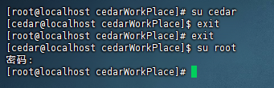
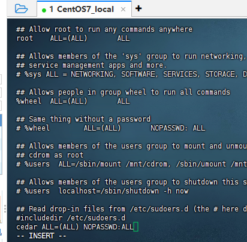
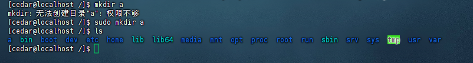
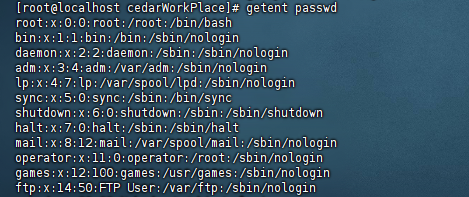
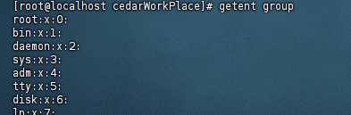
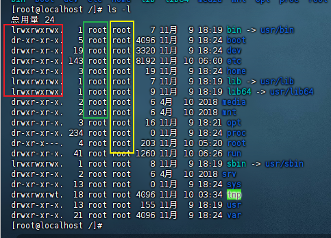
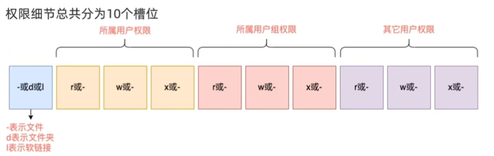
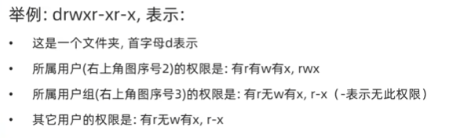
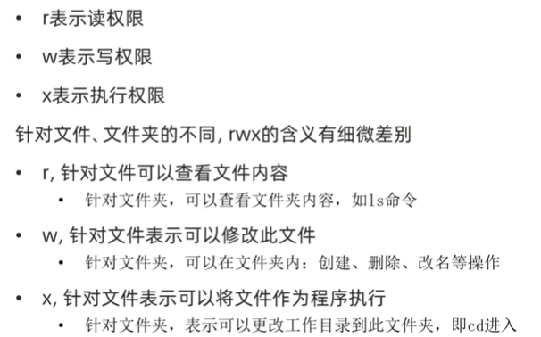

# Linux权限
## 1 root用户
Linux系统中拥有最大权限的账户名是root（超级管理员）。

### 1.1 su 切换用户
`su [-] [用户名]`

- \- ：可选，表示是否在切换用户后加载环境变量，建议带上
- 用户名：表示要切换的用户，省略的话默认是root

切换用户有用exit可以退回上一个用户，也可以使用快捷键ctrl+d 。

使用普通用户切换到其他用户要输入密码，root用户切换到其他用户无需密码。

### 1.2 sudo 临时以root身份执行
`sudo 其他命令`

长期使用root用户是不建议的，避免带来系统损坏，可以使用sudo命令，为普通的命令授权，临时以root身份执行。
不过不是所有用户都有权利使用sudo的，需要为普通用户配置sudo认证。

为普通用户配置sudo认证：
1、切换root用户执行visudo命令，会自动通过vi打开：/etc/sudoers
2、在文件最后添加 `cedar ALL=(ALL) NOPASSWD:ALL`  NOPASSWD:ALL表示使用sudo命令无需输入密码
3、wq保存退出
4、切换回普通用户

## 2 用户、用户组管理
Linux中关于权限的管控级别有2个，分别是：
- 针对用户的权限控制
- 针对用户组的权限控制

### 2.1 用户组管理
需要用root用户执行。

#### 2.1.1 创建用户组
`groupadd 用户组名`

#### 2.1.2 删除用户组
`groupdel 用户组名`

### 2.2 用户管理
#### 2.2.1 创建用户
`useradd 用户名 [-g -d]`
- -g：指定用户的组，不指定-g会创建同名组并自动加入，指定-g需要组已经存在
- -d：指定用户HOME路径，不指定，HOME目录默认在/home/用户名

#### 2.2.2 删除用户
`userdel [-r] 用户名`
- -r：删除用户的HOME目录，不使用-r，删除用户时，HOME目录保留

#### 2.2.3 查看用户所属组
`id [用户名]`

#### 2.2.4 修改用户所属组
`usermod -aG 用户组 用户名`

### 2.3 getent 查看当前系统有哪些用户和用户组

查看用户：
`getent passwd`

共有7份信息，分别是：
用户名：密码(x)：用户ID：组ID：描述信息：HOME目录：执行终端（默认bash）

查看用户组：
`getent group`

包含3份信息：
组名称：组认证（x）：组ID

## 3 查看权限控制

依次表示 文件/文件夹权限控制信息、所属用户、所属用户组。

## 4 chmod 修改权限控制

## 5 chown 修改权限控制

