# linux操作相关
## 1 linux使用技巧
1、`ctrl + c`：快捷键，强制停止

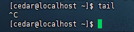


2、`ctrl + d`：快捷键，退出或登出

3、`history`：查看历史命令

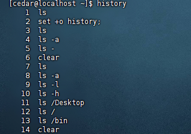

4、`!+命令前缀`：自动执行上一次匹配前缀的命令

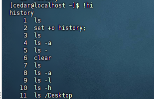

5、`ctrl+r`：输入内容去匹配历史命令

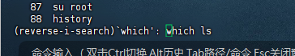

- 回车可以直接执行
- 键盘左右键可以得到这个命令，不执行

6、光标移动快捷键
- ctrl+a：跳到命令开头
- ctrl+e：跳到命令结尾
- ctrl+键盘左键：向左跳一个单词
- ctrl+键盘右键：向右跳一个单词

7、清屏
- 快捷键：ctrl+l
- 命令：clear

## 2 软件安装
操作系统安装软件一般有两种：
- 下载安装包自行安装
    - 比如win系统用exe、msi文件等，mac系统用dmg、pkg文件等
- 系统的应用商店内安装
    - 比如win系统有Microsoft store商店，mac系统有appstore商店
### 2.1 CentOS系统的yum
yum：.rpm包软件管理器，用于自动化安装配置linux软件，并可以自动解决依赖问题。

`yum [-y] [install | remove | search] 软件名称`

- -y：自动确认，无需手动确认安装或卸载过程

yum命令需要root权限，可以su切换用户或属于sudo。

<hr>
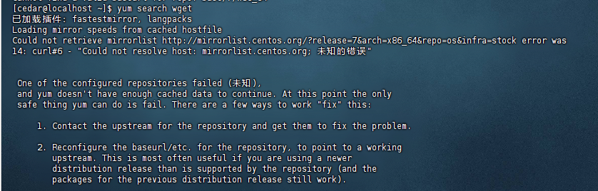
有报错，是镜像源的问题。
解决：https://www.cnblogs.com/abel-he/p/18528680

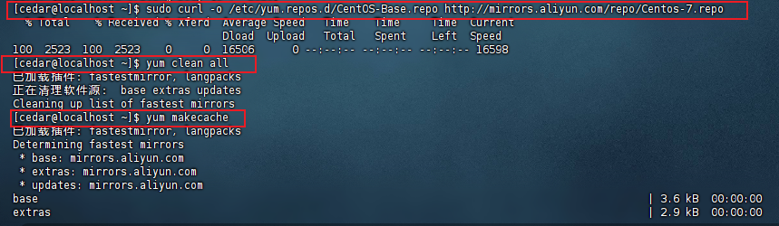

<hr>

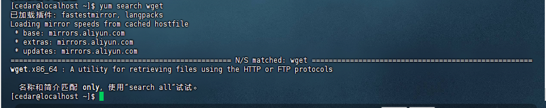


### 2.2 Ubuntu系统的apt
apt：.deb包软件管理器。
`apt [-y] [install | remove | search] 软件名称`

用法和yum一样，同样需要root权限。

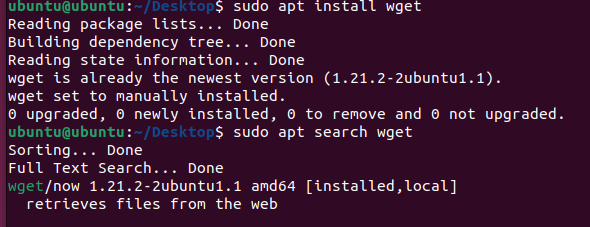


## 3 systemctl 控制软件的启动和关闭
linux系统很多软件均支持systemctl命令控制：启动、停止、开机自启，能够被systemctl管理的软件一般称为“服务”。

`systemctl start | stop | status | enable | disable 服务名`

- start：启动
- stop：关闭
- status：查看状态
- enable：开机自启
- disable：关闭开机自启

系统常见内置服务：
- NetworkManager，主网络服务
- Network，副网络服务
- firewalld，防火墙服务
- sshd，ssh服务（FinalShell远程登录linux使用的就是这个服务）

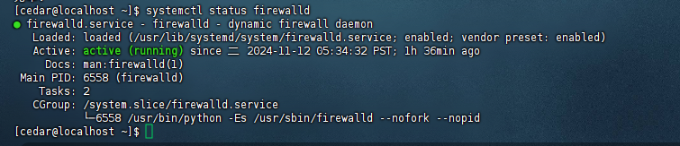

如果第三方安装的软件没有自动集成到systemctl中，我们可以自己手动添加。

## 4 软连接
在系统中创建软连接可以将文件、文件夹链接到其它位置，类似windows的快捷方式。

`ln -s 参数1 参数2`

- -s：常见软连接
- 参数1：被链接的文件或文件夹
- 参数2：要链接去的目的地

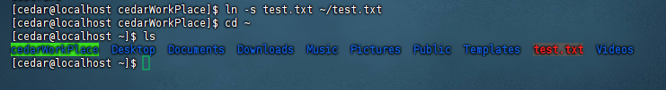

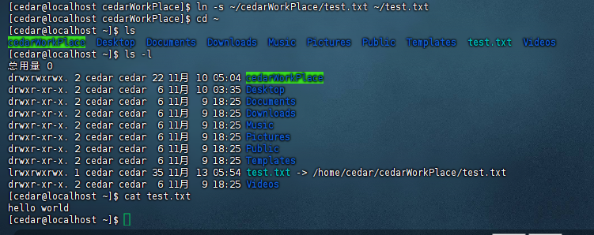

连接路径要写全，不然跟第一个例子一样报错。

## 5 日期、时区
### 5.1 date 查看系统时间
`date [-d] [+格式化字符串]`


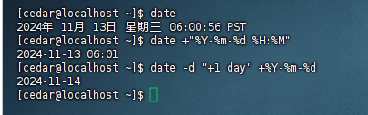

### 5.2 修改时区
1、需要使用root权限
2、执行命令
```sh
rm -f /etc/localtime
sudo ln -s /usr/share/zoneinfo/Asia/Shanghai /etc/localtime
```

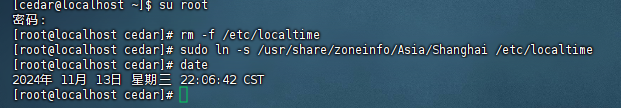


### 5.3 ntp 自动校准系统时间
1、安装ntp `yum -y install ntp`
2、启动并设置开机自启
```sh
systemctl start ntpd
systemctl enable ntpd
```
ntpd启动后会定期联网校准系统时间。

or

手动校准（root权限）：`ntpdate -u ntp.aliyun.com` (任意选择校准的网站)

## 6 IP地址，主机名
### 6.1 IP地址
使用`ifconfig`可以查看本地ip地址，如果没法使用`ifconfig`的话，安装`yum -y install net-tools`

列出的是当前使用的网卡（CentOS的）：
- ens33：主网卡，inet指的就是ip地址
- lo：本地回环的网卡
- virbr0：虚拟机专用网卡

特殊IP：
- 127.0.0.1：指代本机
- 0.0.0.0：
    - 指代本机
    - 可以在端口绑定中来确定绑定关系
    - 在一些IP地址限制中表示所有IP的意思，比如放行规则设置为0.0.0.0表示允许任意IP访问


### 6.2 主机名
每一台电脑除了IP还有主机名：


修改主机名：
```sh
hostnamectl set-hostname 主机名
```
（重新登录就能看到修改后的名称了）


### 6.3 域名解析
IP对应一系列易记的字符。

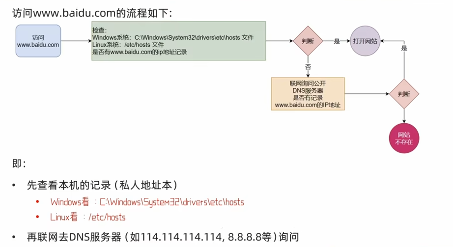

要配置主机名与IP的映射，可以自行到hosts的文件里面配置。


### 6.4 虚拟机配置固定IP
虚拟机linux操作系统的IP地址是通过DHCP服务获取的。

DHCP：动态获取IP地址，每次重启设备后都会获取一次，可能导致IP地址频繁变更。

对于远程连接linux系统，如果IP地址经常变化，那么频繁配置就会比较麻烦。

固定IP：
1、VMware或（Fusion）中配置IP地址网关和网段（IP地址的范围）

2、在linux系统中手动修改配置文件，固定IP

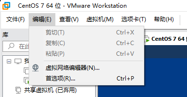

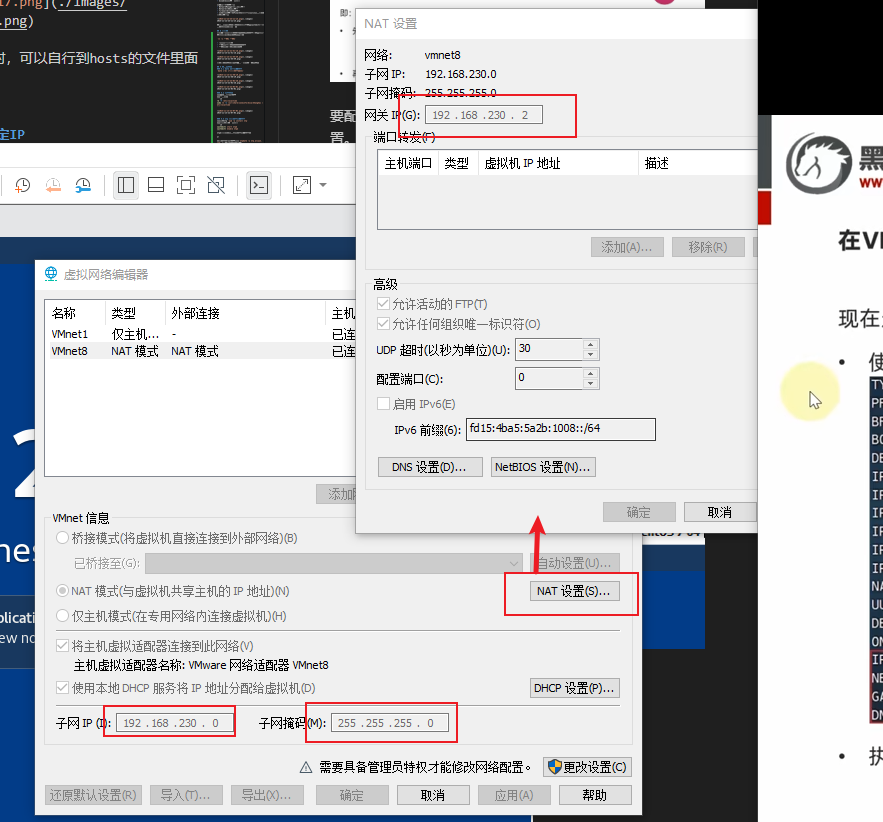

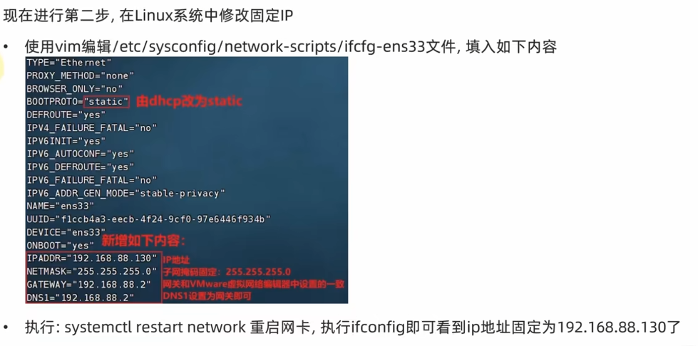

## 7 网络传输
### 7.1 ping 检查指定网络服务器是否联通
`ping [-c num] ip或主机名`

- -c：检查次数，不使用-c就是无限次

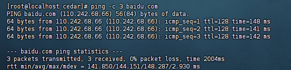

### 7.2 wget 下载网络文件
`wget [-b] url`

- -b：后台下载，会将日志写入当前工作目录的wget-log文件

下载无论是否完成都会产生下载的文件。

### 7.3 curl 发生http网络请求
可用于下载文件、获取信息等。
`curl [-O] url`

- -O：用于下载文件，当url是下载链接时，可以使用这个选项保存文件

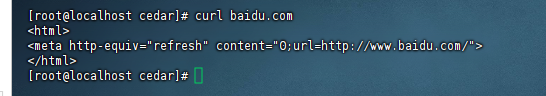

### 7.4 端口
端口是设备与外界通讯交流的出入口，分为物理端口和虚拟端口。
虚拟端口就是用来操作系统和外部进行交互使用。


计算机程序之间，通过IP锁定计算机，通过IP+端口可以锁定计算机上具体的程序。

linux系统可以支持65535个端口，分为3类：
- 公认端口：1-1023，通常用于系统内置或知名程序的预留使用，除非特殊使用，否则不要占用这个范围的端口
- 注册端口：1024-49151，随意使用
- 动态端口：49152-65535，通常不会固定绑定程序，而是当程序对外进行网络链接时用语临时使用

查看端口占用：

1、查看指定IP的对外暴露端口：nmap命令 （yum -y install nmap）

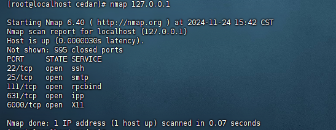

2、查看指定端口号占用情况：netstat命令 （yum -y install net-tools）
`netstat -anp | grep 端口号`

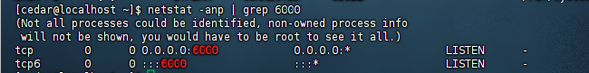  

## 8 进程管理
程序运行在操作系统中，是被操作系统管理的，操作系统将运行时的程序注册为一个进程，并为每一个进程分配一个进程ID。

查看进程信息：`ps [-e -f]`
- -e：显示全部进程
- -f：展示全部信息


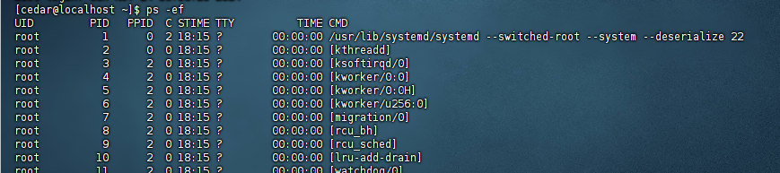

- UID：进程所属用户ID
- PID：进程的进程号ID
- PPID：进程的父ID（启动此进程的其他进程）
- C：此进程的CPU占用率
- STIME：进程的启动时间
- TTY：启动此进程的终端序号，显示？表示非终端启动
- TIME：进程占用CPU的时间
- CMD：进程对应的名称或启动路径或启动命令

关闭进程：`kill [-9] 进程ID`
- -9：强制关闭进程

## 9 主机状态
### 9.1 系统资源监控
查看系统资源占用（相当于任务管理器）：`top` 每5s刷新一次

选项：
- -p：只显示某个进程信息
- -d：设置刷新时间，默认5s
- -c：显示产生进程的完整命令，默认是进程名
- -n：指定刷新次数
- -b:以非交互全屏模式运行，以批次方式执行
- -i：不显示任何闲置（idle）或无用（zombie）进程
- -u：查找特定用户启动的进程


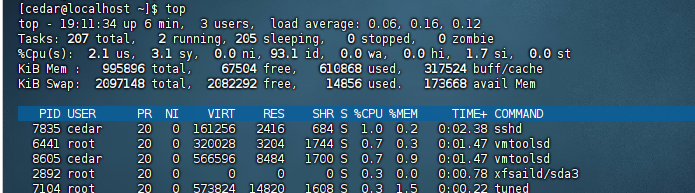


- top：命令名称
- 19:13:22：当前系统时间
- up 8min:启动了8分钟
- 2 users：2个用户登录
- load average：1、5、15分钟的平均负载（负载如果是1表示有1个CPU百分百繁忙）


- Tasks：206个进程
- 2 running：2个进程在运行
- 204 sleeping：204个进程睡眠
- 0 stopped：0个停止进程
- 0 zombie：0个僵尸进程


- %CPU：CPU使用率
- us：用户CPU使用率
- sy：系统CPU使用率
- ni：高优先进程占用CPU时间百分比
- id：空闲CPU率
- wa：IO等待CPU占用率
- hi：CPU硬件中断率
- si：CPU软件中断率
- st：强制等待占用CPU率


- Kib Mem：物理内存
- kibSwap：虚拟内存
- total：总量
- free：空闲
- used：使用
- buff/cache：buff和cache占用


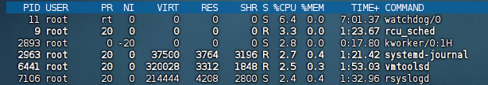

- PID：进程ID
- USER：创建所属用户
- PR：进程优先级，越小越高
- NI：负值表示高优先级，正表示低优先级
- VIRT：进程使用虚拟内存，单位KB
- RES：进程使用物理内存，单位KB
- SHR：进程使用共享内存，单位KB
- S：创建状态（S休眠，R运行，Z僵死状态，N负数优先级，I空闲状态）
- %CPU：进程占用率
- %MEM：进程占用内存列表
- TIME+：进程使用CPU时间总计，单位10毫秒
- COMMAND：进程的命令或名称或进程文件路径

### 9.2 磁盘信息监控
`df [-h]`
- -h：以更加人性化的单位显示

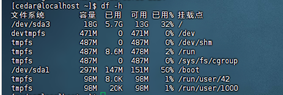


`iostat [-x][num1][num2]`
- -x：显示更多信息
- num1：刷新间隔
- num2：刷新几次

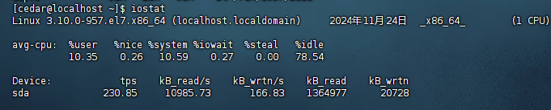

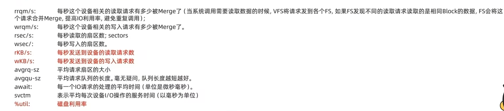

### 9.3 网络状态监控
`sar -n DEV num1 num2` （sar很复杂，不止这个写法）
- -n：查看网络， DEV：查看网络接口
- num1：刷新间隔
- num2：查看次数

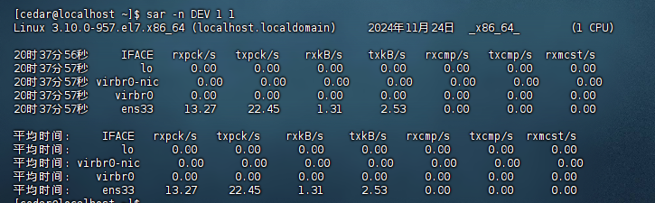


## 10 环境变量
使用的一系列命令本质上就是一个个可执行程序。无论在哪个目录下都能执行这个命令，这依赖于环境变量的配置。

环境变量是操作系统运行时候记录的一些关键性信息，用于辅助系统运行。

`env` 命令可查看当前系统中记录的环境变量。

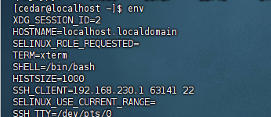

path记录系统执行任何命令的搜索路径：

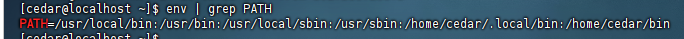

`$`用户取变量的值。


自行设置环境变量：
- 临时设置：export 变量名-变量值
- 永久生效：
  - 针对当前用户生效，配置在当前用户的 ~/bashrc文件中
  - 针对所有用户生效，配置在系统/etc/profile文件中
  - 通过语法 source 配置文件进行立刻生效，或下次重新登录生效


## 11 上传下载

## 12 压缩解压


