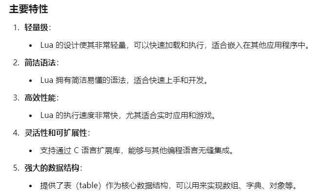
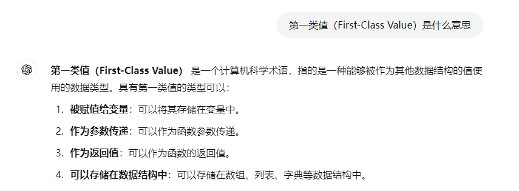

# 1-lua-资料合集
Lua 脚本是一种轻量级的脚本语言，广泛用于嵌入式应用和游戏开发。Lua 以简单、快速和可扩展著称，常被用作配置文件、游戏逻辑处理、数据处理和其他需要动态脚本的场景。

## win安装
Lua 官方推荐：https://www.lua.org/download.html
图片教程：https://blog.csdn.net/susu1083018911/article/details/125130070

## 查漏补缺
### 1、First-Class Value

## 学习资料
lua菜鸟教程：https://www.runoob.com/lua/lua-tutorial.html
