# 1-lua-数据类型
Lua 是动态类型语言，变量不要类型定义,只需要为变量赋值。 值可以存储在变量中，作为参数传递或结果返回。

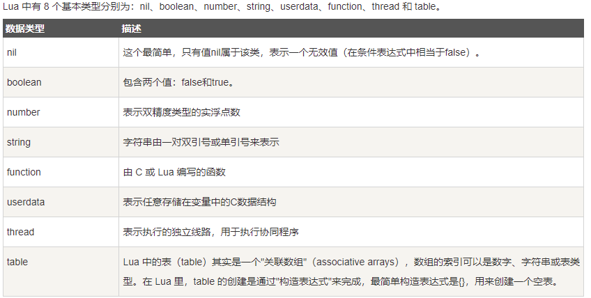

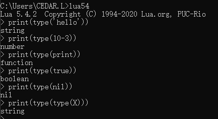

## 1、nil 
nil就是表示空值的。

对于全局变量和table，nil有删除作用，赋值为nil相当于删除掉了。
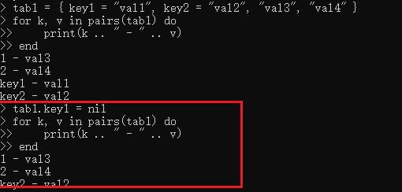

nil做比较时需要用字符串做比较。
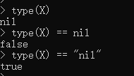

## 2、boolean

Lua 把 false 和 nil 看作是 false，其他的都为 true，数字 0 也是 true
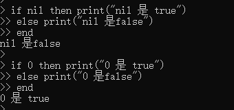

## 3、number
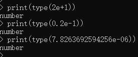

## 4、string
可以用双引号也可以用单引号。也可以用 2 个方括号 "[[]]" 来表示"一块"字符串。

在对一个数字字符串上进行算术操作时，Lua 会尝试将这个数字字符串转成一个数字：
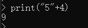

字符串连接使用 “..”：
 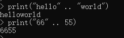

使用 # 来计算字符串的长度，放在字符串前面：
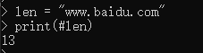

## 5、table 
table 的创建是通过"构造表达式"来完成，最简单构造表达式是{}，用来创建一个空表。也可以在表里添加一些数据，直接初始化表。

table是一个"关联数组"（associative arrays），数组的索引可以是数字或者是字符串。
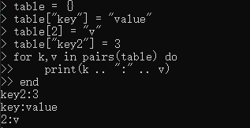

Lua 里表的默认初始索引一般以 1 开始。
table 不会固定长度大小，有新数据添加时 table 长度会自动增长，没初始的 table 都是 nil。

## 6、function
数是被看作是"第一类值（First-Class Value）"，函数可以存在变量里：
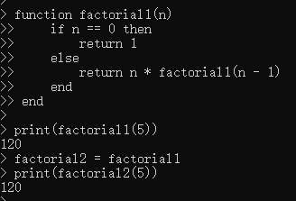

function 可以以匿名函数的方式通过参数传递:
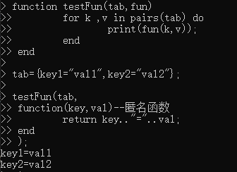

## 7、thread
在 Lua 里，最主要的线程是协同程序（coroutine）。

线程跟协程的区别：线程可以同时多个运行，而协程任意时刻只能运行一个，并且处于运行状态的协程只有被挂起（suspend）时才会暂停。

## 8、userdata
userdata 是一种用户自定义数据，用于表示一种由应用程序或 C/C++ 语言库所创建的类型。