# 2-lua-基础用法
## 1、变量
Lua 变量有三种类型：全局变量、局部变量、表中的域。

Lua 中的变量全是全局变量，哪怕是语句块或是函数里，除非用 local 显式声明为局部变量。

局部变量的作用域为从声明位置开始到所在语句块结束。

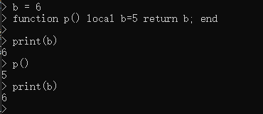

Lua 可以对多个变量同时赋值：
```lua
a, b = 10, 2
```

遇到赋值语句Lua会先计算右边所有的值然后再执行赋值操作，所以可以进行交换变量的值：
```lua
x, y = y, x 
```

当变量个数和值的个数不一致时:
- 变量个数 > 值的个数 : 按变量个数补足nil
- 变量个数 < 值的个数 : 多余的值会被忽略


尽可能的使用局部变量，有两个好处：
- 避免命名冲突。
- 访问局部变量的速度比全局变量更快。

对 table 的索引使用方括号 []。Lua 也提供了 . 操作:
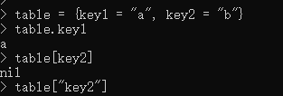

## 2、循环
lua提供几种循环：
- while
- for
- repeat ... until

循环控制语句：
- break
- goto

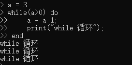
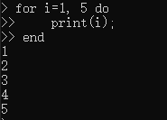
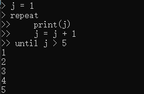

## 3、流程控制语句
- if
- if...else

tips:
- 使用 then ... end 进行条件判断时
- 使用 do ... end 当需要在循环或函数中组织多条语句时

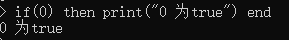


## 4、函数

```lua
optional_function_scope function function_name( argument1, argument2, argument3..., argumentn)
    function_body
    return result_params_comma_separated
end
```

- optional_function_scope：可选的指定函数是全局函数还是局部函数，未设置该参数默认为全局函数

函数可以有多返回值。

函数接收可变参数，使用... 表示函数有可变的参数：
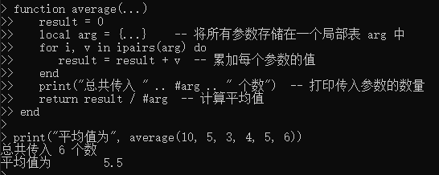
除了用#arg获取长度，也可以用 select("#",...) 获取长度。select(n, …) 用于返回从起点 n 开始到结束位置的所有参数列表。

## 5、运算符
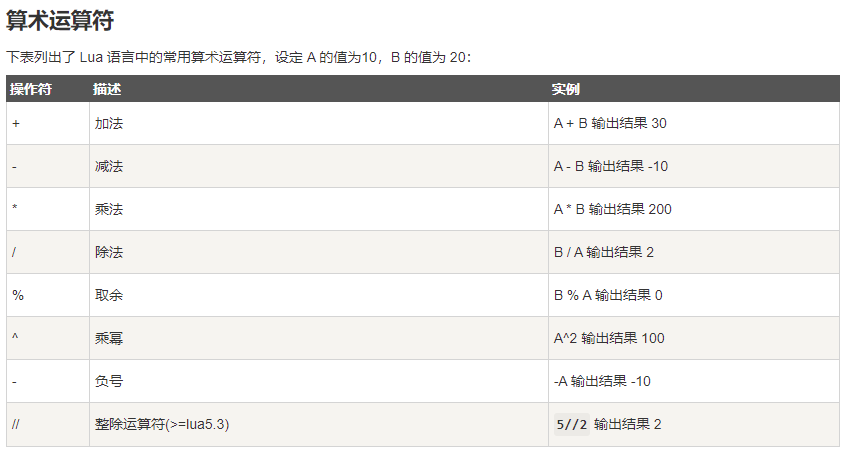

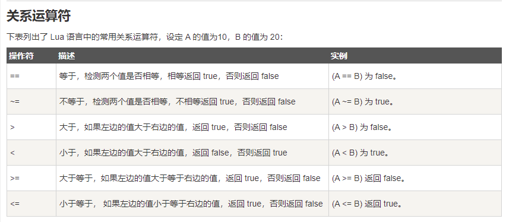

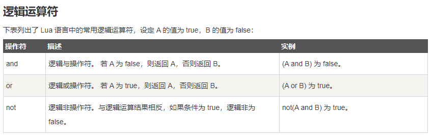

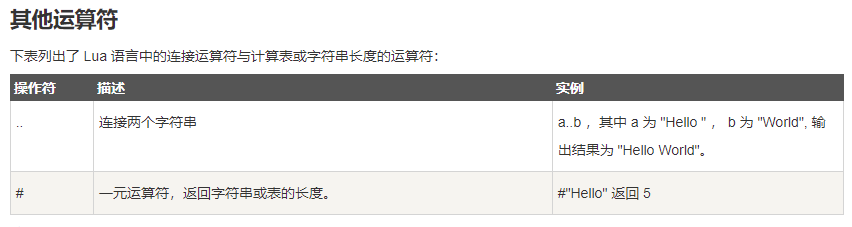

## 6、字符串
- string.len:字符串中字符的个数
- utf8.len:符串中字符的个数(中文一般用这个)
- string.upper(argument):全部转为大写
- string.lower(argument):全部转为小写
- string.gsub(mainString,findString,replaceString,num):在字符串中替换
- string.find (str, substr, [init, [plain]])：查找指定substr的起始和结束索引（plain 表示是否使用简单模式，默认为 false，true 只做简单的查找子串的操作，false 表示使用使用正则模式匹配）。
- string.reverse(arg)：字符串反转
- string.format(...)：返回一个类似printf的格式化字符串
    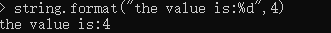
- string.char(arg) 和 string.byte(arg[,int])：char 将整型数字转成字符并连接， byte 转换字符为整数值(可以指定某个字符，默认第一个字符)
- string.rep(string, n)：返回字符串string的n个拷贝
- string.gmatch(str, pattern)：返回一个迭代器函数，每一次调用这个函数，返回一个在字符串 str 找到的下一个符合 pattern 描述的子串
- string.match(str, pattern, init)：只寻找源字串str中的第一个配对. 参数init可选, 指定搜寻过程的起点, 默认为1
- string.sub(str, start end)：截取字符串

## 7、数组
Lua 中并没有专门的数组类型，而是使用一种被称为 "table" 的数据结构来实现数组的功能。
Lua 索引值是以 1 为起始，但我们也可以指定 0 开始。

多维数组：
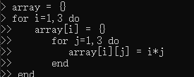

## 8、迭代器
迭代器（iterator）是一种对象，它能够用来遍历标准模板库容器中的部分或全部元素，每个迭代器对象代表容器中的确定的地址。

在 Lua 中迭代器是一种支持指针类型的结构，它可以遍历集合的每一个元素。


