# 7-redis-位图
redis的bitmap是由多个二进制位组成的数组，数组中每个二进制位都有对应的偏移量（索引），用户通过这些偏移量可以对位图中指定一个或多个二进制位进行操作。

对于redis提供的操作命令，我们可以：
- 为bitmap指定偏移量上的二进制位设置值，或获取指定偏移量上的二进制位
- 统计bitmap上多少个二进制位被设置成1
- 查找bitmap中第一个被设置为指定值的二进制位并返回偏移量
- 对一个或多个位图指定逻辑并/或/异或/非运算
- 将指定类型整数存储到位图中

## 1、SETBIT
**SETBIT bitmap offset value**

设置二进制位的值。以字节为单位。

如果要设置10010100，那么需要执行3个命令：
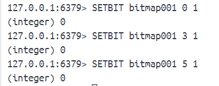

如果设置是SETBIT bitmap 10 1 那将会生成2个字节而不是一个字节。

SETBIT偏移量只能是正数。

## 2、GETBIT
**GETBT bitmap offset**

获取二进制位。偏移量只能正数。偏移量外的都返回0。

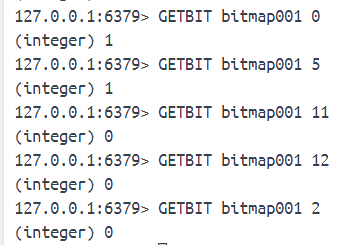

## 3、BITCOUNT
**BITCOUNT key [start end]**

统计被设置为1的二进制位数量。start end 是字节的偏移量不是二进制位的偏移量。[start end] 可以是正数也可以是负数。

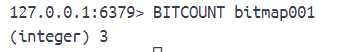

## 4、BITPOS
**BITPOS bitmap value [start end]**

查找第一个被设置为指定值的二进制位，并返回这个二进制位的偏移量。同样start end是字节偏移量。

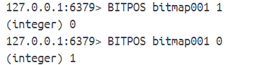

如果所有位都为0，查找1的二进制位，返回-1，如果都为1，查找0的二进制位，返回位图最大偏移量+1作为结果。

## 5、BITOP

**BITOP operation result_key bitmap [bitmap ...]**

operation：AND，OR，XOR，NOT，其中NOT只运行一个位图作为输入。

对一个或多个位图执行指定的二进制位运算，并将运算结果存储到指定键中。

bitmap001:10010100
bitmap002:10010100
bitmap003:00010000

当位图长度不一致，会将短的位图不存在的二进制位看做是0。

## 6、BITFIELD 

在位图中任意区域（field）存储指定长度的整数值，并对这些整数值执行加减操作。支持SET、GET、INCRBY，OVERFLOW。

### 6.1 SET
**BITFIELD bitmap SET type offset value [SET type offset value ...]**

根据偏移量对区域进行设置。

- offset用于指定设置的起始偏移量。二进制位为单位。
- type用于指定被设置值的类型，需要以i或u为前缀，后跟被设置值的位长度。i表示有符号整数，u表示无符号整数。BITFIELD各个子目录目前最大能够对64位长的有符号整数和63位长的无符号整数进行操作。
- value用于指定被设置的整数值，需要与type的指定一致。如果超过type指定，那么SET命令将截断给定值。

SET会返回指定区域被设置之前的旧值作为执行结果。

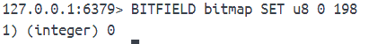

**BITFIELD bitmap SET type #index**

根据给定类型的位长度，对位图在指定索引上存储的整数值进行设置。这样就不必知道这个整数值具体存储在位图的哪个偏移量上。

例子：有一个位图，存储多个字节。现在要把第133个字节设置为22，用SET偏移量需要计算(133-1)*8=1056然后再执行命令BITFIELD bitmap SET u8 1056 22

这种情况很麻烦，但对于索引。我们只需要：BITFIELD bitmap SET u8 #132 22

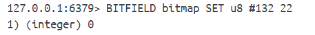

### 6.2 GET
**BITFIELD bitmap GET type offset**

**BITFIELD bitmap GET type #index**

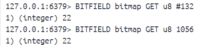

### 6.3 INCRBY
**BITFIELD bitmap INCRBY type offset increment**

**BITFIELD bitmap INCRBY type #index increment**

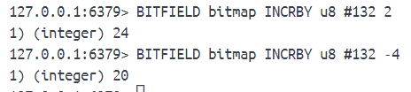

### 6.4 OVERFLOW
**BITFIELD bitmap [...] OVERFLOW WRAP|SAT|FAIL [...]**

- WRAP：wrap around 回绕方式处理溢出，是C语言默认的溢出处理方式。向上溢出的整数值将从类型最小值开始重新计算，向下溢出的整数值从类型的最大值开始重新计算。
- SAT：saturation arithmetic 用饱和运算方式处理溢出。向上溢出的整数值将被设置为类型的最大值，向下溢出的整数值被设置为类型的最小值。
- FAIL：让INCRBY子命令在检测到计算会发生溢出时拒绝执行计算，返回空表示计算失败。

默认使用WRAP处理溢出。

OVERFLOW只会对排在它之后的INCRBY子命令产生效果。redis允许在同一个BITFIELD调用中使用多个OVERFLOW子命令（就近原则）。

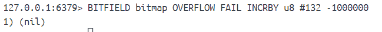

## 7、使用位图原因
一般情况，使用字符串或散列存储整数时，redis会为被存储的整数分配一个long类型的值（32位或64位）并使用对象包裹这个值，然后把对象关联到数据库或散列中。

BITFIELD命令运行用户自行指定被存储整数的类型，并不会使用对象去包裹这些整数。因此如果我们想要存储长度比long短的整数并希望尽可能减少对象包裹带来的内存消耗，可以考虑用位图存储整数。

## 8、使用字符串命令对位图进行操作
redis位图是在字符串基础上实现的。

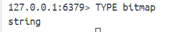

因此除了前面介绍的命令，还可以用字符串命令对位图进行操作。

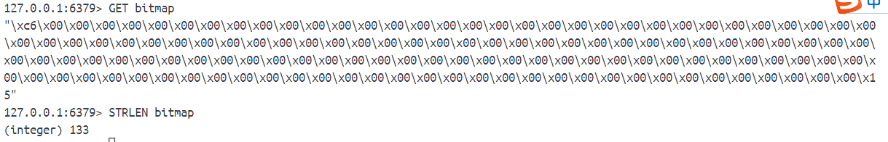

