# 1-redis-字符串
字符串是redis中最基本的键值对类型，可以是普通文字数据，也可以是图片、音频、视频等。

对于redis提供的操作命令，我们可以：
- 为键设置值
- 获取键的值
- 获取旧值的同时为键设置新值
- 同时为多个键设置值或同时获取多个键的值
- 键一些内容追加到值的末尾
- 对键存储的整数值或浮点数值执行加法或减法操作

## 1、SET
**SET key value [NX|XX] [EX seconds] [PX milliseconds]**

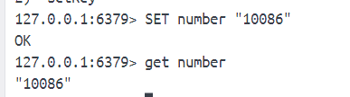

redis数据库是以无序的方式存放数据库键的，一个新加入的键可能会出现在数据库的任何位置上。

默认情况下，对于一个已经设置了值的字符串执行SET命令将导致就值被新值覆盖。

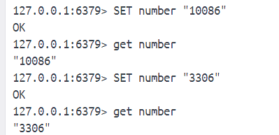

从redis2.6.12开始，我们可以通过NX 或 XX 指示SET命令是否要覆盖已经存在的值。
[NX|XX]:
- NX：如果键存在，返回nil表示失败（可以用来作为锁）
- XX：如果键存在，覆盖值

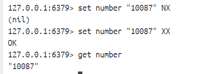

[EX seconds] [PX milliseconds]:redis2.6.12才有的，具体看11-自动过期的章节。

## 2、GET
**GET key**

GET不存在的key会返回空值。

操作看上面的图即可。

## 3、GETSET
**GETSET key new_value**

就是GET与SET命令的结合版本，获取已有值，接着为键设置新值，返回的是获取到的旧值。

如果被设置的键不存在于数据库，那么GETSET返回空值作为键的旧值。

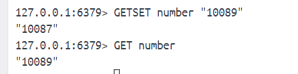

## 4、MSET
**MSET key value [key value ...]**

一次为多个字符串键设置值。和SET一样，如果给的key有关联的值，那会覆盖原来的值。

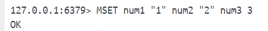

MSET能有效提高程序效率，执行多条SET命令需要客户端与服务器之间进行多次网络通信，而MSET只需要一次。

## 5、MGET
**MGET key [key ...]**

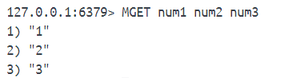

## 6、MSETNX
**MSETNX key value [key value ...]**

只有键不存在的情况下一次为多个字符串键设置值。相当于SET key value NX 执行多次。

设置成功返回1，失败返回0。

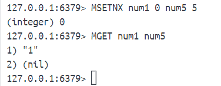

## 7、STRLEN
**STRLEN key**

获取字符串值字节长度。对于不存在的key，返回0。

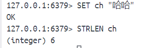

## 8、GETRANGE
**GETRANGE key start end**

字符串值从start索引开始到end结束（[start, end]）。

正数索引从0开始，负数索引从-1开始。

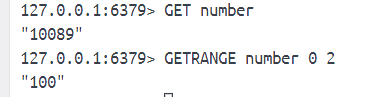

## 9、SETRANGE
**SETRANGE key index substitute**

从index开始的部分替换为指定的新内容，被替换内容的长度取决于新内容的长度。所以SETRANGE命令hi自动扩展被修改的字符串值。执行完返回字符串值当前的长度为结果。

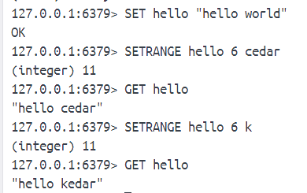

如果索引超过字符串长度，那么index-1到字符串末尾之间会用空字节填充。

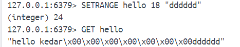

## 10、INCRBY、DECRBY
**INCRBY key increment**

**DECRBY key increment**

对整数值执行加法操作和减法操作。

每当用户将一个值存储到字符串键里面，redis都会对这个值进行检测。如果这个值能够被解释为以下两种类型种的一种，那么redis会把这个值当作数字处理:
- 能够使用C语言的long int 类型存储的整数。
- 能够使用C语言的long double类型存储的浮点数。

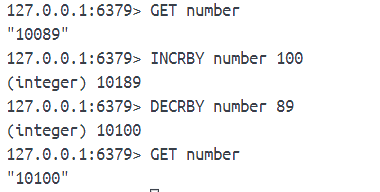

当处理不存在的键时，INCRBY与DECRBY命令会先将键初始化为0再执行加减操作。

## 11、INCR、DECR
**INCR key**

**DECR key**

对整数值执行加1，减1操作。

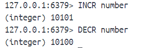

## 12、INCRBYFLOAT
**INCRBYFLOAT key increment**

对数字值执行浮点数加法操作（也同样是减法操作）。

redis不限制字符串键存储的浮点数小数位长度，但INCRBYFLOAT处理浮点数的时候，最多只保留计算结果小数点后17位数字，超过这个范围的小数将被截断。

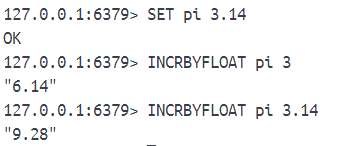

同样处理不存在的键会先初始化值为0。

INCRBYFLOAT没有对应的减法命令，我们只能通过传入负数执行减法操作。

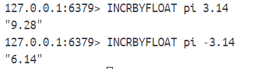

INCRBYFLOAT命令对于类型限制的要求比INCRBY/INCR命令宽松的多：
- INCRBYFLOAT可用于浮点也可用于整数
- INCRBYFLOAT的增量既可浮点也可整数
- INCRBYFLOAT的执行结果可以表示整数时，将以整数形式存储。

