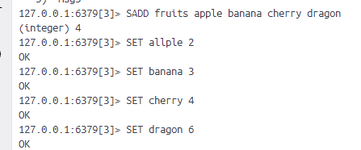
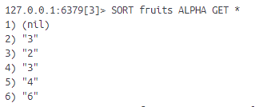
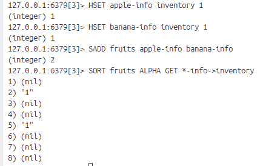
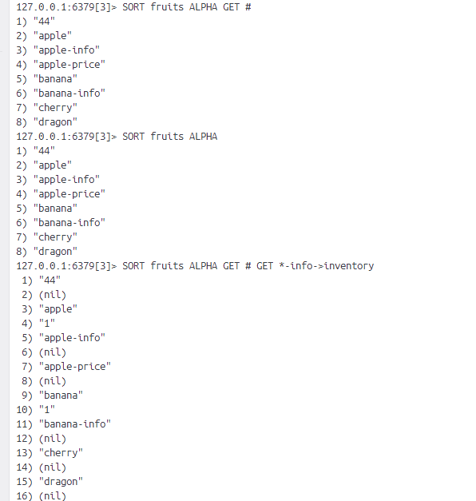
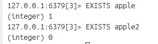
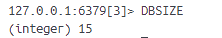
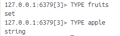
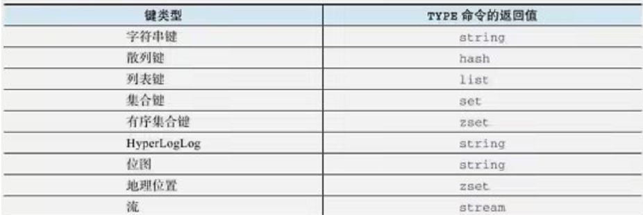
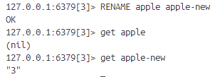

# 10-redis-数据库
redis是一个键值对数据库服务器，它的数据库可以根据键的名字对数据库中的键值对进行索引。
比如通过redis提供的命令，我们可以从数据库中移除指定的键，可以指定键从一个数据库移动到另外一个数据库。

对于redis提供的操作命令，我们可以：
- 指定自己想要使用的数据库
- 一次性获取数据库包含的所有键，迭代地获取数据库包含的所有键，或随机地获取数据库中某个键
- 根据给定键的值进行排序
- 检查给定的一个或多个键是否存在于数据库中
- 查看给定键类型
- 对给定键重命名
- 移除指定键，或将它从一个数据库移动到另一个数据库
- 清空数据库
- 交换给定的两个数据库

## 1、SELECT
**SELECT db**

切换至指定数据库。

一个redis服务器可以包含多个数据库，默认情况redis服务器启动时会创建16个数据库。按0开始排号。客户端一般默认使用0号数据库。

## 2、KEYS
**KEYS pattern**

获取所有与给定匹配符相匹配的键。

关于全局匹配符，查看：https://man7.org/linux/man-pages/man7/glob.7.html

## 3、SCAN
**SCAN cursor [MATCH pattern] [COUNT number]**

以渐进方式迭代数据库中的键。

用KEYS获取数据库键，如果键特别多的情况下可能会导致数据库阻塞。

redis从2.8.0开始提供SCAN命令，SCAN是一个迭代器，每次被调用的时候都会从数据库中获取一部分键，可以通过重复调用SCAN命令迭代数据库包含的所有键。（以SCAN 0 开始，如果游标返回15，下一次就是SCAN 15）

执行结果由两个元素组成：
- 第一个元素是进行下一次迭代所需要的游标，如果为0，说明客户端已经对数据库完成一次完整迭代
- 第二个元素是列表，包含本次迭代取得的数据库键

SCAN可能会返回重复键，需要自己在客户端中进行检测和过滤。SCAN返回键数量是不确定的，有时甚至不返回任何键，但只要命令返回的游标不为0，迭代就没有结束。

SCAN提供以下保证：
- 迭代开始到结束，一直在数据库中的键总会被返回
- 如果一个键在迭代中被添加到数据库，这个键是否会被返回是不确定的
- 一个键在迭代中被移除，SCAN在它移除后将不再返回这个键，但在移除前仍有可能被返回
- 无论数据库如何变化，迭代总是有始有终，不会出现循环或无法终止迭代的情况

SCAN的游标不需要申请，不需要释放，不占任何资源，每个客户端都可以用自己的游标独立堆数据库进行迭代。

用户可以随时在迭代过程中停止迭代或随时开始一次新的迭代，不会浪费任何资源，不会引发任何问题。

[MATCH pattern]可以让SCAN只返回与给定全局匹配符相匹配的键。

[COUNT number]只是给了一个期望值，但返回数量依旧是不确定的。

与KEYS命令一样，redis各个数据结构存在一些可能导致服务器阻塞的命令：
- 散列的HKEYS、HVALS、HGETALL在处理包含键值对较多的散列时可能会导致服务器阻塞
- 集合的SMEMBERS在处理元素较多集合时可能会导致阻塞
- 有序集合一些范围型获取命令

为了解决以上问题，redis为散列、集合和有序集合提供了与SCAN类似的游标迭代命令，分别是HSCAN、SSCAN、ZSCAN。

1、散列迭代命令
**HSCAN hash cursor [MATCH pattern] [COUNT number]**

2、渐进式集合迭代命令
**SSCAN set cursor [MATCH pattern] [COUNT number]**

3、渐进式有序集合迭代命令
**ZSCAN sorted_set cursor [MATCH pattern] [COUNT number]**

HSCAN、SSCAN、ZSCAN、SCAN相同的迭代性质：
- SCAN对于网站迭代所做的保证
- 游标不耗费任何资源，可以随意开始放弃
- 虽然可以用COUNT但是返回数量仍然是无法保证的

## 4、RANDOMKEY
**RANDOMKEY**

随机返回一个键。

## 5、SORT
**SORT key [ASC|DESC] [ALPHA] [LIMIT offset count] [[GET pattern]...] [By pattern] [STORE destination]**

对键的值进行排序。

[ALPHA]是为了能够支持字符串排序。

[GET pattern] 默认情况SORT返回被排序的元素作为结果，如果需要可以用GET获取其他值作为排序结果。pattern参数值可以是：
- 包含*符号的字符串
- 包含*和->的字符串
- 一个单独#的字符串

1、获取字符串键的值

就是从set获取字符串再根据字符串从数据库获取对应的值并进行排序。

2、获取散列中的键值
当pattern包含*和->时，“散列名->字段名”，散列名需要包含*符号，*将被替换成被排序的元素。

3、获取被排序元素本身

[By pattern]使用外部键的值作为排序权重。可以是*符号字符串，可以使包含\*和->,与GET选项一样的用法。

[STORE destination]保存结果，如果destination键已存在，SORT会先移除该键再存储结果。

## 6、EXISTS
**EXISTS key [key ...]**

检查给定键是否存在。

redis3.0.3版本前只能接受一个key。

## 7、DBSIZE
**DBSIZE**

获取数据库包含的键值对数量。

## 8、TYPE
**TYPE key**

查看键的类型。

## 9、RENAME、RENAMENX

1、修改键名
**RENAME origin new**

如果新名字已存在，RENAME会先移除占用了新键名的键再执行改名操作。

2、只在新建名没有被占用的情况下改名
**RENAMENX origin new**

## 10、MOVE
**MOVE key db**
将键从当前数据库移动至目标数据库。当模板数据库存在于给定键同名键时，MOVE会放弃执行移动操作。

## 11、DEL
**DEL key [key ...]**

移除指定键。

## 12、UNLINK

**UNLINK key [key ...]**

以异步方式移除指定键。

DEL如果移除大量键，服务器在执行移除操作中可能会被阻塞，比如移除一个包含上百万个元素的集合。为了解决这个问题，redis4.0添加了UNLINK命令。

## 13、FLUSHDB
**FLUSHDB [ASYNC]**

清空当前数据库。

FLUSHDB是一个同步移除命令，并且FLUSHDB移除的是整个数据库所以常引发比DEL更严重的阻塞。所以加了ASYNC选项进行异步。

## 14、FLUSHALL
**FLUSHALL [ASYNC]**

清空所有数据库。

## 15、SWAPDB
**SWAODB x y**

互换数据库。

互换数据库这一操作可以通过调整指向数据库的指针实现，这个过程不需要移动数据库中任何键，所以SWAPDB命令复杂度是O(1)。

