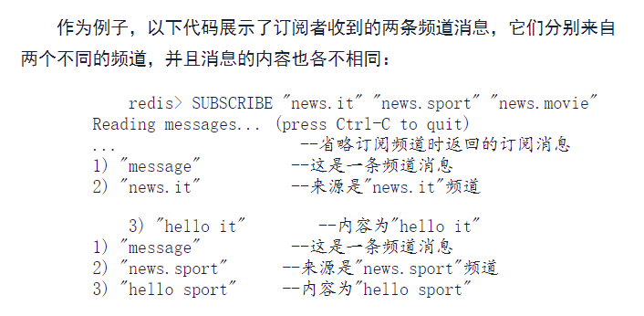

# 15-redis-发布与订阅
redis的发布与订阅让客户端通过广播方式将消息发送给可能存在的多个客户端。

客户端通过订阅特定的频道（channel）接收发送到该跑到的消息。

除了订阅频道，客户端可以通过订阅模式（pattern）接收消息：当发布者向某个跑到发送消息，不仅频道订阅者接收到，与频道匹配的所有模式订阅者也会收到消息。

## 1、PUBLISH
**PUBLISH channel message**

向频道发送消息。返回收到消息的客户端数量。

在 Redis 中，频道（channel）不需要显式创建。频道是动态的，我们可以在任何时候发布消息到一个频道，或者订阅一个频道，而不需要提前创建它。

## 2、SUBSCRIBE 
**SUBSCRIBE channel [channel ...]**
订阅频道。返回被成功订阅的频道以及客户端目前已经订阅的频道数量。

当用户成为订阅者后就能收到频道消息，具体收到的消息格式：

## 3、UNSUBSCRIBE 
**UNSUBSCRIBE [channel ...]**

退订频道。无参表示全部退订。

## 4、PSUBSCRIBE 
**PSUBSCRIBE pattern [pattern ...]**
通过PSUBSCRIBE命令让客户端订阅给定的一个或多个模式。
每个pattern可以是一个全局风格的匹配符，比如news.* 匹配以news.开头的频道；news.[ie]t可以匹配news.it和new.et的频道。

## 5、PUNSUBSCRIBE
**PUNSUBSCRIBE [pattern ...]**
退订模式。

## 6、PUBSUB
### 6.1 查看目前被订阅的频道
**PUBSUB CHANNELS [pattern]**

### 6.2 查看频道的订阅者数量
**PUBSUB NUMSUB [channel ...]**

### 6.3 查看被订阅模式的总数量
**PUBSUB NUMPAT**

