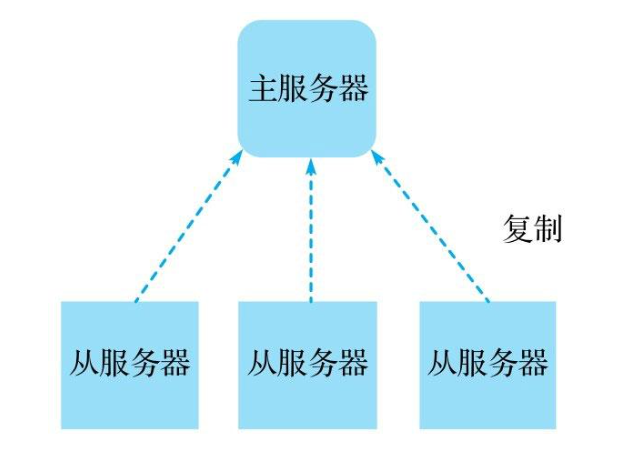
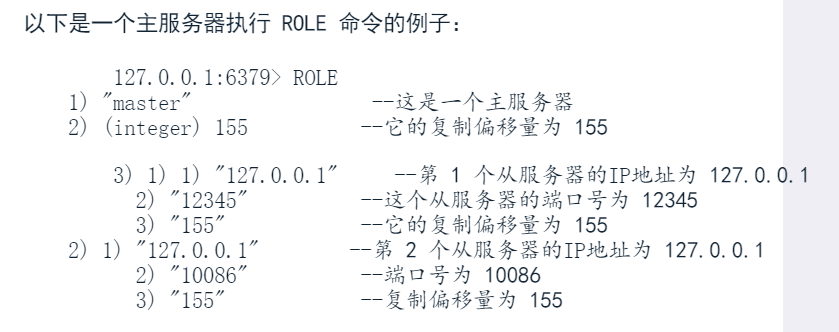
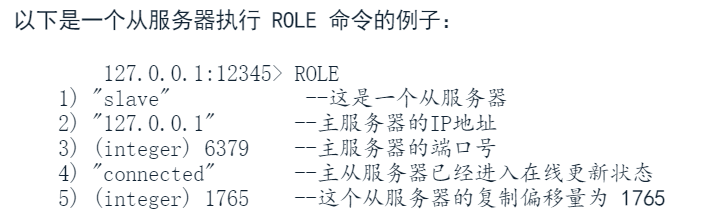
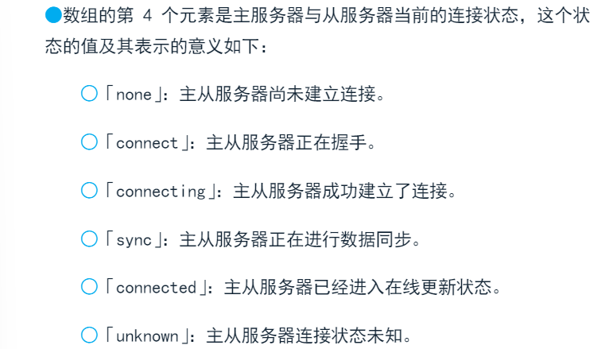
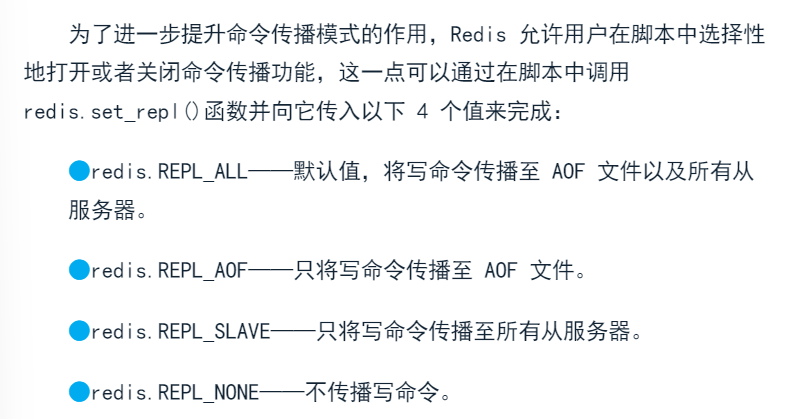

# 17-redis-多机功能-复制
复制时redis提供的多机功能中最基础的一个。通过主从复制模式实现。


对redis来说，一个主服务器可以拥有任意多个从服务器，从服务器也可以作为其他服务器的主服务器。但从服务器一定只能拥有一个主服务器。redis提供的事单主复制功能而不是多主复制功能。

默认情况下，处于复制模式的主服务器可以执行读写操作，从服务器只能执行读操作。

对于开启复制功能的主从服务器，主服务器在每次执行写操作后都会和所有从服务器进行数据同步。

## 1、REPLICAOP：将服务器设置为从服务器
**REPLICAOF host post**
将接受这个命令的redis服务器设置成另外一个redis服务器的从服务器：
- host:指定主服务器的地址
- post： 指定主服务器的端口

复制操作是以异步方式进行，所以收到REPLICAOP命令后会立刻返回ok，之后的操作在后台开始执行。

除了用REPLICAOF命令外可以通过配置replicaof配置选项，在启动redis服务器的同时将它设置为从服务器：
**replicaof <host> <port>**
```
redis-server --port 10086 --replicaof 127.0.0 16379
```

**REPLICAOF no one**可以取消复制，重新变回主服务器。服务器停止复制后不会清空数据库，而是继续保留复制产生的所有数据。

## 2、ROLE：查看服务器的角色
**ROLE**

ROLE命令在主服务器和从服务器上执行将产生不同结果：





## 3、数据同步
用户将一个服务器设置为从服务器，让它去复制另一个服务器时候，主服务器需要通过数据同步机制让两个服务器的数据库保持一致。

### 3.1 完整同步
当服务器接收到REPLICAOF命令，开始对另一个服务器进行复制时，主从服务器执行以下操作：
- 主服务器执行BGSAVE，生成RDB文件，用缓冲区存储BFSAVE命令之后执行的所有写命令
- 主服务器通过套接字将RDB文件传送给从服务器
- 从服务器会载入这个RDB文件，获取主服务器执行BGSAVE时所有数据
- 从服务器载入RDB后开始上线接受命令请求时，主服务器把之前存储在缓冲区中所有写命令发送给从服务器

为提高同步小徐，如果主服务器接收到REPLICAOF命令前已经完成一次RDB操作，并且它的数据库在创建RDB后没有发生过任何变化，那么主服务器将直接从服务器发送已有RDB文件。

如果主服务器创建RDB文件期间，有多个从服务器向主服务器发送数据同步请求，那么主服务器将这些从服务器全部放入队列中，RDB创建后依次发送给从服务器。

### 3.2 在线更新
完整同步后，主服务器执行写命令，这个一致性就会被破坏，所以redis会对从服务器进行在线更新：
- 主服务器完成一个写命令后，会将相同写命令或具有相同效果的写命令发送给从服务器执行

只要从服务器一直与主服务器保持连接，在线更新操作就会不断进行。

在线更新也是异步进行，所以主从服务器会出现短暂不一致，因此要求强一致性的程序可能需要直接读取主服务器而不是读取从服务器。

此外服务器可能执行完写命令，向从服务器发送相同写命令过程中因故障下线，这时一致性被破坏了。这时候就需要部分同步保持一致性。

### 3.3 部分同步
- 主服务器会把每个被执行的写命令都记录到一个特定长度的队列中
- 当断线的从服务器尝试重新连接主服务器时，主服务器将检查从服务器断线期间，被执行的哪些写命令是否依然保存在队列里面，如果是，主服务器会把这些写命令发送给从服务器。
- 如果从服务器确实的那些写命令不存在于队列中，主从服务器将进行一次完整同步

主服务器记录执行过的写命令队列越大，服务器断线后能快速重新回到一致性机会越大。redis为这个队列设置默认大小为1MB，可以根据自己需要通过配置repl-backlog-size修改队列大小。

## 4、无需硬盘的服务
主服务器进行完整同步时需要在本地创建RDB文件，但主服务器所在宿主主机的硬盘负载非常大或性能不佳，那创建RDB文件引起的大量硬盘写入将对主服务器性能造成影响，导致复制进程变慢。

redis2.8.18开始引入无需硬盘复制特性，启用这个特性，主服务器在接受到REPLICAOF命令将不再在本地创建RDB，而是派生一个子进程，由子进程通过套接字直接将RDB文件写入从服务器。

**repl-diskless-sync <yes|no>**

无需硬盘复制特性只是避免在主服务器上创建RDB文件，但仍然需要在从服务器上创建RDB文件。

## 5、降低数据不一致情况出现的概率
复制的在线更新是异步的，主从服务器直接连接不稳定或从服务器未收到主服务器发送的更新命令时就会出现数据不一致情况。

为了尽可能降低数据不一致出现频率，redis引入两个以min-replocas开头的配置：
**min-replicas-max-lag <seconds>**
**min-replicas-to-write <numbers>**
主服务器只会在从服务器数量大于等于min-replicas-to-write并且这些从服务器与主服务器最后一次成功通信间隔不超过min-replicas-max-lag才会执行写命令。

## 6、可写的从服务器
redis2.6开始，redis从服务器默认状态只允许执行读命令。确保只能通过数据同步得到更新。

某些情况下，可能需要把不重要或临时性数据存储到从服务器中，我们可以通过replica-read-only配置打开从服务器的写功能：
**replica-read-only <yes|no>**

当从服务器与主服务器进行完整同步时，从服务器水库包括所有数据都将被清空，其中包括客户端写入的数据。

为了减少内存占用，降低键冲突发生的可能性，并确保主从服务器数据同步操作可以顺利进行，客户端写入从服务器的数据应该在使用完毕之后尽快删除。为写入从服务器的值设置一个较短的过期时间，可以使这些数据在时候后自动被删除。

## 7、脚本复制
redis传播lua脚本具体方法：
- 脚本传播模式
- 命令传播模式

### 7.1 脚本传播模式
主服务器将被执行脚本及参数（EVAL命令本身）复制到AOF文件及从服务器中。这一模式下执行的脚本必须是纯函数，保证主从服务器数据一致。

redis对处于脚本传播模式的lua脚本设置以下限制：
- 脚本不能访问lua时间模块，内部状态或除给定参数之外其他外部信息
- 脚本不能带有随机性质的命令
- 当用户在脚本中调用SINTER、SUNION、SDIFF、SMEMBERS、HKEYS、HVALS、KEYS这些以随机顺序返回结果的命令时，为了消除随机性，Lua环境会把结果进行排序在返回
- redis会确保每个被执行的脚本都拥有相同的随机数生成器种子

### 7.2 命令传播模式
主服务器将执行脚本产生的所有写命令用事务包裹起来，将事务复制到AOF文件以及从服务器中。处于命令传播模式的主服务器能够执行带有副作用的非纯函数脚本。

命令传播模式可以执行带有随机性质的命令，脚本的伪随机数生成器在每次调用前都会随机设置种子。除这两点外其他的限制跟脚本传播模式的一样。

为了开启命令传播模式，需要先在脚本中调用以下函数：
```lua
redis.replicate_commands()
```
在执行完脚本后，服务器将自动切换回默认的脚本传播模式。

### 7.3 选择性命令传播


redis.set_repl()也是只对执行该函数的脚本有效。

### 7.4 模式选择
- 脚本体积不大，执行计算不多，但回产生大量命令调用，那使用脚本传播模式可有效节约网络资源

