# 2-redis-散列
散列键会将一个键和一个散列在数据库里关联起来，用户可以在散列中为任意多个字段设置值。其实可以理解为一个表中的一条数据了。

比如一篇位置article有title，author，public_date等数据，但对于字符串来说只能单独存储这些这段并根据键的命名关联起来，而用散列就能够在散列中定义这些字段并设置值。这样对于一篇文章就只会有一个键。

对于redis提供的操作命令，我们可以：
- 为散列的字段设置值
- 从散列里获取给定字段值
- 对存储的数字值执行加减操作
- 检查给定字段是否存在于散列中
- 从散列中删除指定字段
- 查看散列包含的字段数量
- 一次为散列的多个字段设置值
- 一次从散列中获取多个字段值
- 获取散列包含的所有字段、值、字段和值

## 1、HSET
**HSET hash field value**

为字段设置值
- 如果给定字段不存在与散列中，那这次设置是一次创建操作，命令将在散列里面关联起给定的字段和值，然后返回1
- 如果给定的字段原本已经存在于散列里面，那么这次设置就是一次更新操作，命令将使用给定的新值覆盖字段原有的旧值，返回0

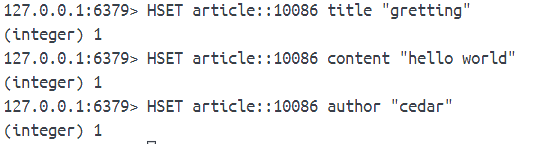

散列包含的字段也是无序的。

## 2、HSETNX
**HSETNX hash field value**

只有在这段不存在的情况下才能设置值。不存在且成功设置时返回1，字段已存在并导致设置不成功的返回0。

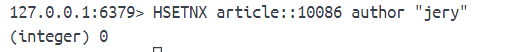

## 3、HGET
**HGET hash field**

获取字段值。

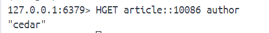

如果给定的字段不在散列中，返回的是空值。
如果给定的散列不存在，返回的事空值。

## 4、HINCRBY
**HINCRBY hash field increment**

对字段存储的整数值执行加减操作。

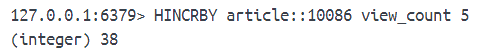

## 5、HINCRBYFLOAT
**HINCRBYFLOAT hash field increment**

对字段存储的数字值执行加减操作。

## 6、HSTRLEN
**HSTRLEN hash field**

获取字段值的字节长度。字段不存在的返回0。

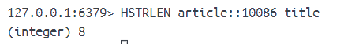

## 7、HEXISTS
**HEXISTS hash field**

检查字段是否存在。存在返回1，否则返回0。如果给的散列不存在，那么所有字段检查结果都返回0。

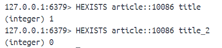

## 8、HDEL
**HDEL hash field**

删除字段。成功返回1，如果给的字段不存在散列中，或给的散列不存在，则返回0表示删除失败。

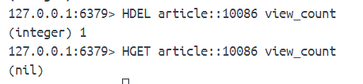

## 9、HLEN

**HLEN hash**

获取散列包含的字段数量。如果给的散列不存在，返回0。

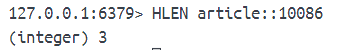

## 10、HMSET
**HMSET hash field value [field value ...]**

一次获取多个字段值。可以覆盖旧值。

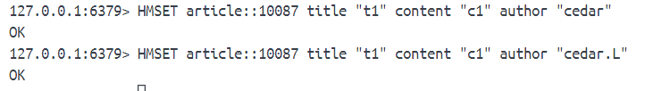

## 11、HMGET

**HMGET hash field [field ...]**

一次获取多个字段值。

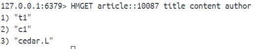

## 12、HKEYS
**HKEYS hash**

获取所有字段

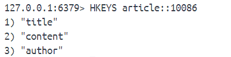

## 12、HVALS

**HVALS hash**

获取所有值。

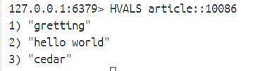

## 13、HGETALL
获取所有字段和值。每两个连续的元素就是一对字段和值。

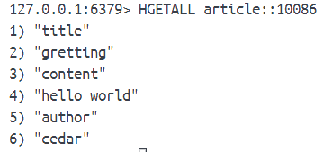

