# 3-redis-列表
redis的列表是一种线性有序结构。元素可以是文字数据，也可以是二进制数据，可以重复出现。

对于redis提供的操作命令，我们可以：
- 将新元素推入列表的左端或右端
- 移除位于列表最左端或最右端的元素
- 移除列表最右端元素然后把移除的元素推入另一个列表的左端
- 获取列表包含的元素数量
- 获取列表在指定索引上的单个或多个元素
- 为列表的指定索引设置新元素，或把新元素添加到某个指定元素前面或后面
- 对列表进行修剪，只保留指定索引范围内元素
- 从列表中移除指定元素
- 执行能够阻塞客户端的推入和移除操作

## 1、LPUSH
**LPUSH list item [item ...]**

将元素推入列表左端，返回当前包含的元素数量。

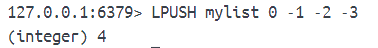

## 2、RPUSH
**RPUSH list item [item ...]**

将元素推入列表右端，返回当前包含的元素数量。

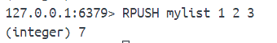

## 3、LPUSHX、RPUSHX

只对已存在的列表执行推入操作，推入不成功返回0。每次只能推入一个元素。

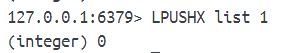

## 4、LPOP
**LPOP list**

弹出列表最左端元素并返回被移除的元素。

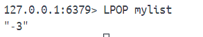

## 5、RPOP
**RPOP list**

弹出列表最右端元素并返回被移除的元素。

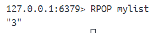

## 6、RPOPLPUSH

**RPOPLPUSH source target**

从source右端弹出并推入到target左端。

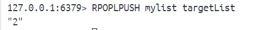

## 7、LLEN

**LLEN list**

获取列表长度

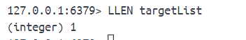

## 8、LINDEX

**LINDEX list index**

获取指定索引上的元素。

redis列表每个元素都有与之对应的正数索引和负数索引。

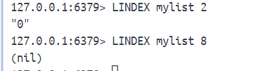

## 9、LRANGE
**LRANGE list start end**

获取指定索引范围上的元素。

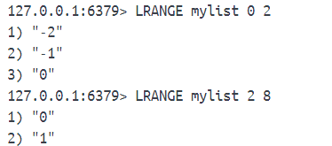

## 10、LSET

**LSET list index new_element**

为列表的指定索引设置新元素。超出范围的话报错。

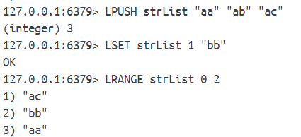

## 11、LINSERT
**LINSERT list BERFORE|AFTER target_element new_element**

将元素插入列表。

如果指定元素不存在，将返回-1表示插入失败。

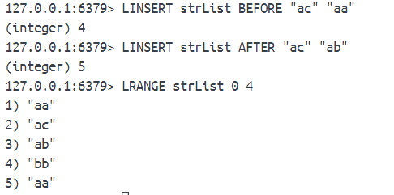

## 12、LTRIM
**LTRIM list start end**

移除列表中位于给定索引范围之外的所有元素。

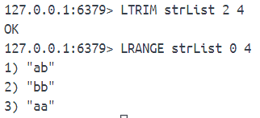

## 13、LREM
**LREM list count element**

移除列表中指定元素。

- count=0：移除列表中包含的所有指定元素
- count>0：从左端开始检查移除最先发现的count个指定元素
- count<0：从右端开始检查移除最先发现的|count|个指定元素

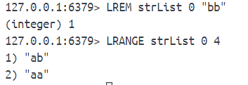

## 14、BLPOP
**BLPOP list [list ...] timeout**

BLPOP带有阻塞功能的左端弹出操作，接收任意多个列表以及一个秒级精度的超时时限作为参数。

按照从左到右顺序检查给定列表，对最先遇到的非空列表执行左端元素弹出操作。乳沟检查所有list后没有发现可以执行弹出操作的非空list，那么会阻塞执行该命令的客户端并开始等待直到某个给定list非空或等到超出给定时限为止。

返回一个包含两个元素的数组，第一个是执行弹出操作的列表，第二个是被弹出元素本身。

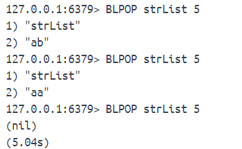

这里的阻塞时间是redis-cli有的，并不是BLPOP命令返回的。

在阻塞的时候如果另外一个客户端推入元素，那么先被阻塞的客户端会先接触阻塞，而未能解除阻塞的客户端则继续等待下次推入操作。

BLPOP的阻塞效果只对执行这个命令的客户端有效，其他客户端以及redis服务器本身并不会因为这个命令阻塞。

## 14、BRPOP
**BRPOP list [list ...] timeout**

BRPOP带有阻塞功能的右端弹出操作，接收任意多个列表以及一个秒级精度的超时时限作为参数。

跟BLPOP类似，就不多做解释了。

## 15、BRPOPLPUSH
**BRPOPLPUSH source target timeout**

RPOPLPUSH的阻塞版本。

- 如果source非空，BRPOPLPUSH的行为和RPOPLPUSH一样
- 如果为空，将会阻塞执行该命令的客户端，在给定时限内等待可弹出的元素出现

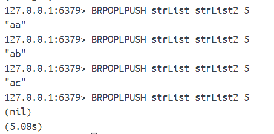

