# 4-redis-集合
redis的集合允许不同的元素在集合中，可以是文本也可以是二进制。

集合和列表有两个明显区别
- 列表可存储重复元素，集合存储非重复元素，如果重复元素添加到集合中会被忽略
- 列表有序接无序

如果可以无序却不重复存储，那么选择集合是最好的，因为复杂度都只有O(1)。

对于redis提供的操作命令，我们可以：
- 将新元素添加到集合中或从集合移除已有元素
- 将指定的元素从一个集合移动到另一个集合
- 获取集合包含的所有元素
- 获取集合包含的元素数量
- 检查给定元素是否存在于集合中
- 从集合中随机获取指定数量的元素
- 对多个集合执行交并差集计算

## 1、SADD
**SADD set element [element ...]**

添加元素到集合，返回成功添加的元素数量。

添加已存在的元素返回的是0。

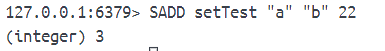

## 2、SREM
**SREM set element [element ...]**

从集合中移除元素。

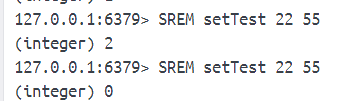

## 3、SMOVE
**SMOVE source target element**

将元素从一个集合移动到另一个集合。

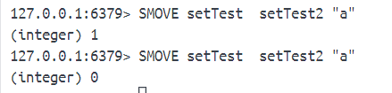

即使目标集合中已有想要移动的元素，那么SMOVE仍然会将指定元素从源集合移动到目标集合，并覆盖目标集合中的相同元素。

## 4、SMEMBERS
**SMEMBERS set**

获取集合包含的所有元素。

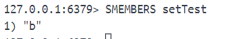

## 5、SCARD
**SCARD set**

获取集合包含的元素数量。

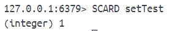

## 6、SISMEMBER 
**SISMEMBER set element**

检查给定元素是否存在于集合。

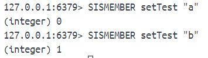

## 7、SRANDMEMBER
**SRANDMEMBER set [count]**

随机获取集合中的元素，默认获取1个，有count就获取count个。

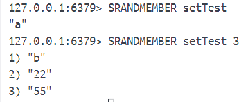

## 8、SPOP
**SPOP set [count]**

随机从集合中移除指定元素。

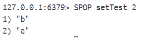

## 9、SINTER、SINTERSTORE

**SINTER set [set ...]**

返回给定集合的交集。

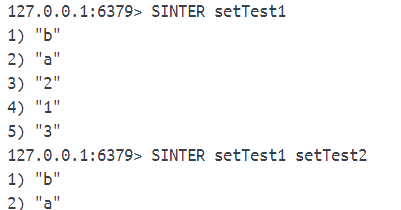

**SINTERSTORE destination_key set [set ...]**

把给定集合的交集结果存储在destination_key中。

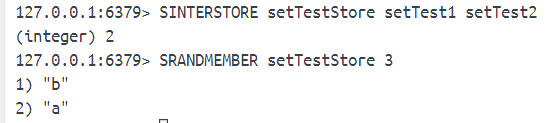

## 10、SUNION、SUNIONSTORE
**SUNION set [set ...]**

**SUNIONSTORE destination_key set [set ...]**

对集合执行并集计算。

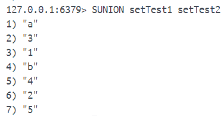

## 11、SDIFF、SDIFFSTORE
**SDIFF set [set ...]**

**SDIFFSTORE destination_key set [set ...]**

对集合执行差集计算。

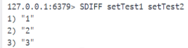

