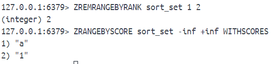

# 5-redis-有序集合
有序集合中每个元素都与会有一个相关联的分值，元素是以字符串形式存储，分值以64位双精度浮点数格式存储。

当两个或多个元素拥有相同分值时，redis按照这些元素在字典序中的大小对其进行排序。

## 1、ZADD
**ZADD sorted_set [XX|NX] score member [score member]**

添加或更新成员。

- XX：只会对给定元素中已存在有序集合的元素进行更新，不存在于集合中的给定元素会被忽略。
- NX：把给定元素中不存在有序集合中的添加到有序集合中，已存在的忽略

## 2、ZREM
**ZREM sort_set member [member ...]**

移除指定元素，返回被移除成员数量。

不存在的会自动忽略。

## 3、ZSCORE 
**ZSCORE sorted_set member**

获取分值。指定元素不存在的返回空。

## 4、ZINCRBY
**ZINCRBY sorted_set increment member**

对指定元素的分值执行自增/自减操作。

如果给定元素不存在，那相当于ZADD的效果。

## 5、ZCARD
**ZCARD sorted_set**

获取有序集合包含的元素数量。

## 6、ZRANK、ZREVRANK
**ZRANK sorted_set member**

**ZREVRANK sorted_set member**

ZRANK返回分值升序排序的排名结果，ZREVRANK返回降序排序的排名结果。

不存在的元素返回空。

## 7、ZRANGE、ZREVRANGE
**ZRANGE sorted_set start end [WITHSCORES]**

**ZREVRANGE sorted_set start end [WITHSCORES]**

获取指定索引范围内的成员。同样ZRANGE是升序，ZREVRANGE是降序。

WITHSCORES是返回成员与分值。

## 8、ZRANGEBYSCORE、ZREVRANGEBYSCORE

**ZRANGEBYSCORE sorted_set min max [WITHSCORES] [LIMIT offset count]**

**ZREVRANGEBYSCORE sorted_set min max [WITHSCORES] [LIMIT offset count]**

获取指定分值范围内的成员。

一般是用闭区间的，开区间的用"(" 实现：

如果需要使用无限制的话，用-inf / +inf 。

## 9、ZCOUNT
**ZCOUNT sorted_set min max**

统计指定分值范围内成员数量。

## 10、ZREMRANGEBYRANK

**ZREMRANGEBYRANK sorted_set start end**

从升序排序的有序集合中移除谓语指定排名范围内的成员。start end是排名。

排名也可以用负数。

## 11、ZREMRANGEBYSCORE
**ZREMRANGEBYRANK sorted_set min max**

有序集合中移除位于指定分值范围内的成员。

## 12、ZUNIONSTORE
**ZUNIONSTORE destination numbers sorted_set [sorted_set ...][AGGREGATE SUM|MIN|MAX][WEIGHTS weight [weight ...]]**

有序集合的并集运算。numbers是参与计算有序集合数量，AGGREGATE是聚合运算，比如SUM就是把相同成员分数值相加。WEIGHTS是给有序集合设置权重（输出是权重与分值相乘）。

除了使用有序集合作为输入，可以用集合作为输入然后通过weight赋予权重输出分值。

## 13、ZINTERSTORE

**ZINTERSTORE destination numbers sorted_set [sorted_set ...][AGGREGATE SUM|MIN|MAX][WEIGHTS weight [weight ...]]**

有序集合的交集运算。

基本和ZUNIONSTORE的使用一模一样。

## 14、ZRANGEBYLEX、ZREVRANGEBYLEX

在分值相同的情况下ZRANGEBYSCORE、ZCOUNT和ZREMRANGEBYSCORE等都将不适用，为了让用户可以对字典排列的有序集合执行类似ZRANGEBYSCORE这样的操作，redis提供相应的ZRANGEBYLEX、ZREVRANGEBYLEX、ZLEXCOUNT、ZREMRANGEBYLEX命令。

**ZRANGEBYLEX sorted_set min max [LIMIT offset count]**

min和max参数中 “+” 表示无穷大， “-” 表示无穷小。参数是同等字典序大小的成员。

**ZREVRANGEBYLEX sorted_set max min [LIMIT offset count]**

## 15、ZLEXCOUNT

**ZLEXCOUNT sort_set min max**

统计位于字典序指定范围内的成员数量。

## 16、ZREMRANGEBYLEX

**ZREMRANGEBYLEX sorted_set min max**

移除位于字典序指定范围内的成员。

## 17、ZPOPMAX、ZPOPMIN

**ZPOPMAX sorted_set [count]**

**ZPOPMIN sorted_set [count]**

弹出分支最高/最低的成员。

## 18、BZPOPMAX、BZPOPMIN

**BZPOPMAX sorted_set [sorted_set ...] timeout**

**BZPOPMIN sorted_set [sorted_set ...] timeout**

阻塞式最大/最小弹出操作。

