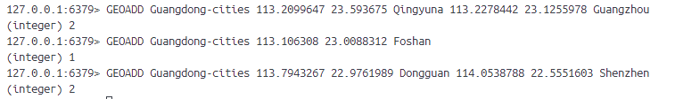
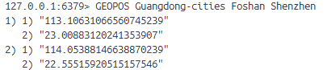
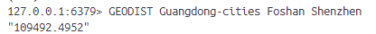
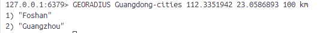
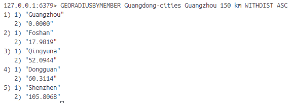
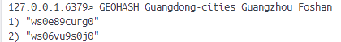
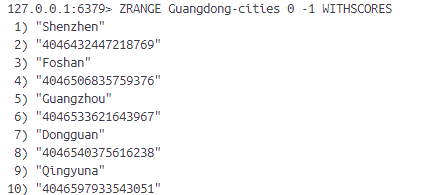

# 8-redis-地理坐标
redis GEO（地理坐标）是redis在3.2版添加的特性。存储地理坐标（经纬度），并对这些坐标进行操作，例如计算距离、查找附近的点等。

对于redis提供的操作命令，我们可以：
- 将位置的名字以及它的经纬度存储到位置集合中
- 根据给定的位置名，从位置集合中获取对应的经纬度
- 计算两个位置之间的直线距离
- 根据给定的经纬度或位置找出指定半径范围内的其他位置
- 获取指定位置的GeoHash编码值（是一种将地理坐标（经纬度）转换为字符串的编码方法）

## 1、GEOADD
**GEOADD location_set longitude latitude name [longitude latitude name ...]**

给定一个或多个经纬度坐标存储到位置集合中，并为这些坐标设置相应的名字。

## 2、GEOPOS
**GEOPOS location_set name [name ...]**

获取指定位置的坐标。

## 3、GEODIST
**GEODIST location_set name1 name2 [unit]**

获取两个位置之间的直线距离。

unit参数指定单位：
- m：米（默认单位）
- km：千米
- mi：英里
- ft：英尺

## 4、GEORADIUS
**GEORADIUS location_set longitude latitude radius unit [WITHDIST] [WITHCOORD] [ASC|DESC] [COUNT n] [WITHHASH]**

指定一个经纬度作为中心点，找出指定半径范围内的其他位置。

WITHDIST会返回与中心点之间的距离。

WITHCOORD是在返回被匹配位置的同时返回这些位置的坐标。

GEORADIUS默认以无序方式返回被匹配的位置，可以通过ASC和DESC以有序方式返回结果。

COUNT n可以限制返回的最大位置数量。

WITHHASH在返回的时候还会返回Geohash的值，返回的是数字类型的Geohash。

## 5、GEORADIUSBYMEMBER 
**GEORADIUSBYMEMBER location_set name radius unit [WITHDIST] [WITHCOORD] [ASC|DESC] [WITHHASH]**

和GEORADOUS命令作用一样都是找出中心指定绑架范围内的其他位置。区别是：GEORADIUS命令通过给定经纬度指定中心点，而GEORADIUSBYMEMBER通过选择位置集合中的一个位置作为中心点。

WITHHASH在返回的时候还会返回Geohash的值，返回的是字符类型的Geohash，与GEORADIUS的类型不一样，但是二进制位是完全相同的。

## 6、GEOHASH
**GEOHASH location_set name [name ...]**

获取指定位置的Geohash值。

## 7、使用有序集合命令操作GEO
redis使用的是有序集合存储GEO数据。一个位置集合实际上就是一个有序集合。

redis没有提供删除位置集合中指定位置的命令，但我们可以使用ZREM达到同样的效果。

