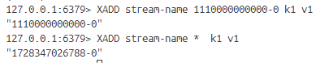
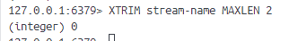
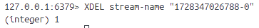
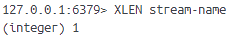
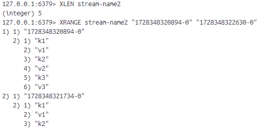
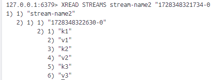

# 9-redis-流
stream 是redis5.0版本中新加的数据结构。在以往版本中，为了实现消息队列这一常见应用，往往会使用列表、有序集合和发布订阅者3种功能，但都有各自的缺陷。
- 列表可快速追加消息，但因为是线性结构，所以程序如果要查找包含指定数据的元素，或进行范围查找，需要遍历整个列表
- 有序集合可有效进行范围查找，但缺少列表和发布与订阅提供的阻塞弹出原语
- 发布与订阅可以将消息传递给多个客户端，但一发即忘策略导致离线的客户端丢失消息

还有一个问题是三个共有的：元素都只能是单个值。如果想实现消息队列传递多项信息，必须用JSON之类的序列化格式把多项消息打包存储到单个元素中然后在取出元素后进行相应的反序列操作。

Redis流解决上面的问题。

流包含零个或任意多个流元素的有序队列，队列中每个元素都包含一个ID和任意多个键值对，这些元素会根据ID的大小在流中有序进行排列。

## 1、XADD
**XADD stream id [MAXLEN len] field value [field value ...]**

追加新元素到流的末尾。用户创建元素时是什么顺序，取出时就是什么顺序。
流元素的ID由毫秒时间和孙旭编号组成。用UNIX时间戳表示的毫秒时间用于标识和元素相关联的时间，
以0为起始值的顺序编号用于区分同一时间内产生的多个不同元素。

毫秒时间和顺序编号都使用64位非负整数，所以整个流ID总长为128位，会有字符“-”分割这两个部分。

redis同一个流上ID是不相同的，要求新元素的ID必须必流中所有已有元素的ID都要大。
- 如果新ID毫秒时间部分比最大ID毫秒时间部分要大，允许添加新元素。
- 如果新ID毫秒时间与最大ID毫秒时间相同，那么对比孙旭编号部分，新的比最大的顺序大就可以添加新元素。

用\*可以自动生成ID号。
如果用户使用\*作为ID参数，但宿主机器的当时时间比流中已有最大ID的毫秒时间小，那么redis将使用该ID的毫秒时间作为新ID毫秒时间，避免机器时间倒流参数错误。

[MAXLEN len] 让用户可以在添加新元素同时删除旧元素，以此限制流的长度。

## 2、XTRIM
**XTRIM stream MAXLEN len**

将流修剪至指定长度。同样是先进先出的方式淘汰元素。

## 3、XDEL 
**XDEL stream [id...]**

移除指定元素。

## 4、XLEN
**XLEN stream**

获取当前流元素数量。

## 5、XRANGE、XREVRANGE
**XRANGE stream start-id end-id [COUNT n]**

**XREVRANGE stream start-id end-id [COUNT n]**

以遍历或迭代的方式访问流中单个或多个元素。是[start-id, end-id],如果获取所有元素，用“- +”就行。

XREVRANGE是逆序访问。

## 6、XREAD
**XREAD [BLOCK ms] [COUNT n] STREAMS stream1 stream2 ... id1 id2 ...**

以阻塞或非阻塞方式获取流元素。

XRANGE和XREVRANGE可以从两个方向对流进行迭代，而XREAD只能从一个方向对流进行迭代。但他支持多个流同时进行迭代且有阻塞和不阻塞两种方式。

### 6.1 从多个流中获取大于指定ID的元素

### 6.2 迭代流
XRANGE和XREVRANGE命令是迭代一个流，用XREAD同样可以迭代一个或多个流。
1、将表示流起点的特殊ID 0-0（0）作为ID传入XREAD，并通过COUNT选项读取流开头的N个元素
2、用命令返回的最后一个元素ID作为参数，再次调用带有COUNT选项的XREAD命令
3、重复步骤2，知道命令返回空值或命令返回元素的数量少于指定数量为止

