# 9-redis-流
stream 是redis5.0版本中新加的数据结构。在以往版本中，为了实现消息队列这一常见应用，往往会使用列表、有序集合和发布订阅者3种功能，但都有各自的缺陷。
- 列表可快速追加消息，但因为是线性结构，所以程序如果要查找包含指定数据的元素，或进行范围查找，需要遍历整个列表
- 有序集合可有效进行范围查找，但缺少列表和发布与订阅提供的阻塞弹出原语
- 发布与订阅可以将消息传递给多个客户端，但一发即忘策略导致离线的客户端丢失消息

还有一个问题是三个共有的：元素都只能是单个值。如果想实现消息队列传递多项信息，必须用JSON之类的序列化格式把多项消息打包存储到单个元素中然后在取出元素后进行相应的反序列操作。

Redis流解决上面的问题。

流包含零个或任意多个流元素的有序队列，队列中每个元素都包含一个ID和任意多个键值对，这些元素会根据ID的大小在流中有序进行排列。

## 1、XADD
**XADD stream id [MAXLEN len] field value [field value ...]**

追加新元素到流的末尾。用户创建元素时是什么顺序，取出时就是什么顺序。
流元素的ID由毫秒时间和孙旭编号组成。用UNIX时间戳表示的毫秒时间用于标识和元素相关联的时间，
以0为起始值的顺序编号用于区分同一时间内产生的多个不同元素。

毫秒时间和顺序编号都使用64位非负整数，所以整个流ID总长为128位，会有字符“-”分割这两个部分。

redis同一个流上ID是不相同的，要求新元素的ID必须必流中所有已有元素的ID都要大。
- 如果新ID毫秒时间部分比最大ID毫秒时间部分要大，允许添加新元素。
- 如果新ID毫秒时间与最大ID毫秒时间相同，那么对比孙旭编号部分，新的比最大的顺序大就可以添加新元素。

用\*可以自动生成ID号。
如果用户使用\*作为ID参数，但宿主机器的当时时间比流中已有最大ID的毫秒时间小，那么redis将使用该ID的毫秒时间作为新ID毫秒时间，避免机器时间倒流参数错误。

[MAXLEN len] 让用户可以在添加新元素同时删除旧元素，以此限制流的长度。

## 2、XTRIM
**XTRIM stream MAXLEN len**

将流修剪至指定长度。同样是先进先出的方式淘汰元素。

## 3、XDEL 
**XDEL stream [id...]**

移除指定元素。

## 4、XLEN
**XLEN stream**

获取当前流元素数量。

## 5、XRANGE、XREVRANGE
**XRANGE stream start-id end-id [COUNT n]**

**XREVRANGE stream start-id end-id [COUNT n]**

以遍历或迭代的方式访问流中单个或多个元素。是[start-id, end-id],如果获取所有元素，用“- +”就行。

XREVRANGE是逆序访问。

## 6、XREAD
**XREAD [BLOCK ms] [COUNT n] STREAMS stream1 stream2 ... id1 id2 ...**

以阻塞或非阻塞方式获取流元素。

XRANGE和XREVRANGE可以从两个方向对流进行迭代，而XREAD只能从一个方向对流进行迭代。但他支持多个流同时进行迭代且有阻塞和不阻塞两种方式。

### 6.1 从多个流中获取大于指定ID的元素

### 6.2 迭代流
XRANGE和XREVRANGE命令是迭代一个流，用XREAD同样可以迭代一个或多个流。
1、将表示流起点的特殊ID 0-0（0）作为ID传入XREAD，并通过COUNT选项读取流开头的N个元素
2、用命令返回的最后一个元素ID作为参数，再次调用带有COUNT选项的XREAD命令
3、重复步骤2，知道命令返回空值或命令返回元素的数量少于指定数量为止

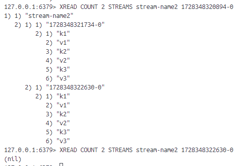

两种迭代方式的区别：
- XRANGE与XREVRANGE接受ID区间范围作为输入，XREAD接受单个ID。前者每次进行后续迭代都需要手动计算下一次迭代的起始ID，后者只需要把上次最后的ID输入即可
- XRANGE和XREVRANGE可以按从头到尾从尾到头迭代，XREAD只能从流开头进行迭代
- XREAD可以一次接受多个流作为输入
- XREAD有阻塞功能，所以它既可以同步也可以异步，XRANGE和XREVRANGE只能同步

### 6.3 阻塞
用BLOCK并给一个毫秒精度超时时间作为参数，可以是任何>=0的数值，如果是0，表示阻塞知道出现可返回的元素为止。

### 6.4 只获取新出现的元素
XREAD提供了特殊ID参数$符号，在执行阻塞XREAD时，只要将$作为ID参数值，就会只获取给定流在命令执行之后新出现的元素

**XREAD BLOCK ms STREAMS stream1 [stream2 ...] \$ [\$...]**

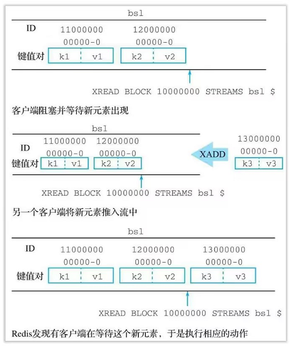
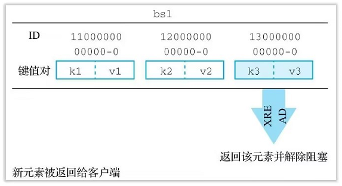

## 7、消费者组
redis流的消费者组允许用户将一个流从逻辑上划分为多个不同的流，并让消费者组属下的消费者处理组中的消息。

### 7.1 创建消费者组
**XGROUP CREATE stream group start_id**
stream：流名称
group：消费者组名字
start_id：指定消费者组在流中起始ID

同一个流的消息在不同消费者组之间是共享的。

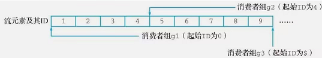
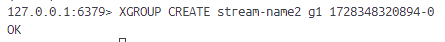
### 7.2 读取消费者组
**XREADGROUP GROUP group consumer [COUNT n] [BLOCK ms] STREAMS stream [stream ...] id [id ...]**

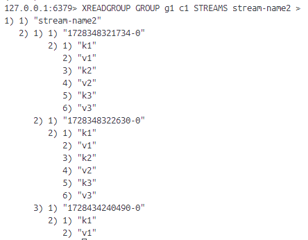

- 使用具体 ID 以读取该 ID 之后的消息
- 使用 > 来读取当前消费者组未消费的新消息

### 7.3 消费者
消费者是负责处理消息的客户端。与创建消费者组不一样，消费者不用显示地创建，只要在XREADGROUP命令中给定消费者名字即可。

和消费者组一样，消费者也会维护一个属于自己的待处理消息列表：当用户使用XREADGROUP读取一条消息并将消息指派给一个消费者处理时，该消费者会把所指派的消息添加到自己的待处理消息队列中。

多个消费者组能够共享同一个流中的元素不一样，同一个消费者组中每条消息只能有一个消费者。

### 7.4 消息状态转换
消费者处理完一条消息后会向redis发送一条针对该消息的XACK命令。

**XACK stream group id [id ...]**

redis接受到消息就会从消费者组的待处理消息队列以及消费者的待处理消息队列中移除指定消息。这些消息从待处理表位已确认。

- XADD让消息从【不存在】变为【未递送】
- XREADGROUP从流中读取一条消息，该消息从【未递送】变为【待处理】
- 消费者完成对消息处理，通过XACK把消息从【待处理】变为【已确认】

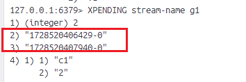
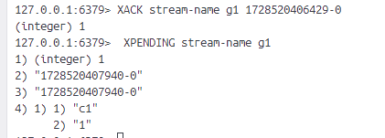

## 8、XGROUP 管理消费者组
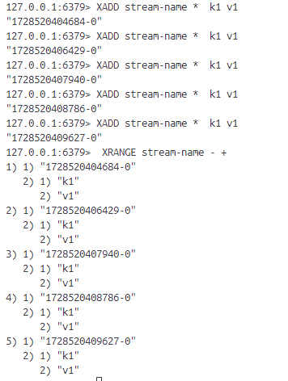

### 8.1 创建消费者组
**XGROUP CREATE stream group id**

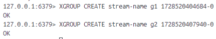

### 8.2 修改消费者组最后递送的消息ID
**XGROUP SETID stream group id**

命令给的ID可以是任意合法ID，即ID对应消息可以不存在，可以大于、小于、等于当前ID。

处理合法ID，$也可以作为ID参数值。

- 新ID>旧ID，消费者可能会漏掉一些原本应该读取的消息
- 新ID<旧ID，消费者可能重新读取到一些之前已被确认过的消息

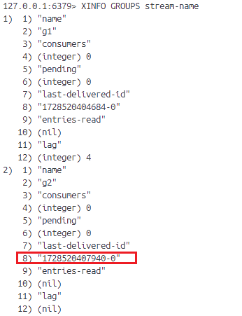
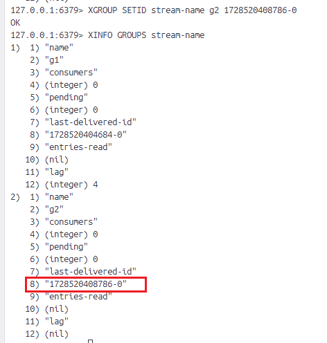

### 8.3 删除消费者
**XGROUP DELCONSUMER stream group consumer**

返回消费者被删除时仍在处理的消息数量。

消费者被删除后，它在被删除时处理的消息也会从消费者组的待处理消息队列中移除，这些消息可能已被消费者处理了，但也可能尚未妥善处理。所以我们在删除一个消费者前应该保证命令的返回值都是0。可以用XCLAIM显示转移待处理消息的归属权。
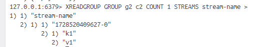
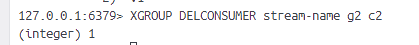

### 8.4 删除消费者组
**XGROUP DESTROY stream group**
成功返回1，失败返回0。

和上面一样，为了保证程序的准确性，我们需要保证在删除消费者组的时候，组内没有任何待处理消息，否则这些待处理消息可能无法得到妥善处理。

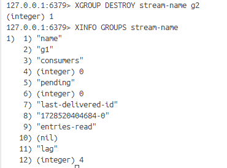

## 9、XREADGROUP

**XREADGROUP GROUP group consumer [COUNT n] [BLOCK ms] STREAMS stream [stream ...] id [id ...]**

读取消费者组中消息。

XREADGROUP在读取消息同时会将消息分别添加到消费者组的待处理消息队列以及消费者的待处理消息队列中。

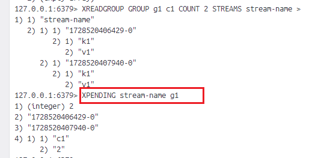
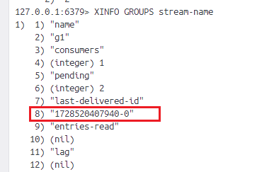

## 10、XPENDING
**XPENDING stream group [start stop count] [consumer]**

显示待处理消息相关信息。
 [start stop count] ：start和stop是id，count限制被检阅的消息数量。
 [consumer] : 只会列出给定消费者相关待处理消息

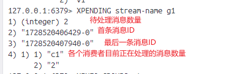

## 11、XACK
**XACK stream group id [id ...]**
将消息标记为【已处理】。

## 12、XCLAIM
**XCLAIM stream group new_consumer max_pending_time id [id ...] [JUSTID]**

指定消息的归属权从一个消费者转向另外一个消费者。

命令中的任意多个id指明需要转移归属权的消息。

max_pending_time指定执行归属权转移操作所需最大消息处理时限：
- 如果XCLAIM执行时消息原来的消费者用在处理该消息上的时间超过指定时限，那么归属权转移操作就会被执行
- 相反，如果原消费者处理该消息时间未超过给定时限，或该消息被原消费者确认，归属权转移操作将放弃执行

这里的消息处理时间指的是从消费者组将消息递送给原消费者开始，直到XCLAIM执行为止所用的时间总长。max_pending_time是针对那些待处理消息的。
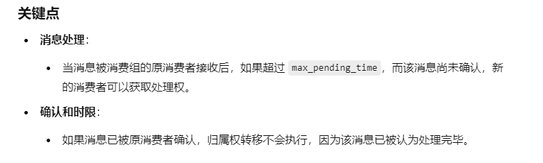

默认情况XCLAIM会把成功执行后被转移的消息ID及其内容全部返回给客户端，用JUSTID可以只返回被转移的ID，避免不必要的带宽消耗。

## 13、XINFO 
查看流和消费者组的相关信息。

### 13.1 打印消费者信息
**XINFO CONAUMERS stream group-name**

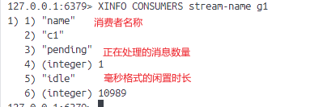

### 13.2 打印消费者组信息
**XINFO GROUPS stream**

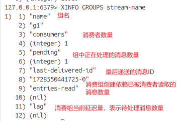

### 13.3 打印流消息
**XINFO STREAM stream**

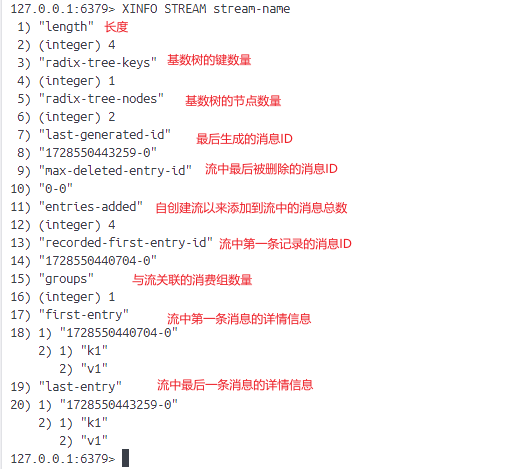

