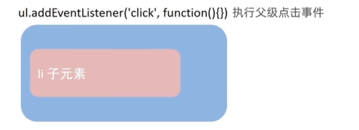

# JavaScript

VSCode安装插件：Error Lens（代码报错），One Dark Pro（代码颜色主题），Live Server（左右分屏）

## 1、基础
### 1.1 基础知识点
JavaScript作用：
- 网页特效（监听用户一些行为让网页做出对应反馈）
- 表单验证（针对表单数据的合法性进行判断）
- 数据交互（获取后台数据，渲染到前端）
- 服务端编程（node.js）


JavaScript组成：
- ECMAScript：规定js基础语法核心
- webAPIs:
  - DOM 操作稳定
  - BOM 操作浏览器

查询js的网站：https://developer.mozilla.org/zh-CN/


JavaScript书写位置：
- 内部JavaScript，直接在html里面写，用Script包住
  - script标签写在HTML文件底部，因为浏览器会按代码在文件中的顺序加载HTML
- 外部JavaScript，script标签中间无需写代码
- 内联JavaScript（<button onclick="alert("hello")">）


JavaScript注释：
- //  ctrl + /
- /**/ shift + alt + a

JavaScript结束符是“;”但是浏览器会自己推断，所以可写可不写，风格统一就行。


### 1.2 输入输出语法
**document.write("要输出的内容")**：向body内输出内容，如果输出的内容写的是标签，也会被解析成网页元素

**alert('要输出的内容')**：页面弹出警告框

**console.log('控制台打印')**


**prompt('输入提示：')**：显示一个对话框，对话框中包含一条文字信息，用于提示用户输入文字


（一般按html文档顺序执行JavaScript，alert和prompt会跳过页面渲染先被执行）


### 1.3 变量
let 变量名
var 变量名（旧版的js可能会看到这个，新版现在一般不用了）

var声明：
- 可以先使用再声明（不合理）
- var声明过的变量可以重复声明（不合理）
- 变量提升，全局变量，没有块级作用域等等

### 1.4 数组
let 数组名 = [数据1， 数据2， ...]

取值： 数组名[索引号]

new Array(数据1， 数据2， 数据3， ...)

增加：arr.push(增加的数据, ...) 添加到结尾，arr.unshift(增加的数据) 添加到开头

修改：数组[下标] = 修改的数据

删除：arr.pop() 删最后,arr.shift() 删最前, arr.splice(操作的下标，删除的个数)

map方法：
```js
const arr = ['red', 'blue']
const newArr = arr.map(function(ele, index){
  console.log(ele) // 数组元素
  console.log(index) // 数组索引号
  return ele + '颜色'
})
console.log(newArr) //['red颜色', 'blue颜色']
```

join方法：把数组中所有元素转化成一个字符串
```js
const arr = ['red', 'blue']
console.log(arr.join(' ')) //"red blue"
```
### 1.5 常量
const 常量名 = 常量

不允许重新复制，声明的时候必须赋值。

### 1.6 数据类型
- 基本数据类型
  - number 数字型
  - string 字符串型
  - boolean 布尔型
  - undefined 未定义型
  - null 空类型
- 引用数据类型
  - object对象

NaN代表计算错误

字符串用单引号，双引号或反引号包裹

模板字符串：
```
"字符串${变量}字符串"
```

用`typeof 变量`关键字检测数据类型

对于数据类型转换，只有加号默认转化为字符串（如果只有一个字符串，比如+“123” 那么就是转化为数值型），其他运算符默认转化为数字。

显示转换：
- 转换为数字型
  - Number(数据)
  - parseInt（数据）：保留整数 55.66px -> 55, abc 55.66px->null
  - parseFloat（数据）：可以保留小数 abc55.66px->55.66


### 1.7 运算符
- 赋值运算符
  - +=
  - -=
  - *=
  - /=
  - %=
- 一元运算符
  - ++
  - --
- 比较运算符
  - ==：左右两边值是否相等
  - ===：左右两边是否类型和值都相等
  - !==：左右两边是否不全等（NaN不等于任何包括它自己）
- 逻辑运算符
  - &&
  - ||
  - ！


### 1.8 语句

**if语句**
```
if(条件){
  满足条件要执行的代码
}

if(条件){

}else{

}

if(){}
else if(){}
else {}
```
条件 ? 满足条件执行的代码 : 不满足条件执行的代码

**switch** 匹配的是全等===
```
switch(数据){
  case 值1：
    代码1
    break
  case 值2：
    代码2
    break
  default:
    代码n
    break
}
```
**while**

while(循环条件){要重复执行的代码}

**for循环**
for（变量起始值;终止条件;变量变化量）{}

for(;;)是无限循环

退出循环也是用continue和break


### 1.9 函数
定义：function 函数名(参数1，...){}
调用：函数名(参数1，...)

利用默认值去定义形参的类型。

在 JavaScript 中，函数本身只能返回一个值。

两个系统的函数后面的会覆盖前面的函数。

如果函数内部，变量没有声明， 直接赋值，会当做全局变量看（不推荐）

匿名函数：
- 函数表达式
- 立即执行函数
```
let fn = function(x,y){} //函数表达式
fun(x,y) // 调用

// 具名函数的调用可以写到任何位置，函数表达式必须先声明后调用

// 立即执行函数:防止变量名冲突
// 方法1
(function (x,y) {内容})(1,2);
// 方法2
(function(x,y){方法}(1,2))
```

可以利用逻辑中断实现：
```
let a = 5 || 1; // a得到的值是5
```

### 1.10 对象
```
//声明
let 对象名 = {
  属性名：属性值，
  方法名：函数
}

let 对象名 = new Object()

// 查
对象名.属性
对象名['属性名']

// 改
对象名.属性 = 新值

// 增加属性
对象名.新加的属性 = 新值

// 删 （不推荐）
delete 对象名.属性

// 遍历对象
for(let k in obj){
  // k 属性名 （数组的话k是下标，但不推荐数组用这种形式遍历）
  // obj[k] 值
}

```

内置对象：
- Math


## 2、Web Api
操作DOM和BOM，控制网页元素交互等各种网页交互效果

变量声明先考虑const，引用类型也可以用const，因为地址是不变的，内容是可以改变的

分类：
- DOM：文档对象模型，提供一套专门用于操作网页内容的功能 document
- BOM：浏览器对象模型 window

### 2.1 DOM
DOM树：将HTML文档以树结构直观的表现出来，称为DOM树或文档树
DOM对象：浏览器工具HTML标签生成js对象


document对象：是DOM里提供的一个对象，网页所有内容都在document里，是整个页面最大的对象

#### 2.1.1 获取DOM对象：
- 根据css选择器
document.querySelector('css选择器')
```js
// 匹配第一个
<div class='box' id='nav'>123</div>

const box1 = document.querySelector('div');
const box2 = document.querySelector('.box');
const box2 = document.querySelector('#nav')


<ul>
  <li>测试1</li>
  <li>测试2</li>
  <li>测试3</li>
</ul>
const li = document.querySelector('ul li:first-child')

// 匹配所有
const lis = document.querySelectorAll('ui li'); //是一个伪数组，没有pop push等数组方法
```

- 其他获取DOM元素方式
```js
document.getElementById('nav')
document.getElementsByTagName('div')
document.getElementsByClassName('class name')
```

#### 2。1.2 操作元素内容
- 对象.innerText 属性
- 对象.innerHTML 属性

```js
const box = document.querySelector(".box");
box.innerText = '修改的内容'； // 不解析标签，添加的是纯文本

box.innerHTML = '<div>修改的内容</div>' //解析标签
```

#### 2.1.3 操作元素属性
操作元素常用属性：href，title，src等
对象.属性 = 值
```js
const img = document.querySelector('img');
img.src = "/new/path"
```

操作元素样式属性：
```js
.box{
  width:200px;
  height:200px;
  background-color:pink;
}

.box2{
  width:300px;
  height:300px;
  background-color:hotpink;
}
<div class='box' id='nav'>123</div>

// 通过属性修改
const box = document.querySelector(".box");
box.style.width = "300px";
box.style.backgroundColor = "hotpink" //多组单词的用小驼峰命名法

// 通过类名修改
box.className = 'box2';

// 追加和删除类名
box.classList.add('box2');
box.classList.remove('box');
box.classList.toggle('box'); // 切换一个类名，就是有就删掉，没有就加上，类似开关灯很有用

```

操作表单元素属性：

```js
<input type="checkbox" value="11" checked>

const ipt = document.querySelector('input');
ipt.checked = true //控制添加还是不添加，类似的还有disabled，selected
```

操作自定义属性：
html5推出专门的data-自定义属性 （data开头不是死规定，但是建议这样写，专业）
DOM对象上一律以dataset对象方式获取
```html
<body>
  <div class="box" data-id="10" data-spm="呵呵">123</div>
  <script>
    const box = document.querySelector('.box');
    console.log(box.dataset.id);
    console.log(box.dataset.spm);
  </script>
</body>

```

#### 2.1.4 定时器-简写函数
场景：每隔一段时间需要自定执行一段代码，不需要手动去触发
```js
// 开启定时器
setInterval(函数,间隔时间)
setInterval(function(){console.log('1s执行一次')},1000) // 如果是函数名的话，不要加小括号

// 关定时器
let m = setInterval(function(){console.log('1s执行一次')},1000) //m是一个id
clearInterval(m)
// 关闭后再开
m = setInterval(function(){console.log('1s执行一次')},1000)
```

#### 2.1.5 事件
元素对象.addEventListener('事件类型', 要执行的函数)
```js
const btn = document.querySelector('.btn');
btn.addEventListener('click', function (){alert('点击了')})
```

事件监听版本：
- DOM L0 ： on方式会被覆盖
  - 事件源.on事件 = function(e){ // 第一个参数e是事件对象}
- DOM L2
  - 事件源.addEventListener(事件，事件处理函数)

事件类型：
- 鼠标事件
  - click
  - mouseenter 鼠标经过
  - mouseleave
- 焦点事件，就是表单光标
  - focus 获得焦点
  - blur 失去焦点
- 键盘事件
  - keydown 键盘按下触发
  - keyup 键盘抬起触发
- 文本事件
  - input 用户输入事件

事件对象常见属性：
- type：当前事件类型
- clientX/clientY:光标相对于浏览器可见窗口左上角的位置
- offsetX/offsetY：获取光标相对于当前DOM元素左上角的位置
- key：用户按下的键盘键的值

环境对象：
```js
// 每个函数里面都有this环境对象
// 普通函数里面this指的是window，指的是调用函数的对象
function (){console.log(this)}
window.fn() // 调用，相当于fn()

btn.addEventListener('click', function(){console.log(this)}) // this是btn
```

事件流：


捕获是从DOM的根元素开始去执行对应的事件：
DOM.addEventListener(事件类型，事件处理函数，是否使用捕获机制)：为true是捕获事件触发，false是冒泡阶段触发
```js
document.addEventListener('click', function(){
  alert('爷爷')
}, true)；
father.addEventListener('click', function(){
  alert('爸爸')
}, true)；
son.addEventListener('click', function(){
  alert('儿子')
}, true)；

// 捕获顺序：爷爷、爸爸、儿子
// 冒泡顺序：儿子、爸爸、爷爷
let fn = function(e){
  alert('儿子')
  e.stopPropagation(); // 阻止流动传播 
};
son.addEventListener('click',fn , true)；
// 点击后只出现儿子

son.onclick = null //解绑事件 L1 L1只有冒泡没有捕获
son.removeEventListener('click', fn, true) //解绑事件 L2 匿名函数无法被解绑，所以需要定义出来
```


鼠标经过事件的区别：
- mouseover、mouseout会有冒泡效果
- mouseenter、mouseleave 没有冒泡效果（推荐）


事件委托：
场景是给多个元素注册同样的事件。
事件委托是利用事件冒泡的特点。



通过事件对象的target可以确定是哪一个元素被点击的。
```js
const ul = document.querySelector('ul');
ul.addEventListener('click', function(e){
  // this.style.color = 'red';
  // e.target.style.color = 'red';
  if(e.target.tagName === 'LI'){ // 限定里面只有li点击才有效果
    e.target.style.color = 'red';
  }
})
```

阻止元素默认行为：
```html
<form action="http:baidu.com">
  <input type="submit" value="注册">
</form>
<script>
  const form = document.querySelector('form');
  form.addEventListener('submit', function(e){
    // 阻止默认行为提交，点击后就不会再有提交表单的行为了
    e.preventDefault();
  })
</script>
```

其他事件：
- 页面加载事件
  - load 加载外部资源（图片，css，js等）加载完毕时触发的事件，用这个的话js就不用再写在html下面了（window加）
  - DOMContentLoaded（document加）
- 元素滚动事件
  - scroll window或document加都可以
- 页面尺寸事件
  - resize 窗口尺寸改变的时候触发事件

```html
// 页面加载事件
<script>
window.addEventListener('load', function(){
  //执行操作
  const btn = document.querySelector('button');
  btn.addEventListener('click', function(){

  })
})
// 图片加载完成再执行里面的代码
img.addEventListener('load', function(){
  //执行操作
  const btn = document.querySelector('button');
  btn.addEventListener('click', function(){

  })
})

// 当初始HTML文档被完全加载和解析完成后，DOMContentLoaded事件被粗发，无需等待样式表，图形等完全加载
document.addEventListener('DOMContentLoaded', function(){

})
</script>

<button>按钮</button>

// 元素滚动
<script>
  // 元素
  const div = document.querySelector('div');
  window.addEventListener('scroll', function(){
    console.log(div.scrollTop);
  })

  // 页面
  // 想知道页面滚动了多少迅速
  window.addEventListener('scroll', function(){
    // documentElement是获取html标签对象
    console.log(document.documentElement.scrollTop);
  })
</script>

// 页面尺寸事件
<script>
  window.addEventListener('resize', function(){
    let w = document.documentElement.clientWidth; // 检测屏幕宽度，检测元素宽度也是clientWidth
    console.log(w);
  })
</script>
```


元素尺寸：
- 获取宽高
  - offsetWidth、offsetHeight 可视宽高 内容+padding+border
- 获取位置
  - offsetLeft、offsetTop 获取元素距离自己定位父级元素的左上距离  只读

```js
const div = document.querySelector('div');
const p = document.querySelector('p');
// 检测盒子的位置 最近一级带有定位的祖先元素 都没有以文档左上角为准
console.log(p.offsetLeft);
```

#### 2.1.6 日期
属于ECMAScript对象

日期对象：
```js
// 获取当前时间
const date = new Date();

// 指定时间
const date1 = new Date('2022-5-1 08:30:00')

```


时间戳：
指1970年01月01日00:00:00起到现在的毫秒数，是一种特殊的计量事件的方式
```js
// 3种方式
+new Date()

date.getTime()

Date.now()
```

月份是0-11 星期是0-6（星期日是0）

#### 2.1.7 节点操作


查找节点：
- 父节点
  - 子元素.parentNode
- 子节点
  - 父元素.childNodes 获得所有字节点，包括文本节点，注释节点等
  - 父元素.children  返回伪数组 仅获得所有元素节点
- 兄弟节点
  - 节点.nextElementSibling 下一个兄弟节点
  - 节点.previousElementSibling 上一个兄弟节点

创建节点：
```js
// 创建节点
let li = document.createElement('li')；
li.innerHTML = "新增";
let ul = document.querySelector('ul');
// 追加
ul.appendChild(li); // 放到父元素的最后一个子元素
ul.insertBefore(li, ul.children[4]); // 指定插入位置 放到ul.children[4]前面

```

克隆节点：
- 元素.cloneNode(布尔值) true:包含后代节点  false:不包含后代节点

删除节点：
- 父元素.removeChild(要删除的元素)

#### 2.1.8 M端（移动端）事件


#### 2.1.9 js插件
- 官网查找插件：https://www.swiper.com.cn
- demo:https://www.swiper.com.cn/demo/index.html
- 查看基本使用流程：https://www.swiper.com.cn/usage/index.html
- 查看Api文档：https://www.swiper.com.cn/api/index.html


### 2.2 BOM


定时器-延时函数：
- setTimeout(回调函数，等待的毫秒数) 创建延时函数，延时器需要等待，所以后面的代码先执行，每一次调用延时器都会产生一个新的延时器
- clearTimeout(setTimeout的对象) 清除延时函数，递归就会用到这个

Js执行机制：
- js一大特点是单线程，所有任务需要排队，前一个任务结束才会执行后一个任务
- 问题：造成页面渲染不连贯，导致页面渲染加载阻塞
- 为解决上面的问题，利用多核CPU计算能力，HTML5允许徐js脚本创建多个线程，于是js中出现了同步和异步
- 异步任务
  - 普通事件
    - click、resize等
  - 资源加载
    - load，error等
  - 定时器
    - setInterval、setTimeout等
- 异步任务相关添加到任务队列中
- 执行路径
  - 先执行执行栈中的同步任务
  - 异步任务放入任务队列中
  - 所有同步任务执行完毕，系统会按次序读取任务栈中的异步任务，被读取的异步任务结束等待状态，进入执行栈开始执行
- 主线程不断地重复获得任务，执行任务，再获取任务，这种机制被称为事件循环


location对象：
- 拆分保存了URL地址的哥哥组成部分
- 常用属性和方法
  - href 属性，获取完整URL地址，对其赋值用于地址跳转
  - search 属性，获取URL ? 后面的部分
  - hash 就是获取地址哈希值url/#value #后面的部分
  - reload 方法。用来刷新当前页面，传入参数true表示强制刷新（重新拉数据而不是从本地拿）

navigator对象：
- 记录浏览器自身相关信息
- 常用属性和方法
  - userAgent属性，检测浏览器的版本以及平台

history对象：
- 管理历史记录，与浏览器地址栏的操作相对应，如前进、后退、历史记录等
- 方法
  - back() 后退功能
  - forward() 前进功能
  - go(参数) 前进后退功能，1是前进一个页面，-1是后退一个页面


本地存储：
- 数据存储在用户浏览器中，sessionStorage和localStorage约5M左右
- 本地存储分类
  - localStorage
    - 将数据永久存储在本地，除非手动删除，关闭页面也会存在
    - 多窗口共享，以键值对形式存储，只能存储字符串
    - localStorage.setItem(key,value) 有就是改没有就是增
    - localStorage.getItem(key)
    - localStorage.removeItem(key)
  sessionStorage
    - 生命周期为关闭浏览器串口，同一个窗口下数据共享，键值对形式存储，使用方式和localStorage相同
- 存储复杂数据类型
  - 将复杂数据类型转化成字符串在存储到本地
  - JSON.stringify(复杂数据类型)
  - JSON.parse(string) 反序列号


### 2.3 正则表达式

- 定义规则: const regObj = /表达式/ // 是正则表达式字面量
- 查看是否与指定字符串匹配： regObj.test(被检测的字符串)
- 执行一个搜索匹配，匹配到返回arr，否则为null：regObj.exec(字符串)

元字符：
- 特殊含义的字符，比如26个英文字符换成元字符就是[a-z]
- 分类
  - 边界符 表示位置，开头和结尾，必须用什么开头/结尾
    - ^ 开始
    - $ 结尾
  - 量词 表示重复次数
    - 
  - 字符类 比如\d表示0-9
    - [] 匹配字符集合，只选一个
      - 用-表示一个范围
      - 加上^ 表示除[]里面以外的字符
    - 预定义
      - 
  - 修饰符
    - 约束正则执行的某些细节行为，比如是否区分大小写，是否支持多行匹配等
    - /表达式/修饰符
    - 类比
      - i 不区分大小写
      - g 匹配所有满足正则表达式的结果

## 3、js进阶
### 3.1 关于变量
作用域：
- 分类
  - 局部作用域
    - 函数作用域
    - 块作用域 {} 包裹的代码
      - 代码块内部生命的变量外部有可能无法访问， let声明产生块作用域，var不会产生块作用域（可以外部访问）
  - 全局作用域

作用域链：
- 本质上是底层的变量查找机制
  - 函数被执行时优先查找当前函数作用域中查找变量
  - 如果当前作用域查找不到就会依次逐级查找父级作用域知道全局作用域


垃圾回收机制 GC：
- 内存生命周期
  - 内存分配：声明变量、函数、对象时，系统自动为他们分配内存
  - 内存使用：读写内存
  - 内存回收：使用完毕，垃圾回收器自动回收不再使用的内存
- 全局变量一般不会回收（关闭页面回收）
- 内存泄露：程序分配的内存由于某种原因程序未释放或无法释放
- 算法说明
  - 堆栈空间分配区别
    - 栈：操作系统自动分配释放函数的参数值，局部变量等，基本数据类型都放栈里面
    - 堆：由程序员分配释放，程序员不释放，由垃圾回收机制回收，复杂数据类型放堆里
  - 算法
    - 引用计数法（现在已经不用了）
    - 标记清除法
      - 从根部扫描对象，能查找到的就是使用的，查找不到的就是要回收的

闭包：
- 一个函数对周围状态的引用捆绑在一起，内层函数中访问到其外层函数的作用域 闭包=内层函数+外层函数的变量
- 作用：封闭数据，提供操作，外部也可以访问函数内部的变量，其实最终的目的就是为了变量不被篡改，把局部变量变成全局变量
- 闭包会有问题：内存泄露
```js
//一个闭包
function outer(){
  const a = 1;
  function fn(){
    console.log(a)
  }
  return fn;
}
const fun = outer() //outer === fn === function fn(){}
```

变量提升：
- 允许变量声明之前被访问（仅存在于var声明变量），执行前会把var的声明提到当前作用域下的前面，所以不会报错


### 3.2 关于函数
函数提升
- 和变量提升类似，会把所有函数声明提升到当前作用域的最前面，所以函数在声明之前就能调用

函数参数：
- 动态参数
  - arguments，包含调用函数时传入的所有实参 fun(){console.log(arguments)}
- 剩余参数
  - fun(x,y,..arr){console.log(arr)}
  - 区别展开运算符，不作为型参，...arr是展开数组

箭头函数：
- 没有动态参数，有剩余参数
- 箭头函数不会创建自己的this，它只会从自己的作用域链的上一层沿用this
```js
const fn = (x)=>{
  console.log(x)
}
fn(1)

// 返回一个对象用()包起来
const f =(uname) => ({uname:uname})
```

解构赋值：
- 数组解构
- 对象解构
```js
//数组
const [max, min, avg] = [100, 60, 80]
console.log(max)

// 对象 声明的变量名要和属性名一样
const {name, age} = {
  name:'tom',
  age:22
}
// 变名
const {name:username, age} = {
  name:'tom',
  age:22
}

// 解构数组对象
const [{uname, age}] = [{uname:'tom', age:88}]
```

js前面必须加分号的情况：
- 立即执行函数
- 数组解构


forEach:
- arr.forEach(function(当前数组元素，当前元素索引（可选）)){}


### 3.3 关于对象

创建对象3种方式：
```js
//利用对象字面量创建
const o ={name:'tom'}

// 用new object
const obj = new Object()
obj.name = 'tom'
// const obj = new Object({name:'tom'})

//用构造函数创建
/*
构造函数约定：
- 命名以大写字母开头
- 只能由new操作符执行
构造函数自动返回创建的新的对象
*/
function Pig(name){
  this.name = name;
}
let pig = new Pig('佩奇')
```

构造函数实例化执行过程：
- 创建新空对象
- 构造函数this指向新对象
- 执行构造函数代码，修改this添加新属性
- 返回新对象

实例成员：
- 用构造函数创建的对象称为实例对象，实例对象中的属性和方法称为实例成员（实例属性，实例方法）

静态成员：
- 构造函数的属性和方法称为静态成员（静态属性和静态方法）
```js
function Persion(name){
  this.name = name
} 
Persion.age = 4; //静态属性
Persion.walk = function(){ //静态方法

}
```

内置构造函数：
- 引用类型
  - Object
    - Object.keys(obj) 返回数组，存储的是属性值
    - Object.values(obj)
    - Object.assign(newObj, obj) 对象拷贝，可以用于属性追加
  - Array
    - forEach
    - filter
    - map
    - reduce 累计器
      - arr.reduce(function(上一次值，当前值){}, 起始值)
  - RegExp
  - Date
- 包装类型
  - String
  - Number
  - Boolean

构造函数方法很好用，但存在浪费内存的问题。不同对象的方法是不相等的。

如果希望所有对象使用同一个函数（节省内存），用原型可以解决：
- 能够利用原型对象事项方法共享
- 构造函数通过原型分配的函数是所有对象共享的
- js规定每个构造函数都有一个prototype属性，指向另一个对象，所以也称为原型对象
- 这个对象可以挂载函数，对象实例化不会多次创建原型上的函数
- 构造函数和原型对象中的this都指向实例化的对象

```js
Persion.prototype.sing = function(){

}


Persion.prototype = {
  constructor：Persion // 重新指回构造函数
  sing:function(){}
}
```
constructor属性：
- 每个原型对象里面都有这个constructor属性
- 指向改原型对象的构造函数


对象原型：
- 对象都有一个属性__proto__（非js标准，也有是\[[Prototype]]）指向构造函数的prototype原型对象
- __proto__里面也有一个constructor属性，指向创建该实例对象的构造函数


原型继承：
```js
function Persion(){
  this.eays=2,
  this.head=1
}
// 通过原型继承Persion
function Woman(){

}
// 通过原型继承Persion
Woman.prototype = new Persion() //new的话就跟其他继承原型的构造方法不一样了
//指回原来的构造函数
Woman.prototype.constructor = Woman
```

原型链：
- 概念和作用域链差不多


用instanceof运算符用于检测构造函数的prototype属性是否出现在某个实例对象的原型链上  `对象名 instanceof 类名`


深浅拷贝：
- 浅拷贝
  - 拷贝的是地址
  - Object.assgin() / {...obj}  对象
  - Array.prototype.concat()  /  [..arr] 数组
  - 对象里面有对象属性，这时浅拷贝就有问题了，里层的拷贝的是地址
- 深拷贝
  - 递归实现深拷贝
  - lodash/cloneDeep
  - Json.stringfig()实现

```js
//js库lodash里面cloneDeep内部实现了深拷贝
<script src="./lodash.min.js"></script>
const o = _.cloneDeep(obj);


// json转换
const o = JSON.parse(JSON.stringify(obj))
```


异常处理：
- throw
- try/catch
- debugger

```js
function fun(x,y){
  if(!z || !y){
    //throw "无参数"
    throw new Error("无参数")
  }
  return x+y;
}

function fun(x,y){
  try{

  }
  catch(err){
    console.log(err.message)
  }
  finally{

  }
}

function fun(){
  //xxx
  debugger
  //xxx
}
```

this处理：
- this指向
  - 普通函数：谁调用，this指向谁
    - 没有明确调用者时this值为Window，严格模式下没有调用者时this值为undefined
    - 严格模式就是加上"use strict"
  - 箭头函数
    - 事实上箭头函数不存在this，默认会绑定外层this值
    - 事件回调函数使用箭头函数时，this为全局的Window，因此DOM事件回调函数如果里面需要DOM对象，不推荐使用箭头函数
    - 基于原型的面向对象，构造函数也不推荐采用箭头函数
- 改变this
  - call()
    - fun.call(thisArg, arg1, arg2, ...)  thisArg 在fun函数运行时指定this的值
  - apply()
    - fun.apply(thisArg, [argsArray])
  - bind()
    - bind不会调用函数，但能改变函数内部this指向
    - fun.bind(thisArg, arg1, arg2, ...)

```js
const obj = {
  uname:'tom'
}

function fun(x,y){
  console.log(this)
}

fun.call(obj, 1,2)

fun.apply(obj, [1,2]) //可以用于数组  Math.max.apply(Math, [...])

let fun2 = fun().bind(obj);
fun2()
```

### 3.4 性能优化

防抖：
- 单位时间内，平方触发事件，只执行最后一次
- lodash的debounce函数，底层就是定时器，延迟wait毫秒后调用func方法
```js
//利用防抖实现性能优化
// 需求：鼠标在盒子上移动，里面数字就会变化+1
const box = document.querySelector('.box')
let i = 1
function mouseMove(){
  box.innerHTML = i++
}

// 添加事件
// box.addEventListener('mousemove', mouseMove);

// 利用lodash库实现防抖--鼠标滑动并停止500ms后采取+1
box.addEventListener('mousemove', _.debounce(mouseMove, 500))


//手写
/*
思路：
声明一个定时器变量
当鼠标每次滑动抖先判断是否有定时器了，如果有定时器，先清除以前的定时器
如果没有定时器，则开启定时器，存到变量里面
在定时器里面调用要执行的函数
*/
function debounce(fn, t){
  let timer
  // return 一个匿名函数 因为debounce是带()即立刻执行，所以需要返回一个函数，在函数里面写逻辑
  return function(){
    if(timer) clearTimeout(timer)
    timer = setTimeout(function(){fn()}, t)
  }
}

box.addEventListener('mousemove', debounce(mouseMove, 500))
```


节流：
- 单位时间内，频繁触发事件，只执行一次，就是执行单位时间内的第一次触发
- lodash的throttle 核心是利用定时器

```js
// 需求：鼠标在盒子上移动，不管移动多少次，每隔500ms才+1
box.addEventListener('moucemove', _.throttle(mouseMove, 500))

// 手写
/*
思路：
声明一个定时器变量
当鼠标每次滑动抖想判断是否有定时器，有定时器则不开启新定时器
没有定时器则开启，执行后关闭定时器
*/
function throttle(fn, t){
  let timer = null
  return function(){
    if(!timer){
      timer = setTimeout(function(){
        fn()
        timer = null // 不用clearTimeout(timer)原因：在定时器里面，定时器还在运作，是无法清除的，所以使用null 
      }, t)
    }
  }
}
box.addEventListener('moucemove', throttle(mouseMove, 500))
```