# Node.js入门
Node.js是一个基于Chrome V8引擎的JavaScript运行环境。有了Node.js，JavaScript就可以做后端开发。

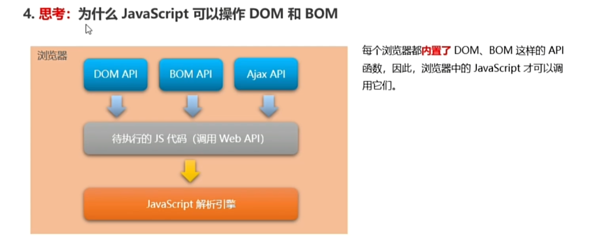


框架：
- Express：快速构建web应用
- Electron：构建跨平台的桌面应用
- restify：快速构建API接口项目

下载：https://nodejs.org/en （一路默认就行）

一个node运行js的小例子：


## fs 文件系统模块
fs是node.js官方提供的，用来操作文件的模块。

- fs.readFile()：读取指定文件
- fs.writeFile()：写入内容到指定文件

**导入模块**
```js
// 明确导入fs这个模块
const fs = require("fs")
```

**fs.readFile(path[, option], callback)，读取指定文件**
- path：文件路径
- option：以什么编码格式读取文件
- callback：读取成功后通过回调函数拿到读取结果
```js
fs.readFile("./files/111.txt", "utf8", function(err, dataStr){
  /*console.log(err);
  console.log("---");
  console.log(dataStr);*/
  if (err) {
    return console.log("文件读取失败：" + err.message)
  }
  console.log("文件读取成功，内容是：" + dataStr)
})
```
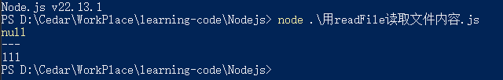

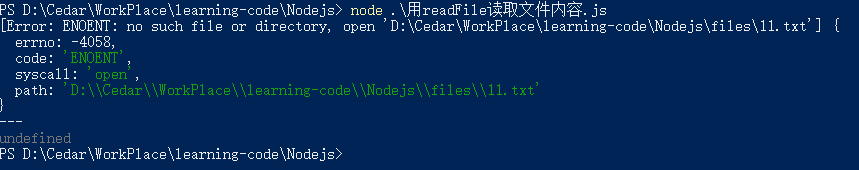


**fs.writeFile(file, data[, option], callback) 写入内容到指定文件**
- 参数1 文件路径
- 参数2 写入内容
- 参数3 文件格式 默认utf8
- 参数4 回调函数
```js
fs.writeFile("./files/2.txt", "2222", "utf8", function (err) {
  if (err) {
    console.log(err.message);
  }
  else {
    console.log("写入成功");
  }
})
```

**fs路径动态拼接问题**
fs如果提供相对路径，很容易出现路径动态拼接错误问题，因为代码执行时会以node命令所处的目录，动态拼接出被操作文件的完整路径

```js
// __dirname 表示当前文件所处目录
fs.readFile(__dirname + "/files/111.txt", "utf8", function (err, dataStr) {
  if (err) {
    return console.log("文件读取失败：" + err.message)
  }
  console.log("文件读取成功，内容是：" + dataStr)
})
```

## path 路径模块
- path.join() 多个路径片段拼接成一个完整路径字符串
- path.basename() 从路径字符串中将文件名解析出来
- path.extname() 路径中获取文件扩展名

**path.join([...paths])**
```js
const path = require("path")

const pathStr = path.join("/a", "/b/c", "./d", "e")
console.log(pathStr) // \a\b\d\e

const pathStr2 = path.join(__dirname, "./files/1.txt")
console.log(pathStr2) // 当前文件所在目录/files/1.txt
```

**path.basename(path[, ext])**
- path 路径字符串
- ext 文件扩展名

```js
const fpath = "/a/b/c/index.html"
var fullName = path.baseName(fpath) // index.html

var nameWithoutExt = path.basename(fpath, ".html") // index
```

## http 创建web服务器模块
负责消费资源的是客户端，对外提供资源的是服务器。

服务器和普通电脑的区别在于服务器上安装了web服务器软件，如IIS，Apache等。

nodejs不需要第三方软件，通过`http.createServer()`能把普通电脑变成web服务器。对外提供web资源服务

创建基本的web服务器：
```js
// 导入http模块
const http = require("http")
// 创建web服务器实例
const server = http.createServer()
// 为服务器实例绑定request事件

// 用服务器实例的.on方法，为服务器绑定一个request事件
server.on("request", function (req, res) {
  // 只要有客户端来请求我们自己的服务器，就会触发request事件，从而调用这个事件处理函数
  // console.log("web server")

  // req 是请求对象，包含客户端相关数据和属性
  // req.url 客户端请求的url地址
  // req.method 客户端的method请求类型
  const str = `request url is ${req.url}, 方法 is ${req.method}`
  console.log(str)

  // 为了防止中文显示乱码，需要设置响应头Content-Type值为 text/html; charset=utf-8
  res.setHeader("Content-Type", "text/html; charset=utf-8")
  // res.end() 向客户端发送指定内容，并结束这次请求的处理过程
  res.end("<b>" + str + "</b>")
})

// 启动服务器
server.listen(8080, () => {
  console.log("running at http://127.0.0.1")
})
```

根据不同url响应不同html内容：
```js
server.on("request", (req, res) => {
  const url = req.url

  let content = "<h1> 404 Not Fount</h1>"

  if (url === "/" || url === "/index.html") {
    content = "<h1>首页</h1>"
  } else if (url === "/about.html") {
    content = "<h1>关于页面</h1>"
  }

  res.setHeader("Content-Type", "text/html; charset=utf-8")

  res.end(content)
})
```

## 模块化
把大文件拆分成独立并互相依赖的多个小模块。

工具模块来源分类：
- 内置模块 node.js 官方提供 fs path http等
- 自定义模块 用户创建的每个js文件都是自定义模块
- 第三方模块

用require方法加载模块：
```js
// 内置模块
const fs = require("fs")

// 自定义模块  可以忽略.js后缀
const custom = require("./custom.js")

// 第三方
const moment = require("moment")
```
用require()方法加载其他模块时，会执行被加载模块中的代码

自定义模块中定义的变量方法等只能在当前模块中使用。防止全局变量污染的问题。

向外共享模块作用域中的成员：
- 每个js自定义模块中都有一个module对象，存储和当前模块有关的信息
- module的exports可以向外共享成员

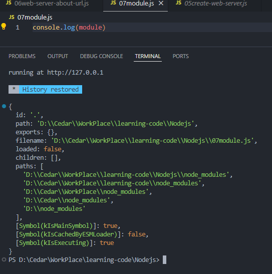

require()方法导入自定义模块时，得到的就是module.exports所指向的对象

```js
// module.js
module.exports.username = "zs";
module.exports.sayHello = function(){
  console.log("hello node.js")
};

/*module.exports = {
  username:"zs",
  sayHello(){
    console.log("hello node.js")
  }
}*/
```

```js
// getmodule.js
const m = require("./07module")
m.sayHello();
```

node提供了exports对象，默认情况下exports和module.exports指向同一个对象。

使用require()模块时，得到的永远都是module.exports指向的对象。

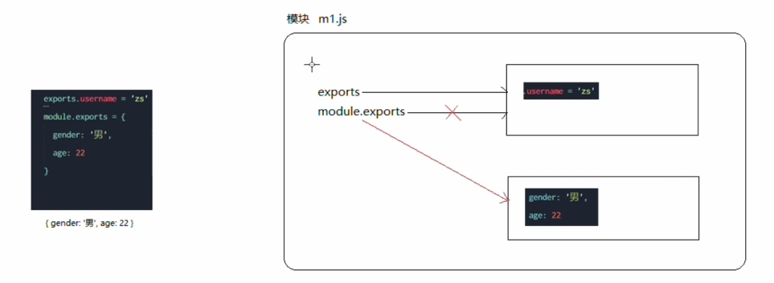
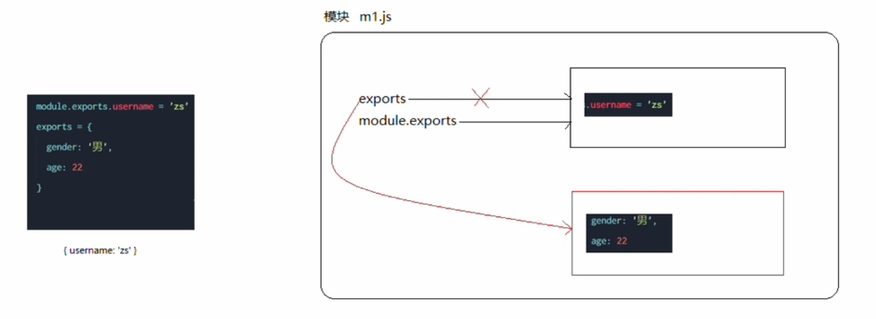


node.js遵循commonJS模块化规范，CommonJS规定模块特性和各模块之间如何相互依赖：
- 每个模块内部，module变量代表当前模块
- module变量是一个对象，它的exports属性是对外的接口
- 加载某个模块，其实是加载该模块的module.exports属性，require()方法用于加载模块

## 包与npm
node.js第三方模块又叫包（都是免费开源， \*\^▽\^\*）

全球最大包共享平台：从https://www.npmjs.com/ 搜索包，从 https://registry.npmjs.org下载需要的包

可以通过npm包管理工具安装包，npm随node.js的安装包一起安装的。

`npm install 包完整名称` / `npm i 包完整名称`

通过`包名称@{版本号}` 指定安装的包版本号。


安装后多了node_modules文件夹和package-lock.json,package.json文件
- node_modules 存放所有已经安装到项目中的包
- package-lock.json 记录node_modules目录下每一个包的下载信息，名字、版本号、下载地址等
- package.json 包管理配置文件
  - 锁定依赖的精确版本，确保不同环境下安装的包版本完全一致
  - 没有生成的话通过 npm init -y 生成 package.json
  - package.json 定义依赖范围（如 ^4.18.2），而 package-lock.json 锁定具体版本（如 4.18.2）
  - 作用
    - 项目名称、版本号、描述
    - 项目中用了哪些包
    - 哪些包只在开发期间会用到，哪些是开发和部署时用的
  - `npm install`
    - 先读取package.json中的dependences节点，把包一次性下载到项目中
  - `npm install 包名 --save-dev` / `npm i 包名 -D`
    - devDependencies节点时开发阶段用的，上线后就不会用到


`npm uninstall 包名称` 卸载包


包语义化规范：
- 包版本以“点分十进制”形式定义的，共3位数字:
  - 第1位数字：大版本
  - 第2位数字：功能版本
  - 第3位数字版本：Bug修复版本
- 前面版本号增长，后面版本号归零

包分类：
- 项目包
  - 开发依赖包
  - 核心依赖包
- 全局包 `npm i 包 -g`
  - C:/Users/用户目录/appData/Roaming/npm/node_modules
<hr>

镜像：是一种文件存储形式，一个磁盘上的数据在另外一个磁盘上存在一个完全系统的副本

```
# 查看当前的下载包镜像源
npm config get registry

# 将镜像源切换为淘宝镜像源
npm config set registry=https://registry.npm.taobao.org/

# 检查镜像源是否下载成功
npm config get registry
```

也可以用nrm查看和切换下载包的镜像源。

<hr>


开发一个包步骤：
- 初始化包的基本结构
  - 新建一个文件夹作为包根目录
  - 在文件夹下新建3个文件
    - package.json 包管理配置文件
    - index.js 包入口文件，在这里设置module.exports所以暴露的属性和方法（模块化拆分然后在index.js导入需要的模块）
    - README.md 包说明文档
  - 初始化package.json
- 然后就可以到npm发布包了（尽量不要在npm上发布没有意义的包，练习的话72小时内删除， 超过时间删不掉）

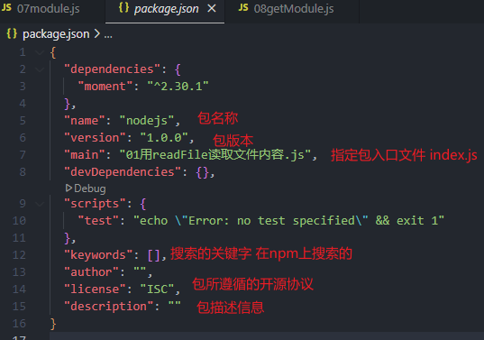

## 模块加载机制
优先从缓存中加载：模块第一次加载后会被缓存，多次调用require()不会导致模块的代码被执行多次

内置模块的加载优先级是最高的

自定义模块必须指定以./或../开头的路径标识符，如果没有，node会把它当做内置模块或第三方模块进行加载

使用require()导入自定义模块时，如果省略文件扩展名，node会按顺序尝试加载一下文件：
- 按确切文件名进行加载
- 补全.js扩展名进行加载
- 补全.json扩展名进行加载
- 补全.node扩展名进行加载
- 报错


传递给require()模块标识符不是内置模块，也不是./或../开头，node会从当前模块父目录开始尝试从node_modules文件夹加载第三方模块，如果没有对应第三方模块，移动到再上一层父目录中进行加载，直到文件系统根目录

把目录作为模块标识符传递给require()进行加载，有3种方式：
- 在被加载目录下查找package.json文件，找main属性作为require()加载入口
- 如果没有package.json文件，或main入口不存在，node会尝试加载目录下的index.js文件
- 如果上面都失败了，node会打印报错


## Express
### 1 基本使用
基于node的web开发框架。快速创建web网站服务器或api接口的服务器。

本质就是npm上的第三方包。是基于http封装而来的。

`npm i express`

创建基本web服务器：
```js
const express = require("express");
// 创建web服务器
const app = express();
// 调用app.listen(端口号，启动成功后的回调函数)， 启动服务器
app.listen(80, ()=>{
  console.log("express server running at http://127.0.0.1");
})
```

监听get请求：
```js
// 参数1 客户端请求的URL地址
// 参数2 请求对应的处理函数
//       req 请求对象，包含与请求相关的属性和方法
//       res 响应对象，包含与响应相关的属性和方法
app.get("请求URL", function(req, res){
  // ?name=sz&age=20  req.query.name  req.query.age
  console.log(req.query); 
  // /user/:id1/:id2  req.params.id1  req.params.id2
  console.log(req.params);

  // 响应给客户端
  res.send({name:"zs", age:20});
})
```

监听post请求：
```js
// 参数1 客户端请求的URL地址
// 参数2 请求对应的处理函数
//       req 请求对象，包含与请求相关的属性和方法
//       res 响应对象，包含与响应相关的属性和方法
app.post("请求URL", function(req, res){
  res.send("successed");
})
```

托管静态资源：
```js
// express.static() 方便地创建一个静态资源服务器

// public文件夹下的文件都可以对外开发访问
// ip/images/1.png  ip/css/style.css ...
app.use(express.static("public"))
// 挂载路径前缀
app.use("/publish", express.static("public"))
```

nodemon:代码修改后自动重启项目，就不用修改代码后自己手动重启 `npm i -g nodemon`
启动：`nodemon 文件名`


### 2 路由
指的是客户端的请求和服务器处理函数之间的映射关系

Express中路由分3不分组成：请求的类型，请求的URL地址，处理函数 `app.METHOD(PATH, HANDLER)`
```js
app.post("请求URL", function(req, res){
  res.send("successed");
})
```

模块化路由：express不建议直接将路由挂载到app上，而是推荐将路由抽离为单独的模块
- 创建js文件
- 调用express.Router()函数创建路由对象
- 向路由对象上挂载具体路由
- 使用module.exports向外共享路由对象
- 用app.use()函数注册路由模块

创建路由模块：
```js
const express = require("express");
const router = express.Router();

router.get("/user/list", function(req, res){
  res.send("get user list");
})

router.post("/user/add", function(req, res){
  res.send("add new user")
})

module.exports = router;
```

注册路由模块：
```js
const userRouter = require("./router/user.js")

// 注册路由模块
app.use(userRouter);
// app.use("/user", userRouter);
```

app.use()函数的作用是用来注册全局中间件


### 3 中间件

当一个请求到达express服务器后，可以连续调用多个中间件，从而对这次请求进行预处理

express的中间件本质是一个function函数，格式如下：

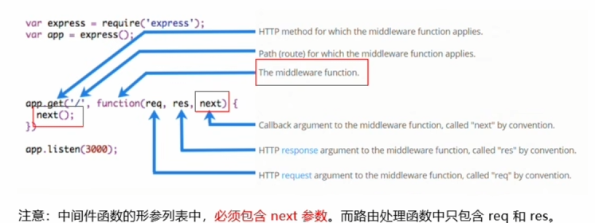

定义中间件函数：
```js
const mw = function(req, res, next){
  console.log("自定义中间件")
  // 把流转关系转交给下一个中间件或路由
  next()
}

// 全局生效的中间件
app.use(mw)
```

多个中间件之间，共享一份req和res，基于这样的特性，可以在上游的中间件中，统一为req或res对象添加自定义的属性或方法，供下游的中间件或路由进行使用

可以用app.use()连续定义多个全局中间件，会按照中间件先后顺序依次进行调用
```js
app.use(function(req, res, next){
  console.log("中间件1")
  next()
})

app.use(function(req, res, next){
  console.log("中间件2")
  next()
})
```

局部生效中间件：
```js
const mw = function(req, res, next){
  console.log("自定义中间件")
  next()
}
// 中间件只在当前路由中生效
app.get("/", mw, function(req, res){
  res.send("Home page")
})

// 多个局部中间件
/*app.get("/", mw1, mw2, ... function(req, res){
})
app.get("/", [mw1, mw2, ...] function(req, res){
})
*/
```

中间件注意事项：
- 一定要在路由之前注册中间件（错误级别中间件外）
- 客户端发送过来的请求。可以连续调用多个中间件
- 执行中间件业务代码后必须调用next()函数
- 调用next()后不要写额外代码
- 连续调用多个中间件时，req和res对象是共享的


中间件分类：
- 应用级别中间件
  - 通过app.use()/app.get()/app.port()，绑定到app实例上的中间件
- 路由级别中间件
  - 绑定到express.Router()实例上的中间件
  ```js
  const app = express()
  const router = express.Router()
  // 路由级别中间件
  router.use(function(req, res, next){
    next()
  })

  app.use("/", router)
  ```
- 错误级别中间件
  - 形参是(err, req, res, next)
  ```js
  app.get("/", function(req, res){
    throw new Error("server error")
    res.send("Home page")
  })

  // 错误级别中间件  必须注册在所有路由之后
  app.use(function(err, req, res, next){
    console.log(err.message)

    res.send("Error" + err.message)
  })
  ```
- express内置中间件
  - express.static 快速托管静态资源的内置中间件
  - express.json 解析json格式的请求体数据
  - express.urlencoded 解析utl-encoded格式的请求体数据
  ```js
  // 配置解析application/json格式数据的内置中间件
  app.use(express.json())

  // 配置解析application/x-www-form-urlencoded格式数据的内置中间件
  app.use(express.urlencoded({extended:false}))
  ```
- 第三方中间件
  - 例如body-parser这个第三方中间件
    - npm install body-parser
    - 调用require导入中间件
    - 调用app.use()注册中间件


### 4 与编写api服务器相关
web服务器和api服务器写法一样，只不过是一个返回html页面，一个返回数据

接口跨域问题：用CORS解决
cors是express一个第三方中间件
- npm install cors
- const cors = require("cors")
- 路由之前调用app.use(cors())

CORS 由一系列HTTP响应头组成，这些HTTP响应头决定浏览器是否阻止前端JS代码跨域获取资源。

浏览器的同源安全策略默认会阻止网页跨域获取资源，如果接口服务器配置了CORS相关的HTTP响应头，就可以解除浏览器端的跨域访问限制
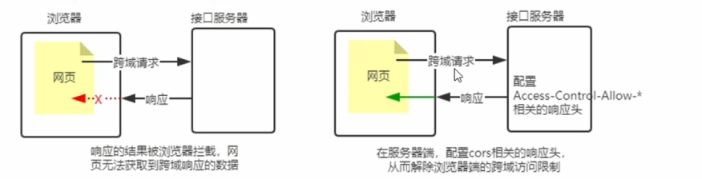


CORS响应头部
- Access-Control-Allow-Origin:<origin> | *
  - origin 指定允许范围该资源的外域url
  - e.g `res.setHeader('Access-Control-Allow-Origin', 'http://baidu.com')`
- Access-Control-Allow-Headers
  - 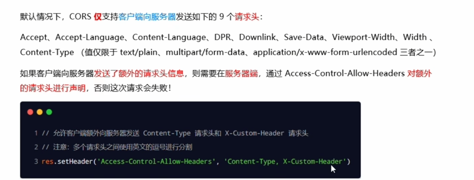
- Access-Control-Allow-Methods
  - 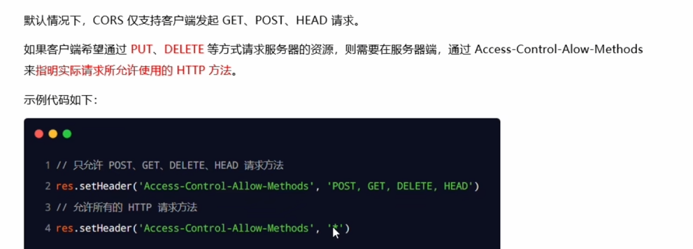

CORS请求分类（根据请求方式和请求头的不同）
- 简单请求
  - 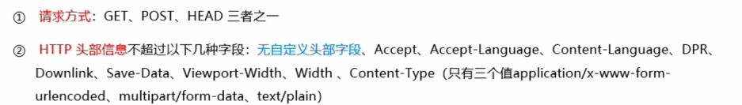
- 预检请求
  - 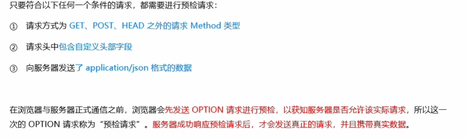

简单请求与预检请求区别：
- 简单请求是客户端与服务器之间只会发生一次请求
- 预检请求是客户端与服务器之间会发生两次请求，OPTION预检请求成功后才会发起真正的请求

### 5 JSONP

浏览器通过\<script\>标签的src属性，请求服务器上的数据，同时服务器返回一个函数的调用，这种请求数据的方式叫做JSONP

JSONP仅支持GET请求

项目中已经配置CORS跨域资源共享，为了防止冲突，必须在配置CORS中间件之前声明JSONP接口，否则JSONP接口会被处理成开启了CORS的接口
```js
// 先创建，这个接口不会被处理成CORS接口
app.get("api/jsonp", (req, res)=>{
  // 获取客户端发送过来的回调函数名字
  const funcName = req.query.callback
  // 得到要通过JSONP形式发送给客户端的数据
  const data = {name:"zs", age:22}
  // 根据前两步得到的数据，拼接出一个函数调用的字符串
  const scriptStr = `${funcName}(${JSON.stringify(data)})`
  // 把上一步拼接得到的字符串，响应给客户端的`<script>`标签进行解析
  res.send(scriptStr)
})

app.use(cors())

// 这个会被处理成CORS接口
app.get("api/get", (req, res)=>{

})
```

```html
<script>
  $('#btnJSONP').on('click', function(){
    $.ajax({
      type:"GET",
      url:"http://127.0.0.1/api/jsonp",
      dataType:"jsonp",
      success:function(res){
        console.log(res)
      }
    })
  })
</script>
```


## mysql模块
`npm install mysql2`

```js
const mysql = require("mysql2")

const db = mysql.createPool({
  host:"127.0.0.1",
  user:"root",
  password:"admin",
  database:"myDb"
})

// read
db.query("SELECT * FROM users", (err, results)=>{
  if(err)
    return console.log(err.message)
  console.log(results)
})
//create
const user = {username:"cedar", password:"123"}
/*const sqlStr = "INSERT INTO users (username, password) VALUES (?,?)"
db.query(sqlStr, [user.username, user.password], (err, results)=>{
  if(err)
    return console.log(err.message)
  if(results.affectedRows === 1)
    console.log("succeed")
})*/
const sqlStr = "INSERT INTO users SET ?"
db.query(sqlStr, user, (err, results)=>{
  if(err)
    return console.log(err.message)
  if(results.affectedRows === 1)
    console.log("succeed")
})
```
```js
// add 
const sqlStr = "INSERT INTO users (username, email, age) VALUES ?";
const users = [
  ['user1', 'user1@example.com', 25],
  ['user2', 'user2@example.com', 30],
  ['user3', 'user3@example.com', 28]
];

db.query(sqlStr, [users], (err, results) => {
  if(err) return console.log(err.message);
  console.log(`成功插入 ${results.affectedRows} 条数据`);
});
```
```js
// update
const user = {id:7. username:"aa", password:"12"}
/*const sqlStr = "UPDATE users SET username=?, password=? WHERE id=?"
db.query(sqlStr, [user.username, user.password, user.id], (err, results)=>{
  if(err)
    return console.log(err.message)
  if(results.affectedRows === 1)
    console.log("succeed")
})*/
const sqlStr = "UPDATE users SET ? WHERE id=?"
db.query(sqlStr, [user, user.id], (err, results)=>{
  if(err)
    return console.log(err.message)
  if(results.affectedRows === 1)
    console.log("succeed")
})

// delete
const sqlStr = "DELETE FROM users WHERE id=?"
db.query(sqlStr, 7, (err, results)=>{
  if(err)
    return console.log(err.message)
  if(results.affectedRows === 1)
    console.log("succeed")
})
```

## Web开发模式
主流web开发模式有两种：
- 基于服务器渲染
  - 服务器发送给客户端html页面，是在服务器通过字符串的拼接，动态生成的。因此客户端不需要使用Ajax/axios这样的技术额外请求页面的数据
  - 身份认证推荐使用session认证机制
- 基于前后端分离
  - 依赖ajax/axios技术，后端只负责提供api接口，前端负责调用接口
  - 身份认证推荐使用JWT认证机制


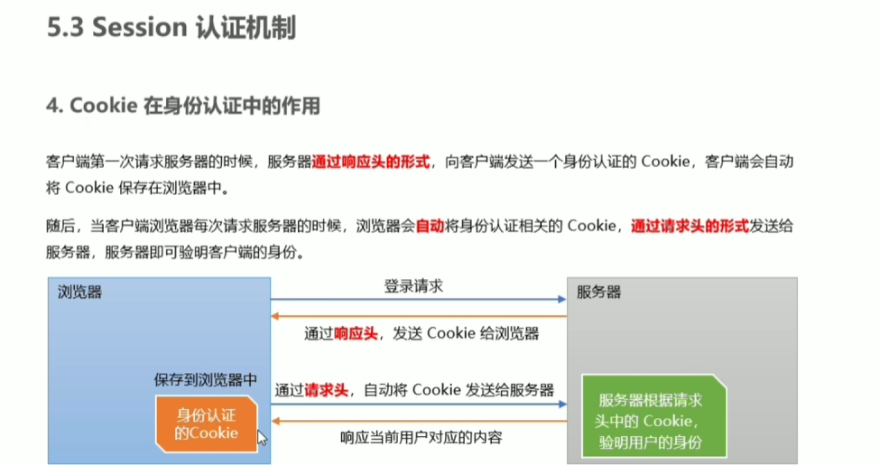
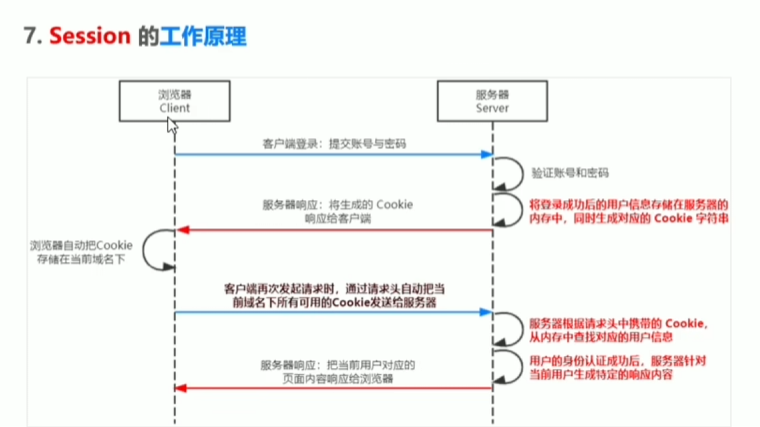

`npm install express-session`
```js
var session = require("express-session")

app.use(session({
  secret:"keyboard cat",
  resave:false, // 固定写法
  saveUninitialized:true //固定写法
}))

// 中间件配置后才可以用req.session访问和使用session对象
app.post("api/login", (req, res)=>{
  if(req.body.username !== "admin" || req.body.password !== "123"){
    return res.send("false login")
  }

  req.session.user = req.body
  req.session.islogin = true

  res.send("succeed")
})

app.get("api/username", (req, res)=>{
  if(!req.session.islogin)
    return res.send("fail")
  res.send(res.session.user.username)
})

app.post("api/logout",(req, res)=>{
  req.session.destroy()
  res.send({
    "succeed"
  })
})
```

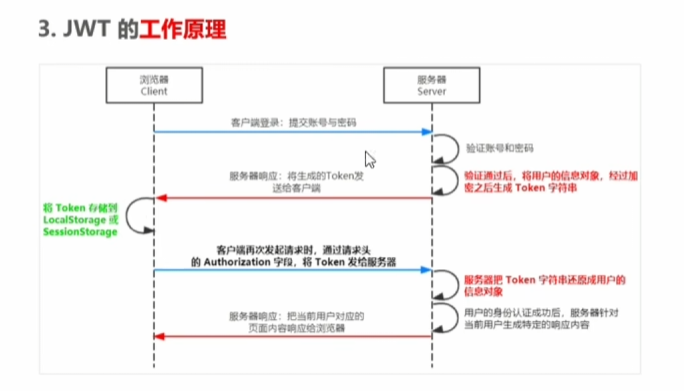
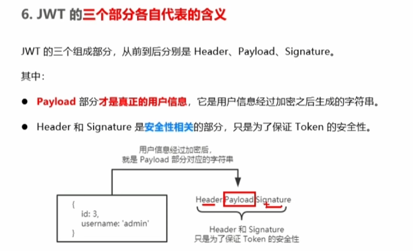

`npm install jsonwebtoken express-jwt`
- jsonwebtoken 生成JWT字符串
- express-jwt 将JWT字符串解析还原成JSON对象 
```js
const jwt = require("jsonwebtoken")
const expressJWT = require("express-jwt")

const secretKey = "aaabbbccc_xxx"

app.post("api/login", (req, res)=>{
  // 用户信息对象，加密密钥，配置对象（token有效期）
  res.send({
    token:jwt.sign({username:user.username}, secretKey, {exporesIn:"30s"})
  })
})

// 自动将客户端发送过来的token解析还原成json对象
// expressJWT({secret:secretKey} 解析token中间件
// .unless({path:[/^\/api\//]}) 指定哪些接口不需要访问权限
// 解析出来的信息挂载到req.user属性上
app.use(expressJWT({secret:secretKey}).unless({path:[/^\/api\//]}))
```

