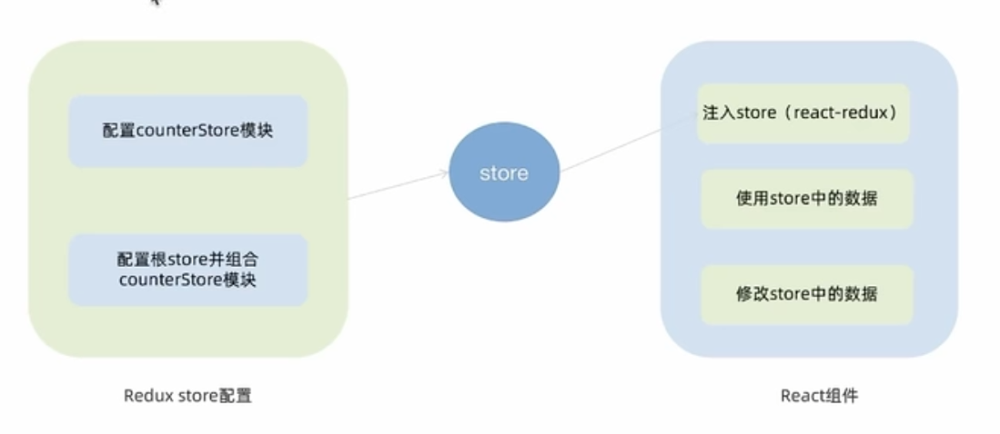
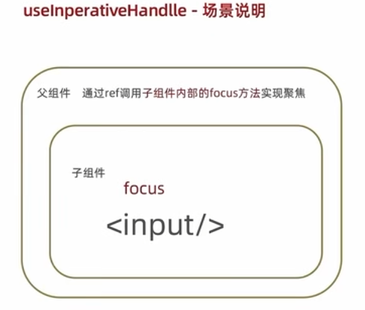

# React18
## 1、React基础
用于构建Web和原生交互界面的库

用create-react-app快熟搭建React开发环境的工具，底层由Webpack构建，封装配置细节，开箱即用
创建React项目方式：https://zh-hans.react.dev/learn/start-a-new-react-project

创建项目：npx create-react-app react-basic
- npx Node.js工具命令，查找并执行后续的包命令
- create-react-app 用于创建React项目
- react-basic 项目名称，自定义

执行项目：cd react-basic  npm start


app.js->index.js->index.html(root)

### JSX基础
是JavaScript和XML（HTML）的缩写，表示JS代码中编写HTML模板结构，它是React中编写UI模板的方式。

JSX不是标准js语法，是js的扩展，浏览器本身不能识别，需要通过解析工具（babel）解析后才能在浏览器中运行。

```js
const message = 'this is message'
function App(){
  return (
    <div>
      <h1>this is title</h1>
      {message}
    </div>
  )
}
```

jsx中通过{}识别js中的表达式。（if、switch、变量声明属于语句，不是表达式）
```js
// 项目的根组件，一切组件的根基
const count = 100;
function getName() {
  return 'jack';
}
function App() {
  return (
    <div className="App">
      This is app
      {/*使用引号传递字符串 */}
      {'this is message'}
      {/*识别js变量*/}
      {count}
      {/*函数调用*/}
      {getName()}
      {/*方法调用*/}
      {new Date().getDate()}
      {/*使用js对象*/}
      <div style={{ color: 'red' }}>哈哈</div>
    </div>
  );
}

export default App;
```


map方法：
```js
const list = [
  { id: 1, name: 'vue' },
  { id: 2, name: 'react' },
  { id: 3, name: 'angular' }
]
function App() {
  return (
    <div className="App">
      {/*渲染列表*/}
      <ul>
        {/*重复的元素需要绑定key 是React内部用的，用于提升性能的*/}
        {list.map(item => <li key={item.id}>{item.name}</li>)}
      </ul>
    </div>
  );
}
```

条件渲染：
- 可以通过 && ?: 实现基础的条件渲染，复杂的直接用函数
```js
return (<div>
  {flag && <span>this is span</span>}
  {loading ? <span>loading...</span> : <span>this is span</span>}
</div>)
```

### 事件、组件

事件绑定：
- on+事件名称 = {事件处理程序}
```js
function App() {
  const handleClick = () => {
    console.log('点击');
  }
  return (
    <div className="App">
      <button onClick={handleClick}>click me</button>
    </div>
  );
}
```
```js
function App() {
  const handleClick = (x, e) => {
    console.log('点击', x, e);
  }
  return (
    <div className="App">
      <button onClick={(e) => handleClick(3, e)}>click me</button>
    </div>
  );
}
```

组件：
- 
- 组件是首字母大写的函数，内部放组件逻辑和视图UI，渲染组件就是把组件当标签书写
```js
// 定义组件
function Button(){
  // 组件内部逻辑
  return <button>click me</button>
}

// 使用组件
function App(){
  return(
    // <Button/>
    <Button></Button>
  )
}
```
### useState
useState：
- 是一个React Hook (函数)，允许向组件添加一个状态变量，影响组件的渲染结果
- 和普通js变量不一样的是，状态变量一旦发生变化，组件的视图UI也会发生变化
```js
// useState是一个函数，返回值是一个数组
// 数组中的第一个参数是状态变量，第二个参数是set函数用来修改状态变量
// useState的参数将作为count的初始值

// useState实现计数器按钮
import { useState } from 'react'
function App() {
  // 调用useState添加一个状态变量
  // count 状态变量
  // setCount 修改状态变量的方法
  const [count, setCount] = useState(0)

  // 点击事件回调
  const handleClick = () => {
    // 用传入的新值修改count
    // 重新使用新的count渲染UI
    setCount(count + 1)
  }

  return (
    <div className="App">
      <button onClick={handleClick}>{count}</button>
    </div>
  );
}
```
- React中，状态被认为是只读的，即状态不可变，应该始终替换而不是修改它，直接修改状态不能引发视图更新
- 规则：
  - 对于对象类型的状态变量，应该始终传给set方法一个全新的对象来进行修改 set({...form, name:"john"})


```js
const [value, setValue] = useState('');

function App(){
  return(
    <input type="text" value={value} onChange={(e)=>setValue(e.target.value)}>
  )
}
```

### 基础样式

组件基础样式控制：
- 行内样式
- class类名控制
```html
// 行内1
<div style={{color:'red'}}>hello</div>
// 行内2
<script>
  const foo = {
    color:red
  }

  function App(){
    return(
      <div style={foo}>hello</div>
    )
  }
</script>

// 类名
<style>
  .foo{
    color:red;
  }  
</style>
<script>
  const foo = {
    color:red
  }

  function App(){
    return(
      <div className='foo'>hello</div>
    )
  }
</script>
```

classnames优化类名控制：
- classnames是一个js库，通过条件动态控制class类名的显示
```js
// 普通
<span className={`nav-item ${type === item.type && 'active'}`}>hello</span>

// 用classnames
// key是要控制的类名，value是条件，true时类名显示
<span className={classNames({'nav-item', {active:type === item.type}})}>hello</span>
```

### useRef 在React中获取DOM
React中获取DOM分两步：
```js
// 用useRef创建ref对象
const inputRef = useRef(null)
// 与jsx绑定
<input type="text" ref={inputRef}/>
// 在DOM可用时，通过inputRef.current拿到DOM对象（渲染完成后dom生成后才可用）
console.log(inputRef.current)
```

### 组件通信
父子通信：
- 父传子
  - 父组件传递数据，在子组件标签上绑定属性
  - 子组件接收数据，子组件通过props参数接收数据
```js
function Son(props){
  // props：对象，包含父组件传递过来的所有数据 {name:'name', age:18}
  // props可传递任意类型的数据，是只读对象
  return <div>{props.name}</div>
}


function App(){
  const name = "name";
  return(
    <div>
      <Son name={name} age={18}>
    </div>
  )
}
```

```js
// 特殊场景：把内容嵌套在子组件标签中，父组件会自动在名为children的prop属性中接收该内容
<Son>
  <span>span</span>
</Son>
// Son组件的props有{children:<span>span</span>}
```

- 子传父
  - 在子组件中调用父组件中的函数并传递参数
```js
function Son(props){
  const sonMsg = "son";
  return(
    <div>
      <button onClick={()=>{props.onGetMsg(sonMsg)}}>send</button>
    </div>
  )
}

function App(){
  const [msg, setMsg] = useState('')
  const getMsg = （msg）=>{
    console.log(msg)
    setMsg(msg)
  }
  return(
    {msg}
    <Son onGetMsg={getMsg}/>
  )
}
```

兄弟通信:
- 利用子传父，父传子实现兄弟通讯
```js
//A->B
function A({onGetName}){
  const name = "A"
  return (
    <div conClick={()=>onGetName(name)}>A</div>
  )
}

function B({name}){
  return (
    <div>B  {name}</div>
  )
}

function App(){
  const [name, setName] = useState()
  const getName = (name)=>{
    console.log(name)
    setName(name)
  }
  return (
    <div>
      App
      <A onGetName={getName}/>
      <B name={name}/>
    </div>
  )
}
```

Context实现跨层通信:
- 使用createContext方法创建一个上下文对象Ctx
- 在顶层组件中通过Ctx.Provider组件提供数据
- 在底层组件中通过useContext钩子函数获取数据

```js
import {createContext} from "react"
const MsgContext = createContext();

function A(){
  return(
    <div>
      A
      <B/>
    </div>
  )
}

function B(){
  const msg = useContext(MsgContext)
  return(
    <div>
      B
      {msg}
    </div>
  )
}

function App(){
  const msg = "app"
  return(
    <div>
      <MsgContext.Provider value={msg}>
        <A/>
      </MsgContext.Provider>
    </div>
  )
}
```

### useEffect
是一个react Hook函数，用于在组件中创建不是由事件引起而是由渲染本身引起的操作


```js
//useEffect(()=>{}, [])
// 参数1是副作用函数，函数内部放置要执行的操作
// 参数2在数组里放依赖项，不同依赖项一下第一个参数函数的执行，当是一个空数组时，副作用函数只会在组件渲染完毕之后执行一次

import { useEffect } from "react";
import { useState } from 'react'

const url = 'http://geek.itheima.net/v1_0/channels'

function App() {
  // 创建一个状态数据
  const [list, setList] = useState([])
  useEffect(() => {
    // 额外操作 获取频道列表
    async function getList() {
      const res = await fetch(url)
      const jsonRes = await res.json()
      console.log(jsonRes);
      setList(jsonRes.data.channels)
    }
    getList()
  }, [])
  return (
    <div className="App">
      {list.map(item => <li key={item.id}>{item.name}</li>)}
    </div>
  );
}
```


```js
//1 没有依赖项 初始+组件更新
function App() {
  const [count, setCount] = useState(0)
  useEffect(() => {
    console.log("副作用函数执行了");
  })
  return (
    <div className="App">
      <button onClick={() => setCount(count + 1)}>+{count}</button>
    </div>
  );
}

//2 传入空数组依赖 初始执行一次
useEffect(() => {
  console.log("副作用函数执行了");
}, [])

//3 传入特定依赖项 初始+依赖项变化时
useEffect(() => {
  console.log("副作用函数执行了");
}, [count])
```

清除副作用：
```js
// 最常见的执行时机是组件卸载时自动执行
useEffect(()=>{
  // 实现副作用
  return ()=>{
    // 清除副作用逻辑
  }
})


function Son() {
  // 渲染开启定时器
  useEffect(() => {
    const timer = setInterval(() => {
      console.log('定时器执行中...');
    }, 1000)

    // 清除副作用
    return () => {
      clearInterval(timer)
    }
  }, [])
  return <div>son</div>
}
function App() {
  const [show, setShow] = useState(true);
  return (
    <div className="App">
      {show && <Son />}
      <button onClick={() => setShow(false)}>卸载Son组件</button>
    </div>
  );
}
```

获取数据中，可以用json-server工具模拟接口服务，通过axios发送接口请求。


### 自定义Hook函数
use开头，可以用来实现逻辑的封装和复用
```js
// 普通函数：存在问题，当前组件耦合在一起，不方便复用
function App() {
  const [value, setValue] = useState(true)
  const toggle = () => setValue(!value)
  return (
    <div className="App">
      {value && <div>this is div</div>}
      <button onClick={toggle}>toggle</button>
    </div>
  );
}

// 解决：自定义hook
function useToggle() {
  const [value, setValue] = useState(true)
  const toggle = () => setValue(!value)
  // return 其他组件需要使用的状态和回调函数
  return {
    value,
    toggle
  }
}

function App() {
  const { value, toggle } = useToggle()
  return (
    <div className="App">
      {value && <div>this is div</div>}
      <button onClick={toggle}>toggle</button>
    </div>
  );
}
```

reactHook使用规则：
- 只能在组件中或其他自定义hook函数中调用
- 只能在组件的顶层调用，不能嵌套在if、for、其他函数中

<hr>
一个抽象原则：
- 智能组件：负责数据的获取
- UI组件：负责数据的渲染
<hr>

## 2、Redux
redux是react常用的集中状态管理工具，可以独立于框架运行


### redux单独使用：

```html
<button id="decrement">-</button>
<span id="count">0</span>
<button id="increment">+</button>

<script src="https://unpkg.com/redux@3.7.2/dist/redux.min.js"></script>

<script>
  // 1 定义reducer函数  作用：根据不同action对象，返回不同新的state
  // state:管理数据初始状态
  // action：对象，type标记当前要做什么样的修改
  function reducer(state = { count: 0 }, action) {
    // 数据不可变，所以返回的是新的而不是在原有的修改
    if (action.type === "INCREMENT") {
      return { count: state.count + 1 }
    }
    if (action.type === "DECREMENT") {
      return { count: state.count - 1 }
    }
    return state;
  }
  // 2 使用reducer函数生成store实例
  const store = Redux.createStore(reducer);

  // 3 通过store实例的subscribe订阅数据变化
  // 回调函数可以在每次state发生变化时自动执行
  store.subscribe(() => {
    console.log("state变化了");
  })

  // 4 通过store实例的dispatch函数提交action更改状态
  const inBtn = document.getElementById('increment')
  inBtn.addEventListener('click', () => {
    // 增
    store.dispatch({ type: "INCREMENT" })
    document.getElementById("count").innerText = store.getState().count
  })

  const dBtn = document.getElementById('decrement')
  dBtn.addEventListener('click', () => {
    // 减
    // { type: "DECREMENT" }就是一个action对象
    store.dispatch({ type: "DECREMENT" })
    document.getElementById("count").innerText = store.getState().count
  })

  // 5 通过store实例的getState方法获取最新状态更新到视图中
</script>
```


### redux在react中使用：
npm i @reduxjs/toolkit react-redux
- 需要安装两个插件：
  - Redux Toolkit (RTK)
    - 官方推荐编写Redux逻辑的方式，是一套工具集
    - 简化store配置方式
    - 内置immer支持可变式状态修改
    - 内置thunk更好的异步创建
  - react-redux
    - 

store目录设计：
- 通常集中状态管理的部分都会单独创建一个单独的store目录
- 应用通常由多个子store模块，创建一个modules目录，写业务分类的子store
- store中的入口文件index.js作用是组合modules中所有子模块，并导出store




1、使用react toolkit创建counterStore
```js
// counterStore.js

import { createSlice } from "@reduxjs/toolkit";

const counterStore = createSlice({
  // 定义state
  name: 'counter',
  initialState: {
    // 初始化state
    count: 0
  },
  // 编写修改数据的方法 同步方法 支持直接修改
  reducers: {
    inscrement(state) {
      state.count++
    },
    decrement(state) {
      state.count--
    }
  }
})

// 解构出actionCreater函数
const { inscrement, decrement } = counterStore.actions

// 获取reducer
const reducer = counterStore.reducer

// 按需导出的凡是导出actionCreater
export { inscrement, decrement }
// 以默认导出方式导出reducer
export default reducer
```
2、配置根store  为了统一管理
```js
// index.js

import { configureStore } from "@reduxjs/toolkit";
// 导入子模块reducer
import counterReducer from "./modules/counterStore"

const store = configureStore({
  reducer:{
    counter:counterReducer
  }
})

export default store;
```

3、为react注入store
```js
// 项目的index.js

import { Provider } from 'react-redux';
import store from './store';

const root = ReactDOM.createRoot(document.getElementById('root'));
root.render(
  <React.StrictMode>
  // 注入store
    <Provider store={store}>
      <App />
    </Provider>
  </React.StrictMode>
);
```
4、react组件中使用store中的数据：
需要用到钩子函数：useSelector,把store中的数据映射到组件中
```js
// App.js

import { useSelector } from "react-redux";


function App() {
  const { count } = useSelector(state => state.counter)
  return (
    <div className="App">
      {count}
    </div>
  );
}

export default App;
```

5、组件修改store中的数据
需要useDispatch，作用是生成提交action对象的dispatch函数
```js
// App.jd

import { useDispatch, useSelector } from "react-redux";
import { descrement, inscrement } from "./store/modules/counterStore";
// 导入actionCreater


function App() {
  const { count } = useSelector(state => state.counter)
  const dispatch = useDispatch()
  return (
    <div className="App">
      <button onClick={() => dispatch(inscrement())}>+</button>
      {count}
      <button onClick={() => dispatch(descrement())}>-</button>
    </div>
  );
}

export default App;
```

传参：
```js
// counterStore
  reducers: {
    ...
    addToNum(state, action) {
      state.count += action.payload
    }
  }

// App.js
<button onClick={() => dispatch(addToNum(10))}>add 10</button>
```

### 异步状态操作


- 创建store的写法不变，配置好同步修改状态的方法
- 单独封装一个函数，在函数内部return一个新函数，新函数中
  - 封装异步请求获取数据
  - 调用同步actionCreater传入异步数据生成一个action对象，使用dispatch提交
- 组件中dispatch的写法保持不变
```js
// channel.js
// 创建store的写法不变，配置好同步修改状态的方法
const { createSlice } = require("@reduxjs/toolkit");

const channelStore = createSlice({
  name: 'channel',
  initialState: {
    channelList: []
  },
  reducers: {
    setChannels(state, action) {
      state.channelList = action.payload
    }
  }
})

// 异步请求部分
const {setChannels} = channelStore.actions
const fetchChannelList=()=>{
  return async (dispatch)=>{
    const res = await axios.get("http://geek.itheima.net/v1_0/channels")
    dispatch(setChannels(res.data.data.channels))
  }
}

export {fetchChannelList} 
const reducer = channelStore.reducer
export default reducer
```

```js
// index.js
import { configureStore } from "@reduxjs/toolkit";
// 导入子模块reducer
import counterReducer from "./modules/counterStore"
import channelReducer from "./modules/channelStore"

const store = configureStore({
  reducer: {
    counter: counterReducer,
    channel: channelReducer,
  }
})

export default store;
```

使用：
```js
// App.js
const { channelList } = useSelector(state => state.channel)
const dispatch = useDispatch()
// 使用useEffect触发异步请求执行
useEffect(() => {
  dispatch(fetchChannelList())
}, [dispatch])


function App() {
  const { channelList } = useSelector(state => state.channel)
  const dispatch = useDispatch()
  // 使用useEffect触发异步请求执行
  useEffect(() => {
    dispatch(fetchChannelList())
  }, [dispatch])
  return (
    <div className="App">
      <ul>
        {channelList.map(item => <li key={item.id}>{item.name}</li>)}
      </ul>
    </div>
  );
}
```

redux调试工具Devtools：https://developer.chrome.com/docs/devtools/overview?hl=zh-cn


## 3、Router路由
npm i react-router-dom

简单实现：
```js
// index.js

// 创建Router实例对象并配置路由对应关系
const router = createBrowserRouter([
  {
    path: "/login",
    element: <div>登录页</div> // 支持组件也支持常规元素
  },
  {
    path: "/acticle",
    element: <div>文章页</div>
  }
])
const root = ReactDOM.createRoot(document.getElementById('root'));
root.render(
  <React.StrictMode>
    // 路由绑定
    <RouterProvider router={router}></RouterProvider>
  </React.StrictMode>
);
```

抽象路由模块：
- page/
- router 引入组件配置path-component
- 应用入口文件渲染RouterProvider


```js
// page/login/index.js
const Login = () => {
  return <div>登录</div>
}

export default Login;
```
```js
// router/index.js
import Login from "../page/login";
import Article from "../page/article";

import { createBrowserRouter } from "react-router-dom";

const router = createBrowserRouter([
  {
    path: "/login",
    element: <Login />
  },
  {
    path: "/article",
    element: <Article />
  }
])

export default router;
```
```js
// src/index.js
// 创建Router实例对象并配置路由对应关系
import router from './router';
const root = ReactDOM.createRoot(document.getElementById('root'));
root.render(
  <React.StrictMode>
    // 路由绑定
    <RouterProvider router={router}></RouterProvider>
  </React.StrictMode>
);

```

路由导航：
- 路由系统多个路由间需要进行路由调整，在跳转的同时可能需要传递参数进行通信
- 分类
  - 声明式导航
    - `<Link to='/article'>文章</Link>`
  - 编程式导航
    - 通过useNavigate钩子得到导航方法，然后通过调用方法以命令式的形式进行路由调整
```js
// 声明
import { Link } from "react-router-dom";

const Login = () => {
  return (
    <div>
      登录
      <Link to="/article">跳转</Link>
    </div>
  )
}

export default Login;

```

```js
// 编程
import { Link, useNavigate } from "react-router-dom";

const Login = () => {
  const navigate = useNavigate()
  return (
    <div>
      登录
      <Link to="/article">跳转</Link>
      <button onClick={() => navigate('/article')}>点击</button>
    </div>
  )
}

export default Login;
```

导航传参：
- searchParams 传参
- params传参

```js
//searchParams
// src/index.js  set
navigate('/article?id=100&name=jack')
// article/index.js   get
const [params] = useSearchParams()
let id = params.get('id')
```
```js
// params
// set
createBrowserRouter([
  {
    path:"/article/:id"
    ...
  }
])
navigate('article/1001')
// get
const params = useParams()
let id = params.id
```

嵌套路由：
- 
- 步骤
  - 使用children属性配置路由嵌套关系
  - 使用`<Outlet/>`组件配置二级路由渲染位置
```js
// 1
{
  path:"/",
  element:<Layout/>,
  children:[
    {
      path:'board',
      element:<Board/>
    },
    {
      path:'about',
      element:<About/>
    }
  ]
}
// 2
const Layout = () =>{
  return(
    return(
      <div>
        <div>一级路由Layout组件页</div>
        <Link to="/board">面板</Link>
        <Link to="/about">关于</Link>
        // 二级路由出口
        <Outlet/>
      </div>
    )
  )
}
```


默认二级路由：
- 访问的是一级路由时，默认二级路由组件可以得到渲染
- 在二级路由的位置去掉path，设置index属性为true

```js
children:[
  {
    index:true
    element:<Board/>
  }
]

<Link to="/">面板</Link>
```

404路由配置：
- 浏览器输入url路径在整个路由配置中找不到，可以用404兜底
- 步骤
  - 准备NotFound组件
  - 在路由表数组末尾，以*号作为路由path配置路由
```js
{
  path:'*',
  element:<NotFound/>
}
```

两种路由模式：
- 


开发时的路径解析配置：
- 
- 

ant Design Mobile:https://mobile.ant.design/zh/components/tab-bar


- useMemo() 数据二次处理，记忆缓存
- lodash 数据逻辑处理

## 4、打包
打包命令：npm run build

本地预览：
npm i -g serve
serve -s ./build

打包优化：路由懒加载：路由的js资源只有在被访问时才会动态获取，目的是优化项目首次打开时间

配置：
- 把路由修改为由react提供的lazy函数进行动态导入
- 使用react内置的Suspense组件包裹路由中element选项对应的组件

## 5、基础拓展
### useReducer
与useState作用类似，用来管理相对复杂的状态数据

基础用法：
```js
// 定义一个reducer函数
function reducer(state, action){
  switch(action.type){
    case 'INC':
      return state +1
    case 'DEX':
      return state -1
    case 'SET':
      return action.payload
    default:
      return state
  }
}

// 组件中调用useReducer,传入reducer函数和状态初始值
const [state dispatch] = useReducer(reducer, 0)

// 事件发送时，通过dispatch函数分派一个action对象
dispatch({type:"SET", payload:100})
```

### useMemo
在组件每次重新渲染的时候缓存计算的结果
跟useEffect类似，不过useEffect在初始化的时候就会执行一次，而且useEffect是获取数据，而useMemo是计算后缓存数据

消耗非常大的计算需要用到，计算小的没必要

```js
useMemo(()=>{
// 根据count1返回计算结果
}, [count1]) // 只有count1发生变化的时候才会重新计算
```

### React.memo
react组件默认的渲染机制：只要父组件重新渲染，子组件就会跟着重新渲染

react.memo运行组件在Props没有改变的情况下跳过渲染
```js
// memo进行缓存 只有props发生变化的时候才会重新渲染
const MemoSon = memo(
  function Son(count){
  console.log("子组件")
  return <div>son</div>
}
)


function App(){
  const [count, setCount] = useState(0);
  return (
    <div className="App">
      <button onClick={()=>setCount(count +1)}>+{count}</button>
      {/*<Son />*/}
      <MemoSon count={count} /> {/*count发生变化时才会重新渲染*/}
    </div>
  )
}
```

props的比较机制：用memo缓存组件后，react会对每一个prop使用Object.is比较新值和老值，返回true表示没有变化
- props是简单类型
  - Object.is(3,3)=>true 没有变化
- props是引用类型（对象/数组）
  - Object.is([],[])=>false 有变化，react值更新引用是否变化
  - 为了保证引用稳定，可以使用useMemo组件渲染的过程中缓存一个值


### useCallback 
在组件多次重新渲染的时候缓存函数，也就是引用稳定
```js
const Input = memo(function Inpit ({onChange})){
  console.log("子组件");
  return <input type="text" conChange={(e)=>onChange(e.target.value)} />
}

function App(){
  const changeHandler = useCallback((value)=>console.log(value), []) // 这样点击button的时候就不会重新渲染Input了

  const [count, setCount] = useState(0)
  
  return (
    <div className="App">
      <Input onChange={changeHandler} />
       <button onClick={()=>setCount(count +1)}>{count}</button>
    </div>
  )
}
```

### React.forwardRef
使用ref暴露DOM节点给父组件 （获取子组件里的DOM元素）


```js
function Son(){
  return <input type="text" />
}

const ForwardSon = forwardRef((props, ref)=>{
  return <input type="text"  ref={ref}/>
})

function App(){
  const sonRef = useRef(null)
  const showRef = ()=>{
    console.log(sonRef)
    sonRef.current.focus()
  }
  return(
    <>
      {/*<Son ref={sonRef}/>*/}
      <ForwardSon ref={sonRef}/>
      <Button onClick={showRef}>focus</Button>
    </>
  )
}
```

### useInperativeHandle
通过ref暴露子组件中的方法（获取子组件中的方法）



```js
const ForwardSon = forwardRef((props, ref)=>{
  // 实现聚焦逻辑
  const inputRef = useRef(null)
  const focusHandler = ()=>{
    inputRef.current.focus()
  }

  // 把聚焦方法暴露出去
  useImperativeHandle(ref, ()=>{
    return{
      // 暴露的方法
      focusHandler
    }
  })
  return <input type="text"  ref={inputRef}/>
})

function App(){
  const sonRef = useRef(null)
  const focusHandler = ()=>{
    console.log(sonRef.current)
    sonRef.current.focusHandler()
  }
  return(
    <>
      <ForwardSon ref={sonRef}/>
      <Button onClick={focusHandler}>focus</Button>
    </>
  )
}
```

### Class API (了解， 不再推荐)
类组件基础结果：通过Js中的类组织组件的代码
- 通过类属性state定义状态数据
- 通过setState方法修改状态数据
- 通过render写UI模板

```js
class Counter extends Component {
  // 编写组件逻辑代码
  // 定义状态变量
  state = {
    count:0
  }

  // 定义事件回调修改状态数据
  setCount = ()=>{
    this.setState({
      count:this.state.count +1
    })
  }

  render(){
    return <button onClick={this.setCount}>{this.state.count}</button>
  }
}

function App(){
  return (
    <>
      <Counter />
    </>
  )
}
```

类组件的生命周期函数


```js
class Son extends Component{
  // 声明周期函数
  // 组件渲染完毕执行一次 发送网络请求
  componentDidMount(){
    console.log("组件渲染完毕，请求发送起来")
    // 开启定时器
    this.timer = setInterval(()=>{
      console.log("定时器进行中")
    }, 1000)
  }

  // 组件卸载的时候自动执行 副作用清理的工作 
  componentWillUnmount(){
    console.log("组件Son被卸载了")
    // 清除定时器
    clearInterval(this.timer)
  }
  render(){
    return <div> son </div>
  }
}

function App(){
  const [show, setShow] = useState(true);
  return (
    <>
      {show && <Son />}
      <button onClick={()=>setShow(false)}>unmount</button>
    </>
  )
}
```

类组件的组件通信：
类组件和Hooks编写的组件通信思想上完全一致
- 父传子：通过prop绑定数据
- 子传父：通过prop绑定父组件中的函数，子组件调用
- 兄弟通信：状态提升

```js
class Son extends Component{
  render(){
    // 使用this.props.msg获取父组件传来的信息
    return (
      <>
        <div>子组件：{this.props.msg}</div>
        <button conClock={()=>this.props.onGetSonMsg("this is son msg")}>sendMsgToParent</button>
      </>
    )
  }
}

class Parent extends Component{
  state = {
    msg:"this is parent msg"
  }

  getSonMsg = (sonMsg)=>{
    console.log(sonMsg)
  }

  render(){
    return (
      <div>
        父组件
        <Son msg={this.state.msg} onGetSonMsg={this.getSonMsg}/>
      </div>
    )
  }
}

function App(){
  return (
    <>
      <Parent />
    </>
  )
}
```

### zustand 极简的状态管理工具


npm i zustand

```js
import {create} from 'zustand'
// 创建store  useStore是一个方法
// set是一个方法，专门用来修改数据的
// 语法1：set接收的参数是函数，需要用到老数据的场景
// 语法2：set接收的参数是对象，不需要用到老数据的场景
const useStore = create((set)=>{
  return {
    // 定义状态数据
    count:0,
    // 定义修改状态数据的方法
    inc:()=>{
      set((state)=>{
        count:state.count + 1
      })
      //set({count:100})
    }
  }
})

// 绑定store到组件
function App(){
  const {count, inc} = useStore() // 返回对象
  return (
    <>
      <button onClick={inc}>{count}</button>
    </>
  )
}
```

zustand异步支持：
- 直接在函数中写异步逻辑，最后只需要调用set方法传入新状态
```js
const useStore = create((set)=>{
  return {
    // 定义状态数据
    count:0,
    // 定义修改状态数据的方法
    inc:()=>{
      set((state)=>{
        count:state.count + 1
      })
    },
    channelList:[]
    fetchGetList:async ()=>{
      const res = await fetch("url")
      const jsonRes = await res.json()
      set({
        channelList:jsonRes.data.channels
      })
    }
  }
})

function App(){
  const {count, inc, fetchGetList, channelList} = useStore() // 返回对象

  useEffect(()=>{
    fetchGetList()
  }, [fetchGetList])
  return (
    <>
      <button onClick={inc}>{count}</button>
      <ul>
        {
          channelList.map(item=><li key={item.id}>{item.name}</li>)
        }
      </ul>
    </>
  )
}
```

zustand切片模式：
- 当个store比较大的时候，可以采用切片模式进行模块拆分组合，类似与模块化


```js
const createCounterStore = (set)=>{

}

const createChannelStore = (set)=>{

}

// 组合切片
const useStore = create((...a)=>{
  return{
    ...createCounterStore(...a),
    ...createChannelStore(...a)
  }
})
```
## 6、React+TS
搭建环境借助vite:https://cn.vite.dev/guide/

`npm create vite@latest react-ts-pro -- --template react-ts`
`npm i`
`npm install vite`

### useState
- 自动推导:通常React会工具传入us额State的默认值自动推导类型，不需要显示标注类型
- 传递泛型参数：useState本身是一个泛型参数，可以传入具体的自定义类型
- 初始值为null：不知道状态初始值是什么，将useState初始值设置为null，可以通过具体类型联合null做显示注解

```tsx
type User = {
  name:string
  age:number
}
//const [user, setUser] = useState<User>({name:"jack", age:18})

const [user, setUser] = useState<User>(()=>{
  return {
    name:"jack",
    age:18
  }
})

/*const changeUser = () =>{
  setUser({
    name:"jack",
    age:18
  })
}*/

const changeUser = () =>{
  setUser(()=>({
    name:"jack",
    age:18
  }))
}

```

```tsx
// 限制useState函数参数初始值可以是User或null， setUser函数的参数类型可以是User或null
const [user, setUser] = useState<User | null>(null)
```


### props
为组件prop添加类型，本质是给函数的参数做类型注解，可以使用type对象类型或interface接口做注解 

```tsx
type Props = {
  className:string
}
// Button组件只能传入名称为className的props参数，类型为string，且必填
function Button(props:Props){
  const {className} = props
  return <button class={className}>click me</button>
}
```

为children添加类型：
children支持多种不同类型数据的传入，需要通过一个内置的ReactNode类型做注解
```tsx
// children可以是多种类型：React.ReactElement, string, number, React.ReactFragment, React.ReactPortal, boolean, null, undefined
type Props = {
  className:string
  children:React.ReactNode
}

function Button(props:Props){
  const {className, children} = props
  return <button class={className}>{children}</button>
}

// click me这个文案会当成参数传到children
// <span>span</span>也会传到children
function App(){
  return (
    <>
      <Button className="test">click me</Button>
      <Button className="test">
        <span>
          span
        </span>
      </Button>
    </>
  )
}
```

事件prop添加类型：
组件经常执行类型为函数的Prop实现子传父，这类prop重点在于函数参数类型的注解

```tsx
type Props = {
  onGetMsg?:(msg:string)=>void
}

function Son(props:Props){
  const {onGetMsg} = props
  const clickHandler =()=>{
    onGetMsg?.("this is msg")
  }
  return <button coClick={clickHandler}>sendMsg</button>
}

function App(){
  return(
    <>
      <Son onGetMsg={(msg) => console.log(msg)}/>
    </>
  )
}
```

### useRef
可以直接把要获取的dom元素的类型当成泛型参数传递给useRef,可以推导出current属性的类型
```tsx
// 只能绑定Input的dom元素
const domRef = useRef<HTMLInputElement>(null)

useEffect(()=>{
  domRef.current?.focus()
},[])

function App(){
  return(
    <>
      <input ref={domRef}/>
    </>
  )
}
```

应用稳定的存储器：
把useRef当成引用稳定的存储器，使用的场景可以通过泛型传入联合类型来做。
```jsx
// 定时器管理
function App(){
  const domRef = useRef<HTMLInputElement>(null)
  const timerId = useRef<number | undefind>(undefind)

  useEffect(()=>{
    domRef.curent?.focus()

    timerId.current = setInterval(()=>{
      console.log("123")
    }. 1000)

    return ()=>clearInterval(timerId.current)
  }, [])

  return (
    <>
      <input ref={domRef} />
    </>
  )
}
```