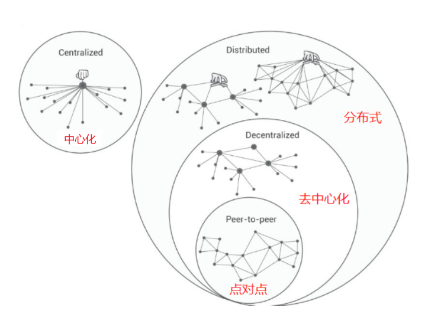

# 资料合集
## 查漏补缺
### 去中心化
在一个分布有众多节点的系统中，每个节点都具有高度自治的特征。节点之间彼此可以自由连接，形成新的连接单元。任何一个节点都可能成为阶段性的中心，但不具备强制性的中心控制功能。

### Web1、Web2、Web3
是对于互联网发展的阶段划分。

## 参考资料
- 区块链100问：https://tech.sina.com.cn/zt_d/blockchain_100/
- 《自学区块链：原理、技术及应用》：https://weread.qq.com/web/bookDetail/f1832a507193eee0f18ddfd
- 区块链技术指南：https://yeasy.gitbook.io/blockchain_guide
- 去中心化与分布式区别：https://zhuanlan.zhihu.com/p/46201855
- 区块链分类：https://www.okx.com/zh-hans/learn/classification-of-blockchain-cn
- 跨链技术：https://www.okx.com/zh-hans/learn/classification-of-blockchain-cn
- 以太坊开发文档：https://ethereum.org/zh/developers/docs/
- 区块链相关dotnet项目：https://easy-dotnet.com/pages/blockchain/
- 以太坊为dotnet提供的开源库：https://nethereum.com/#fh5co-examples
- solidity文档：https://docs.soliditylang.org/en/develop/types.html
- remix界面介绍：https://juejin.cn/post/7046041881913851912
- 区块链资源合集：
    - https://github.com/chaseSpace/learn_blockchain/tree/main
    - https://github.com/farmer08/doc/tree/master
- geth：https://geth.ethereum.org/docs
- teku文档：https://docs.teku.consensys.io/get-started/connect/mainnet#2-start-the-execution-client
- 以太坊技术与实现：https://learnblockchain.cn/books/geth/part1/genesis.html
- 卡尔达诺教育网站：https://learn.academy.cardanofoundation.org/app/learn/
- 卡尔达诺入门必备：https://liuchengxu.gitbook.io/blockchain/cardano/cardano-introduction
- 卡尔达诺官网文档：https://docs.cardano.org/
- 卡尔达诺开发者门户：https://developers.cardano.org/home/
- Ouroboros的理解：https://iohk.io/en/blog/posts/2022/06/03/from-classic-to-chronos-the-implementations-of-ouroboros-explained/

