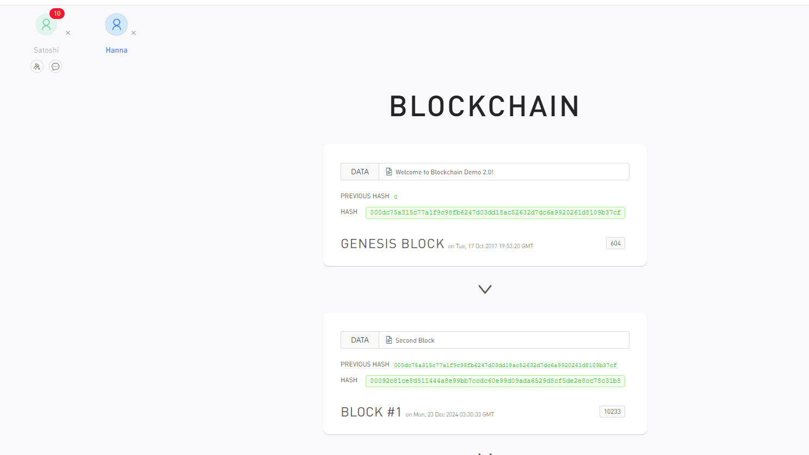
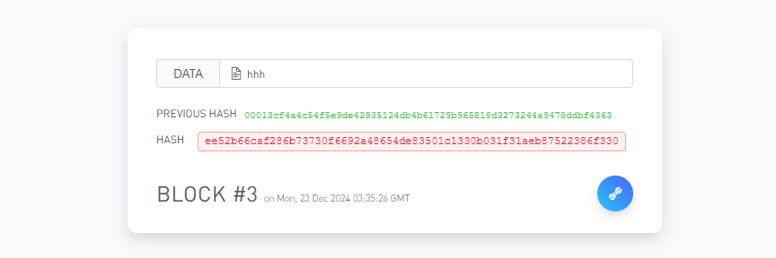
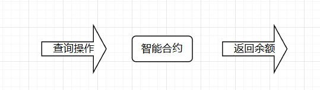

# 区块链入门知识点汇总
## 1、什么是区块链
### 1.1 区块链概念
区块链是由密码学与共识机制等技术与存储庞大交易资料链的点对点网络系统。是一种去中心化、分布式且通常是公共的数字分类账。

构成区块链的区块是基于密码学生成的，每一个区块包含前一个区块的哈希值、对应的时间戳记录以及交易数据等信息。

说人话就是是一个包含交易记录的分布式系统，类似于账本，而区块相当于流水，每一块都包含上一块的信息。狭义上看，区块链也被成为“分布式账本系统”。广义上，区块链是一个统称，除了基于区块链结构的分布式账本系统，还包括共识机制、智能合约、点对点网络、自治社区等一系列和分布式账本相关的功能。可以看做是很多个技术的组合。

学习区块链之前总以为 比特币=区块链 ，但实际并不是，区块链是一种技术，而比特币是使用这种技术得到的成品。除了比特币，还有很多基于区块链技术的应用。比特币是区块链最经典的应用，所以以下很多例子都是以比特币出发去理解。

区块链是有成本的，区块链中每一个“区块”都需要用大量运算来解决。

### 1.2 区块概念
跟它的名字一样，区块就是区块链的组成单元。

区块是由一系列特征值和一段时间内的交易记录组成的一个数据结构。

可以通过 https://www.oklink.com/zh-hans/btc/block-list 查看比特币结构。

区块结构：
- 区块头：80个字节组成
    - 版本号（version）：4字节
    - 父区块哈希值(Previous Block Hash)：32字节
    - Merkle根(Merkle Root) ：32字节
        - 表示当前区块中所有交易信息的Merkle树根哈希值，用于保证区块中交易信息的完整性
    - 时间戳(Timestamp)：4字节
    - 难度目标(Difficulty Target)：4字节
        - 表示当前区块的哈希值必须满足的难度目标，这个值是根据当前网络计算出来的，用于保证区块链的安全性和可靠性
    - 随机数(Nonce)：4字节
        - 用于计算区块哈希值的随机数，通过不断尝试不同的随机数以满足难度目标为目的，从而保证区块的唯一性和完整性
- 区块体：可以包括任何内容
    - 交易数量
    - 区块大小
    - 长度不定的交易记录

区块的特点：
- 由计算机通过加密算法生成
    - 如果成功生成一个有效的区块，该结点就能获得一定奖励（加密数字货币）。这一过程被称为“挖矿”，执行操作的计算机被称为“矿机”，用矿机挖矿的人被称为“矿工”
- 若区块是有效的，该区块的哈希值必须满足区块头中特征值相加生成的哈希值符合一定格式
    - 由于哈希值随输入不同而不同，所以计算机要不断尝试改变区块头的Nonce值直到最终生成的哈希值满足条件才算生成一个有效区块。（寻找Nonce值生成有效区块的过程称为**工作量证明**）

**创世区块**：区块链中的第一个区块

### 1.3 区块链运行原理
1、构成区块链的去中心化网络中的第一个结点初始化，并生成区块链中的创世区块
2、通过“挖矿”生成新区块添加到区块链中
3、如果有新结点加入到去中心化网络，那么会先同步一份最新的区块链数据
4、每个结点生成的区块都会向网络中的其他结点进行广播
5、其他结点收到这个结点的广播后判断自己是否已经收到过这个区块
    - 已收到忽略
    - 未收到则先验证这个区块的有效性，有效区块会被收到广播的结点添加到自身结点区块链中

就是不同人各自有一个账本，有新人加入则先抄录一份账本，后续有交易记录到某个人账本中，这个人会广播通知拥有账本的人添加新的账本交易记录以保持账本数据一致性。

**模拟生成一个区块链**

模拟网站：https://blockchaindemo.io/

添加2个区块：

添加1个结点，新结点加入网络后就同步了区块链：

从一个结点中添加区块，可以看到另外的结点也同步了区块。如果改变data，可以看到hash无效。

当一个区块链节点掌握整个区块链51%以上的计算能力时，它可以重写整个区块链。基于这个原因，区块链中的计算能力过度集中会很危险。只有一个庞大且均匀分布的区块链才比较安全。

## 2、区块链的技术构成与逻辑架构
### 2.1 区块链技术构成
广义上说，区块链由分布式账本、共识机制、智能合约、去中心化网络等技术构成。

#### 2.1.1 共识机制
网络中各个结点根据共识机制达成共识，共同维护整个区块链网络。

把区块链网络比作一个公司，共识机制就是公司的kpi。公司根据kpi对员工进行奖惩。同理，区块链网络根据共识机制对链上规格结点进行奖惩。

不同的区块链项目可能使用不同的共识机制。

#### 2.1.2 智能合约
智能合约不是区块链必要组成，是区块链2.0后出现的技术。

智能合约相当于公司中的规章制度。区块链中的结点会依据智能合约进行工作。

#### 2.1.3 去中心化网络

### 2.2 区块链逻辑架构

#### 2.2.1 数据层
数据层是区块链逻辑架构最基础的一层，主要包括区块数据的存储、哈希值和Merkle树的计算以及链式结构的生成。

在比特币和以太坊中的存储功能选择的是LevelDB数据库（谷歌实现的高效键值数据库）。

数据层功能是把交易数据存储到区块中并将区块加入到数据链中。

#### 2.2.2 网络层
网络层主要包括P2P网络和共识算法两部分。

P2P网络（点对点网络/对等网络）根据去中心化程度的不同可以分为：
- 纯P2P网络
    - 结点同时作为客户端和服务端
    - 没有中心服务器
    - 没有中心路由服务器
- 杂P2P网络
    - 有一个中心服务器保存结点信息并对请求这些信息的客户端做出响应
    - 结点负责发布信息，让中心服务器知道哪些文件被共享，让需要的结点下载其可共享资源
- 混合P2P网络
    - 同时含有纯P2P合杂P2P的特点

 在区块链技术中，P2P网络作用是让网络中所有结点一起平等地参与维护，所以使用的是纯P2P网络。

 P2P网络中，各个结点需要对区块链中各个区块达成共识才能共同维护同一分布式账本，这个共识机制就是共识算法。

 常用共识算法：
 - 工作量证明机制（Proof of Work，PoW）
 - 权益证明机制（Proof of Stake，PoS）
 - 股份授权证明机制（Delegated Proof of Stake）
 
#### 2.2.3 合约层
合约层的功能使得区块链中的区块具有可编程性。

智能合约对区块链中的数据和事件按预先设定的逻辑进行处理。

#### 2.2.4 应用层
应用层泛指基于区块链技术并结合具体业务场景卡法的应用，包括加密数字货币钱包、交易所、去中心化应用等。

## 3、区块链分类
根据区块链开放程度：
- 公有链
    - 对外公开，任何人可以参与
- 联盟链
    - 写入、修改权限掌握在多个互信组织手中，被视为是部分去中心化的区块链
- 私有链
    - 数据的写入、修改权限仅在少数人/组织手中，属于私有机构单中心网络

**侧链和闪电网络：**

侧链实际上指遵守侧链协议的所有区块链。侧链协议是一个可以让比特币安全地从比特币主链转移到其他区块链，又可以从其他区块链安全地返回比特币主链的协议。本质是一种跨区块链解决方案。

闪电网络是为了提升交易性能。主要思路：将大量交易放到比特币区块链之外进行，只把关键环节放到链上进行确认。

## 4、区块链特点
- 去中心化
    - 网络上结点是平等的，没有中心服务器
- 去信任
    - 区块链中数据都是公开透明，交易数据通过加密技术进行验证和记录，无需第三方信任机构参与
- 集体维护
    - 由权威结点共同参与维护，不受少数结点控制
- 可靠的数据库
    - 区块链中每一个结点上的数据都是全网数据，单个结点退出或瘫痪不会影响整个系统
- 匿名性
    - 区块链上用一串唯一数字代表一个身份，使用数字签名进行身份认证，具有匿名特点

## 5、区块链发展历程
- 区块链1.0
    - 代表：比特币
- 区块链2.0
    - 可以在区块链上基于智能合约开发去中心化应用（DApp）
    - 代表：以太坊（开源的，支持智能合约的去中心化应用开发平台）
- 区块链3.0
    - 区块链有更广泛的应用

## 6、区块链经典应用
### 6.1 比特币
https://www.bitcoin.com/

加密数字货币的代表。

在比特币网络进行挖矿可以获取比特币。这种加密数字货币可以通过比特币网络或其他交易网站进行交易。可以用来购买电子产品或其他的加密数字货币兑换，也可以将比特币捐赠给其他人。

这个用到的场景还挺多，比如我需要一张虚拟信用卡，有些平台虚拟信用卡充钱需要用到USDC币种，那么我会从欧易钱包这个平台通过跟他人购买USDC充值到指定钱包中，然后再从钱包向虚拟信用卡充值。

### 6.2 以太坊
https://ethereum.org/zh/

智能合约鼻祖。

是一个开发平台，用于开发各种基于智能合约的去中心化应用（DAPP），以太坊的目的是要将区块链技术应用于加密数字货币以外的领域，比如社交、众筹、游戏等。

-----书中还有一些，不过暂时不需要了解，后续再补上------
