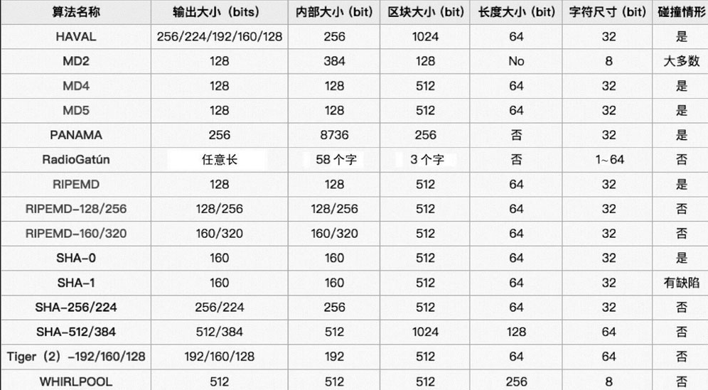

# 区块链中的密码学
## 1、哈希算法和哈希值
哈希算法是区块链技术的基础算法。

把区块链想象成一条长链，块与块之间用“钩子”连接，这个钩子就是由哈希算法（散列算法）生成的一个哈希值。

哈希算法能将任意长度的而精致字符串转换成较短字符串（哈希值）：h=hash(x)

哈希函数系列：
- MD
    - MD4
        - 输出值为128位，已被证明不够安全
    - MD5
        - 输入值以512位进行分组，输出值是128位，比MD4安全
- SHA
    - SHA1
        - 目前已被破解
    - SHA2（SHA224， SHA256， SHA384， SHA512）
        - SHA后面的数值是输出值长度，推荐SHA256

哈希算法特点：
- 单向性
- 确定下
- 抗碰撞
    - 两个哈希值相同，两个输入值可能是相同也可能是不同，不同的情况称为碰撞。好的哈希算法很难找到两段内容不同的明文使它们的哈希值一致（发生碰撞）。
- 抗篡改

哈希算法应用：
- 数据校验
- 哈希指针
    - 向数据存储位置及其位置数据的哈希值的指针，除了指示数据位置，还提供一种方法可以验证数据是否被篡改过。
- 数字摘要

## 2、区块链中的密码学知识
### 2.1 对称加密算法和非对称加密算法
密码学主要工作时对星系变换的研究，主要包括经典密码学和现代密码学两个部分。

经典密码学主要研究对称密码，研究信息在不可靠信道的保密传输，以及对信息篡改的检测。实现信息完整性。

现代密码学时非对称密码学，研究密钥在可验证不可靠信道的保密分发和数字签名及其提供的不可抵赖性。

### 2.2 椭圆曲线密码学（Elliptic curve cryptography，ECC）
一种建立公开密钥加密算法，基于椭圆曲线数学。

优势：
- 比其他方法使用更小密钥
- 可以定义群之间的双线性映射

缺点：
- 加密和解密的实现比其他机制花费的时间长

在比特币中，利用椭圆曲线密码学生成私钥，公钥和数字签名。

### 2.3 Merkle树（哈希树）
一种树形数据结构，叶结点以数据块的哈希值作为标签，其他结点以其子节点标签的加密哈希值作为标签。

Merkle树的特点：
- 一般是二叉树，也可以是多叉树
- 树的根结点只取决于数据，和其中的更新顺序无关。换个顺序进行更新，甚至重新计算树，并不会改变根结点
- 当区块链中的交易数据过多时，可以通过只保留Merkle树的根结点
- 提供了证明数据完整性和有效性的手段
- 只需要很少的内存和磁盘空间，并且很容易验证树的正确性
- Merkle树同步时在网络上只传输很少的数据

### 2.4 数字签名和数字证书
数字签名用于证实某项数字内容的完整性和来源，保证签名的有效性和不可抵赖性。使用了公钥密码学。

在传输的过程中，公钥可能会被替换或篡改。数字证书（Digital Certificate）是用来确保接收方拿到的确实是发送方的公钥，而不是被篡改过的。数字证书是由PKI体系中的证书中心（CA）机构颁发的。

