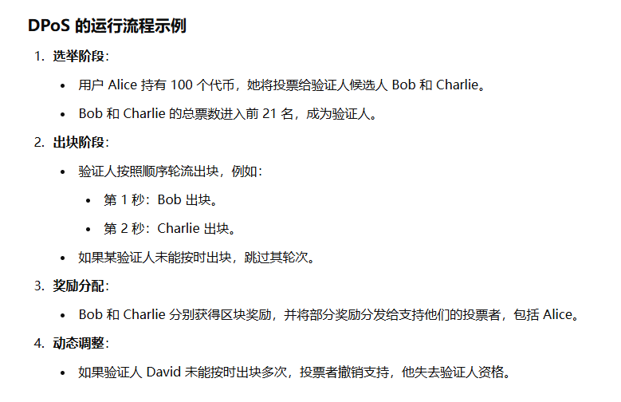
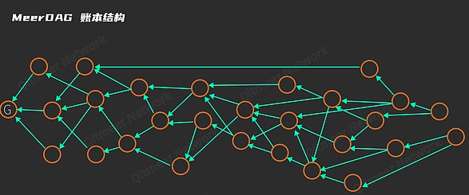
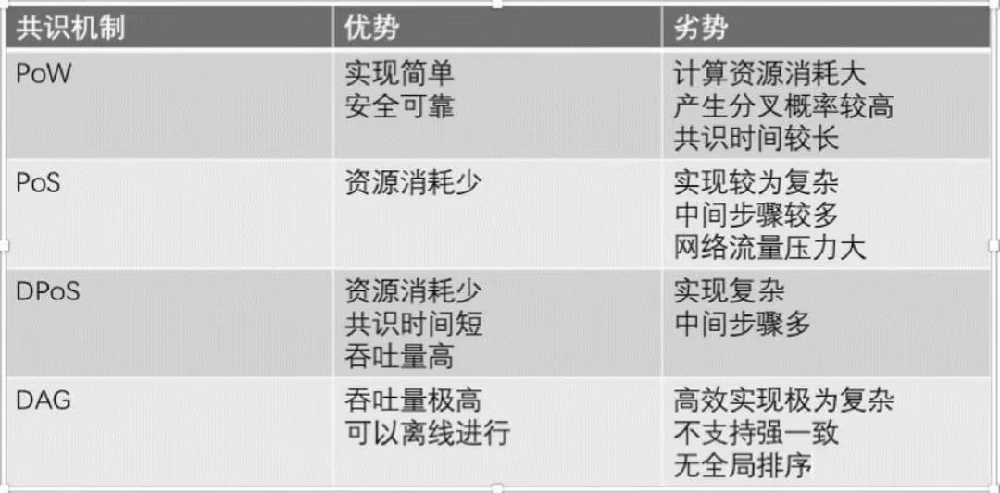
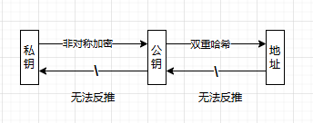
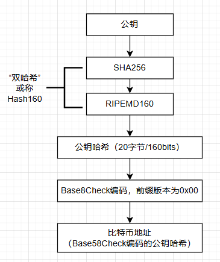
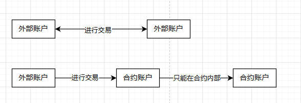
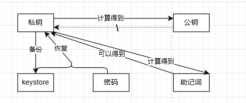

# 区块链核心机制
## 1、共识机制
区块链结点是平等的，所以需要一套制度维护系统的运作顺序和公平性。奖励提供资源维护区块链运行的使用者，惩罚危害区块链运行的恶意使用者。

这样的制度必须依赖某种方式来证明，是谁取得了一个区块链的记账权，可以获得生成这一个区块的奖励；又是谁意图进行破坏，就会受到一定的惩罚，这就是共识机制。

拜占庭将军问题，大致意思就是几个将军在不同地方大战，面临进攻还是决策的投票，将军派人将决定分发给其他将军。如果中途出现叛徒或者是决策信息被篡改就会出现一致协同遭到破坏。（大概是这个意思，具体故事可自行搜索）

在区块链之前，有两种解决方案：​“口头协议”​（又称为拜占庭容错算法）和“书面协议”（本质是引入了签名系统）​。

区块链中常见的共识机制：
- 工作量证明PoW
    - 代表项目：比特币
- 权益证明PoS
    - 代表项目：以太坊
- 委托权益证明DPoS
    - 代表项目：EOS项目
- 代理拜占庭容错算法DBFT
- 有向无环图DAG
    - 代表项目：IOTA项目

**记账权的分配是共识机制的核心任务**

### 1.1 PoW机制
工作量证明机制（Proof of Work，PoW）​，就是一份证明，用来确定完成了一定量的工作并可以因此获得一定的奖励。

比特币用的是PoW机制。

工作量证明工作原理：
- 取得一些公开的数据，并加上一个随机数（Nonce）
- 以数据和随机数作为输入值计算哈希值
- 检查生成的哈希值是否符合一定的条件，符合就记下这个随机数的值并退出，不符合则改变随机数的值才行计算，不断重复

可能需要十万多次才能得到一个符合条件的哈希值，这个计算任务目前除了暴力计算外还没有有效算法可以快速完成。但验证时一次就够了。这个设计需要付出大量的算力成本和电力成本。

优点：
- 因为消耗算力巨大，如果有人尝试恶意破坏，需要付出巨大经济成本
缺点：
- 只有第一个获取有效哈希值的结点能得到奖励，其他结点的计算会被浪费掉

比特币网络中，每生成一个区块获得的比特币数量不同，根据比特币网络设计，每个区块获得的比特币数量每四年减半。

一般谁算力强，谁最先解决问题并生成区块，获取建立概率就越大，当掌握超过整个区块链中一半算力时，洋葱理论上讲能控制整条链的走向，这就是所谓51%攻击的由来。小的区块链网络会有这种隐患。

### 1.2 PoS机制
权益证明机制（Proof of Stake，PoS）试图解决在PoW机制中大量资源被浪费的问题。PoS机制类似公司中的股东机制，拥有股份越多的人越容易获取权益。

PoS机制要求提供的是保证金（一定数量数字货币的拥有权）。

权益证明机制工作原理：
- 通过保证金确认一个合法的块成为新的区块
- 收益为保证金的利息和交易服务费

优点：
- 一定程度上缩短共识达成的时间，不再需要大量消耗能源挖矿

### 1.3 DPoS机制
股份授权证明机制（Delegated Proof of Stake，DPoS）与PoS机制基本原理相同，只是选举了若干代理人，由代理人执行验证和记账功能。

其实就是几个结点出币竞争记账权，然后选出一个代理人生成区块。

股份授权证明机制工作原理：
- 每个持币用户根据其持有的代币数量拥有投票权
- 投票选出一定数量的代表（通常称为验证人或见证人）负责出块
- 获取票数最多的前100位代表按既定时间表轮流产生区块
- 每名代表分配到一个时间段产生区块，所有代表将收到等同于一个平均水平的区块所含交易费的10%作为报酬（如果一段时间内的所有区块交易费总和是 1000，区块数量是 10，则平均每个区块的交易费是 100）

优点：
- 大幅缩小参与验证和记账结点的数量，可以达到秒级的共识验证

### 1.4 DAG机制
有向无环图（Direct Acyclic Graph，DAG），由有限个顶点和有向边组成，每条有向边都从一个顶点指向另一个顶点。从任意一个顶点触发都不能通过这些有向边回到原来的顶点。

DAG不用区块的概念，从基于打包这样的粗粒度层面提升到了基于交易的层面。

DAG账本结构是以交易为单位：

交易发起后，直接广播全网，跳过打包区块阶段，达到所谓的无区块链状态，省去了打包交易出块的时间。

## 2、账户、钱包和交易

### 2.1 账户
区块链技术中，账户是一个实体在区块链中代表自己的一串二进制数字。（账户不是结点，结点是用于记录区块，账户是用于做交易动作的）。在区块链中，不需要提供个人信息即可创建一个账户。

区块链中账户的地址是利用非对称加密算法从个人的私钥计算得到的。

#### 2.1.1 比特币账户
比特币账户是一个由数字和字母组成的字符串，任何人都可以通过这个字符串发送比特币，所以也成为比特币地址。（就跟充值虚拟信用卡一样，交易虚拟货币时是复制平台A的钱包的地址，这个就是账户了，然后在平台B兑换虚拟货币充值到平台A的钱包）。

比特币账户用来接收别人发送的比特币，并且可以通过用户的私钥确认其持有权限。

#### 2.1.2 以太坊账户
不同比特币账户的核心功能在单一的交易身份识别上。以太坊账户系统除了具有交易身份识别功能，还与数据及其操作之间有更为直接的联系。

以太坊网络中两种类型账户：
- 外部账户
    - 与比特币账户类似，也是公私钥生成的账户
- 合约账户
    - 智能合约的账户地址，创建合约时确定，由代码控制
    - 不可以自己发起一个交易，只有在接收到一个交易后，为了响应此交易而触发一个交易

### 2.2 钱包
一个钱包可以存放多个账户，本质上，钱包存放的是用户的密钥对。钱包中包含的是几个成对的私钥和公钥，用户用私钥签名交易，用公钥生成账户地址。

钱包包含以下内容：
- 私钥
    - 随机生成的一个字符串
- 公钥
    - 由私钥计算而来，与私钥成对（账户由公钥进一步计算得来）
- 助记词
    - 私钥是随机字符串，所以助记词的帮助记忆的，由特定算法将私钥转换成十多个常见英文单词，助记词相当于私钥
- keystore（私钥的一种文件存储格式）
    - 一串字符串，本质是加密后的私钥，通过keystore和密码可以得到私钥
- 密码

钱包类别：
- 按硬件设备
    - 电脑钱包
    - 手机钱包
    - 在线钱包
    - 硬件钱包
- 私钥存储方式
    - 冷钱包
    - 热钱包
- 数据维护方式
    - 全结点钱包
    - 轻钱包
    - 中心化钱包
        - 不依赖去中心化网络，只依赖自己的中心化服务器，中心化钱包不同步数据，所有数据均从自己的中心化服务器中获得，如交易所中使用的钱包

### 2.3 交易
区块链上的交易过程：发起交易请求->将交易广播到网络->交易确认->将交易添加到区块->区块添加到区块链->交易完成

交易过程：
1、某人发起交易，输入交易对象和交易数量，用私钥对交易进行签名
2、交易被广播到中心化网络，中心化网络中其他结点都知道这笔新生成的交易
3、其他结点收到这笔交易信息后开始验证交易的正确性
4、多个交易组成一个区块（挖矿过程）
5、新生成区块加入到一个区块链末端
6、交易完成

## 3、智能合约
是一种以信息化方式传播、验证或执行合同的计算机协议。允许在没有第三方的情况下进行可信交易，这些交易可追踪但不可逆转。

智能合约不只是一个可以自动执行的计算机程序，还是一个基于区块链的参与者。可以接收和存储价值，也可以向外发送信息和价值。

智能合约具体是指运行在可复制、共享的账本上的计算机应用程序，可以处理信息，接收、存储和发送价值的脚本。

智能合约特点：
- 不可篡改
- 分布式
- 自动触发
- 不依赖第三方
