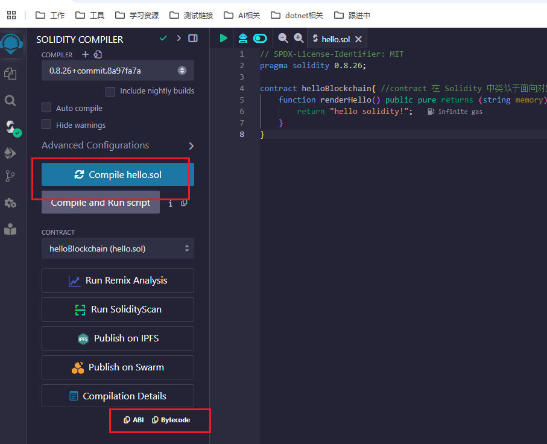

# 以太坊 Ethereum 
## 1、DApp
不同于传统App依赖中心服务器，DApp的运行依赖区块链以及在区块链上的智能合约。

当前DApp主要基于以太坊、EOS、Steem、TRON等区块链平台进行开发。DApp需要在具有钱包功能的环境中运行。比如基于以太坊开发的DApp

DApp由智能合约和用户界面组成。其中智能合约是运行在区块链上的代码，负责与区块链交互，UI是由HTML和JavaScript实现的前端页面，供用户进行操作。在以太坊中，用户界面可以通过Web3.js库对智能合约进行调用。


- Mist和Parity是支持DApp的钱包
- EVM是以太坊虚拟机，是以太坊中智能合约的运行环境，类似Core CLR
- 以太坊使用Gas作为计量单位，DApp开发过程中Gas指代以太币
- Web3.js是以太坊提供的一个JavaScript库，封装了以太坊的JSON RPC API，提供一系列与区块链交互的JavaScript对象和函数


## 2、智能合约的开发和使用
DAPP开发包括智能合约和UI两部分。

开发智能合约，首先需要搭建一个基于以太坊的智能合约开发环境。

以太坊区块链架构：
- 核心库
    - 主要功能是区块链，EVM（以太坊虚拟机）以及共识机制的实现
    - C#版本对应的是Nethereum.Web3
- 通讯库
    - 是一个P2P的网络库，主要功能是实现结点间的发现、连接和数据同步，实现去中心化网络中的数据传输服务
    - C#对应Nethereum.RPC
- 客户端
    - 客户端的作用是连接到以太坊并与之进行交互，包括获取以太坊区块链网络的数据，向网络上发送交易、部署合约甚至编译智能合约等

### 2.1 搭建本地以太坊测试环境
Ganache是一个运行在PC上的以太坊测试空间，是以太坊开发工具箱Truffle Suite的一部分。

下载地址：https://archive.trufflesuite.com/ganache/


Ganache启动后会监听本地的7545端口，并自动创建10个测试账号（就图片中的那些数据），每个测试账号均有100个以太币供测试开发。BLOCKS有一个创世区块。

### 2.2 安装和使用以太坊钱包
用插件MetaMask作为以太坊钱包。在浏览器添加这个插件就行。

Google插件地址：https://chromewebstore.google.com/detail/metamask/nkbihfbeogaeaoehlefnkodbefgpgknn?pli=1


MetaMask默认连接以太坊主网络，这里把网络切换到Ganache的本地网络：设置->安全与隐私->添加自定义网络->添加自定义网络->输入本地RPC地址`http://127.0.0.1:7545`


打开Ganache查看第一个Account的私钥并复制：


在打开MetaMask，选择导入账户，将私钥粘贴到私钥输入框中。


### 2.3 Solidity语言介绍
智能合约的开发可以使用多种语言，Solidity、Serpernt、LLL等，目前流行的是官方编程语言Solidity。

Solidity运行在以太坊虚拟机（EVM）上，语法接近JavaScript，是一种面向对象的语言。

1、变量声明与常见数据类型
Solidity数据类型与常见编程语言类似，另外还有一个特殊类型address。
|类别|数据类型|说明|示例|
|---|---|---|---|
|值类型|bool|布尔类型|bool isActive = true;|
||int/intX|有符号整数，intX 表示位数（如 int8, int16 到 int256），默认 int256|int8 signedNumber = -128;|
||uint / uintX|无符号整数，uintX 表示位数（如 uint8, uint16 到 uint256），默认 uint256|uint256 unsignedNumber = 1000;|
||address|以太坊地址，占用 20 字节，标识账户或合约地址|address owner = 0xAbC1234567890abcdef1234567890AbCdEf12345;|
||bytesX|固定大小的字节数组，X 范围为 1 到 32|bytes4 data = 0x12345678;|
||enum|枚举类型|enum Status { Pending, Active, Completed }|
|引用类型|string|字符串类型|string name = "Solidity";|
||bytes|动态大小的字节数组|bytes data = "Hello";|
||固定大小数组||uint[3] fixedArray = [1, 2, 3];|
||动态大小数组||uint[] dynamicArray = [1, 2, 3]; <br>dynamicArray.push(4);|
||mapping(keyType => valueType)|映射类型，键值对存储；keyType 只能是值类型|mapping(address => uint256) balances; balances[msg.sender] = 100;|
|特殊类型|struct|结构体|struct User { uint id; string name; } <br>User user = User(1, "Alice");|
||函数类型|函数引用，可存储内部或外部函数|function add(uint a, uint b) <br>public pure returns (uint) { return a + b; }|
|全局变量|msg.sender|当前调用者的地址|address caller = msg.sender;|
||msg.value|调用时发送的以太币数量（单位为 wei）|uint256 amount = msg.value;|
||block.timestamp|当前区块的时间戳|uint256 time = block.timestamp;|
||block.number|当前区块的编号|uint256 blockNum = block.number;|
||tx.origin|交易的原始发起者地址|address origin = tx.origin;|

- 值类型：直接存储在栈上，数据是独立的副本
- 引用类型：存储在存储（storage）或内存（memory）中，操作的是数据的引用
- 全局变量：由以太坊提供，用于获取链上的上下文信息

注释是：// or /**/

Solidity文件一般以.sol作为文件猴嘴，在sol文件中，第一行是版本声明，不同的版本支持的功能不同，所以文件需要指定编译器的版本号：
```sol
pragma solidity ^0.4.0;
```
上面表示这个sol文件需要在0.4.0之后的版本上运行，其中的“^”表示0.4.0 到 0.4.999... 的任何版本都可以编译该合约，但不会使用版本 0.5.0 或更高版本。

### 2.4 智能合约开发
使用Solidity开发智能合约需要一个编译器。

学习Solidity的话用Remix在线IDE编译器：http://remix.ethereum.org/


1、新建sol文件
2、用编译器编译
3、编译成功，生成一个二进制文件
4、将编译成功的智能合约部署到区块链系统中
5、部署成功后会返回智能合约地址和应用二进制接口，用于和智能合约进行交互
6、通过地址和ABI调用智能合约

Remix有3种运行模式;
- JavaScript VM：在浏览器中模拟一个区块链，合约在模拟的沙盒中执行，刷新页面会使所有数据清空，不做持久化操作，没有注入Web3对象
- Injected Provider：连接到包含注入Web3对象的源上，在Mist浏览器或安装MetaMask浏览器上会自动切换到此模式下
- Web3 Provider：连接到远程结点，需要填写源url地址和端口，如geth，ganache等客户端，包含Web3对象

```sol
// SPDX-License-Identifier: MIT
pragma solidity 0.8.26;

contract helloBlockchain{ //contract 在 Solidity 中类似于面向对象编程中的类（class），它定义了数据结构、行为和对外提供的接口。
    function renderHello() public pure returns (string memory){
        return "hello solidity!";
    }
}
```

编译时EVM版本要一致，不然会报错：



支付智能合约部署费用：


根据address与ABI调用智能合约：


## 3、demo：搭建以太坊私链并自定义虚拟货币


