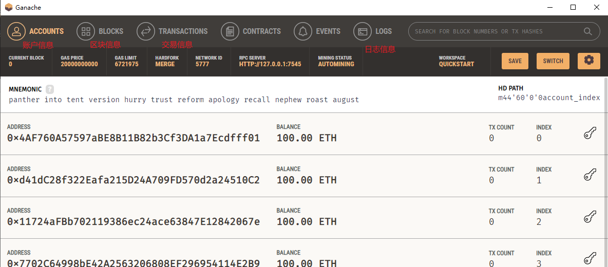
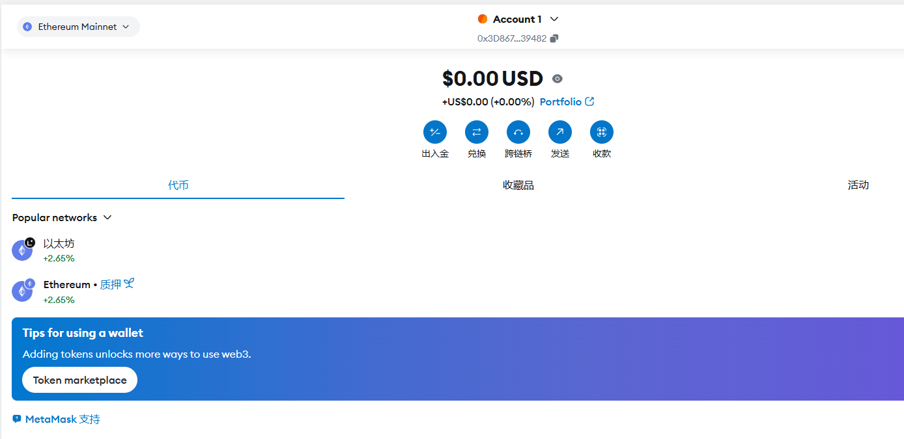
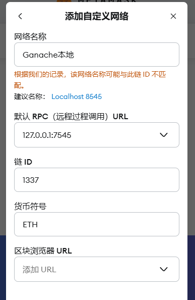

# 以太坊 Ethereum 
## 1、DApp
不同于传统App依赖中心服务器，DApp的运行依赖区块链以及在区块链上的智能合约。

当前DApp主要基于以太坊、EOS、Steem、TRON等区块链平台进行开发。DApp需要在具有钱包功能的环境中运行。比如基于以太坊开发的DApp

DApp由智能合约和用户界面组成。其中智能合约是运行在区块链上的代码，负责与区块链交互，UI是由HTML和JavaScript实现的前端页面，供用户进行操作。在以太坊中，用户界面可以通过Web3.js库对智能合约进行调用。

- Mist和Parity是支持DApp的钱包
- EVM是以太坊虚拟机，是以太坊中智能合约的运行环境，类似Core CLR
- 以太坊使用Gas作为计量单位，DApp开发过程中Gas指代以太币
- Web3.js是以太坊提供的一个JavaScript库，封装了以太坊的JSON RPC API，提供一系列与区块链交互的JavaScript对象和函数

## 2、智能合约的开发和使用
DAPP开发包括智能合约和UI两部分。

开发智能合约，首先需要搭建一个基于以太坊的智能合约开发环境。

以太坊区块链架构：
- 核心库
    - 主要功能是区块链，EVM（以太坊虚拟机）以及共识机制的实现
    - C#版本对应的是Nethereum.Web3
- 通讯库
    - 是一个P2P的网络库，主要功能是实现结点间的发现、连接和数据同步，实现去中心化网络中的数据传输服务
    - C#对应Nethereum.RPC
- 客户端
    - 客户端的作用是连接到以太坊并与之进行交互，包括获取以太坊区块链网络的数据，向网络上发送交易、部署合约甚至编译智能合约等

### 2.1 搭建本地以太坊测试环境
Ganache是一个运行在PC上的以太坊测试空间，是以太坊开发工具箱Truffle Suite的一部分。

下载地址：https://archive.trufflesuite.com/ganache/

Ganache启动后会监听本地的7545端口，并自动创建10个测试账号（就图片中的那些数据），每个测试账号均有100个以太币供测试开发。BLOCKS有一个创世区块。

### 2.2 安装和使用以太坊钱包
用插件MetaMask作为以太坊钱包。在浏览器添加这个插件就行。

Google插件地址：https://chromewebstore.google.com/detail/metamask/nkbihfbeogaeaoehlefnkodbefgpgknn?pli=1

MetaMask默认连接以太坊主网络，这里把网络切换到Ganache的本地网络：设置->安全与隐私->添加自定义网络->添加自定义网络->输入本地RPC地址`http://127.0.0.1:7545`

打开Ganache查看第一个Account的私钥并复制：

在打开MetaMask，选择导入账户，将私钥粘贴到私钥输入框中。

