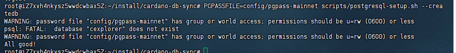

测试资源：
服务器A（创建区块，运行两个创建区块的节点）
服务器B（运行消费节点）


## 1、服务器A配置初始区块链

首先是在服务器A创建创世区块，并且创建两个节点在权益池参与出块，这里利用脚本https://github.com/IntersectMBO/cardano-node/blob/master/scripts/babbage/mkfiles.sh 搭建。

先把 alonzo-babbage-test-genesis.json、conway-babbage-test-genesis.json、configuration.yaml下载到template目录下，mkfiles.sh下载到与template目录同级目录下。

资料比较旧，有一些格式和命令需要调整，实际开发也需要根据实际的业务对一些配置做出调整：

```
#!/usr/bin/env bash

set -e
# Unofficial bash strict mode.
# See: http://redsymbol.net/articles/unofficial-bash-strict-mode/
set -u
set -o pipefail

UNAME=$(uname -s) SED=
case $UNAME in
  Darwin )      SED="gsed";;
  Linux )       SED="sed";;
esac

sprocket() {
  if [ "$UNAME" == "Windows_NT" ]; then
    # Named pipes names on Windows must have the structure: "\\.\pipe\PipeName"
    # See https://docs.microsoft.com/en-us/windows/win32/ipc/pipe-names
    echo -n '\\.\pipe\'
    echo "$1" | sed 's|/|\\|g'
  else
    echo "$1"
  fi
}

UNAME=$(uname -s) DATE=
case $UNAME in
  Darwin )      DATE="gdate";;
  Linux )       DATE="date";;
  MINGW64_NT* ) UNAME="Windows_NT"
                DATE="date";;
esac

CARDANO_CLI="${CARDANO_CLI:-cardano-cli}"
NETWORK_MAGIC=42
HOST="服务器A的私网IP"
SECURITY_PARAM=10
NUM_SPO_NODES=2
INIT_SUPPLY=12000000
START_TIME="$(${DATE} -d "now + 30 seconds" +%s)"
ROOT=node
TEMPLATE="template"
mkdir -p "${ROOT}"

cat > "${ROOT}/byron.genesis.spec.json" <<EOF
{
  "heavyDelThd":     "300000000000",
  "maxBlockSize":    "2000000",
  "maxTxSize":       "4096",
  "maxHeaderSize":   "2000000",
  "maxProposalSize": "700",
  "mpcThd": "20000000000000",
  "scriptVersion": 0,
  "slotDuration": "1000",
  "softforkRule": {
    "initThd": "900000000000000",
    "minThd": "600000000000000",
    "thdDecrement": "50000000000000"
  },
  "txFeePolicy": {
    "multiplier": "43946000000",
    "summand": "155381000000000"
  },
  "unlockStakeEpoch": "18446744073709551615",
  "updateImplicit": "10000",
  "updateProposalThd": "100000000000000",
  "updateVoteThd": "1000000000000"
}
EOF

$CARDANO_CLI byron genesis genesis \
  --protocol-magic ${NETWORK_MAGIC} \
  --start-time "${START_TIME}" \
  --k ${SECURITY_PARAM} \
  --n-poor-addresses 0 \
  --n-delegate-addresses ${NUM_SPO_NODES} \
  --total-balance ${INIT_SUPPLY} \
  --delegate-share 1 \
  --avvm-entry-count 0 \
  --avvm-entry-balance 0 \
  --protocol-parameters-file "${ROOT}/byron.genesis.spec.json" \
  --genesis-output-dir "${ROOT}/byron-gen-command"

cp ${TEMPLATE}/alonzo-babbage-test-genesis.json "${ROOT}/genesis.alonzo.spec.json"
cp ${TEMPLATE}/conway-babbage-test-genesis.json "${ROOT}/genesis.conway.spec.json"

cp ${TEMPLATE}/configuration.yaml "${ROOT}/"
$SED -i "${ROOT}/configuration.yaml" \
     -e 's/Protocol: RealPBFT/Protocol: Cardano/' \
     -e '/Protocol/ aPBftSignatureThreshold: 0.6' \
     -e 's/minSeverity: Info/minSeverity: Debug/' \
     -e 's|GenesisFile: genesis.json|ByronGenesisFile: genesis/byron/genesis.json|' \
     -e '/ByronGenesisFile/ aShelleyGenesisFile: genesis/shelley/genesis.json' \
     -e '/ByronGenesisFile/ aAlonzoGenesisFile: genesis/shelley/genesis.alonzo.json' \
     -e '/ByronGenesisFile/ aConwayGenesisFile: genesis/shelley/genesis.conway.json' \
     -e 's/RequiresNoMagic/RequiresMagic/' \
     -e 's/LastKnownBlockVersion-Major: 0/LastKnownBlockVersion-Major: 6/' \
     -e 's/LastKnownBlockVersion-Minor: 2/LastKnownBlockVersion-Minor: 0/'

  echo "TestShelleyHardForkAtEpoch: 0" >> "${ROOT}/configuration.yaml"
  echo "TestAllegraHardForkAtEpoch: 0" >> "${ROOT}/configuration.yaml"
  echo "TestMaryHardForkAtEpoch: 0" >> "${ROOT}/configuration.yaml"
  echo "TestAlonzoHardForkAtEpoch: 0" >> "${ROOT}/configuration.yaml"
  echo "TestBabbageHardForkAtEpoch: 0" >> "${ROOT}/configuration.yaml"
  echo "TestConwayHardForkAtEpoch: 0" >> "${ROOT}/configuration.yaml"
  echo "ExperimentalProtocolsEnabled: True" >> "${ROOT}/configuration.yaml"
  echo ""EnableP2P": true" >> "${ROOT}/configuration.yaml"

# Because in Babbage the overlay schedule and decentralization parameter
# are deprecated, we must use the "create-staked" cli command to create
# SPOs in the ShelleyGenesis
$CARDANO_CLI conway genesis create-staked --genesis-dir "${ROOT}" \
  --testnet-magic 42 \
  --gen-pools 2 \
  --supply            2000000000000 \
  --supply-delegated   240000000002 \
  --gen-stake-delegs 2 \
  --gen-utxo-keys 2

SPO_NODES="node-spo1 node-spo2"

# create the node directories
for NODE in ${SPO_NODES}; do

  mkdir "${ROOT}/${NODE}"

done

# Here we move all of the keys etc generated by create-staked
# for the nodes to use

# Move all genesis related files
mkdir -p "${ROOT}/genesis/byron"
mkdir -p "${ROOT}/genesis/shelley"

mv "${ROOT}/byron-gen-command/genesis.json" "${ROOT}/genesis/byron/genesis-wrong.json"
mv "${ROOT}/genesis.alonzo.json" "${ROOT}/genesis/shelley/genesis.alonzo.json"
mv "${ROOT}/genesis.conway.json" "${ROOT}/genesis/shelley/genesis.conway.json"
mv "${ROOT}/genesis.json" "${ROOT}/genesis/shelley/genesis.json"

jq --raw-output '.protocolConsts.protocolMagic = 42' "${ROOT}/genesis/byron/genesis-wrong.json" > "${ROOT}/genesis/byron/genesis.json"

rm "${ROOT}/genesis/byron/genesis-wrong.json"

cp "${ROOT}/genesis/shelley/genesis.json" "${ROOT}/genesis/shelley/copy-genesis.json"

jq -M '. + {slotLength:0.1, securityParam:10, activeSlotsCoeff:0.1, securityParam:10, epochLength:500, maxLovelaceSupply:10000000000000, updateQuorum:2}' "${ROOT}/genesis/shelley/copy-genesis.json" > "${ROOT}/genesis/shelley/copy2-genesis.json"
jq --raw-output '.protocolParams.protocolVersion.major = 7 | .protocolParams.minFeeA = 44 | .protocolParams.minFeeB = 155381 | .protocolParams.minUTxOValue = 1000000 | .protocolParams.decentralisationParam = 0.7 | .protocolParams.rho = 0.1 | .protocolParams.tau = 0.1' "${ROOT}/genesis/shelley/copy2-genesis.json" > "${ROOT}/genesis/shelley/genesis.json"

rm "${ROOT}/genesis/shelley/copy2-genesis.json"
rm "${ROOT}/genesis/shelley/copy-genesis.json"

mv "${ROOT}/pools/vrf1.skey" "${ROOT}/node-spo1/vrf.skey"
mv "${ROOT}/pools/vrf2.skey" "${ROOT}/node-spo2/vrf.skey"

mv "${ROOT}/pools/opcert1.cert" "${ROOT}/node-spo1/opcert.cert"
mv "${ROOT}/pools/opcert2.cert" "${ROOT}/node-spo2/opcert.cert"

mv "${ROOT}/pools/kes1.skey" "${ROOT}/node-spo1/kes.skey"
mv "${ROOT}/pools/kes2.skey" "${ROOT}/node-spo2/kes.skey"

#Byron related

mv "${ROOT}/byron-gen-command/delegate-keys.000.key" "${ROOT}/node-spo1/byron-delegate.key"
mv "${ROOT}/byron-gen-command/delegate-keys.001.key" "${ROOT}/node-spo2/byron-delegate.key"

mv "${ROOT}/byron-gen-command/delegation-cert.000.json" "${ROOT}/node-spo1/byron-delegation.cert"
mv "${ROOT}/byron-gen-command/delegation-cert.001.json" "${ROOT}/node-spo2/byron-delegation.cert"


echo 3001 > "${ROOT}/node-spo1/port"
echo 3002 > "${ROOT}/node-spo2/port"

# Make topology files
# Make topology files
#TODO generalise this over the N BFT nodes and pool nodes
cat > "${ROOT}/node-spo1/topology.json" <<EOF
{
  "bootstrapPeers":null,
  "localRoots": [
    {
      "accessPoints": [
       {
         "address": "${HOST}",
         "port": 3002
       }
      ],
      "advertise": false,
      "trustable": false,
      "valency": 1
    }
  ],
  "publicRoots": [
    {
      "accessPoints": [],
      "advertise": false
    }
  ],
  "useLedgerAfterSlot": -1
}
EOF

cat > "${ROOT}/node-spo2/topology.json" <<EOF
{
  "bootstrapPeers": null,
  "localRoots": [
    {
      "accessPoints": [
       {
          "address": "${HOST}",
          "port": 3001
       }
      ],
      "advertise": false,
      "trustable": false,
      "valency": 1
    }
  ],
  "publicRoots": [
    {
      "accessPoints": [],
      "advertise": false
    }
  ],
  "useLedgerAfterSlot": -1
}
EOF


for NODE in ${SPO_NODES}; do
  RUN_FILE="${ROOT}/${NODE}.sh"
  cat << EOF > "${RUN_FILE}"
#!/usr/bin/env bash

CARDANO_NODE="\${CARDANO_NODE:-cardano-node}"

\$CARDANO_NODE run \\
  --config                          '${ROOT}/configuration.yaml' \\
  --topology                        '${ROOT}/${NODE}/topology.json' \\
  --database-path                   '${ROOT}/${NODE}/db' \\
  --socket-path                     '$(sprocket "${ROOT}/${NODE}/node.sock")' \\
  --shelley-kes-key                 '${ROOT}/${NODE}/kes.skey' \\
  --shelley-vrf-key                 '${ROOT}/${NODE}/vrf.skey' \\
  --byron-delegation-certificate    '${ROOT}/${NODE}/byron-delegation.cert' \\
  --byron-signing-key               '${ROOT}/${NODE}/byron-delegate.key' \\
  --shelley-operational-certificate '${ROOT}/${NODE}/opcert.cert' \\
  --port                            $(cat "${ROOT}/${NODE}/port") \\
  --host-addr                        '172.25.134.1' \\
  | tee -a '${ROOT}/${NODE}/node.log'
EOF

  chmod a+x "${RUN_FILE}"

  echo "${RUN_FILE}"
done

mkdir -p "${ROOT}/run"

echo "#!/usr/bin/env bash" > "${ROOT}/run/all.sh"
echo "" >> "${ROOT}/run/all.sh"

for NODE in ${SPO_NODES}; do
  echo "$ROOT/${NODE}.sh &" >> "${ROOT}/run/all.sh"
done
echo "" >> "${ROOT}/run/all.sh"
echo "wait" >> "${ROOT}/run/all.sh"

chmod a+x "${ROOT}/run/all.sh"

echo "CARDANO_NODE_SOCKET_PATH=${ROOT}/node-spo1/node.sock "

(cd "$ROOT"; ln -s node-spo1/node.sock main.sock)

```

执行命令创建相关创世文件与密钥并且启动两个节点：
```
./mkfiles.sh
./node/run/all.sh
```


可以看到两个节点持续出块中。


以上是服务器A的配置目录。

## 2、服务器B同步
将configuration.yaml与genesis文件复制到服务器B上。创建topology.json:
```
{
  "bootstrapPeers": null,
  "localRoots": [
    {
      "accessPoints": [
       {
        "address": "服务器A 公网ip",
        "port": 3002
        }
      ],
      "advertise": false,
      "trustable": true,
      "valency": 3
    }
  ],
  "publicRoots": [
    {
      "accessPoints": [
       {
        "address":"服务器A 公网 ip",
	"port":3002
       }
      ],
      "advertise": true
    }
  ],
  "useLedgerAfterSlot": -1
}
```

对于服务器A的topology.json也需要修改配置，这里选择服务器A的spo2节点进行修改，将服务器B的公网IP添加到localRoot里面：
```
{
  "bootstrapPeers": null,
  "localRoots": [
    {
      "accessPoints": [
       {
          "address": "服务器A 私网IP",
          "port": 3001
       }
      ],
      "advertise": false,
      "trustable": true,
      "valency": 1
    },
    {
      "accessPoints": [
       {
          "address": "服务器B 公网IP",
          "port": 3001
       }
      ],
      "advertise": false,
      "trustable": true,
      "valency": 1
    }
  ],
  "publicRoots": [
    {
      "accessPoints": [],
      "advertise": false
    }
  ],
  "useLedgerAfterSlot": -1
}
```

用命令`pkill -HUP cardano-node`通知cardano-node重新读取配置文件并重新启动所有DNS解析。<p style="color:red">（这个执行后好像没有起作用，因为启动服务器B后并没有同步到服务器A的数据，需要中断服务器A的节点再重新启动，服务器B的节点才成功同步，这个后面需要再研究下）</p>

运行服务器B上的节点：
```
cardano-node run \
--config configuration.yaml \
--database-path $HOME/cardano-private/db/ \
--socket-path $HOME/cardano-private/db/node.socket \
--host-addr 服务器B 私网IP \
--port 3001 \
--topology topology.json
```


## 3、测试交易
在服务器B创建支付密钥：
```
mkdir utxo-keys

cardano-cli address key-gen \
--verification-key-file utxo-keys/payment.vkey \
--signing-key-file utxo-keys/payment.skey

cardano-cli address build \
--payment-verification-key-file utxo-keys/payment.vkey \
--testnet-magic 42 \
--out-file utxo-keys/payment.addr
```


在服务器A的utxo-keys中为支付密钥都创建地址：
```
cardano-cli address build \
--payment-verification-key-file utxo-keys/utxo2.vkey \
--testnet-magic 42 \
--out-file utxo-keys/utxo2.addr

cardano-cli address build \
--payment-verification-key-file utxo-keys/utxo1.vkey \
--testnet-magic 42 \
--out-file utxo-keys/utxo1.addr
```


在服务器A上从utxo2.addr上转10000000给服务器B上的payment.addr:
```
mkdir transactions

// 创建交易

cardano-cli conway transaction build-raw \
  --invalid-hereafter $(expr $(cardano-cli query tip --testnet-magic 42 --socket-path node-spo1/node.sock | jq .slot) + 100000) \
  --tx-in 6dfe8493abd40a1e0ee901b03fa3649a04a38e795340dd76b98021c38c20476c#0 \
  --tx-out  addr_test1vrjmv8tuafdndwx93fkr20h3nv0y2u9w52zamqtjj7flzcs4jtmmq+10000000 \
  --tx-out $(< utxo-keys/utxo1.addr)+899989800000 \
  --out-file transactions/tx1.raw \
  --fee 200000

//签署交易：
cardano-cli conway transaction sign \
--tx-body-file transactions/tx1.raw \
--signing-key-file utxo-keys/utxo1.skey \
--testnet-magic 42 \
--out-file transactions/tx1.signed

//提交到区块链
cardano-cli conway transaction submit \
--testnet-magic 42 \
--tx-file transactions/tx1.signed \
--socket-path node-spo1/node.sock
```


## 4、运行cardano-wallet
卡尔达诺钱包可帮助您管理 ADA。可以使用它通过 http 和 cli 接口在 Cardano 区块链上发送和接收付款。

首先需要安装cardano-wallet，因为是国内服务器，配不了cabal，所以直接用可执行文件：
```
wget 
https://github.com/cardano-foundation/cardano-wallet/releases/download/v2025-01-09/cardano-wallet-v2025-01-09-linux64.tar.gz
```


```
mkdir wallets
```
为了与 API 交互，必须先启动服务器:
```
cardano-wallet serve \
--listen-address 0.0.0.0 \
--port 1337 \
--testnet $HOME/cardano-private/genesis/byron/genesis.json \
--database $HOME/cardano/wallets/db \
--node-socket $HOME/cardano-private/db/node.socket
```


测试下api(查看网络信息):
```
curl --url http://localhost:1337/v2/network/information | jq
```


外部也正常访问：


可用接口详情：https://cardano-foundation.github.io/cardano-wallet/api/edge/


## 5、cardano-db-sync
需要用到cabal，配置vpn就能成功安装（虚拟机不行），具体过程看01的文档。

```
git clone https://github.com/IntersectMBO/cardano-db-sync
cd cardano-db-sync
```

```
sudo apt-get update
sudo apt-get install postgresql-client
sudo apt-get install postgresql postgresql-contrib
```
执行
```
PGPASSFILE=config/pgpass-mainnet scripts/postgresql-setup.sh --createdb
```
如果没有权限，则执行
```
sudo -i -u postgres
createuser --createdb --superuser root
exit
```



configuration.yaml需要添加以下内容：
```
# added properties otherwise cardano-db-sync-extended did not start
echo "NetworkName: testnet" >> ${ROOT}/configuration.yaml
echo "NodeConfigFile: configuration.yaml" >> ${ROOT}/configuration.yaml
echo "ByronGenesisHash: $(cardano-cli byron genesis print-genesis-hash --genesis-json ${ROOT}/genesis/byron/genesis.json)" >> ${ROOT}/configuration.yaml
echo "ShelleyGenesisHash: $(cardano-cli conway genesis hash --genesis ${ROOT}/genesis/shelley/genesis.json)" >> ${ROOT}/configuration.yaml
echo "AlonzoGenesisHash: $(cardano-cli conway genesis hash --genesis ${ROOT}/genesis/shelley/genesis.alonzo.json)" >> ${ROOT}/configuration.yaml
echo "ConwayGenesisHash: $(cardano-cli conway genesis hash --genesis ${ROOT}/genesis/shelley/genesis.conway.json)" >> ${ROOT}/configuration.yaml
```


```
PGPASSFILE=\pgpass-mainnet cardano-db-sync \
    --config db-sync.json \
    --socket-path node.sock \
    --state-dir tmp/ledger-state \
    --schema-dir schema/
```

## 5、问题
1、区块链生产区块在conway应该是必须有权益池的，并且池中必须至少两个生产区块的节点，尝试过只配置一个生产区块节点，结果是区块链无法创建区块，连创世区块也没法创建。

2、服务器A一开始运行能够生产区块，但是ctrl+C停止运行并调整topology配置，然后再重新启动两个节点，偶尔会出现无法生产区块的场景，后面再怎么重启都无法正常生产区块，得所有数据删除从头开始执行。这个不确定是什么原因，没修改任何内容，只是单纯重启也会有这种情况。