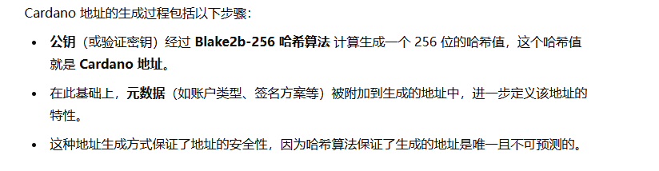

# 卡尔达诺 Cardano
## 1、Cardano介绍
### 1.1 Cardano
卡尔达诺是一个去中心化且开源的公有区块链，采用基于权益证明的共识机制。可以通过其原生加密货币艾达币（ADA）进行点对点交易。

Cardano是第一个从科学哲学和研究优先驱动方法演变而来的区块链平台。Cardano平台是从头开始设计的，由区块链和密码学领域的顶级工程师和学术专家的汗液领先组合进行验证。将安全性作为创始原则之一。是用Haskell编写的。


#### 1.1.1 Cardano架构


- 系统组件：不同的部署用例将使用不同的组件组合
    - 节点
    - 命令行界面CLI
    - Cardano钱包
    - Cardano db-sync
    - GraphQl API server
    - SMASH 服务器
- 节点
    - 
    - 节点负责
        - 执行Ouroboros协议
        - 验证和中继块
        - 生成区块
        - 向其他本地客户端提供有关区块链状态的信息
- 节点进程
    - cardano-node 是 Cardano 系统的 顶层组件，它是 Cardano 区块链网络中的核心部分，负责协调和管理不同的子系统
    - cardano-node 包含了多个 子系统，也就是说，Cardano 的不同功能和操作都是由这些子系统提供和管理的。每个子系统负责特定的任务
    - 其中，最重要的子系统 包括共识机制、账本子系统、网络子系统
    - ardano-node 还包含了 辅助功能，如配置系统、CLI、Logging、Monitoring
- 节点到节点 IPC 协议
    - 目的是允许作为 Ouroboros 共识算法的一部分在节点之间交换区块和交易
    - node-to-node 协议是一种复合协议，由 3 个微型协议组成
        - chain-sync：用于跟踪链和获取区块头
        - block-fetch：用于获取块体
        - tx-submission：用于转发交易
- 节点到客户端 IPC
    - 目的是允许本地应用程序通过节点与区块链交互
    - 节点到客户端协议由三个微型协议组成
        - chain-sync：用于跟踪链和获取区块
        - local-tx-submission：用于提交交易
        - local-state-query：用于查询账本状态
- 命令行界面 （CLI）
    - CLI可以做的操作
        - 查询节点以获取信息
        - 提交交易
        - 构建和签署交易
        - 管理加密密钥
- Daedalus wallet  
    - Daedalus 是一个全节点钱包，可帮助用户管理他们的 ada，并可以在 Cardano 区块链上发送和接收付款。
- Cardano DB Sync 
    - Cardano DB Sync 作为一个独立的组件，负责将 区块链数据同步到 SQL 数据库，并为外部应用提供 高效的历史数据查询服务。外部客户端通过访问这个数据库来查询和分析区块链的历史数据，而不需要直接查询 Cardano 节点
#### 1.1.2 Cardano网络
**节点间通信：**

由于信息传播的顺序和网络拓扑的不确定性，节点 A 和节点 B 的上游/下游关系是 相对的，并不固定。比如现在N节点生产一个新区块，如果A节点先接收到新区块，A就是B节点的上游。

Cardano 使用了一些称为 mini-protocols 的小协议实现节点间的通信。这些协议提供了基本的信息交换功能，例如：
- 通知最新区块
- 共享区块
- 广播新交易

出于连接目的，迷你协议由网络协议的版本决定。

节点需要支持多种 mini-protocols，以便满足客户端的多种需求，而客户端可以根据自己的需求选择不同的协议进行通信。

**节点内的数据流:**


存在两种类型的数据流：
- Mini-Protocol 通过公共网络 （internet） 发送和接收消息来与其他节点的 mini-protocols 进行通信
- 在一个节点中，mini-protocols 通过读取和写入共享的可变变量来相互通信


**网络协议设计：**
Cardano 节点通信协议的按序交付由 TCP/IP 协议保证。

操作系统限制并发连接的数量。为了避免过度使用资源并为建立连接提供可靠的方法，Cardano 使用了多路复用器。

- 连接管理
    - 网络层除了交换 Ouroboros 协议所需的区块和交易信息外，还处理一系列特定任务
        - 打开socket，可以从操作系统获取资源
        - 与 Handshake Mini-Protocol 协商协议版本
        - 生成运行 multiplexer 的线程（可以指示它启动/停止各种mini-protocols）
        - 发现和分类由微型协议或多路复用器本身引发的异常
        - 在出现错误时关闭连接
        - 处理来自对等节点的关闭请求
        - 关闭socket
- 多路复用
    - 
- 多路复用协议的数据段
    - Transmission time：传输时间，基于发送方单调时钟的低 32 位的时间戳
    - Mini-protocol ID 
    - 有效负载长度：分段有效负载的大小
    - Mode：单位 M （模式） 用于区分mini-protocol的双实例。在发起方（最初具有代理权的一方）的分段中，模式设置为 0，在响应方的分段中设置为 1
- Cardano 节点通信协议
    - Cardano 使用进程间通信 （IPC） 协议来允许在节点之间交换区块和交易，并允许本地应用程序通过节点与区块链交互
- mini-protocols两种形式
    - Node-to-node IPC 
        - 
        - NtN mini-protocols 的解释
            - chain-sync：允许节点重建上游节点链的协议
            - block-fetch：一种允许节点从各种对等节点下载区块体的协议
            - tx-submission：允许提交交易的协议。该协议的实现基于一个通用的迷你协议框架，有一个特点：发起者和响应者的角色是颠倒的。Server 是请求新事务的发起方，而 Client 是回复事务的响应方。这种角色互换是出于技术原因而设计的。
            - keep-alive：一种保证节点之间持续连接并最大限度地减少性能故障的协议
    - Node-to-client IPC 
        - NtC IPC 协议的目的是允许本地应用程序通过节点与区块链交互
        - NtC 协议由三个小协议组成
            - chain-sync ：用于跟踪链和获取区块
            - local-tx-submission ：用于提交交易
            - local-state-query ：用于查询账本状态


### 1.2 Ada

每个区块链账本都有其基础加密货币或原生货币，Ada是Cardano上的原生货币，是Cardano上的主要支付单位。它被接受为支付费用进行付款，也是分发奖励的唯一货币。lovelace是ada最小面额，1ada=1,000,000 lovelaces。ada有6位小数。

Cardano支持创建原生代币（就是自定义虚拟货币）。

<div style="color:gray">
<p>原生货币（Native Currency）与原生代币（Native Token）区别：</p>

<p>原生货币是一个区块链网络中原生的，用于支付交易费用和作为价值存储的货币。</p>

<p>原生代币是某个特动区块链平台上发行的代币，这些代币可以用于支付、治理、抵押。原生代币不一定是该区块链网络中的唯一或主要货币。</p>

</div>

### 1.3 Proof of stake
Cardano是基于Ouroboros共识协议构建的，它实现了 PoS 机制。Ouroboros 是首个通过同行评审研究开发的区块链共识协议。

Ouroboros协议核心是权益池，由权益池运营商运行的可靠服务器节点，ADA持有者可以将他们的权益委托给该节点，而不需要自己参与节点的维护和运行。权益池用于确保每个人都可以参与协议，这些权益池专注于维护，将各种利益相关者的中和权益保存在一个实体中。

PoS相对于PoW的一些优势：
- 严格的安全协议被纳入PoS协议
- 通过对网络内的自私行为进行处罚来降低中心化的风险
- 生成和运行区块链需要的电力和硬件资源较少
- PoS货币比在PoW协议上运行的货币更具有成本效益


### 1.4 Cardano Eras

Cardano不是一个协议，而是一个子协议的集合，它们按顺序执行，并通过转换机制（硬分叉组合器）连接在一起。这些协议通常被称为Eras。

共识层的作用是弄清楚当前区块链的Eras，每个Eras都有一套特定的规则来规定什么是有效的块。共识层规定了所有节点用于寻找协议的协议。


#### 1.4.1 Byron
- 这时Cardano是一个联合网络，Genesis实体、Cardano基金会、输入输出、Emurgo联合控制区块生产
- 允许用户以网络的本地货币相互进行交易，ada使用UTXO模型

#### 1.4.2 Shelly
- 对 Cardano 的内部结构进行了大规模的重构，引入了多个层次的抽象
- 是开始去中心化出块的时代
- 为Cardano交易添加一整套新组件
- 引入证书概念，可以添加到交易中以生命或撤销于用户凭据之间的关系
- 启用权益池注册和委托
- 允许用户在交易中添加任意信息
- 引入一种新型地址，能够不仅将资金锁定在公钥和私钥对下，也说定在本机脚本下

#### 1.4.3 Allegra
- 引进智能合约
- 引入一种新的交易原生脚本功能，添加两个新的原语，使用户能够指定资金的有效期
- 为交易添加有效性间隔的概念
- 允许表达复杂的与时间相关的执行逻辑

#### 1.4.4 mary
- 扩展交易功能，允许同时携带ada和用户铸造的资产输出
- 支持代币的转移和交易

#### 1.4.5 Alonzo Era
- 引入脚本语言Plutus
- 使用Plutus的地方：
    - 在地址中使用任意逻辑锁定资金
    - 定义委托权
    - 指定额外的质押奖励和提款条件
    - 定义或销毁链上的资产政策
- 引入两阶段验证管道：验证结构、执行脚本

#### 1.4.6 Babbage
- 处于可编程序、可扩展性和治理的十字路口
- 允许在交易中 引用之前的交易输入（即未花费的输出，UTXO），但不需要实际花费它
- 交易输出可以承载 任意的脚本和数据
- 允许提前发布脚本并且值添加对脚本的引用
- 升级网络层
    - 为节点间正确的p2p网络通信奠定基础
    - 使用管道改善块传播，乐观发送多个请求而不立刻等待响应

#### 1.4.7 Conway
- 专注链上治理
- 引入两个治理主体
### 1.5 相关词语解释
#### 1.5.1 Cardano节点
Cardano节点是Cardano区块网络的顶级组件，负责维护和验证区块链的状态、处理交易、参与共识过程以及实现协议各种功能。

权益池使用Cardano节点验证池如何与网络交互，并负责处理交易和生产区块。他们充当可靠的服务器节点，在单个实体中持有和维护各种权益相关者的综合股份。

Cardano 区块链使用 Ouroboros Praos 协议。Ouroboros Praos将时间分为多个epoch，每个epoch由多个slot组成。


在任何 slot 中，零个或多个出块节点都可能被提名为 slot 领导者（就是pos中团体选出来出块的代表）。如何选举领导者参考PoS的概念，另外为了保持公平的竞争环境，并防止出现少数非常大的矿池控制大部分股份的情况，卡尔达诺有一个激励系统，不鼓励委托给已经控制了大部分总股份的矿池。

在验证交易时，slot 领导者需要确保发送者已经包含足够的资金来支付该交易，还必须确保满足交易的参数。假设交易满足所有这些要求，slot 领导者会将其记录为新区块的一部分，然后该区块将连接到链中的其他区块。

#### 1.5.2 权益池
权益池是一个可靠的服务器节点，专注于账本维护，并将各个利益相关者的综合资源（即“权益”）保存在一个实体中。权益池负责处理将放入账本的交易，以及生成新的区块。权益池是 卡尔达诺权益证明协议Ouroboros的核心。

通常，权益池运营商（SPO）安装并运行与平台（服务器节点）兼容的软件，而委托人则扮演更被动的角色。他们将他们的权益委托给矿池。

#### 1.5.3 委托
大白话就是散户提供ada参与slot领导者选举。
ada持有者可以考虑三种方式委托他们的股份：
- 运行自己的权益池
- 与第三方达成协议，为他们运行一个私有的权益池
- 委托给其他权益池

委托股份需要向链上发布两个证书：
- Staking 地址注册证书
    - 这个证书用于注册一个staking地址，即我们想要用来委托的地址。该证书会确保我们的钱包地址能够与权益池进行关联，让我们能够参与权益委托。（这个地址是属于ada持有者的）
- 委托证书
    - 这个证书表示将我们的ada委托给某个特定的权益池。它会记录我们的委托行为和选择的权益池

在 Cardano 中，发布证书到区块链上是需要支付一定的交易费用的。和普通的交易一样，提交证书的过程会消耗一部分资金作为交易费用。这意味着在首次设置钱包并委托权益时，钱包中需要有足够的资金来支付这两笔证书提交的费用。

对于 首次设置钱包 的用户来说可能没有足够ADA支付证书提交需要的交易费，为了让用户能够顺利开始委托过程，cardano引入引导机制。

引导机制允许用户先使用基础地址（base address）进行staking，即便用户还没有提交完整的 staking 地址注册证书。

<p style="color:green">基础地址 是一种特殊的地址，可以在不需要先提交注册证书的情况下使用。用户可以在提交正式的 staking 地址注册证书 之前，使用一个 staking key（质押密钥） 来生成基础地址。这样，用户即使没有资金支付注册证书费用，依然可以委托权益，完成 staking 操作。</p>

Staking 地址的类型:
- 基于 单个密钥，即简单的公钥/私钥对
- 基于 脚本（比如 多签名（multi-sig）），这种方式允许多个密钥对地址进行管理，增加安全性

委托方案：
- 委托机制
    - 权益委托：任何利益相关者都可以将自己的权益委托给一个权益池，允许该池为Cardano网络生成区块
    - 奖励分配：协议会将奖励分配给所有参与者，包括SPO的费用
    - 委托方式：利益相关者通过将权益委托给池的ID（池营运者验证密钥的哈希值）来参与
- 代理签名的安全性
    - 为了限制委托者在某些时段内的区块生成能力，利益相关者可以通过代理签名限制其有效性，要将委托人的区块生成能力限制在一定范围的 epoch 和 slots
    - 任何利益相关者都可以验证代理签名密钥是否确实由特定利益相关者颁发给特定代理人，并且代理人只能使用这些密钥分别对密钥的有效消息空间内的消息进行签名
- 委托的交易费用
    - 用户钱包中的每个质押密钥的资金需要通过单笔交易发布，该交易包含 委托证书，只产生常规的交易费用
    - 质押地址注册 需要支付押金，而委托不需要额外的费用。
    - 一旦质押地址注册完成，利益相关者只需为设置委托池支付费用
- 奖励计算
    - 利益相关者的权益会计入其委托的 权益池 中，影响该池的奖励分配

总结委托步骤：
- 创建钱包并存入ADA
- 注册staking地址，并支付相关费用
- 选择权益池，并选择池的表现、规模等
- 提交委托证书，将ADA委托给池
- 支付交易费用
- 开始获得建立
- 随时撤回或重新委托

#### 1.5.4 承诺与奖励  Pledging and rewards


#### 1.5.5 共识解释
共识机制的作用：谁可以在什么时候生成区块，冲突如何处理。

Cardano 在 Ouroboros 共识协议上运行，该协议与 在顶级会议和出版物上发表的多篇同行评审论文 在网络安全和密码学领域。

Ouroboros如何工作：
- 时间划分为时期和时隙，每个时隙为 1 秒，时隙内产生一个区块
- 每个slot会选举出一个 时隙领导者，负责生成并广播区块
- slot领导者 在生成区块后，将其传递给下一个时隙的领导者
- 为了防止恶意攻击，新的区块在一段时间内视为“临时区块”，直到足够多的后续区块确认它们的有效性（结算延迟）
- 每个节点维护交易内存池和本地区块链副本，发现更长的有效链时更新副本
- Ouroboros 协议通过 51% 的权益控制保证网络安全，防止恶意分叉（只要超过 51% 的赌注由诚实的参与者（即遵循协议的参与者）控制，就可以保证协议在所谓的同步设置中是安全的（即对消息传递时间有强有力的保证））

#### 1.5.6 Ouroboros简介


Ouroboros能够代表区块链无限增长和可扩展性，所以采用 Ouroboros 来命名 Cardano 背后的权益证明共识协议。

Ouroboros 不同版本：
- Ouroboros Classic  衔尾蛇经典版
- Ouroboros BFT 衔尾蛇 BFT
- Ouroboros Praos 乌洛波罗斯普劳斯
- Ouroboros Genesis  衔尾蛇创世纪
- Ouroboros Crypsinous 隐秘衔尾蛇
- Ouroboros Chronos 衔尾蛇 柯罗诺斯

#### 1.5.7 Cardano key
Cardano key是非对称加密密钥对，用于：
- 签署和验证付款和质押证书
- 识别和定义Cardano区块链上的地址


密钥的类型：
- 节点密钥
    - operator/operational key
        - 这些是操作员的离线密钥对，其中包括新证书的证书计数器
        - 操作员负责管理池的热 （联机） 和冷 （脱机） 键（建议保留冷密钥的多个备份）
    - KES
        - 为区块生产节点创建操作证书时需要KES密钥对验证身份
        - KES 密钥对会在固定的时间周期内变化（即“演变”）。每个密钥只能使用一定数量的周期，在这些周期后该密钥就失效（防止攻击者篡改历史）
        - 在设定的周期数过后，节点操作员必须生成新的 KES 密钥对，使用该新密钥对颁发新的可操作节点证书，然后使用新证书重新启动节点
    - VRF
        - Ouroboros Praos 协议通过使用 VRF 密钥（可验证随机函数密钥）为区块生产过程增加了 额外的安全性。
        - Ouroboros Praos 的slot 领导者时间表保密，没有人知道下一个slot 领导者是谁，那么一旦成为slot 领导者，他可以向其他人证明他正在使用VRF密钥
        - VRF 密钥是存储在操作证书中的签名验证密钥。它证明节点有权在给定的 slot 中创建区块

- 地址密钥
    - Payment key：通常用于生成 UTXO 地址的单个地址密钥对
    - staking key：质押/奖励地址密钥对，通常用于生成账户/奖励地址
#### 1.5.8 Cardano 地址


地址类型：
- 基地址
    - 直接指向质押密钥地址
    - 所以上面也说了即使没有提前注册质押密钥，也可以使用基础地址进行交易，但是，这种情况下不能行使质押权利，即不能参与权益池的委托和奖励分配
- 指针地址
    - 指针地址 并不像 基础地址 那样直接指向质押密钥，而是通过一个 指针 指向存储在区块链上的质押密钥注册证书
    - 指针地址可以在 注册质押密钥之前 或 注册质押密钥之后 用于交易，但在质押权利的行使（即参与质押、委托权益池）时，它需要指向一个有效的质押密钥注册证书
    - 如果 质押密钥注册证书 被回滚或无效，指针地址仍然可以用于交易，但不能用于质押
    - 指针地址 比 基础地址 更短，因为它仅包含一个指向注册证书的引用
- 企业地址
    - 企业地址不具有权益证明，因此使用这些地址意味着您选择退出权益证明协议。也就是像交易所那样，提供存储ada的地址，但是存储在这个企业地址的ada不参与质押。
    
- 奖励账户地址
    - 奖励地址 是 Cardano 中用于 接收质押奖励 的特殊地址，注册的质押密钥和奖励账户地址之间存在一一对应的关系，每当从地址提取资金时，都会使用此密钥
#### 1.5.9 链式确认与交易确认


#### 1.5.10 扩展的UTXO模型（EUTXO）
##### 1.5.10.1 UTXO （未花费交易输出）


用户钱包管理这些UTXO并发起涉及用户拥有的UTXO的交易，每个区块链节点始终维护所有 UTXO 子集的记录（UTXO集）。

##### 1.5.10.2 EUTXO
EUTXO模型扩展了UTXO模型：
- 通过锁和钥匙来解释地址，对于UTXO模型，address是锁（公钥），通过钥匙（私钥）解锁（表示对这个地址有控制权），而EUTXO的Address进一步泛化，EUTXO 模型中的地址可以包含脚本形式的任意逻辑，而不是将锁限制为公钥，将密钥限制为签名。
- EUTXO除了地址和值之外，输出还可以携带（几乎）任意数据。这允许脚本携带状态信息，从而使脚本功能更加强大


#### 1.5.11 Cardano特点
Cardano 的定价方法主要依赖于市场需求而非实际供应。例如，如果很多人需要使用 Cardano 网络，可能需要支付更多的费用，而不是仅仅根据网络的实际处理能力来定价。

在 Cardano 网络上，多个不同类型的需求（比如智能合约执行、交易处理、NFT 操作等）都会争夺相同的区块链资源。因此，如何平衡这些需求和资源之间的关系变得非常重要。这些需求影响的是 Cardano 的共同资源 —— 网络的处理能力，智能合约的定价、NFT 操作等都会消耗这个处理能力。

Cardano 网络需要同时考虑相对定价（不同类型需求之间如何对价格进行调整）和绝对定价（一种固定的定价策略）。


Cardano 通过 Plutus 脚本，确保交易执行成本和结果是确定的（即用户可以预知交易执行后对区块链的影响），而不会受到网络状态的影响。

Cardano 的特点：
- 交易成本
- 确定性
    -  Cardano 交易和智能合约执行的确定性。它确保了交易执行的结果是完全可预测的，没有外部干扰。 Cardano 交易和智能合约执行的确定性。它确保了交易执行的结果是完全可预测的，没有外部干扰。
    - 不会出现以下情况
        - 意外的脚本验证结果或失败
        - 意外的费用
        - 意外的账本或脚本状态更新
- 验证 <p style="color:red">（这里的翻译感觉不太顺，按自己的理解又感觉跟翻译的意思不太对的上，需要留意这个地方）</p>
    - 处理交易的一个重要方面是验证它正在采取的操作， Cardano 使用脚本来验证操作，这些脚本是一段代码，用于实现具有 True 或 False 输出的纯函数
    - 可以针对以下操作执行脚本验证
        - 被脚本锁定的 UTXO：运行的脚本是该地址哈希所对应的脚本
        - 铸造代币：运行的脚本是该代币的政策ID所对应的脚本
        - 奖励提现:运行的脚本是构成质押地址的脚本
        - 应用证书：运行的脚本是构成证书作者凭证的脚本
    - 除了让节点知道要运行哪个脚本之外，所有交易操作都指示如何组装传递给该脚本的参数。由于实施了 Plutus 脚本，Alonzo 在 Cardano 上引入了一种新的交易验证方法。
- 账本特性

#### 1.5.12 关于抵押机制
抵押机制确保智能合约成功执行。

Cardano 实现了一个两阶段验证方案：
- 第一阶段检查交易是否构建正确并可以支付其手续费
- 第二阶段运行实物中包含的脚本


抵押机制的核心目的是 确保节点不因执行失败的交易而浪费资源，并且激励用户确保他们的合约已经充分设计和测试过，减少无效交易的发生。


## 2、Cardano实践
普通用户可以在Cardano做的事：
- 发送和接收原生代币，包括ada
- 将ada委托给现有池之一并获取奖励
- 用ada投票，从国库中分配价值超过 10 亿美元的 ada，以资助 Project Catalyst 上的社区驱动提案
- 通过对提案进行投票来获得 ada 奖励
- 参与 Cardano 改进提案 （CIP） 流程
- 可以与智能合约交互

开发者可以在Cardano做的事：
- 将 Cardano 集成到现有网站和服务中
- 发行原生代币和 NFT
- 向事务添加元数据，为事务提供故事、背景甚至身份
- 使用交易元数据证明文件、文本或任何其他数据在特定时间点的存在
- 使用交易元数据来验证和确认外部实物产品和正品
- 在 Cardano 上设置、管理和维护权益池
- 创建智能合约。


实践使用的是Ubuntu22

### 2.1 一些工具
#### 2.1.1 VESPR Wallet
https://chromewebstore.google.com/detail/vespr-wallet/bedogdpgdnifilpgeianmmdabklhfkcn


### 2.2 安装cardano-node
首先需要**安装系统依赖项**：
```sh
sudo apt-get update -y
sudo apt-get install automake build-essential pkg-config libffi-dev libgmp-dev libssl-dev libtinfo-dev libsystemd-dev zlib1g-dev make g++ tmux git jq wget libncursesw5 libtool autoconf liblmdb-dev -y
```

然后**安装 Haskell 环境**：
```sh
curl --proto '=https' --tlsv1.2 -sSf https://get-ghcup.haskell.org | sh
```


选择配置后就能够执行脚本下载了。

<hr>
在安装 GHCup 之前，我们要做一件额外的工作，创建 ~/.cabal 目录，并创建 ~/.cabal/config 文件，填入如下内容：

```
repository mirrors.ustc.edu.cn
  url: https://mirrors.ustc.edu.cn/hackage/
  secure: True
```

这是因为 GHCup 在安装 Cabal 时会进行初始化（会下载一个 100MB 的文件）,这一步首先替换 Hackage 源。不替换的话安装一半会一直卡着。


<hr>

之后打开一个新终端，执行;
```sh
ghcup install ghc 8.10.7
ghcup install cabal 3.8.1.0
ghcup set ghc 8.10.7
ghcup set cabal 3.8.1.0
```

决定将安装哪个版本的卡尔达诺节点，可以在 https://github.com/IntersectMBO/cardano-node/tags 查看，然后把选择的版本设置为环境变量：
```sh
sudo vim ~/.bashrc
```
添加内容：
```
CARDANO_NODE_VERSION='9.2.1'
IOHKNIX_VERSION=$(curl https://raw.githubusercontent.com/IntersectMBO/cardano-node/$CARDANO_NODE_VERSION/flake.lock | jq -r '.nodes.iohkNix.locked.rev')
```


**安装sodium**
Cardano使用sodium自定义分支：https://github.com/intersectmbo/libsodium 

```sh
mkdir -p ~/src
cd ~/src

SODIUM_VERSION=$(curl https://raw.githubusercontent.com/input-output-hk/iohk-nix/$IOHKNIX_VERSION/flake.lock | jq -r '.nodes.sodium.original.rev')
echo "Using sodium version: $SODIUM_VERSION"

: ${SODIUM_VERSION:='dbb48cc'}
git clone https://github.com/intersectmbo/libsodium
cd libsodium
git checkout $SODIUM_VERSION
./autogen.sh
./configure
make
make check
sudo make install
```
添加环境变量：
```
export LD_LIBRARY_PATH="/usr/local/lib:$LD_LIBRARY_PATH"
export PKG_CONFIG_PATH="/usr/local/lib/pkgconfig:$PKG_CONFIG_PATH"
```

```sh
sudo apt install libsodium-dev
```

**安装secp256k1:**
```sh
SECP256K1_VERSION=$(curl https://raw.githubusercontent.com/input-output-hk/iohk-nix/$IOHKNIX_VERSION/flake.lock | jq -r '.nodes.secp256k1.original.ref')
echo "Using secp256k1 version: ${SECP256K1_VERSION}"

: ${SECP256K1_VERSION:='v0.3.2'}
git clone --depth 1 --branch ${SECP256K1_VERSION} https://github.com/bitcoin-core/secp256k1
cd secp256k1
./autogen.sh
./configure --enable-module-schnorrsig --enable-experimental
make
make check
sudo make install
```

**安装blst:**
```sh
BLST_VERSION=$(curl https://raw.githubusercontent.com/input-output-hk/iohk-nix/master/flake.lock | jq -r '.nodes.blst.original.ref')
echo "Using blst version: ${BLST_VERSION}"

: ${BLST_VERSION:='v0.3.11'}
git clone --depth 1 --branch ${BLST_VERSION} https://github.com/supranational/blst
cd blst
./build.sh
cat > libblst.pc << EOF
prefix=/usr/local
exec_prefix=\${prefix}
libdir=\${exec_prefix}/lib
includedir=\${prefix}/include

Name: libblst
Description: Multilingual BLS12-381 signature library
URL: https://github.com/supranational/blst
Version: ${BLST_VERSION#v}
Cflags: -I\${includedir}
Libs: -L\${libdir} -lblst
EOF
sudo cp libblst.pc /usr/local/lib/pkgconfig/
sudo cp bindings/blst_aux.h bindings/blst.h bindings/blst.hpp  /usr/local/include/
sudo cp libblst.a /usr/local/lib
sudo chmod u=rw,go=r /usr/local/{lib/{libblst.a,pkgconfig/libblst.pc},include/{blst.{h,hpp},blst_aux.h}}
```

**安装节点：**
```sh
git clone https://github.com/intersectmbo/cardano-node.git
cd cardano-node
```

选择Cardano版本：
```sh
git fetch --all --recurse-submodules --tags
git tag | sort -V
git checkout tags/1.35.7
（有些版本会出现代码错误，还不清楚是什么原因）
```


构建和安装节点：

<hr>

卡位，还不清楚是什么原因导致的：


<hr>