# Haskell 入门


https://www.haskell.org/ghcup/
根据指示在Window下下载ghcup

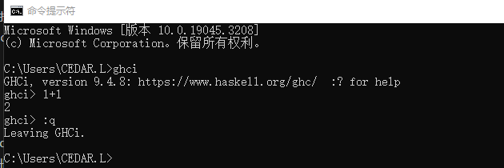

```hs
-- 单行注释
{- 多行注释 -}
```

## 基本用法

### 函数

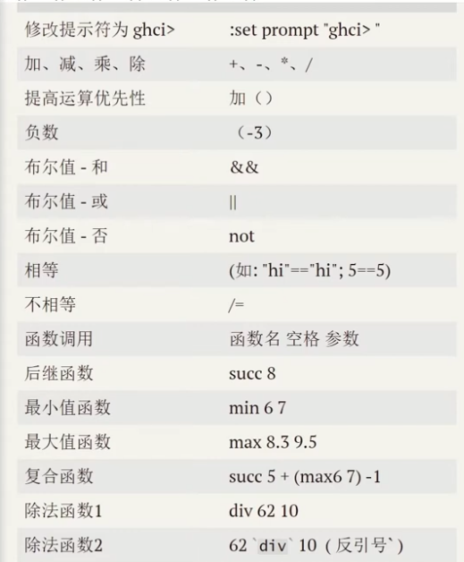

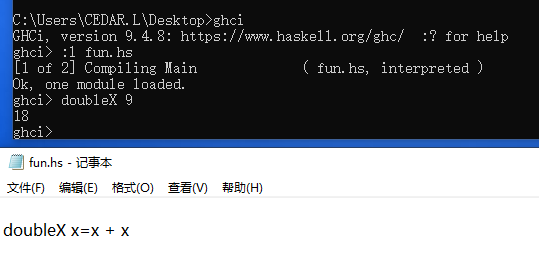

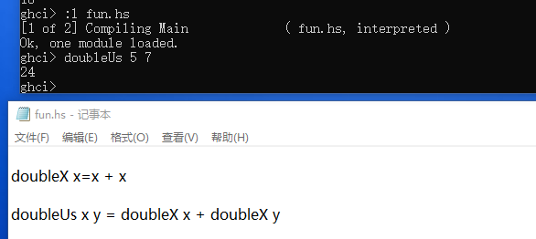

### 列表

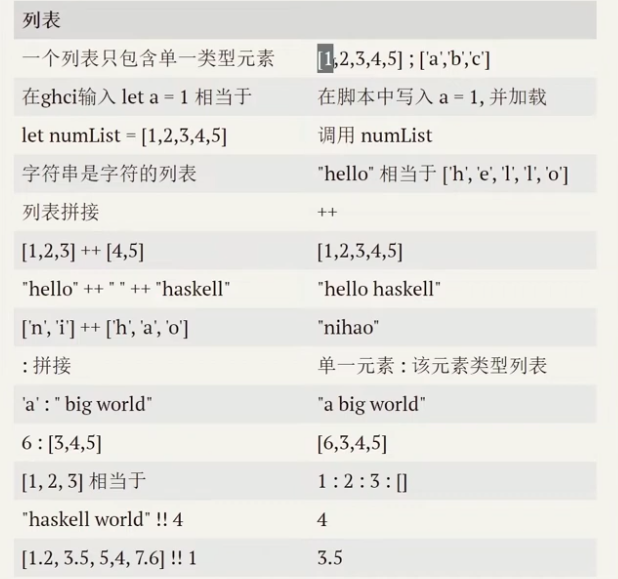

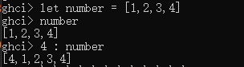

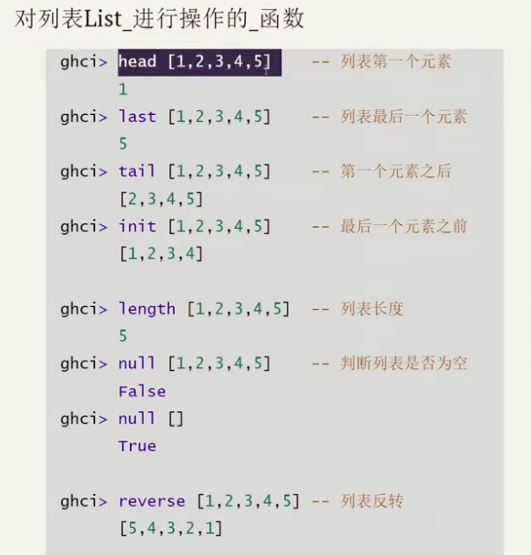

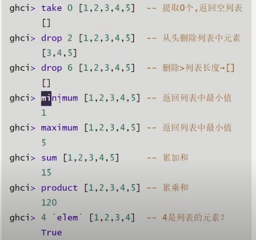

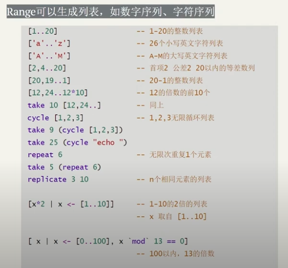

[输出(select) | 条件1， 条件2， ...(where)]

### 元组
tuple可以包含多种类型的元素。
不同长度的列表可比较，元组不可以。

zip函数：

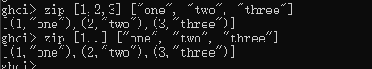

### 类型
expression表达式是一段有返回值的代码，5是一个表达式，x+y也是一个表达式。

```hs
:t 类型  -- 查看类型
```

Int 整数，32位电脑，取值[2147483647, -2147483648]
Interger 整数，无界
Float 单精度浮点数
Double 双精度浮点数
Bool 布尔值 True False
Char 字符，单引号表示


类型类（typeclass）是一种接口，定义某种行为。

类型实现类型类定义的行为。（+，-，*，==，... 都是函数）只包含特殊字符的函数，默认是中缀函数。（:t (\==) ）


- =>符号之前的内容是类约束
- \==函数接收任意两个相同类型的值，并返回一个Bool
- 这两个值的类型必须是Eq的成员（这是类约束）
- Eq类型类提供了一个用于测试相等的接口，任何可进行相等性比较的类型都应该是Eq的成员

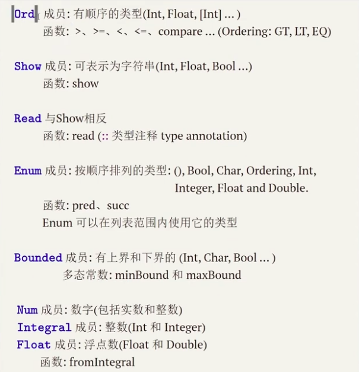


