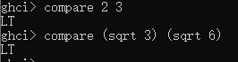

# Haskell

vscode安装3个插件：


ghc编译haskell慢，可以安装下这个插件：


## 入门
Haskell 是一种编译型语言，但具有某些类似解释型语言的特性。

编程环境使用GHC
- ghc 生成本地原生代码的优化编译器。（相当于C#的Roslyn）
- ghci 一个交互解析器和调试器。（相当于python.exe就是一个交互式窗口）
- runghc是一个以脚本形式(并不要首先编译)运行Haskell代码的程序

https://www.haskell.org/ghcup/
根据指示在Window下下载ghcup（推荐手动安装）

### ghci

导入模块：


列表：


字符串：


- haskell没有定义0为False，非0为True

开启/关闭类型和求值结果的自动显示
```
 :set +t
 :unset +t
```

### 类型
- 所有类型名字都以大写字母开头
- 所有变量名字都以小写字母开头

特点：
- 强类型
- 静态
  - 编译器可以在编译期（而不是执行期）知道每个值和表达式的类型
- 可以通过自动推导得出


- it 这是一个有特殊用途的变量， ghci将最近一次求值所得的结果保存在这个变量里（是ghci一个辅助功能，不是haskell有的）
- x :: y 表示表达式 x 的类型为 y

#### 基本类型：
- Char
- Bool
- Int
  - 带符号的定长整数
- Integer
  - 不限长度的带符号整数
- Double


#### 复合数据类型：
- 列表
  - 列表可以任意长，且只能包含类型相同的值
- 元组
  - 元组的长度是固定的，但可以包含不同类型的值
  - 只要元素的结构和类型都一致，那么元组的类型就是相同的
  - 一般使用的场景
    - 一个函数需要返回多个值的时候
    - 需要定长容器，但又没有必要使用自定义类型的时候


#### 自定义类型：
类比class

```hs
-- data 关键字
-- BookInfo 类型构造器，新类型的名字
-- Book 值构造器（数据构造器）， 类型的值就是由值构造器创建的，可以理解成是“构造函数” 返回BookInfo这个类型的“对象”
data BookInfo = Book Int String [String]
                deriving (Show)

-- 源码文件不能省略let， ghci可以
let myInfo = Book 1001 "tom" ["aa", "bb"]
```


- 在 Haskell 里，类型的名字（类型构造器）和值构造器的名字是相互独立的。类型构造器只能出现在类型的定义，或者类型签名当中。而值构造器只能出现在实际的代码中。因为存在这种差别，给类型构造器和值构造器赋予一个相同的名字实际上并不会产生任何问题

类型别名：
```hs
type BookId = Int
type BookName = String
type Author = [String]

data BookInfo = Book BookId BookName Author


data BetterReview = BetterReview BookInfo CustomerID ReviewBody
```

#### 代数数据类型 (也是自定义类型)：
一个代数类型可以有多于一个值构造器，可以理解为C#里面的enum（感觉更像是switch，或者是多态）
```hs
data Bool = False | True

type CardNumber = String
type CardHolder = String
type CustomerId = Int

data BillingInfo = CreditCard CardNumber CardHolder
                    | CashOnDelivery
                    | Invoice CustomerId
                    deriving (Show)

let card = CreditCard "2901650221064486" "Thomas Gradgrind" ["Dickens", "England"]
```

### 函数

- 函数参数不需要括号包围，参数与参数之间不需要逗号
- 一些复杂的就需要括号让编译器知道这是一个参数
- 表达式用作另一个表达式的参数，需要用括号
- 纯函数
  - 副作用 函数的行为受系统的全局状态所影响
  - Haskell 的函数在默认情况下都是无副作用的
  - 将带副作用的函数称为“不纯（impure）函数”，而将不带副作用的函数称为“纯（pure）函数”
  - 不纯的本质  依赖外部状态
    - 相同输入可能返回不同结果
  - 不纯函数的类型签名都以 IO 开头
  - 一种常见的 Haskell 风格就是，将带有副作用的代码和不带副作用的代码分开处理。在这种情况下，不纯函数需要尽可能地简单，而复杂的任务则交给纯函数去做
- 多态
  - **参数多态**   像last这类函数，不在乎列表元素类型的，这种函数时多态的，这种多态称为参数多态 [Char]->Char, [int]->int ...
  - （强制多态   允许值在类型之间进行隐式的转换，  Haskell 坚决反对自动类型转换，所以haskell不支持这种多态）





haskell源码，函数定义：


```hs
-- 变量
-- 一旦变量绑定了某个表达式，那么这个变量的值就不会改变
x = 10
y = 20
-- x = 50  错误写法，不能再赋值
```

```hs
-- 条件表达式
myDrop n xs = if n <= 0 || null xs
              then xs
              else myDrop (n-1) (tail xs)

-- 变量 xs 展示了一个命名列表的常见模式： s 可以视为后缀，而 xs 则表示“复数个 x ”
```


#### 模式匹配
其实就是函数名一样，参数不一样而已（重载）


（在源码才能有这个效果，ghci不行，会变成覆盖）


