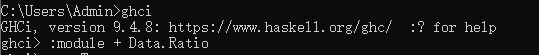
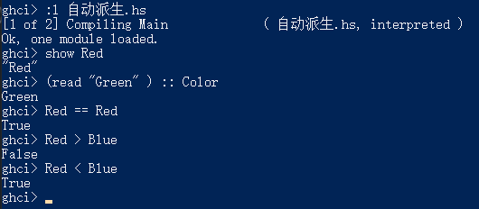

# Haskell

vscode安装3个插件：


ghc编译haskell慢，可以安装下这个插件：


## 入门
Haskell 是一种编译型语言，但具有某些类似解释型语言的特性。

编程环境使用GHC
- ghc 生成本地原生代码的优化编译器。（相当于C#的Roslyn）
- ghci 一个交互解析器和调试器。（相当于python.exe就是一个交互式窗口）
- runghc是一个以脚本形式(并不要首先编译)运行Haskell代码的程序

https://www.haskell.org/ghcup/
根据指示在Window下下载ghcup（推荐手动安装）

### ghci

导入模块：


列表：


字符串：


- haskell没有定义0为False，非0为True

开启/关闭类型和求值结果的自动显示
```
 :set +t
 :unset +t
```

### 类型
- 所有类型名字都以大写字母开头
- 所有变量名字都以小写字母开头

特点：
- 强类型
- 静态
  - 编译器可以在编译期（而不是执行期）知道每个值和表达式的类型
- 可以通过自动推导得出


- it 这是一个有特殊用途的变量， ghci将最近一次求值所得的结果保存在这个变量里（是ghci一个辅助功能，不是haskell有的）
- x :: y 表示表达式 x 的类型为 y

#### 基本类型：
- Char
- Bool
- Int
  - 带符号的定长整数
- Integer
  - 不限长度的带符号整数
- Double


#### 复合数据类型：
- 列表
  - 列表可以任意长，且只能包含类型相同的值
- 元组
  - 元组的长度是固定的，但可以包含不同类型的值
  - 只要元素的结构和类型都一致，那么元组的类型就是相同的
  - 一般使用的场景
    - 一个函数需要返回多个值的时候
    - 需要定长容器，但又没有必要使用自定义类型的时候


#### 自定义类型：
类比class

```hs
-- data 关键字
-- BookInfo 类型构造器，新类型的名字
-- Book 值构造器（数据构造器）， 类型的值就是由值构造器创建的，可以理解成是“构造函数” 返回BookInfo这个类型的“对象”
data BookInfo = Book Int String [String]
                deriving (Show)

-- 源码文件不能省略let， ghci可以
let myInfo = Book 1001 "tom" ["aa", "bb"]
```


- 在 Haskell 里，类型的名字（类型构造器）和值构造器的名字是相互独立的。类型构造器只能出现在类型的定义，或者类型签名当中。而值构造器只能出现在实际的代码中。因为存在这种差别，给类型构造器和值构造器赋予一个相同的名字实际上并不会产生任何问题

类型别名：
```hs
type BookId = Int
type BookName = String
type Author = [String]

data BookInfo = Book BookId BookName Author


data BetterReview = BetterReview BookInfo CustomerID ReviewBody
```

#### 代数数据类型 (也是自定义类型)：
一个代数类型可以有多于一个值构造器，可以理解为C#里面的enum（感觉更像是switch，或者是多态）
```hs
data Bool = False | True

type CardNumber = String
type CardHolder = String
type CustomerId = Int

data BillingInfo = CreditCard CardNumber CardHolder
                    | CashOnDelivery
                    | Invoice CustomerId
                    deriving (Show)

let card = CreditCard "2901650221064486" "Thomas Gradgrind" ["Dickens", "England"]
```


#### 模式匹配
其实就是函数名一样，参数不一样而已（重载）,有一点不同，就是第一个函数没有匹配到（执行后没有返回），就会继续匹配第二个函数。


（在源码才能有这个效果，ghci不行，会变成覆盖）


组成和解构：
```hs
complicated (True, a, x:xs, 5) = (a, xs)
complicated (True, 1, [1, 2, 3], 5) -- (1,[2,3])
-- (x:xs) 或是 (d:ds) 这种类型的名字，是一个流行的命名规则
--  s 表示元素的复数，用 x 来表示列表的第一个元素，剩余的列表元素则用 xs 表示
```

```hs
bookID      (Book id title authors) = id
let book = (Book 3 "Probability Theory" ["E.T.H. Jaynes"])
bookID book -- 3
```

如果在匹配模式中我们不在乎某个值的类型，那么可以用下划线字符 “_” 作为符号来进行标识，它也叫做*通配符*
```hs
nicerID      (Book id _     _      ) = id
```

可以用通配符定义一个默认行为
```hs
sumList (x:xs) = x + sumList xs
sumList _  = 0
```

给每一个数据类型写访问器函数很枯燥，重复又是必须的，这个叫做样板代码
```hs
nicerID      (Book id _     _      ) = id
nicerTitle   (Book _  title _      ) = title
nicerAuthors (Book _  _     authors) = authors
```

函数定义并不是唯一能使用模式匹配的地方。case 结构使得还能在一个表达式内部使用模式匹配。
```hs
fromMaybe defval wrapped =
    case wrapped of
      Nothing     -> defval
      Just value  -> value
      -- _ -> Nothing
```
case 关键字后面可以跟任意表达式，这个表达式的结果即是模式匹配的目标。of 关键字标识着表达式到此结束，以及匹配区块的开始，这个区块将用来定义每种模式及其对应的表达式。

#### 守卫
我们常常需要在对函数体求值之前进行各种各样的检查。Haskell 也为此提供了守卫这个特性。


```hs
myGuard n 
  | n < 0 = "zero or negative"
  | n == 0 = "zero"
  | n == 1 = "one"
  | n == 2 = "two"

myGuard n = "No";
```
也可以用otherwise，这是一个被绑定为值 True 的普通变量。


#### 记录语法 *
haskell提供更加便捷的写法（记录语法）：
```hs
type BookId = Int

-- type BookName = String
-- type Author = [String]
-- data BookInfo = Book BookId BookName Author deriving (Show)

data Book = Book{
  bookId :: BookId,
  bookName :: String,
  author :: [String]
}deriving (Show)

-- 可以类比C#的{get;set;}了

-- myInfo = Book 9780135072455 "Algebra of Programming"["Richard Bird", "Oege de Moor"]

-- 可以这样赋值
myInfo = Book{
  bookName = "Algebra of Programming",
  bookId = 9780135072455,
  author = ["Richard Bird", "Oege de Moor"]
}
```

#### 参数化类型


#### 递归类型
```hs
-- 定义类型
data List a = Cons a (List a)
            | Nil
              deriving (Show)

-- 定义方法
fromList (x:xs) = Cons x (fromList xs)
```


### 变量
#### 局部变量
let...in...：
```hs
-- let 关键字标识一个变量声明区块的开始，用 in 关键字标识这个区块的结束
-- 在 let 区块内定义的变量，既可以在定义区内使用，也可以在紧跟着 in 关键字的表达式中使用

lend amount balance = let reserve = 100
                          newBalance = balance - amount
                      in if balance < reserve
                         then Nothing
                         else Just newBalance


{-lend amount balance = let reserve = 100 ;newBalance = balance - amount
                      in if balance < reserve
                         then Nothing
                         else Just newBalance -}
```

屏蔽：
```hs
-- 内部的 x 隐藏了，或称作屏蔽（shadowing）
foo = let x = 1
      in ((let x = "foo" in x), x)
```

where：
```hs
lend2 amount balance = if balance < reserve
                       then Nothing 
                       else Just newBalance
                  where reserve = 100
                        newBalance = balance - amount
```


#### 全局变量
```hs
-- globalVar :: Int
globalVar = 42 
```

#### 闭包变量

#### 参数变量
```hs
foo x = x + 1  -- x是参数变量，作用域限于foo函数内部
```


### 函数

- 函数参数不需要括号包围，参数与参数之间不需要逗号
- 一些复杂的就需要括号让编译器知道这是一个参数
- 表达式用作另一个表达式的参数，需要用括号
- 纯函数
  - 副作用 函数的行为受系统的全局状态所影响
  - Haskell 的函数在默认情况下都是无副作用的
  - 将带副作用的函数称为“不纯（impure）函数”，而将不带副作用的函数称为“纯（pure）函数”
  - 不纯的本质  依赖外部状态
    - 相同输入可能返回不同结果
  - 不纯函数的类型签名都以 IO 开头
  - 一种常见的 Haskell 风格就是，将带有副作用的代码和不带副作用的代码分开处理。在这种情况下，不纯函数需要尽可能地简单，而复杂的任务则交给纯函数去做
- 多态
  - **参数多态**   像last这类函数，不在乎列表元素类型的，这种函数时多态的，这种多态称为参数多态 [Char]->Char, [int]->int ...
  - （强制多态   允许值在类型之间进行隐式的转换，  Haskell 坚决反对自动类型转换，所以haskell不支持这种多态）


haskell源码，函数定义：


```hs
-- 变量
-- 一旦变量绑定了某个表达式，那么这个变量的值就不会改变
x = 10
y = 20
-- x = 50  错误写法，不能再赋值
```

```hs
-- 条件表达式
myDrop n xs = if n <= 0 || null xs
              then xs
              else myDrop (n-1) (tail xs)

-- 变量 xs 展示了一个命名列表的常见模式： s 可以视为后缀，而 xs 则表示“复数个 x ”
```


## 函数式编程
### 中缀函数
纯粹是为了语法上的便利，因此它不会改变函数的行为
```hs
plus 1 2
-- 相当于使用中缀函数
1 `plus` 2
```

### 列表相关
Data.List模块包含所有的列表函数  `:module +Data.List`

基本操作：


产生子列表：


搜索列表：


一次性处理多个列表：


### 全函数 & 部分函数
- 全函数
  - 对于其声明的输入类型（定义域）中的 所有可能值，全函数都能返回一个有效的输出。即，函数不会在任何合法输入上崩溃或陷入无限循环
  - 推荐，比较可靠
- 部分函数
  - 函数对某些合法输入没有定义输出（即会抛出异常、崩溃或无法终止）
  - 比如`head []` 会抛出异常
  - 有些使用Haskell的程序员会为部分函数加上unsafe的前缀


### 循环
Haskell 既没有 for 循环，也没有 while 循环
#### 显示递归
```hs
-- 只载入 Data.Char 中的 digitToInt 函数
-- 用于将单个数字字符（0-9、A-F、a-f）转换成对应的整数值（0-15）
import Data.Char (digitToInt)

loop :: Int -> String -> Int -- 函数签名
-- 定义函数
loop acc [] = acc
loop acc (x:xs) = let acc' = acc * 10 + digitToInt x
                  in loop acc' xs

-- 定义函数
asInt xs = loop 0 xs

-- asInt "12" => loop 0 "12" => loop (0*10 + 1) "2" => loop 1 "2" => loop (1*10+2) [] => 12

```

#### 对列表元素进行转换
```hs
square :: [Double] -> [Double]

square (x:xs) = x * x : square xs
square [] = []

-- square [1,2,3,4]
-- [1.0,4.0,9.0,16.0]
```

#### 列表映射 map
```hs
square2 :: [Double] -> [Double]

square2 xs = map squareOne xs
             where squareOne x = x * x
```


#### 筛选列表元素
```hs
-- 筛选出奇数 if-then-else版
oddList :: [Int] -> [Int]

oddList (x:xs) = 
  if odd x then x : oddList xs
  else oddList xs

oddList [] = []

-- 更简便写法  Guard版
oddList2 :: [Int] -> [Int]
oddList2 (x:xs) 
  | odd x = x : oddList2 xs
  | otherwise = oddList2 xs

oddList2 [] = []


-- oddList [1, 2, 3, 4,5]
-- [1,3,5]
```


#### 处理收集器得出结果 折叠 （理解难度大，可以再研究研究）
```hs
-- 对列表求和
mySum xs = helper 0 xs
  where helper acc (x:xs) = helper (acc+x) xs
        helper acc [] = acc
```
对一个列表中的所有元素做某种处理，并且一边处理元素，一边更新累积器，最后在处理完整个列表之后，返回累积器的值，这种称为折叠

有两种不同类型的折叠
- 左折叠  从左边开始进行折叠
- 右折叠  从右边开始进行折叠

左折叠：
```hs
-- 定义
foldl step acc (x:xs) = foldl step (step acc x) xs
foldl _ acc [] = acc

-- 调用 并且定义step
foldlSum xs  = foldl step 0 xs
                where step acc x = acc + x

-- 对于foldlSum 也可以用加法函数
niceSum xs = foldl (+) 0 xs

{--foldlSum [1,2,3] 
=> foldl step 0 [1,2,3]
=> foldl step (step 0 1) [2,3]
=> foldl step (0+1) [2,3]
=> foldl step ((0+1)+2) [3] 
=> foldl step (((0+1)+2) + 3) []--}

{--niceSum [1,2,3]
=> fold1 (+) 0 [1,2,3]
=> fold1 (+) (0+1) [2,3]
=> fold1 (+) (0+1+2) [3]
=> fold1 (+) (0+1+2+3) []
=> 6--}
```

加法函数：


Haskell 默认采用 惰性求值（Lazy Evaluation），即：
表达式不会立即计算，除非它的值被真正需要（比如打印、参与条件判断等）。
计算过程会构建一个 “未求值的表达式”（thunk），直到必须计算时才展开。比如`niceSum xs = foldl (+) 0 xs`并不会真正计算，而是执行`pring sumList` 或 `sumList + 1`时才会真正计算

不要将左折叠用在实际使用中，因为：
- 除非被显式地要求，否则最后的表达式不会被求值，在表达式被求值之前，它会被保存在块里面
- 保存一个块比保存单独一个数字要昂贵得多，而被块保存的表达式越复杂，这个块占用的空间就越多
- 左折叠可以得到正确答案，但是过度的块资源占用，这种现象为内存泄漏：代码可以正确地执行，但它占用了比实际所需多得多的内存

Data.List 模块定义了一个 foldl' 函数，它和 foldl 的作用类似，唯一的区别是， foldl' 并不创建块。最好不要在实际代码中使用 foldl ：即使计算不失败，它的效率也好不到那里去。更好的办法是，使用 Data.List 里面的 foldl' 来代替。


右折叠：
```hs
foldr step zero (x:xs) = step x (foldr step zero xs)
foldr _ zero [] = zero

niceSumFoldr xs = foldr (+) 0 xs

{--niceSumFoldr [1,2,3] 
=> foldr (+) 0 [1,2,3]
=> (+) 1 (foldr (+) 0 [2, 3])
=> (+) 1 ((+) 2 (foldr (+) 0 [3])) 
=> (+) 1 ((+) 2 ((+) 3 (foldr (+) 0 [])))
=> (+) 1 ((+) 2 ((+) 3 0))
=> (+) 1 ((+) 2 3)
=> (+) 1 5
=> 6 --}

-- 挺牛的，感觉没调用到step，结果是在返回的时候隐式调用了

```

为什么左折叠就是惰性而右折叠就不是？
因为左折叠求值信号是从左向右流动，计算是从顶部触发的，所以可以支持惰性求值。右折叠求值信号最后是停留在最右侧，所以是自动触发的。


### 匿名函数
Haskell 允许编写完全匿名的函数，这样就不必再费力地为辅助函数想名字了。因为匿名函数从 lambda 演算而来，所以匿名函数通常也被称为 lambda 函数。

匿名函数以反斜杠符号 \ 为开始，后跟函数的参数（可以包含模式），而函数体定义在 -> 符号之后。其中， \ 符号读作 lambda 。

使用括号包裹了整个匿名函数，确保 Haskell 可以知道匿名函数体在那里结束。

```hs
isInAny needle haystack = any inSequence haystack
    where inSequence s = needle `isInfixOf` s

-- 转化成匿名函数

isInAny2 needle haystack = any (\s -> needle `isInfixOf` s) haystack
```

### 部分函数应用和柯里化
前面用type查看函数会看到 `->` 隔开参数和返回值的类型，实际上`->`只有一种作用：它表示一个函数接受一个参数，并返回一个值。


尽管 dropWhile 看上去像是一个接受两个参数的函数，但实际上它是一个接受一个参数的函数，而这个函数的返回值是另一个函数，这个被返回的函数也只接受一个参数。


传入参数的数量，少于函数所能接受参数的数量，这种情况被称为函数的部分应用（partial application of the function）：函数正被它的其中几个参数所应用

### 节 section
Haskell 提供了一种方便的符号快捷方式，用于对中序函数进行部分应用：使用括号包围一个操作符，通过在括号里面提供左操作对象或者右操作对象，可以产生一个部分应用函数。


其实就是对应上上面的应用和柯里化，给部分参数得到的还是一个函数。

### As模式
```hs
suffixes :: [a] -> [[a]]
suffixes xs@(_:xs') = xs : suffixes xs'
suffixes [] = []

{-- suffixes "foo" => xs=foo xs'=oo 
=> "foo" : suffixes "oo"
=> "foo" : ("oo" : suffixes "o")
=> "foo" :("oo" : ("o" : suffixes ""))
=> "foo" :("oo" : ("o" : []))
=> ["foo", ""]
--}
```
新引入的 @ 符号，模式 xs@(_:xs') 被称为 as-模式，它的意思是：如果输入值能匹配 @ 符号右边的模式（这里是 (_:xs') ），那么就将这个值绑定到 @ 符号左边的变量中（这里是 xs ）

as-模式可以对输入数据进行共享，而不是复制它

### 通过组合函数进行代码复用


在任何时候，都可以通过使用 (.) 来组合函数，并产生新函数，只要 (.) 符号右边函数的输出值类型适用于 (.) 符号左边函数的输入值类型就可以了。

### 内存泄露和严格求值
称非惰性求值的表达式为严格的（strict）。 foldl' 就是左折叠的严格版本，它使用特殊的 seq 函数来绕过 Haskell 默认的非严格求值。

seq就是计算第一个参数，返回第二个参数。


```hs
fold1' _ zero = zero;
fold1' step zero (x:xs) =
  let new = step zero x
  in new `seq` fold1' step new xs

{--
fold1' (+) 0 (1:[2,3])
=> (0+1) `seq` (fold1' (+) 1 [2,3])
=> (0+1) `seq` ((1+2) `seq` (fold1' (+) 3 [3]))
=> (0+1) `seq` ((1+2) `seq` ((3+3) `seq` (fold1' (+) 6 [])))
=> (0+1) `seq` ((1+2) `seq` ((3+3) `seq` 6))
=> 6
--}

-- 牛！！！ 很奇妙
```

要正确地产生 seq 的作用，表达式中被求值的第一个必须是 seq。
seq 的使用并不是无成本的，它需要在运行时检查输入值是否已经被求值。必须谨慎使用 seq。

## 编写JSON库（开发Haskell库示例）

### 完整流程
自定义数据类型：
learning-code/Haskell/Json库/SimpleJSON.hs

编译一个 Haskell 源码文件可以通过 ghc 命令来完成：
```
$ ghc -c SimpleJSON.hs

$ ls
SimpleJSON.hi  SimpleJSON.hs  SimpleJSON.o
```
- SimpleJSON.hi 是接口文件（interface file）， ghc 以机器可读的格式，将模块中导出名字的信息保存在这个文件
- SimpleJSON.o 是目标文件（object file），它包含了已生成的机器码

-c 表示让 ghc 只生成目标代码。如果省略 -c 选项，那么 ghc 就会试图生成一个完整的可执行文件，这需要有main函数

成功编译了 SimpleJSON 库，可以写小程序去执行，创建Main.hs:
learning-code/Haskell/Json库/Main.hs
```
ghc -o simple Main.hs
```

这次编译没有使用 -c 选项，因此 ghc 会尝试生成一个可执行程序，这个过程被称为链接（linking）。ghc 可以在一条命令中同时完成编译和链接的任务。

-o 选项用于指定可执行程序的名字。在 Windows 平台下，它会生成一个 .exe 后缀的文件，而 UNIX 平台的文件则没有后缀。

### 类型推导
Haskell 编译器的类型推导能力非常强大也非常有价值。省略显式的类型信息时，编译器就必须猜测我们的意图：它会推导出合乎逻辑且相容的（consistent）类型，但是，这些类型可能并不是我们想要的。所以在刚开始的时候最好尽可能地为函数添加类型签名，然后随着对类型系统了解的加深，逐步放松要求。


## 使用类型类
类型类允许定义通用接口，而这些接口为各种不同的类型提供一组公共特性集。

### 自定义类型类
```hs
-- class 关键字声明一个类型类BasicEq，a是实例类型（相当与T了）
-- 这个类型类定义了一个函数 isEqual ，接收两个参数
-- 定义
class BasicEq a where
    isEqual :: a -> a -> Bool

-- 实现 a是Bool类型
instance BasicEq Bool where
    isEqual True  True  = True
    isEqual False False = True
    isEqual _     _     = False

-- 实现 a是Int类型
instance BasicEq Int where
    isEqual 100 200 = True
    isEqual 300 _ = True
    isEqual _ _ = False
```


```hs
-- 定义两个函数的
class BasicEq2 a where
    isEqual2    :: a -> a -> Bool
    isNotEqual2 :: a -> a -> Bool

-- 为了避免所有实现都要实现定义的所有函数，可以给函数默认实现
-- 像下面这个类型类，就可以只实现其中一个函数
class BasicEq3 a where
    isEqual3 :: a -> a -> Bool
    isEqual3 x y = not (isNotEqual3 x y)

    isNotEqual3 :: a -> a -> Bool
    isNotEqual3 x y = not (isEqual3 x y)
```

### 主要的内置类型类
#### Show类型类
Show 类型类用于将值(values)转换为字符串(Strings)，其最常用的是将数值转换成字符串。


show 于 String 之上，show 添加了引号和转义符号("")，其适用于Haskell程序内部。

#### Read类型类
接受一个字符串作为参数，对这个字符串进行解析(parse)，并返回一个值。

```hs
-- do作用自动处理 >> 和 >>=，隐藏 Monad 的细节，支持 <- 提取 IO 值
main = do
  putStrLn "Please enter a Double:"  -- putStrLn 是一个 IO 操作，用于输出字符串并换行
  -- getLine 是一个 IO 操作，它会 从用户输入读取一行字符串
  -- <- 用于从 IO 操作中提取值，是IO绑定
  -- inpStr是一个变量
  inpStr <- getLine 
  let inpDouble = (read inpStr) :: Double -- read inpStr 尝试将字符串 inpStr 解析成某种类型
  putStrLn ("Twice" ++ show inpDouble ++ " is " ++ show (inpDouble *2))
```

#### 数值类型
Haskell 有一个非常强大的数值类型集合


https://github.com/huangzworks/real-world-haskell-cn/blob/master/chp/6.rst 查看对应的数值函数和常量

(==) 和 (/=) ，这两操作符们都定义于 Eq 类(class)中，其他的比较操作符， 如 >= 和 <= ，其则由 Ord 类型类定义，所有 Ord 实例都可以使用 Data.List.sort 来排序。

### 自动派生
对于许多简单的数据类型， Haskell 编译器可以自动将类型派生（derivation）为 Read 、 Show 、 Bounded 、 Enum 、 Eq 和 Ord 的实例

```hs
data Color = Red | Green | Blue
  deriving  (Read, Show, Eq, Ord)
```



相当于一个类继承某个类，所以就能用父类的方法

自动派生并不总是可用的。 比如说，如果定义类型 data MyType = MyType (Int -> Bool) ，那么编译器就没办法派生 MyType 为 Show 的实例，因为它不知道该怎么渲染一个函数。 

```hs
data Book = Book

data BookInfo = BookInfo Book
                deriving (Show)
```
上面这个也不行，Book必须是Show的实例才行

### 重叠实例
```hs
class Describe a where
  describe :: a -> String

instance Describe [a] where
  describe _ = "This is a list."

instance Describe [Int] where
  describe _ = "This is a list of Ints."
```
Describe [Int] 同时匹配 Describe [a] 和 Describe [Int]，导致编译器无法自动选择。

```hs
instance {-# OVERLAPPABLE #-} Describe [a] where
  describe _ = "This is a list."

instance {-# OVERLAPPING #-} Describe [Int] where
  describe _ = "This is a list of Ints."
```

- OVERLAPPABLE：表示这个实例可以被更具体的实例覆盖。
- OVERLAPPING：表示这个实例比更通用的实例优先级更高。
- {-# INCOHERENT #-}（不推荐）:允许编译器任意选择一个实例，可能导致不可预测的行为

### 给类型以新身份 newtype
 data 关键字以外，Haskell 提供我们另外一种方式来创建新类型，即采用 newtype 关键字。

```hs
data DataInt = D Int
    deriving (Eq, Ord, Show)

newtype NewtypeInt = N Int
    deriving (Eq, Ord, Show)
```
newtype 声明的目的是重命名一个存在着的类型，来给它一个独特的身份(id)。


## I/O
runghc = 快速运行 Haskell 脚本，无需编译
```hs
main = do
    putStrLn "Greetings!  What is your name?"
    inpStr <- getLine
    putStrLn $ "Welcome to Haskell, " ++ inpStr ++ "!"
```


```
ghci> :type putStrLn
putStrLn :: String -> IO ()
ghci> :type getLine
getLine :: IO String
```

getLine 保存了一个I/O动作。 当这个动作运行了你会得到一个 String

<- 运算符是用来从运行I/O动作中抽出结果，并且保存到一个变量中

main 自己就是一个I/O动作，类型是 IO () 。 你可以在其他I/O动作中只是运行I/O动作。 Haskell程序中的所有I/O动作都是由从 main 的顶部开始驱动的， main 是每一个Haskell程序开始执行的地方。

```hs
name2reply :: String -> String
name2reply name =
    "Pleased to meet you, " ++ name ++ ".\n" ++
    "Your name contains " ++ charcount ++ " characters."
    where charcount = show (length name)

main :: IO ()
main = do
       putStrLn "Greetings once again.  What is your name?"
       inpStr <- getLine
       let outStr = name2reply inpStr
       putStrLn outStr
```
在 do 代码块中使用 let 声明的时候，不要在后面放上 in


### 使用文件和句柄（Handle）
通常会用到 openFile ，这个函数给一个文件句柄，这个句柄用来对这个文件做特定的操作。

操作完成之后，需要用 hClose 来关闭这个句柄 。 这些函数都是定义在 System.IO 中。

```hs
import System.IO
import Data.Char(toUpper)

main :: IO()
main = do
  inh <- openFile "input.txt" ReadMode
  outh <- openFile "output.txt" WriteMode
  mainloop inh outh
  hClose inh
  hClose outh

mainloop :: Handle -> Handle -> IO()
mainloop inh outh =
  do 
    ineof <- hIsEOF inh -- 检查看看是否在输入文件的结尾（EOF）
    if ineof
    then return () --  return 是和 <- 相反。 也就是说， return 接受一个纯的值，把它包装进IO。 因为每个I/O动作必须返回某个 IO 类型
    else do -- 下面三行是一个连贯的IO操作，所以需要do
      inpStr <- hGetLine inh
      hPutStrLn outh (map toUpper inpStr)
      mainloop inh outh
```


二进制文件同样可以在Haskell里使用。 如果操作一个二进制文件，要用 openBinaryFile 替代 openFile

可以用 hTell 来找出你文件中的当前位置。 当文件刚新建的时候，文件是空的，这个位置为0。 在你写入5个字节之后，位置会变成5。

hTell 的伙伴是 hSeek 。
hSeek 可以改变文件位置，它有3个参数：一个 Handle ， 一个 seekMode ，还有一个位置。

不是所有句柄都是可以定位的。 一个句柄通常对应于一个文件，但是它也可以对应其他东西，比如网络连接，磁带机或者终端。hIsSeekable 去看给定的句柄是不是可定位的。

h函数和非h函数的区别：


程序员频繁需要用到临时文件。 临时文件可能用来存储大量需要计算的数据，其他程序要使用的数据，或者很多其他的用法。

Haskell提供了一个方便的函数叫做 openTempFile （还有一个对应的 openBinaryTempFile ）

openTempFile 接受两个参数：创建文件所在的目录，和一个命名文件的“模板”。 这个目录可以简单是“.”，表示当前目录。 或者你可以用 System.Directory.getTemporaryDirectory 去找指定机器上存放临时文件最好的地方。 这个模板用做文件名的基础，它会添加一些随机的字符来保证文件名是唯一的，从实际上保证被操作的文件具有独一无二的文件名。

openTempFile 返回类型是 IO (FilePath, Handle) 。 元组的第一部分是创建的文件的名字，第二部分是用 ReadWriteMode 打开那个文件的一个句柄 。 处理完这个文件，要 hClose 它并且调用 removeFile 删除它。 

### 惰性I/O
Haskell是一种惰性语言，意思是任何给定的数据片只有在它的值必须要知道的情况下才会被计算。

#### hGetContents
 hGetContents 函数类型是 Handle -> IO String 。 这个返回的 String 表示 Handle 所给文件里的所有数据。

 返回的 String 是惰性估值的。 调用 hGetContents 的时刻，实际上没有读任何东西。 数据只从句柄读取， 作为处理的一个元素（字符）列表。

```hs
import System.IO
import Data.Char(toUpper)

main :: IO ()
main = do
  inh <- openFile "input.txt" ReadMode
  outh <- openFile "output.txt" WriteMode
  inpStr <- hGetContents inh
  let result = processData inpStr -- 按需获取，所以是一个个字符获取
  hPutStrLn outh result 
  hClose inh
  hClose outh

processData :: String -> String
processData = map toUpper
```

#### readFile writeFile
readFile(在内部使用 hGetContents) 和 writeFile 是把文件当做字符串处理的快捷方式。处理所有细节，包括打开文件，关闭文件，读取文件和写入文件。

```hs
import Data.Char(toUpper)

main = do
       inpStr <- readFile "input.txt"
       writeFile "output.txt" (map toUpper inpStr)
```

#### interact
从标准输入读取，做一个转换，然后把结果写到标准输出。


getContents（interact 内部使用）是 惰性 的，它不会一次性读取所有输入，而是按需读取。所以可以无限回车得到输入字符串的大写。

interact 也可作为过滤器
```hs
main = interact (unlines . filter (elem 'a') . lines)
```

### The IO Monad
#### Actions
actions是使用I/O的一些工具，和函数类似，定义的时候不做任何事情，被调用时执行一些任务。 I/O动作被定义在 IO Monad。 I/O动作被定义在 IO Monad。actions的返回类型都带有 IO 。


#### 串联化
do 代码块实际上是把操作连接在一起的快捷记号。 有两个运算符可以用来代替 do 代码块： >> 和 >>=

\>> 运算符把两个操作串联在一起：第一个操作先运行，然后是第二个
\>>= 运算符运行一个操作，然后把它的结果传递给一个返回操作的函数。 那样第二个操作可以同样运行，而且整个表达式的结果就是第二个操作的结果。 例如 getLine >>= putStrLn ，这会从键盘读取一行，然后显示出来

#### Return
Haskell的 return 函数很不一样。 在Haskell中， return 用来在Monad里面包装数据。 当说I/O的时候， return 用来拿到纯数据并把它带入IO Monad。

### 缓冲区
Haskell中有3种不同的缓冲区模式，它们定义成 BufferMode 类型： NoBuffering ， LineBuffering 和 BlockBuffering
- NoBuffering 没有缓冲区，读取的数据是从操作系统一次一个字符读取的。 写入的数据会立即写入，也是一次一个字符地写入，性能很差
- LineBuffering 当换行符输出的时候会让输出缓冲区写入， 每次按下回车之后它会立即返回数据。 这个模式经常是默认模式
- BlockBuffering  以一个固定的块大小读取或者写入数据，批处理大量数据的时候是性能最好的，这个对于交互程序不能用，因为它会阻塞输入直到一整块数据被读取

调用 hGetBuffering 查看系统的当前缓冲区模式。 当前的模式可以通过 hSetBuffering 来设置

刷新缓冲区：hFlush 会强制所有等待的数据立即写入

### 读取命令行参数
System.Environment.getArgs 返回 IO [String] 列出每个参数

System.Console.GetOpt 模块提供了一些解析命令行选项的工具

### 环境变量
可以使用 System.Environment 里面两个函数中的一个： getEnv 或者 getEnvironment

getEnv 查找指定的变量，如果不存在会抛出异常。 getEnvironment 用一个 [(String, String)] 返回整个环境，然后你可以用 lookup 这样的函数来找你想要的环境条目

在Haskell设置环境变量没有采用跨平台的方式来定义。 像Linux这样的POSIX平台上，可以使用 System.Posix.Env 模块中的 putEnv 或者 setEnv 。 环境设置在Windows下面没有定义。


## 高效文件处理，正则表达式，文件名匹配

上面读写文件的代码中，默认使用String类型，但这是不高效的。String 代表一个元素类型为 Char 的列表；列表的每个元素被单独分配内存，并有一定的写入开销。

bytestring 库是 String 类型的一个快速、经济的替代品。在保持 Haskell 代码的表现力和简洁的同时，使用 bytestring 编写的代码在内存占用和执行效率经常可以达到或超过 C 代码。

bytestring提供两个模块：
- Data.ByteString
- Data.ByteString.Lazy

### 二进制 I/O 和有限载入

```hs
-- 限定导入，就是重命名，因为ByteString和Prelude有很多函数名是重复的
import qualified Data.ByteString.Lazy as L

-- 检查文件是否是ELF object 类型的文件
hasElfMagic :: L.ByteString -> Bool
hasElfMagic content = L.take 4 content == elfMagic
    where elfMagic = L.pack [0x7f, 0x45, 0x4c, 0x46]
-- L.take 获取文件前4个字节，返回的是ByteString 
-- L.pack 将[0x7f, 0x45, 0x4c, 0x46]转化为ByteString 
```

```hs
-- 如何执行hasElfMagic
isElfFile :: FilePath -> IO Bool
isElfFile path = do
  content <- L.readFile path
  return (hasElfMagic content)
```

### 文本 I/O
bytestring 库提供两个具有有限文本 I/O 功能的模块，将每个字符串的元素暴露为 Char 而非 Word8
- Data.ByteString.Char8 
- Data.ByteSring.Lazy.Char8

ps:这些模块中的函数适用于单字节大小的 Char 值，所以他们仅适用于 ASCII 及某些欧洲字符集。大于 255 的值将被截断。
### 匹配文件名


### haskell中的正则表达式
```
cabal install --lib regex-posix

ghci> :module +Text.Regex.Posix
```

=~ 操作符的参数和返回值都使用了类型类
- 第一个参数 (=~ 左侧) 是要被匹配的文本
- 第二个参数 (=~ 右侧) 是准备匹配的正则表达式


