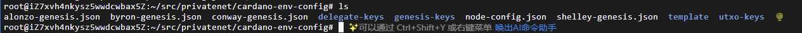
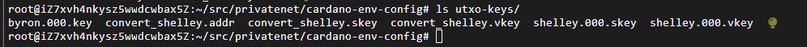
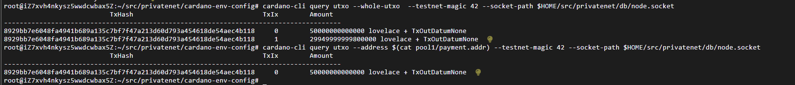
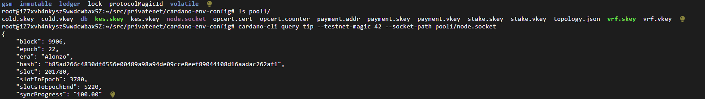

修改config
```
"EnableP2P": false,
```

添加创世文件
```
cardano-cli conway genesis create-cardano \
--genesis-dir ./ \
--gen-genesis-keys 1 \
--gen-utxo-keys 1 \
--start-time $(date -u -d "now + 2 minutes" +%FT%Tz) \
--supply 30000000000000000 \
--security-param 45 \
--slot-length 100 \
--slot-coefficient 5/100 \
--testnet-magic  42 \
--byron-template template/byron.json \
--shelley-template template/shelley.json \
--alonzo-template template/alonzo.json \
--conway-template template/conway.json \
--node-config-template template/config.json

mv node-config.json config.json
```



运行节点
```
cardano-node run \
--config $HOME/src/privatenet/cardano-env-config/config.json \
--database-path $HOME/src/privatenet/db/ \
--socket-path $HOME/src/privatenet/db/node.socket \
--host-addr 127.0.0.1 \
--port 3001 \
--topology $HOME/src/privatenet/nodeConfig/topology.json \
--shelley-kes-key $HOME/src/privatenet/cardano-env-config/delegate-keys/shelley.000.kes.skey \
--shelley-vrf-key $HOME/src/privatenet/cardano-env-config/delegate-keys/shelley.000.vrf.skey \
--shelley-operational-certificate $HOME/src/privatenet/cardano-env-config/delegate-keys/shelley.000.opcert.json 
```

<hr>

将byron类型密钥转化为shelly类型：
```
cardano-cli conway key convert-byron-key \
--byron-payment-key-type \
--byron-signing-key-file utxo-keys/byron.000.key \
--out-file utxo-keys/convert_shelley.skey

cardano-cli conway key verification-key \
--signing-key-file utxo-keys/convert_shelley.skey \
--verification-key-file utxo-keys/convert_shelley.vkey

cardano-cli address build \
--payment-verification-key-file utxo-keys/convert_shelley.vkey \
--testnet-magic 42 \
--out-file utxo-keys/convert_shelley.addr
```


<hr>

创建权益池
```
mkdir pool1

// 创建付款键：
cardano-cli address key-gen \
--verification-key-file pool1/payment.vkey \
--signing-key-file pool1/payment.skey

// 将权益委托给池中，需要权益密钥
cardano-cli conway stake-address key-gen \
--verification-key-file pool1/stake.vkey \
--signing-key-file pool1/stake.skey

// 构建地址：
cardano-cli address build \
--payment-verification-key-file pool1/payment.vkey \
--stake-verification-key-file pool1/stake.vkey \
--out-file pool1/payment.addr \
--testnet-magic 42

//向矿池所有者发送资金：
cardano-cli alonzo transaction build-raw \
  --invalid-hereafter $(expr $(cardano-cli query tip --testnet-magic 42 --socket-path $HOME/src/privatenet/db/node.socket | jq .slot) + 100000) \
  --tx-in $(cardano-cli query utxo --address $(cat utxo-keys/convert_shelley.addr) --testnet-magic 42 --socket-path $HOME/src/privatenet/db/node.socket --out-file  /dev/stdout | jq -r 'keys[]') \
  --tx-out $(cat pool1/payment.addr)+50000000000000 \
  --tx-out $(cat utxo-keys/convert_shelley.addr)+29949999999800000 \
  --out-file transactions/tx3.raw \
  --fee 200000

//签署交易：
cardano-cli alonzo transaction sign \
--tx-body-file transactions/tx3.raw \
--signing-key-file utxo-keys/convert_shelley.skey \
--testnet-magic 42 \
--out-file transactions/tx3.signed

//提交到区块链
cardano-cli alonzo transaction submit \
--testnet-magic 42 \
--tx-file transactions/tx3.signed \
--socket-path $HOME/src/privatenet/db/node.socket
```


生成权益池密钥：
```
// 生成冷键:
cardano-cli node key-gen \
--cold-verification-key-file pool1/cold.vkey \
--cold-signing-key-file pool1/cold.skey \
--operational-certificate-issue-counter-file pool1/opcert.counter

// 生成 VRF 密钥
cardano-cli node key-gen-VRF \
--verification-key-file pool1/vrf.vkey \
--signing-key-file pool1/vrf.skey

// 生成 KES 密钥
cardano-cli node key-gen-KES \
--verification-key-file pool1/kes.vkey \
--signing-key-file pool1/kes.skey

// 生成操作证书
cardano-cli node issue-op-cert \
--kes-verification-key-file pool1/kes.vkey \
--cold-signing-key-file pool1/cold.skey \
--operational-certificate-issue-counter pool1/opcert.counter \
--kes-period 0 \
--out-file pool1/opcert.cert
```

为出块节点创建拓扑文件并更新BFT节点的拓扑：
```
cat > pool1/topology.json <<EOF
{
  "bootstrapPeers": [
    {
      "address": "172.25.134.1",
      "port": 3001
    }
  ],
  "localRoots": [
    {
      "accessPoints": [],
      "advertise": false,
      "trustable": false,
      "valency": 1
    }
  ],
  "publicRoots": [
    {
      "accessPoints": [],
      "advertise": false
    }
  ],
  "useLedgerAfterSlot": 128908821
}
EOF
```

启动权益池节点：
```
cardano-node run \
--config ../config.json \
--topology topology.json \
--database-path db \
--socket-path node.socket \
--port 3002 \
--shelley-kes-key kes.skey \
--shelley-vrf-key vrf.skey \
--shelley-operational-certificate opcert.cert
```


注册权益密钥:
```
创建注册证书：
cardano-cli alonzo stake-address registration-certificate \
  --stake-verification-key-file pool1/stake.vkey \
  --out-file pool1/stake.cert

CHANGE=$(($(cardano-cli query utxo --socket-path $HOME/src/privatenet/db/node.socket --address $(cat pool1/payment.addr) --testnet-magic 42 --out-file /dev/stdout | jq -r 'to_entries | .[0].value.value.lovelace') - 3000000))


cardano-cli alonzo transaction build-raw \
--fee 1000000 \
--invalid-hereafter $(expr $(cardano-cli query tip --testnet-magic 42 --socket-path $HOME/src/privatenet/db/node.socket | jq .slot) + 1000) \
--tx-in $(cardano-cli query utxo --socket-path $HOME/src/privatenet/db/node.socket --address $(cat pool1/payment.addr) --testnet-magic 42 --out-file  /dev/stdout | jq -r 'keys[]') \
--tx-out $(cat pool1/payment.addr)+$CHANGE \
--certificate-file pool1/stake.cert \
--out-file transactions/tx4.raw

cardano-cli alonzo transaction sign \
--tx-body-file transactions/tx4.raw \
--signing-key-file pool1/payment.skey \
--signing-key-file pool1/stake.skey \
--testnet-magic 42 \
--out-file transactions/tx4.signed

cardano-cli alonzo transaction submit \
--testnet-magic 42 \
--tx-file transactions/tx4.signed \
--socket-path $HOME/src/privatenet/db/node.socket
```