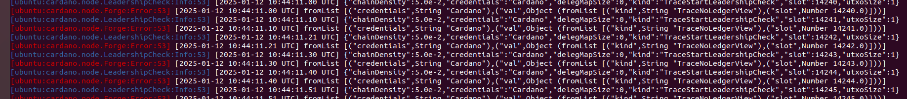

 ```
export CARDANO_NODE_SOCKET_PATH="$HOME/src/privatenet/db/node.socket"
 export PATH=$PATH:/$HOME/src/cardano-node/bin
 mkdir privatenet
 cd privatenet
 mkdir cardano-env-config db nodeConfig
cd cardano-env-config/
```

```
wget -P template/ https://raw.githubusercontent.com/input-output-hk/iohk-nix/master/cardano-lib/testnet-template/alonzo.json
wget -P template/ https://raw.githubusercontent.com/input-output-hk/iohk-nix/master/cardano-lib/testnet-template/byron.json
wget -P template/ https://raw.githubusercontent.com/input-output-hk/iohk-nix/master/cardano-lib/testnet-template/config.json
wget -P template/ https://raw.githubusercontent.com/input-output-hk/iohk-nix/master/cardano-lib/testnet-template/shelley.json
wget -P template/ https://raw.githubusercontent.com/input-output-hk/iohk-nix/master/cardano-lib/testnet-template/conway.json
```


config.json:
```
  "EnableP2P": false,
  "ExperimentalProtocolsEnabled": false,
  "ExperimentalHardForksEnabled": false,
  "ApplicationName": "cardano-node"
```

shelley.json
```
  "updateQuorum": 0,
  "networkId": "Mainnet",
  "networkMagic": 1001,
  "slotLength": 1000,
```

conway.json
```
"committeeMinSize": 0,
```

```
cat > ~/src/privatenet/nodeConfig/topology.json <<EOF
{
   "Producers": []
 }
EOF
```

```
cardano-cli conway genesis create-cardano \
--genesis-dir ./ \
--gen-genesis-keys 1 \
--gen-utxo-keys 1 \
--start-time $(date -u -d "now + 2 minutes" +%FT%Tz) \
--supply 30000000000000000 \
--security-param 45 \
--slot-length 100 \
--slot-coefficient 5/100 \
--testnet-magic  42 \
--byron-template template/byron.json \
--shelley-template template/shelley.json \
--alonzo-template template/alonzo.json \
--conway-template template/conway.json \
--node-config-template template/config.json
```

```
mv node-config.json config.json
mv delegate-keys/byron.000* delegate-keys/shelley.000* ../nodeConfig/
```

```
cardano-node run \
--config $HOME/src/privatenet/cardano-env-config/config.json \
--database-path $HOME/src/privatenet/db/ \
--socket-path $HOME/src/privatenet/db/node.socket \
--host-addr 127.0.0.1 \
--port 3001 \
--topology $HOME/src/privatenet/nodeConfig/topology.json \
--shelley-kes-key $HOME/src/privatenet/cardano-env-config/delegate-keys/shelley.000.kes.skey \
--shelley-vrf-key $HOME/src/privatenet/cardano-env-config/delegate-keys/shelley.000.vrf.skey \
--shelley-operational-certificate $HOME/src/privatenet/cardano-env-config/delegate-keys/shelley.000.opcert.json \
--byron-delegation-certificate  $HOME/src/privatenet/cardano-env-config/delegate-keys/byron.000.cert.json \
--byron-signing-key   $HOME/src/privatenet/cardano-env-config/delegate-keys/byron.000.key
```




alonzo能够生产区块，但是到了硬分叉升级为Babbage的时候就出现报错了。
巴贝奇时代（Vasil 硬分叉）取消了去中心化参数。这意味着当前的 BFT 节点将无法继续在 Babbage 中生成区块。


```
cardano-cli conway transaction build \
  --testnet-magic 42 \
  --socket-path /var/lib/cardano-node/node.socket \
  --invalid-hereafter $(expr $(cardano-cli query tip --testnet-magic 42 --socket-path $HOME/src/privatenet/db/node.socket | jq .slot) + 1000) \
  --tx-in $(cardano-cli query utxo --address $(cat utxo-keys/shelley.000.addr) --testnet-magic 42 --socket-path $HOME/src/privatenet/db/node.socket --out-file ./out | jq -r 'keys[]') \
  --tx-out $(cat pool1/payment.addr)+50000000000000 \
  --change-address $(cat utxo-keys/shelley.000.addr) \
  --out-file transactions/tx3.raw
```

```
cardano-cli signing-key-address \
    --testnet-magic 42 \
    --secret utxo-keys/byron.000.key > utxo-keys/byron.000.addr

cardano-cli address build \
--payment-verification-key-file utxo-keys/shelley.000.vkey \
--mainnet \
--out-file utxo-keys/shelley.000.addr
```

```
mkdir pool1

cardano-cli address key-gen \
--verification-key-file pool1/payment.vkey \
--signing-key-file pool1/payment.skey

cardano-cli conway stake-address key-gen \
--verification-key-file pool1/stake.vkey \
--signing-key-file pool1/stake.skey


cardano-cli address build \
--payment-verification-key-file pool1/payment.vkey \
--stake-verification-key-file pool1/stake.vkey \
--out-file pool1/payment.addr \
--testnet-magic 42


cardano-cli conway transaction build \
  --testnet-magic 42 \
  --socket-path /var/lib/cardano-node/node.socket \
  --invalid-hereafter $(expr $(cardano-cli query tip --testnet-magic 42 --socket-path $HOME/src/privatenet/db/node.socket | jq .slot) + 100000) \
  --tx-in $(cardano-cli query utxo --address $(cat utxo-keys/shelley.000.addr) --testnet-magic 42 --socket-path $HOME/src/privatenet/db/node.socket --out-file  /dev/stdout | jq -r 'keys[]') \
  --tx-out $(cat pool1/payment.addr)+50000000000000 \
  --change-address $(cat utxo-keys/shelley.000.addr) \
  --out-file transactions/tx3.raw
```

--socket-path  $HOME/src/privatenet/db/node.socket


cardano-cli alonzo transaction build-raw \
--invalid-hereafter $(expr $(cardano-cli query tip --socket-path  $HOME/src/privatenet/db/node.socket --testnet-magic 42 | jq .slot) + 1000) \
--fee 1000000 \
--tx-in $(cardano-cli byron transaction txid --tx transactions/tx0.tx)#0 \
--tx-out $(cat utxo-keys/user1.payment.addr)+29999999998000000 \
--out-file transactions/tx1.raw 


cardano-cli alonzo transaction sign \
--tx-body-file transactions/tx1.raw \
--signing-key-file utxo-keys/payment.000.converted.key \
--testnet-magic 42 \
--out-file transactions/tx1.signed

cardano-cli alonzo transaction submit \
--tx-file transactions/tx1.signed --testnet-magic 42 \
--socket-path  $HOME/src/privatenet/db/node.socket


cardano-cli submit-tx \
            --testnet-magic 42 \
            --tx transactions/tx0.tx \
            --socket-path  $HOME/src/privatenet/db/node.socket


            
byron钱转到shelley：
```

cardano-cli alonzo transaction build-raw \
--invalid-hereafter $(expr $(cardano-cli query tip --socket-path  $HOME/src/privatenet/db/node.socket --testnet-magic 42 | jq .slot) + 1000) \
--fee 1000000 \
--tx-in 367cc4329aa8d87ad29b851bbdde6771eceee2d658bbebef7091922502a7145c#0 \
--tx-out $(cat utxo-keys/user1.payment.addr)+29999999999000000 \
--out-file transactions/tx1.raw 


cardano-cli alonzo transaction sign \
--tx-body-file transactions/tx1.raw \
--signing-key-file utxo-keys/payment.000.converted.key \
--testnet-magic 42 \
--out-file transactions/tx1.signed

cardano-cli alonzo transaction submit \
--tx-file transactions/tx1.signed --testnet-magic 42 \
--socket-path  $HOME/src/privatenet/db/node.socket

```